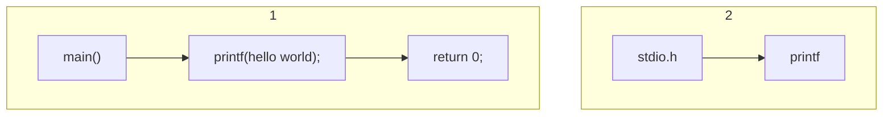
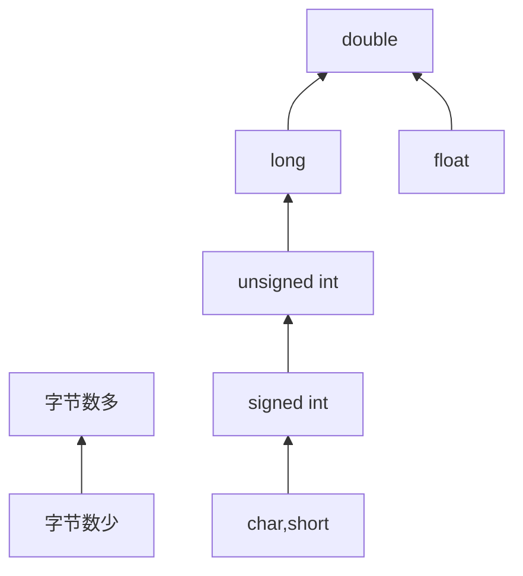

[TOC]

# 第一部分: C&C++基础

## 一. C的基础知识

### 1. C的起源

C语言最早是在1972年由贝尔实验室的丹尼斯·里奇（Dennis Ritch）和肯·汤普逊（KenThompson）在开发UNIX操作系统时设计了C语言。现如今成为广受欢迎的编程语言之一.

### 2. C的特点

- 高效性
  - C语言是基于汇编语言之上,具有汇编语言的微调控制能力的语言.它高效的利用了当前计算机的优势,从而使其十分高效.
- 可移植
  - C语言是可移植的语言,这意味着，在一种系统中编写的 C程序稍作修改或不修改就能在其他系统运行。它可以同时在诸如Windows,Linux,Unix(mac os)等系统中运行.

### 3. C的应用范围

- 操作系统
- 游戏
- 嵌入式
- 电影CG

### 4. 计算机的构成

- 中央处理单元（CPU）
  - 中央处理单元（CPU）承担绝大部分的运算工作.
- 随机存取内存（内存）
  - 随机存取内存（内存）是存储程序和文件的工作区.
- 永久内存存储设备(硬盘)
  - 永久内存存储设备（过去一般指机械硬盘，现在还包> 括固态硬盘）即使在关闭计算机后，也不会丢失之前> 储存的程序和文件
- 图像处理器(GPU)
  - 图像处理器是专门用于图像处理的硬件设备,广泛应用于游戏,AI计算领域,在C语言篇幅不做要求.

### 5. C语言的标准

- ANSI标准
  - ANSI标准于1989年正式公布,国际标准化组织于1990年采用了这套C标准（ISO C）.
- C89/C90
  - ANSI/ISO标准的最终版本通常叫作C89（因为ANSI于1989年批准该标准）或C90（因为ISO于1990年批准该标准）.
- C99标准
  - 1994年，ANSI/ISO联合委员会（C9X委员会）开始修订C标准，最终发布了C99标准.
- C11标准
  - 标准委员会在2007年承诺C标准的下一个版本是C1X，2011年终于发布了C11标准.

### 6. 编写程序的七个步骤

- 定义程序的目标
  - 在动手写程序之前，要在脑中有清晰的思路.想要程序去做什么首先自己要明确自己想做什么，思考你的程序需要哪些信息，要进行哪些计算和控制，以及程序应该要报告什么信息.**可以使用思维导图辅助完成构思.**
- 设计程序
  - 对程序应该完成什么任务有概念性的认识后，就应该考虑如何用程序来完成它.例如，用户界面应该是怎样的？如何组织程序？目标用户是谁？准备花多长时间来完成这个程序？
- 编写代码

- 编译
- 运行程序
- 测试和调试程序

### 7. 第一个C语言程序

```c
#include<stdio.h>
int main()
{
    printf("hello world\n");
    return 0;
}
```

**程序分析:**

```c
#include<stdio.h>        //调用C语言标准库,为main()中调用的printf()函数提供函数原型
```

```C
int main(){}            //C语言入口函数,程序的运行将从这里开始
```

```c
printf("hello world\n");//控制台打印函数,将指定内容打印到屏幕上,"\n"转义字符,打印一个回车
```

```c
return 0;                //main()函数返回值,在main()结束时返回一个整数类型值
```



 **注:标准输入输出函数包括printf(),scanf()等函数**

```c
//使用printf()函数
//打印输出整数型变量
int i= 0;
printf("%d\n",i);/*函数的第一个参数为转换说明和转义字符,%d表示正要打印的是一个整数型变量,\n则表示会输出一个回车;第二个参数是要输出的变量名,printf()函数可以输出多个变量的值,将要输出的变量加在第二,第三....个参数上*/
```

```c
//使用scanf()函数
//读入一个字符
char ch;
scanf("%c",&ch);            //scanf()函数的参数意义与printf()基本一致,也可以同时读入多个变量
```

### 8. C语言的程序结构

​	一个完整的C语言程序，是由一个、且只能有一个`main()`函数(又称主函数，必须有)和若干个其他函数结合而成（可选)

- **函数入口**，`main`函数是程序的入口，即程序从`main`函数开始执行
- **其他函数**，由程序员自己封装的函数，可以实现特定功能，在`main`函数前声明，在`main`函数或者其他函数中调用

## 二. 数据类型

### 1. 关键字

C语言中内置的关键字

#### 1.1 用于定义变量或者类型的关键字

`char`、`short`、`int`、`long`、`float`、`double`、
`struct`、`union`、`enum`、`signed`、`unsigned`、`void`

**这些关键字是用于定义变量或者类型的关键字，在后面的章节会讲到**

#### 1.2 储存相关关键字

`register`、`static`、`const`、`auto`、`extern`

1. `register`是**寄存器**的意思，用`register`修饰的变量是寄存器变量，
   即:在编译的时候告诉编译器这个变量是寄存器变量，**尽量**将其存储空间分配在寄存器中
   - 注意:
   
      - 定义的变量不一定真的存放在寄存器中
      - cpu取数据的时候去寄存器中拿数据比去内存中拿数据要快
      - 因为寄存器比较宝贵，所以不能定义寄存器数组
      - `register`只能修饰字符型及整型的，不能修饰浮点型
      - 因为`register`修饰的变量可能存放在寄存器中不存放在内存中，所以不**能对寄存器变量取地址**。因为**只有存放在内存中的数据才有地址**
   
2. `static`是静态的意思，使用`static`修饰全局变量、局部变量、函数。可以提升生命周期
3. `const`是常量的意思。使用`const`修饰，变量就不可以修改了
4. `auto`是自动判断变量类型的关键字，在C++中比较常用
5. `extern`是外部的意思，一般用于函数和全局变量的声明，可以使函数和变量在文件外被访问

#### 1.3 控制语句相关的关键字

`if`、`else`、`break`、`continue`、`for`、`while `、`do`、`switch`、`case`、`goto`、`default`

**这些关键字是用于控制分支循环结构的关键字，在后面的章节会讲到**

#### 1.4 其他关键字

`sizeof`、`typedef`、`volatile`

1. `sizeof`用来测试变量、数组的占用储存空间的大小

2. `typedef`重命名，作用是给一个已有的类型，重新起一个类型名

```c
//给short关键字取一个别名
typedef short INT16;	//将short关键字修改为INT16，在后面的变量声明中可以使用INT16替代short关键字
```

3. `volatile`是易改变的意思，用`voltile`定义的变量，是易改变的，即告诉CPU每次用`volatile`的时候，重新去内存中取，保证用的是最新的值，而不是寄存器中的备份

```c
volatile int a = 10;
```

**注意：**

- 变量的**命名规则**：

  - 在C语言中给变量和函数起别名时，由字母、数字、下划线构成；**且必须由字母或者下划线开头**；变量名尽量以**变量的作用命名**

- **命名风格:**

  - linux风格 `stu_num`
  
    - 驼峰风格 `StuNum`
  
    - 大小写敏感  `int Num;`  `int num;`
  

### 2. 基本数据类型

C语言的数据类型简单的划分可以是

- 以**数字为主**的数据类型
- 以**字符为主**的数据类型

C语言中储存数据的量简单的划分可以是

- 常量
- 变量

#### 2.1 常量和变量

**常量：**在程序运行中，不可改变值的量

- **分类：**
  - 字符常量，`'a'`、`'\t'`
  - 字符串常量，`"sdafsf"`
  - 数字常量，`1`、`2313`、`0x3f2a`
- **注意：**
  - 字符常量使用单引号括起来，字符串常量则使用双引号括起来
  - 如果使用双引号括起字符来，则是`"a\0"`；而使用单引号则是`'a'`，多一个`\0`也是字符和字符串的区别，是由编译器自动添加的
  - 数字常量可以是十进制、八进制、十六进制，**不能为二进制**

**变量：**在程序运行中，可以改变值的量

#### 2.2 常见数据类型

| 类型        | 描述                                                         |
| ----------- | ------------------------------------------------------------ |
| `int `      | 整型(`in`t)是储存整数的一种数据类型,在内存中占用4个字节,数据范围: -2,147,483,648~2,147,483,647(-2^31~2^31-1) |
| `char `     | 字符型(`char`)是容纳单字符的一种数据类型,占用1个字节,数据范围为-128 ~ +127(－2^7~2^7-1) |
| `float `    | 浮点数型(`float`)是用于存储单精度浮点数的一种数据类型,占用4个字节,至少精确表示小数点后的6位有效 数字 |
| `double `   | 浮点数型(`double`)是用于存储双精度浮点型的一种数据类型,占用8个字节,至少精确表示小数点后13 位有效数字 |
| `long long` | 长长整型(`int`)是储存整数的一种数据类型,在内存中占用8个字节,数据范围:-9223372036854775808~9223372036854775807(-2^63~2^63-1) |


#### 2.3 其他数据类型

| 数据类型        | 描述         |
| --------------- | ------------ |
| `void`          | 空类型       |
| `long    `      | 长整数型     |
| `short    `     | 短整数型     |
| `unsigned    `  | 无符号整数型 |
| `signed    `    | 有符号型     |
| `Bool    `      | 布尔型       |
| `Complex    `   | 复数类型     |
| `Imaginary    ` | 虚数型       |

**注意：**

- `void`不能定义变量，没有`void`类型的变量
- `void`用来修饰函数的参数或返回值，代表函数没有参数或者返回值

**代码演示:**

```c
//初始化并打印整数变量
#include<stdio.h>
int main()
{
    int x=2;
    int y=2.1;
    printf("%d\n",x);
    printf("%d\n",y);
}
```

```
输出结果:
2
2
```

```c
//初始化并打印整数和浮点数变量
#include<stdio.h>
int main()
{
    int x=2;
    float y=2.1;
    printf("%d\n",x);
    printf("%f\n",y);
}
```

```
输出结果:
2
2.100000
```

```c
//控制输出浮点数位数
#include<stdio.h>
int main()
{
    int x=2;
    float y=2.1;
    printf("%d\n",x);
    printf("%.1f\n",y);
}
```

```
输出结果:
2
2.1
```

```c
//初始化字符型变量并打印
#include<stdio.h>
int main()
{
    char c='a';
    printf("%c\n",c);
}
```

```
输出结果:
a
```

#### 2.4 关于不同编译环境下数据类型的取值范围

- 不同编译器下，指定变量的取值范围可能不同，比如`int`在有的编译器为`16位`有的为`32位`
- 在`32位`系统中，指针的占用空间为`4字节`；而在`64位`中，指针的占用空间为`8字节`。（直接影响就是32位系统只能使用最大4G的内存，而64位系统可以使用4×4294967296G的内存）

#### 2.5 构造类型

概念:

- 由若**干个相同或不同类型数据构成的集合**，这种数据类型被称为**构造类型**例:` int a[10];`

- 数组、结构体、共用体、枚举

#### 2.6 类型转换

数据有不同的类型，不同类型数据之间进行混合运算时必然涉及到类型的转换问题.

**转换的方法有两种:**

- 自动转换:

遵循一定的规则,由编译系统自动完成.

- 强制类型转换:

把表达式的运算结果强制转换成所需的数据类型

**自动转换的原则:**

1. **占用内存字节数少(值域小)的类型,向占用内存字节数多(值域大)的类型转换**,以保证精度不降低.

2. 转换方向:


#### 2.7 类型转换注意点

##### 2.7.1 自动类型转换

- 当表达式中出现了`char `、`short  int` 、`int`类型中的一种或者多种，没有其他类型了参加运算的成员全部变成`int`类型的参加运算，结果也是`int`类型的

```c
10/3 //没有其他类型参与，结果为int类型，即3
```
- 当表达式中出现了带小数点的实数，参加运算的成员全部变成`double`类型的参加运算，结果也是 `double`型

```c
10/3.0 //有浮点数参与，结果为float类型，即3.3333...
```

- 当表达式中有有符号数﹑也有无符号数,参加运算的成员变成无符号数参加运算结果也是无符号数.(表达式中无实数)
- 在赋值语句中等号右边的类型自动转换为等号左边的类型
- 注意自动类型转换都是在运算的过程中进行临时性的转换,并不会影响自动类型转换的变量的值和其类型

##### 2.7.2 强制类型转换

**强制转换:**通过类型转换运算来实现
	语法：`(类型说明符)(表达式)`
**功能:**

- 把表达式的运算结果强制转换成类型说明符所表示的类型

**例如：**

- `(float)a;`把a的值转换为实型
- `(int)(x+y);` 把x+y 的结果值转换为整型

**注意:**

- 类型说明符必须加括号 

### 3. C语言的转换说明

使用`scanf`或者`printf`输入输出数据时，需要根据数据类型指定不同的转换说明，3.1中是主要的转换说明

#### 3.1 主要的转换说明

**转换说明:**

| 转换说明 | 输出                                                         |
| -------- | ------------------------------------------------------------ |
| `%a`     | 浮点数、十六进制数和p记数法(C99/C11)                         |
| `%A`     | 浮点数、十六进制数和p记数法(C99/C11)                         |
| `%c`     | 单个字符                                                     |
| `%d`     | 有符号十进制整数                                             |
| `%e`     | 浮点数，e记数法                                              |
| `%E`     | 浮点数，E记数法                                              |
| `%f`     | 浮点数，十进制记数法                                         |
| `%g`     | 根据值的不同，自动选择`%f`或`%e`。`%e`格式用于指数小于-4或者大于或等于精度时 |
| `%G`     | 根据值的不同，自动选择`%f`或`%E`。`%E`格式用于指数小于-4或者大于或等于精度时 |
| `%i`     | 有符号十进制整数(与`%d`相同)                                 |
| `%o`     | 无符号八进制整数                                             |
| `%p`     | 指针                                                         |
| `%s`     | 字符串                                                       |
| `%u`     | 无符号十进制整数                                             |
| `%x`     | 无符号十六进制整数，使用十六进制数`0f`                       |
| `%X`     | 无符号十六进制整数，使用十六进制数`0F`                       |
| `%%`     | 打印一个百分号                                               |

**代码演示:**

```c
char ch='h';
printf("%c",ch);
```

```
输出结果:
h
```

```c
float i=1.222;
printf("%f",i);
```

```
输出结果:
1.222000
```

```c
//打印输出变量i的地址,运行机器为64位
int i=10;
int* p=&i;
printf("%p",p);
```

```
输出结果:
000000BF51CFF834
```

```c
//打印一个百分号
printf("%%");
```

```
输出结果:
%
```

**关于输入转换说明：**    

- 输入转换说明与输出转换说明基本一致

**代码演示:**

```c
//读入一个整数型变量
int i=10;
scanf("%d",&i);
```

#### 3.2 转换说明修饰符

| 修饰符  | 含义                                                         |
| ------- | ------------------------------------------------------------ |
| `标记`  | 描述了5种标记(-、+、空格、#和0)，可以不使用标记或使用多个标记。<br />示例:`"%-10d"` |
| `数字`  | 最小字段宽度。<br />如果该字段不能容纳待打印的数字或字符串，系统会使用更宽的字段示例:`"%4d"` |
| `.数字` | 精度。对于`%e`、`%E`和`%f`转换，表示小数点右边数字的位数对于`%g`和`%G`转换，表示有效数字最大位数<br />对于`%s`转换，表示待打印字符的最大数量<br />对于整型转换，表示待打印数字的最小位数如有必要，使用前导0来达到这个位数<br />只使用.表示其后跟随一个0，所以`%.f`和`%.0f`相同<br />示例:`"%5.2f"`打印一个浮点数，字段宽度为5字符，其中小数点后有两位数字 |
| `h`     | 和整型转换说明一起使用，表示`short int`或`unsigned short int`类型的值<br />示例:`"%hu"`、`"%hx"`、`"%6.4hd"` |
| `hh`    | 和整型转换说明一起使用，表示`signed char`或`unsigned char`类型的值<br />示例:`"%hhu"`、` "%hhx"`、`"%6.4hhd"` |
| `j`     | 和整型转换说明一起使用，表示`intmax_t`或`uintmax_t`类型的值。这些类型定义在`stdint.h`中<br />示例:`"%jd"`、`"%8jx"` |
| `l`     | 和整型转换说明一起使用，表示`long int `或`unsigned long int`类型的值<br />示例:`"%ld"`、`"%8lu"` |
| `ll`    | 和整型转换说明一起使用，表示`long long int`或`unsigned long long int`类型的值(C99)<br />示例:`"%lld"`、`"%8llu"` |
| `L`     | 和浮点转换说明一起使用，表示`long double`类型的值<br />示例:`"%Ld"`、`"%10.4Le"` |
| `t`     | 和整型转换说明一起使用，表示`ptrdiff t`类型的值。`ptrdiff_t`是两个指针差值的类型(C99)<br />示例:`"%td"`、`"%12ti"` |
| `z`     | 和整型转换说明一起使用，表示`size t`类型的值。`size t`是`sizeof`返回的类型(C99)<br />示例:`"%zd"`、`"%12zd"` |

**代码演示:**

​        **注:转换说明修饰符在格式化输出方面有很大的作用**

```c
//控制输出小数位数
float pi=3.1415926;
printf("%.4f",pi);        
```

```
输出结果:
3.1416
```

```c
//控制输出占格数
float pi = 3.1415926;
printf("%10.4f", pi);    //此时输出占位为10位,除去显示的位数,前面空出四个空位
printf("%-10.4f", pi);    //"-"为向左对齐,此时输出占位为10位,除去显示的位数,后面空出四个空位
```

```
输出结果:
    3.1416
3.1416
```

```c
//输出无符号和长整数型变量
unsigned int ui = 10;
long long int i = 100000000000000000;
printf("%u\n", ui);
printf("%lld\n", i);
```

```
输出结果:
10
100000000000000000
```

```c
//输出sizeof()函数的返回值
int i = 10;
printf("%zd",sizeof(i));
```

```
输出结果:
4
```

### 4. 转义字符

| 转义序列 | 含义                                                         |
| -------- | ------------------------------------------------------------ |
| `\a`     | 警报（ANSI C)                                                |
| `\b`     | 退格                                                         |
| `\f`     | 换页                                                         |
| `\n`     | 换行                                                         |
| `\r`     | 回车                                                         |
| `\t`     | 水平制表符                                                   |
| `\v`     | 垂直制表符                                                   |
| `\ \`    | 反斜杠( \ )                                                  |
| `\ '`    | 单引号                                                       |
| `\ "`    | 双引号                                                       |
| `\ ?`    | 问号                                                         |
| `\0oo`   | 八进制值（`oo`必须是有效的八进制数，即每个o可表示0～7中的一个数) |
| `\xhh`   | 十六进制值（`hh`必须是有效的十六进制数，即每个h可表示0～f中的一个数) |

### 5. ASCII码

`ASCII`（American Standard Code for Information Interchange，美国信息互换标准代码）是一套基于拉丁字母的字符编码，共收录了 128 个字符，用一个字节就可以存储，它等同于国际标准 ISO/IEC 646

`ASCII` 编码于 1967 年第一次发布，最后一次更新是在 1986 年，迄今为止共收录了 128 个字符，包含了基本的拉丁字母（英文字母）、阿拉伯数字（也就是 1234567890）、标点符号（,.!等）、特殊符号（@#$%^&等）以及一些具有控制功能的字符（往往不会显示出来）

**ASCII编码对照表:**

| 二进制   | 十进制 | 十六进制 | 字符/缩写                                    | 解释                               |
| -------- | ------ | -------- | -------------------------------------------- | ---------------------------------- |
| 00000000 | 0      | 00       | NUL (NULL)                                   | 空字符                             |
| 00000001 | 1      | 01       | SOH (Start Of Headling)                      | 标题开始                           |
| 00000010 | 2      | 02       | STX (Start Of Text)                          | 正文开始                           |
| 00000011 | 3      | 03       | ETX (End Of Text)                            | 正文结束                           |
| 00000100 | 4      | 04       | EOT (End Of Transmission)                    | 传输结束                           |
| 00000101 | 5      | 05       | ENQ (Enquiry)                                | 请求                               |
| 00000110 | 6      | 06       | ACK (Acknowledge)                            | 回应/响应/收到通知                 |
| 00000111 | 7      | 07       | BEL (Bell)                                   | 响铃                               |
| 00001000 | 8      | 08       | BS (Backspace)                               | 退格                               |
| 00001001 | 9      | 09       | HT (Horizontal Tab)                          | 水平制表符                         |
| 00001010 | 10     | 0A       | LF/NL(Line Feed/New Line)                    | 换行键                             |
| 00001011 | 11     | 0B       | VT (Vertical Tab)                            | 垂直制表符                         |
| 00001100 | 12     | 0C       | FF/NP (Form Feed/New Page)                   | 换页键                             |
| 00001101 | 13     | 0D       | CR (Carriage Return)                         | 回车键                             |
| 00001110 | 14     | 0E       | SO (Shift Out)                               | 不用切换                           |
| 00001111 | 15     | 0F       | SI (Shift In)                                | 启用切换                           |
| 00010000 | 16     | 10       | DLE (Data Link Escape)                       | 数据链路转义                       |
| 00010001 | 17     | 11       | DC1/XON (Device Control 1/Transmission On)   | 设备控制1/传输开始                 |
| 00010010 | 18     | 12       | DC2 (Device Control 2)                       | 设备控制2                          |
| 00010011 | 19     | 13       | DC3/XOFF (Device Control 3/Transmission Off) | 设备控制3/传输中断                 |
| 00010100 | 20     | 14       | DC4 (Device Control 4)                       | 设备控制4                          |
| 00010101 | 21     | 15       | NAK (Negative Acknowledge)                   | 无响应/非正常响应/拒绝接收         |
| 00010110 | 22     | 16       | SYN (Synchronous Idle)                       | 同步空闲                           |
| 00010111 | 23     | 17       | ETB (End of Transmission Block)              | 传输块结束/块传输终止              |
| 00011000 | 24     | 18       | CAN (Cancel)                                 | 取消                               |
| 00011001 | 25     | 19       | EM (End of Medium)                           | 已到介质末端/介质存储已满/介质中断 |
| 00011010 | 26     | 1A       | SUB (Substitute)                             | 替补/替换                          |
| 00011011 | 27     | 1B       | ESC (Escape)                                 | 逃离/取消                          |
| 00011100 | 28     | 1C       | FS (File Separator)                          | 文件分割符                         |
| 00011101 | 29     | 1D       | GS (Group Separator)                         | 组分隔符/分组符                    |
| 00011110 | 30     | 1E       | RS (Record Separator)                        | 记录分离符                         |
| 00011111 | 31     | 1F       | US (Unit Separator)                          | 单元分隔符                         |
| 00100000 | 32     | 20       | (Space)                                      | 空格                               |
| 00100001 | 33     | 21       | !                                            |                                    |
| 00100010 | 34     | 22       | "                                            |                                    |
| 00100011 | 35     | 23       | #                                            |                                    |
| 00100100 | 36     | 24       | $                                            |                                    |
| 00100101 | 37     | 25       | %                                            |                                    |
| 00100110 | 38     | 26       | &                                            |                                    |
| 00100111 | 39     | 27       | '                                            |                                    |
| 00101000 | 40     | 28       | (                                            |                                    |
| 00101001 | 41     | 29       | )                                            |                                    |
| 00101010 | 42     | 2A       | *                                            |                                    |
| 00101011 | 43     | 2B       | +                                            |                                    |
| 00101100 | 44     | 2C       | ,                                            |                                    |
| 00101101 | 45     | 2D       | -                                            |                                    |
| 00101110 | 46     | 2E       | .                                            |                                    |
| 00101111 | 47     | 2F       | /                                            |                                    |
| 00110000 | 48     | 30       | 0                                            |                                    |
| 00110001 | 49     | 31       | 1                                            |                                    |
| 00110010 | 50     | 32       | 2                                            |                                    |
| 00110011 | 51     | 33       | 3                                            |                                    |
| 00110100 | 52     | 34       | 4                                            |                                    |
| 00110101 | 53     | 35       | 5                                            |                                    |
| 00110110 | 54     | 36       | 6                                            |                                    |
| 00110111 | 55     | 37       | 7                                            |                                    |
| 00111000 | 56     | 38       | 8                                            |                                    |
| 00111001 | 57     | 39       | 9                                            |                                    |
| 00111010 | 58     | 3A       | :                                            |                                    |
| 00111011 | 59     | 3B       | ;                                            |                                    |
| 00111100 | 60     | 3C       | <                                            |                                    |
| 00111101 | 61     | 3D       | =                                            |                                    |
| 00111110 | 62     | 3E       | >                                            |                                    |
| 00111111 | 63     | 3F       | ?                                            |                                    |
| 01000000 | 64     | 40       | @                                            |                                    |
| 01000001 | 65     | 41       | A                                            |                                    |
| 01000010 | 66     | 42       | B                                            |                                    |
| 01000011 | 67     | 43       | C                                            |                                    |
| 01000100 | 68     | 44       | D                                            |                                    |
| 01000101 | 69     | 45       | E                                            |                                    |
| 01000110 | 70     | 46       | F                                            |                                    |
| 01000111 | 71     | 47       | G                                            |                                    |
| 01001000 | 72     | 48       | H                                            |                                    |
| 01001001 | 73     | 49       | I                                            |                                    |
| 01001010 | 74     | 4A       | J                                            |                                    |
| 01001011 | 75     | 4B       | K                                            |                                    |
| 01001100 | 76     | 4C       | L                                            |                                    |
| 01001101 | 77     | 4D       | M                                            |                                    |
| 01001110 | 78     | 4E       | N                                            |                                    |
| 01001111 | 79     | 4F       | O                                            |                                    |
| 01010000 | 80     | 50       | P                                            |                                    |
| 01010001 | 81     | 51       | Q                                            |                                    |
| 01010010 | 82     | 52       | R                                            |                                    |
| 01010011 | 83     | 53       | S                                            |                                    |
| 01010100 | 84     | 54       | T                                            |                                    |
| 01010101 | 85     | 55       | U                                            |                                    |
| 01010110 | 86     | 56       | V                                            |                                    |
| 01010111 | 87     | 57       | W                                            |                                    |
| 01011000 | 88     | 58       | X                                            |                                    |
| 01011001 | 89     | 59       | Y                                            |                                    |
| 01011010 | 90     | 5A       | Z                                            |                                    |
| 01011011 | 91     | 5B       | [                                            |                                    |
| 01011100 | 92     | 5C       | \                                            |                                    |
| 01011101 | 93     | 5D       | ]                                            |                                    |
| 01011110 | 94     | 5E       | ^                                            |                                    |
| 01011111 | 95     | 5F       | _                                            |                                    |
| 01100000 | 96     | 60       | `                                            |                                    |
| 01100001 | 97     | 61       | a                                            |                                    |
| 01100010 | 98     | 62       | b                                            |                                    |
| 01100011 | 99     | 63       | c                                            |                                    |
| 01100100 | 100    | 64       | d                                            |                                    |
| 01100101 | 101    | 65       | e                                            |                                    |
| 01100110 | 102    | 66       | f                                            |                                    |
| 01100111 | 103    | 67       | g                                            |                                    |
| 01101000 | 104    | 68       | h                                            |                                    |
| 01101001 | 105    | 69       | i                                            |                                    |
| 01101010 | 106    | 6A       | j                                            |                                    |
| 01101011 | 107    | 6B       | k                                            |                                    |
| 01101100 | 108    | 6C       | l                                            |                                    |
| 01101101 | 109    | 6D       | m                                            |                                    |
| 01101110 | 110    | 6E       | n                                            |                                    |
| 01101111 | 111    | 6F       | o                                            |                                    |
| 01110000 | 112    | 70       | p                                            |                                    |
| 01110001 | 113    | 71       | q                                            |                                    |
| 01110010 | 114    | 72       | r                                            |                                    |
| 01110011 | 115    | 73       | s                                            |                                    |
| 01110100 | 116    | 74       | t                                            |                                    |
| 01110101 | 117    | 75       | u                                            |                                    |
| 01110110 | 118    | 76       | v                                            |                                    |
| 01110111 | 119    | 77       | w                                            |                                    |
| 01111000 | 120    | 78       | x                                            |                                    |
| 01111001 | 121    | 79       | y                                            |                                    |
| 01111010 | 122    | 7A       | z                                            |                                    |
| 01111011 | 123    | 7B       | {                                            |                                    |
| 01111100 | 124    | 7C       | \|                                           |                                    |
| 01111101 | 125    | 7D       | }                                            |                                    |
| 01111110 | 126    | 7E       | ~                                            |                                    |
| 01111111 | 127    | 7F       | DEL (Delete)                                 | 删除                               |

## 三. 运算符

### 1. 运算符简介

用**运算符**将运算对象(也称操作数）连接起来的、符合C语法规则的式子，称为**C算术表达式运算对象**

包括: 常量、变量、函数等

例如:

-  `a * b/c一 1 .5 + 'a'`

#### 1.1 运算符分类

1. **双目运算符(二元运算符):**即参加运算的操作数有两个
   - 例: `+` 、`a+b`
2. **单目运算符(一元运算符):**参加运算的操作数只有一个
   - `++`自增运算符   变量值+1
     `--`自减运算符  变量值-1
   - 例如`int a=10;`  `a++;`
3. **三目运算符(三元运算符):**即参加运算的操作数有3个`(条件表达式)?(表达式1):(表达式2)`

### 2. 赋值运算符

`=`、`+=`、`-=`、`*=`、`/=`、`%=`

将一个常量或者变量赋值给一个变量的运算符

### 3. 算数运算符

`+` 、`-`、`*`、`/`、` %`

**注意:**

- `%`为取模运算符；`10%3=1`

- `+=`为双目运算符（双元运算符）；`a+=3;`等价于`a=a+3;`；其他以此类推

### 4. 比较运算符

`>`、`<`、`==`、`>=`、`<=`、`!=`

判断数据是否相等时使用`==` 或`!=`

**注意:**

- 两数相等的运算符为`==`而不是赋值运算符`=`

### 5. 逻辑运算符

1. `&&`逻辑与

```c
(a>b)&& (a<c)//两个条件都为真，则结果为真
(b<a<c)//这种表达方式是错误的
```

2. `||`逻辑或

```c
(a>p)||(a<c) //两个条件至少有一个为真，则结果为真
```

3. `!`逻辑非

```c
!(a>b)	//将(a>b)取反
```

#### 5.1 逻辑短路

所谓短路，就是用||，&&，这些双目操作符，实现一些if的判断。

因为这些操作符具有的一个特点是：先计算左边的表达式值，能得到值就不计算右边了，不能再计算右边

```c++
int x,y,t;
x=y=3;
t=++x||++y;
cout<<x<<" "<<y<<" "<<t<<endl;
```

```
4 3 1
```

### 6. 位运算符

#### 6.1 基础进制和转换

1. 十进制转二进制
   - 方法: 除2求余法
2. 数据在计算机中的存放
   1. **正数**在内存中以**原码**形式存放，**负数**在内存中以**补码**形式存放（正数的原码=反码=补码）
   2. **原码:**将一个整数，转换成二进制，就是其原码。
      如单字节的5的原码为: 0000 0101;-5的原码为1000 0101
   3. **反码:**正数的反码就是其原码;负数的反码是将原码中，除符号位以外，每一位取反。如单字节的5的反码为: 0000 0101;-5的反码为1111 1010。
   4. **补码:**正数的补码就是其原码;负数的反码+1就是补码。
      如单字节的5的补码为: 0000 0101; -5的原码为1111 1011。
      在计算机中，**正数是直接用原码表示的**，如单字节5，在计算机中就表示为: 0000 0101。**负数用补码表示**，如单字节-5，在计算机中表示为1111 1011。
   5. 无论是正数还是负数，编译系统都是按照内存中存储的内容进行位运算

#### 6.2 按位逻辑操作符

##### 6.2.1 按位取反(~)

**功能描述:**

- 一元运算符`~`把**1变成0,把0变成1**.

**语法:**

- `~(10011010)`转换为`(01100101)`

##### 6.2.2 按位与(&)

**功能描述:**

- 二元运算符`&`通过比较两个运算对象,生成一个新值.对于每个位,**只有两个运算对象中相应的位都为1时,结果才为1**.

**语法:**

- `(10010011) & (00111101)`得到`(00010001)`

##### 6.2.3 按位或(|)

**功能描述:**

- 二元运算符`|`通过比较两个运算对象,生成一个新值.对于每个位,**如果两个运算对象中相应的位为1,结果就为1**.

**语法:**

- `(10010011) | (00111101)`得到`(10111111)`

##### 6.2.4 按位异或(^)

**功能描述:**

- 二元运算符`^`通过比较两个运算对象.对于每个位,**如果两个运算对象中相应的位一个为1,另一个不为1,结果为1**.

**语法:**

- `(10010011) ^ (00111101)`得到`(10101110)`

#### 6.3 移位操作运算符

##### 6.3.1 左移运算符(<<)

**功能描述:**

- 将其左侧运算对象每一位的值**向左移动其右侧运算对象指定的位数**.左侧运算对象移出左末端位的值丢失,用0填充空出的位 置.

**语法:**

- `(10001010) << 2 `得到`(00101000) `

##### 6.3.2 右移运算符(>>)

**功能描述:**

- 将其左侧运算对象每一位的值**向右移动其右侧运算对象指定的位数**.左侧运算对象移出右末端位的值丢.对于无符号类型,用 0 填充空出的位置;对于有符号类型,其结果取决于机器.

**语法:**

- `(10001010) >> 2`得到`(00100010)`

### 7. 条件运算符

**语法:**

- `()?():();`
- `A?B:C;`

如果`?`前边的表达式成立，整个表达式的值，是`?`和`:`之间的表达式的结果否则是`:`之后的表达式的结果

### 8. 逗号运算符

**语法:**

- `(),();`

**注意**

- 逗号运算符的结果是,后边表达式的结果

### 9. 自增自减运算符

**语法：**

- `i++`
- `i--`

运算符在变量的后面，在当前表达式中先用`i`的值，下条语句的时候`i`的值改变

**注意:**

- 如果是`++i`或者是`--i`则是先自增(自减)后，将`i`的值赋出去
- 在`MSVC`(Visual Studio)和`minGW`编译器中自增自减的运算顺序可能不同

### 10. 运算符优先级及结合性

**运算符优先级**
在表达式中按照优先级先后进行运算,**优先级高的先于优先级低的先运算**。
**优先级一样的按结合性来运算**

| 优先级 | 运算符                                                       | 结合律   |
| ------ | ------------------------------------------------------------ | -------- |
| 1      | 后缀运算符：`[] `  `()`   `· `  `->`   `++`   `--`(类型名称){列表} | 从左到右 |
| 2      | 一元运算符：`++`  ` --`  ` !`   `~ `  `+`   `-`   `*`   `&  ` `sizeof_Alignof` | 从右到左 |
| 3      | 类型转换运算符：`(类型名称)`                                 | 从右到左 |
| 4      | 乘除法运算符：`*`  ` /`  ` %`                                | 从左到右 |
| 5      | 加减法运算符：`+` `  -`                                      | 从左到右 |
| 6      | 移位运算符：`<<`   `>>`                                      | 从左到右 |
| 7      | 关系运算符：`<<=`   `>>=`                                    | 从左到右 |
| 8      | 相等运算符：`==`  ``!=`                                      | 从左到右 |
| 9      | 位运算符 AND `:` `&`                                         | 从左到右 |
| 10     | 位运算符 XOR：`^`                                            | 从左到右 |
| 11     | 位运算符 OR：`|`                                             | 从左到右 |
| 12     | 逻辑运算符 AND：`&&`                                         | 从左到右 |
| 13     | 逻辑运算符 OR：`||`                                          | 从左到右 |
| 14     | 条件运算符：`()?():()`                                       | 从右到左 |
| 15     | 赋值运算符：    `=`    ` += `    `-=`    `*=`    `/=`    `%=`    `&= `   `^= `   `|=`     `<<= `   `>>=` | 从右到左 |
| 16     | 逗号运算符：`，`                                             | 从左到右 |

**运算符的组合方式:**

| 表达式  | 结合律   | 组合方式    |
| ------- | -------- | ----------- |
| `a/b%c` | 从左到右 | `(a/b)%c`   |
| `a=b=c` | 从右到左 | `a=（b=c）` |

**注意:**

- 当表达式比较复杂的时候，用`()`括起来，括号的优先级最高，优先算括号里的

## 四. 分支与循环

### 1. 分支结构

#### 1.1 选择控制语句

1. **`if `，`else`语句**

```c
if(条件表达式)	//条件表达式为真时执行代码块，否则退出if语句
{
    代码块
}
if(条件表达式)
{
    代码块1
}
else
{
    代码块2
}
if(条件表达式)
    语句1;
if(条件表达式)
    语句1；
else 语句2；
```

2. **`switch`语句**

```c
switch(表达式）//表达式只能是字符型或整型的(short int int long int)
}
case 常量表达式1:
	语句1;
	break;
case 常量表达式2:
	语句2;
	break;
default:语句3; break;
}
```

### 2. 循环结构

#### 2.1 三大循环语句

1. **`for`循环语句**

```c
for(初始化计数器;条件表达式;计数器自增表达式)
{
    //复合语句,循环体
}
```

2. **`while`循环语句**

```c
while(条件表达式)
{
    //循环体，复合语句
}
//进入while循环的时候，首先会判断条件表达式是否为真，为真进入循环体，否则退出循环
```

3. **`do...while`循环语句**

```c
do{
    循环体
}while(条件表达式)
//先执行循环体里的代码，然后去判断条件表达式是否为真，为真再次执行循环体，否则退出循环。
```

#### 2.2 跳转语句

1. `break`和`continue`语句
   - 用于控制循环的**提前结束**和**跳过语句直接进入下一循环**
2. `goto`语句
   - 频繁使用`goto`语句会降低代码可读性，且经过验证，`goto`语句能实现的代码，C语言中其他语句也能实现。`goto`语句源自于汇编语言的`jmp`语句，在高级语言中使用不妥

## 五. 数组

### 1. 数组的概念

数组是**若干个相同类型的变量在内存中有序存储的集合**
```c
int a[10];//定义了一个整型的数组a，a是数组的名字，数组中有10个元素，每个元素的类型都是int类型，而且在内存中连续存储。
```

这十个元素分别是a[0] a[1]  .... a[9]
a[0]~a[9]在**内存中连续的顺序存储**

### 2. 数组的分类

#### 2.1 按元素的类型分类

1. 字符数组
   即若干个字符变量的集合，数组中的每个元素都是字符型的变量

   ```c
   char s[10];
   s[0],s[1]...s[9];
   ```

2. 短整型的数组
   ```c
   short inta[10];
   a[0] ,a[9];
   a[0]=4;
   a[9]=8;
   ```

3. 整型的数组
   ```c
   int a[10];
   a[0]a[9];
   a[0]=3;
   a[0]=6;
   ```

4. 长整型的数组
   ```c
   lont int a[5];
   ```

5. 浮点型的数组（单、双)
   ```c
   float a[6];
   a[4]=3.14f;
   double a[8];
   a[7]=3.115926;
   ```

6. 指针数组
   ```c
   char*a[10];
   int *a[10];
   ```

7. 结构体数组

   ```c
   struct stu[10];
   ```

#### 2.2 按数组嵌套层数

**语法：**

- `a[x][y][z]...`在此基础上可以多次嵌套

**常见的嵌套层数:**

1. 一维数组
2. 二维数组
3. 多维数组

### 3. 定义、初始化、引用数组的方式

#### 3.1 定义数组

**语法:**

```c
数据类型 数组名 [x][y][z]...
```

**注意:**

- 二维数组在定义的时候，可以不给出行数，但必须给出列数，二维数组的大小根据初始化的行数来定的

```c
a[][3]={{1,2,3},{4,5,6},{7,8,9},{10,11,12}};
```

#### 3.2 初始化数组

定义数组的时候，顺便给数组的元素赋初值，即开辟空间的同时并且给数组元素赋值

##### 3.2.1 一维数组的初始化

1. 全部初始化
   ```c
   int a[5]={2,4,7,8,5};
   ```

   代表的意思: a[0]=2; a[1]=4;a[2]=7;a[3] =8;a[4]=5;

2. 部分初始化

   ```c
   int a[5]={2,4,3};//初始化赋值不够后面补0
   //a[0]= 2; a[1]= 4;a[2]=3;a[3]=0;a[4]=0;
   ```

   **注意:**

   - 只能省略后面元素，可以不初始化，不能**中间的不初始化**

##### 3.2.2 二维数组的初始化

**按行初始化:**

1. 全部初始化
   ```c
   int a[2][2]={{1,2},{4,5}};
   a[0][0]=1;
   a[0][1]=2;
   a[1][0]=4;
   a[1][1]=5;
   ```

2. 部分初始化
   ```c
   int a[3][3]={{1,2},{1}};
   a[0][0]= 1;
   a[0][2]= 0;
   ```

**逐个初始化:**

1. 全部初始化:
   ```c
   int a[2][3]={2,5,4,2,3,4};
   ```

2. 部分初始化:
   ```c
   int a[2][3]={3,5,6,8};
   ```

#### 3.3 引用数组

##### 3.3.1 一维数组元素的引用方法

**语法：**

```c
数组名[下标];//下标代表数组元素在数组中的位置
```

##### 3.3.2 二维数组元素的引用方法

**语法：**

```c
数组名[行下标][列下标];
```

### 4. 字符数组

```c
char c1[]={'c', ' ’ ,'p' , 'r' , ’o’ , 'g'};
```

```c
char c2[] = "c prog";
```

```c
char a[][5]={{'B','A','S','I','C'},{'d','B','A','S','E'}};
```

```c
char a[][6]={"hello","world"};
```

**注意：**

- 用字符串方式赋值比用字符逐个赋值要多占1个字节,用于存放字符串结束标志`'\0';`

## 六. 函数基础

### 1. 函数的概念

函数是c语言的功能单位，实现一个功能可以封装一个函数来实现。
定义函数的时候一切以功能为目的，根据功能去定函数的参数和返回值。

### 2. 函数的分类

1. 从定义角度分类（即函数是谁实现的)
   - 库函数(c库实现的)
   - 自定义函数(程序员自己实现的函数)
   - 系统调用(操作系统实现的函数)
2. 从参数的角度分类
   - 有参函数
     - 函数有形参，可以是一个，或者多个，参数的类型随便完全取决于函数的功能
   - 无参函数
     - 函数没有参数,在形参列表的位置写个`void`或什么都不写
3. 从返回值角度分类
   - 带返回值的函数
     - 在定义函数的时候，必须带着返回值类型，在函数体里，必须有`return`如果没有返回值类型，默认返回整型
   - 没返回值的函数
     - 在定义函数的时候，函数名字前面加`void`

### 3. 函数的定义

函数的定义即**函数的实现**

函数的定义方法
```c
返回值类型 函数名字(形参列表)
{
    //函数体，函数的功能在函数体里实现
}
```

**注意:**

- 不能再函数体中在定义另一个函数(嵌套定义)

### 4. 函数的声明

**概念:**

- 对已经定义的函数，进行说明
- **函数的声明可以声明多次**

#### 4.1 为什么函数要声明

- 有些情况下，如果不对函数进行声明，编译器在编译的时候，可能不认识这个函数，因为编译器在编译c程序的时候，从上往下编译的。

#### 4.2 函数声明的方法

**主调函数和被调函数在同一个文件中时:**

1. 直接声明法
   - 将被调用的函数的第一行拷贝过去，后面加分号
2. 间接声明法
   - 将函数的声明放在头文件中，在程序中引入头文件即可 

**主调函数和被调函数在不同一个文件中时:**

1. 直接声明法
   - 将被调函数的第一行拷贝过去，后面加分号，前面加`extern`
2. 简介声明法
   - 将函数的声明放在头文件中并引入函数声明源文件，然后在程序中引入头文件即可

### 5. 函数的调用

**函数的调用方法**

- `变量=函数名(实参列表);//带返回值的`
- `函数名(实参列表);//不带返回值的`

1. 有无返回值

   - 有返回值的，根据返回值的类型，需要在主调函数中定义一个对应类型的变量，接收返回值
   - 没有返回值的函数，不需要接收返回值

2. 有无形参

   - `函数名(实参列表);//带形参的`
   - `函数名()://没有形参的`

   

   **注意:**

   - **实参**，可以常量，可以是变量，或者是表达式
   - **形参**是变量，是被调函数的局部变量

### 6. 外部函数和内部函数

#### 6.1 外部函数

- 我们定义的普通函数，都是外部函数。即函数可以在程序的任何一个文件中调用

#### 6.2 内部函数

- 在定义函数的时候，返回值前面加`static`修饰。这样的函数被称为内部函数
- `static`限定了函数的作用范围，在定义的`.c`中有效。

#### 6.3 内部函数和外部函数的区别

- **外部函数**在所有地方都可以调用
- **内部函数**只能在所定义的`.c`中的函数调用

## 七. 变量储存类别

### 1. 内存的分区

1. 内存:**物理内存**、**虚拟内存**
   - 物理内存:实实在在存在的存储设备
   - 虚拟内存:操作系统虚拟出来的内存
   - 操作系统会在物理内存和虚拟内存之间做映射在32位系统下，每个进程的寻址范围是4G, `0x00 00 00 00`~`0xff ff ff ff`
   - 写应用程序的，看到的都是**虚拟地址**
2. 在运行程序的时候，操作系统会**将虚拟内存进行分区**
   1. 堆
      - 在动态申请内存的时候，在堆里开辟内存
   2. 栈
      - 主要存放局部变量
   3.  静态全局区
      - 未初始化的静态全局区
        静态变量（定义变量的时候，前面加`static`修饰)，或全局变量,没有初始化的，存在此区
      - 初始化的静态全局区
        全局变量、静态变量，赋过初值的，存放在此区
   4. 代码区
      - 存放程序代码
   5. 文字常量区
      - 存放常量的内存片段

### 2. 普通的全局变量

**概念:**

- 在函数外部定义的变量

```c
int num=100;//num就是一个全局变量
int main()
{
	return 0;
}
```

**作用范围:**

- 全局变量的作用范围，是程序的所有地方
- 只不过用之前需要声明。声明方法`extern int num;`
- 注意声明的时候，不要赋值

**生命周期:**

- 程序运行的整个过程，一直存在，直到程序结束

**注意:**

- 定义普通的全局变量的时候，如果不赋初值，它的值默认为0

### 3. 静态全局变量

**概念:**

- 定义全局变量的时候，前面用`static`修饰

```c
static int num=100;//num_就是一个静态全局变量
int main()
{
	return o;
}
```

**作用范围:**

- `static`限定了静态全局变量的，作用范围只能在它定义的.c（源文件）中有效

**生命周期:**

- 在程序的整个运行过程中，一直存在

**注意:**

- 定义静态全局变量的时候，如果不赋初值，它的值默认为0

### 4. 普通的局部变量

**概念:**

- 在函数内部定义的，或者复合语句中定义的变量

```c
int main()
{
	int num;//局部变量
	{
		int a;//局部变量
	}
}
```

**作用范围:**

- 在函数中定义的变量，在函数中有效
- 在复合语句中定义的，在复合语句中有效

**生命周期:**

- 在函数调用之前，局部变量不占用空间，调用函数的时候，才为局部变量开辟空间，函数结束了，局部变量就释放了
- 在复合语句中定义的亦如此

### 5. 静态的局部变量

**概念**:

- 定义局部变量的时候，前面加`static`修饰

**作用范围:**

- 在它定义的函数或复合语句中有效

**生命周期:**

- 第一次调用函数的时候，开辟空间赋值，函数结束后，不释放，以后再调用函数的时候，就不再为其开辟空间，也不赋初值，用的是以前的那个变量

### 6. 储存类别拓展

#### 6.1 四种储存类型的区别

- 定义普通局部变量，如果不赋初值,它的值是随机的
  定义静态局部变量，如果不赋初值，它的值是0
- 普通全局变量，和静态全局变量如果不赋初值，它的值为0

#### 6.2 变量存储类别重名

- 在同一作用范围内，不允许变量重名
- 作用范围不同的可以重名
- 局部范围内，重名的全局变量不起作用(就近原则)

## 八. 指针

### 1. 指针的基本概念

**指针的作用:**可以通过指针间接访问内存

- 内存编号是从0开始记录的,一般用十六进制数字表示
- 可以利用指针变量保存地址

### 2. 指针变量的定义和使用

#### 2.1 指针的定义

**语法:**

- `数据类型* 变量名;`

**代码演示:**

```c++
int main()
{
    int a = 10;
    cout<<"a = "<<a<<endl;
    int* p = &a; //&a取址

    *p = 100;     //*p解引用,获取p指针指向的内存
    cout<<"a = "<<a<<endl;
}
```

#### 2.2 指针的使用

使用指针需要用到指针的运算符

- `&`取地址
- `*`取值(解引用)

### 3. 指针的分类

#### 3.1 按数据类型分类

按照数据类型分类，指针可以为多种数据类型，支持C语言中所有的数据类型

**注意:**

- 指针存储的变量地址必须与指针的类型匹配

#### 3.2 按照功能分类

**按照指针的功能分类，可以分为以下几种:**

- 函数指针
- 结构体指针
- 指针的指针
- 数组指针
- **通用指针 `void*`**


### 3. 指针所占内存空间

- 在32位操作系统下，指针占4个字节空间大小
- 在64位操作系统下，指针占8个字节空间大小

**代码演示:**

```c++
//指针所占内存空间
cout<<"sizeof(int*) = "<<sizeof(int*)<<endl;
cout<<"sizeof(float*) = "<<sizeof(float*)<<endl;
cout<<"sizeof(char*) = "<<sizeof(char*)<<endl;
cout<<"sizeof(double*) = "<<sizeof(double*)<<endl;
cout<<"sizeof(long long*) = "<<sizeof(long long*)<<endl;
```

```
输出结果:
sizeof(int*) = 8
sizeof(float*) = 8
sizeof(char*) = 8
sizeof(double*) = 8
sizeof(long long*) = 8
```

### 4. 空指针和野指针

**空指针:**指针变量指向内存中编号为0的空间
**用途:**初始化指针变量
**注意:**空指针指向的内存是不可以访问的

```c++
//空指针
int* p=NULL;
//空指针指向的内存是不可以访问的
//0~255之间的内存编号是系统占用的,因此不可以访问
*p = 100;
```

**野指针:**指针变量指向非法的内存空间

### 5. const修饰指针

**const修饰指针有三种情况:**

1. `const`修饰指针--常量指针

2. `const`修饰常量---指针常量

3. `const`既修饰指针，又修饰常量

**代码演示:**

```c++
//常量指针
//特点:指针的指向可以修改,但是指针指向的值不可以改
const int* p=&a;
*p = 20;    //错误,指针指向的值不可以修改
p = &b;        //正确,指针指向可以改
```

```c++
//指针常量
//特点:指针的指向不可以改，指针指向的值可以改
int* const p = &a;
*p = 20;    //正确,指针指向的值可以改变
*p = &b;    //错误,指针的指向不可以改
```

```c++
//const既修饰指针，又修饰常量
const int* const p = &a;
*p = 20;    //错误,指针指向的值不可以修改
p = &b;        //错误,指针的指向不可以修改
```

### 6. 指针和数组

**作用:**利用指针访问数组中元素

```c++
int arr[10] = {2,3,3,1,4,6,4,3,2,1};
int* p = arr;    //指向数组第一个元素的指针
for(int i = 0; i<10; i++)
{
    cout<<*(p+i)<<endl;;    //解引用,取得0~9号元素的值
    //相当于    arr[i];  
}
```

```
输出结果:
2
3
3
1
4
6
4
3
2
1
```

### 7. 指针和函数

**作用:**利用指针作函数参数,可以修改实参的值

```c++
void swap(int* a, int* b)
{
    int temp = *a;
    *a = *b;
    *b = temp;
}
int main()
{
    int a = 10, b = 20;
    cout << "修改前: " << "a = " << a << " b = " << b<< endl;
    swap(&a, &b);
    cout << "修改后: " << "a = " << a << " b = " << b<< endl;
}
```

```
输出结果:
修改前: a = 10 b = 20
修改后: a = 20 b = 10
```

### 8. 指针,数组,函数的经典运用(冒泡排序)

**实现冒泡排序算法函数**

**代码演示:**

```c++
//冒泡排序函数
void bubble_sort(int* arr,int len)
{
    for(int i = 0;i<len-1;i++)
    {
        for(int j = 0;j<len-i-1;j++)
        {
            if(arr[j]>arr[j+1])
            {
                int tmp = arr[j];
                arr[j] = arr[j+1];
                arr[j+1] = tmp;
            }
        }
    }
}
int main()
{
    int arr[10] = {2,3,3,1,4,6,4,3,2,1,1};
    cout<<"排序前: "<<endl;
    for(int i = 0;i<10;i++)cout<<arr[i]<<" ";
    cout<<endl;
    bubble_sort(arr,10);
    cout<<"排序后: "<<endl;
    for(int i = 0;i<10;i++)cout<<arr[i]<<" ";
}
```

```
输出结果:
排序前:
2 3 3 1 4 6 4 3 2 1
排序后:
1 1 2 2 3 3 3 4 4 6
```

## 九. 结构体

### 1. 结构体的基本概念

结构体属于**用户自定义的数据类型**，允许用户存储不同的数据类型

### 2. 结构体定义和使用

语法:`struct结构体名{ 结构体成员列表};`

**通过结构体创建变量的方式有三种:**

- struct结构体名变量名
- struct结构体名 `变量名={成员1值，成员2值...}`
- 定义结构体时顺便创建变量

- 

## 十一. 预处理器、动态库、静态库

### 1. C语言编译过程

1. 预编译
   将`.c`中的头文件展开、宏展开
   生成的文件是`.i`文件
2. 编译
   将预处理之后的`.i`文件生成`.s`汇编文件
3. 汇编
   将`.s`汇编文件生成`.o`目标文件
4. 链接
   将`.o`文件链接成目标文件

#### 1.1 Linux下GCC编译器编译过程

1. 预处理

```bash
gcc -E hello.c -o hello.i
```

2. 编译

```bash
gcc -s hello.i -o hello.s
```

3. 汇编

```bash
gcc -c hello.s -o hello.o
```

4. 链接

```bash
gcc hello.o -o hello_elf
```

简洁命令

```bash 
gcc hello.cpp -o hello.out # 编译
./hello.out # 运行
```

### 2. #include< >和#include" "

#### 2.1 #include< >

**概念:**`#include <>`引用的是编译器的类库路径里面的头文件.

VS2022的库文件目录在`D:\Windows Kits\10\Include\10.0.19041.0\ucrt`下,`#include<stdio.h>`默认在此目录下寻找,**一般用于引用标准库文件**

#### 2.2 #include" "

**概念:**`#include ""`引用的是项目相对路径中的头文件

```c++
//头文件位于当前目录
#include "main.h"
```

```c++
//头文件位于子目录
#include "header/main.h"
```

```c++
//头文件位于父目录
#include "../header/main.h"
```

**注意:**

- `include `经常用来包含头文件，可以包含`.c`文件，但是大家不要包含`.c`
  因为`include`包含的文件会在预编译被展开，如果一个`.c`被包含多次，展开多次，会导致**函数重复定义**。所以不要包含`.c`文件
- 预处理只是对`include`等预处理操作进行处理并不会进行语法检查**这个阶段有语法错误也不会报错**，第二个阶段即编译阶段才进行语法检查

### 3. define

定义宏用`define`去定义
宏是在预编译的时候进行替换

#### 3.1 不带参宏

```c
#define PI 3.14
//在预编译的时候如果代码中出现了PI 就用3.14去替换
```

**宏的好处:**

- 只要修改宏定义，其他地方在预编译的时候就会重新替换

**注意:**

- 宏定义后边不要加分号

#### 3.2 带参宏

```c
#define S(a,b) a*b
//S(2,4)将来在预处理的时候替换成实参替代字符串的形参，其他字符保留，2*4
```

**注意:**

- 带参宏的形参a和b**没有类型名**
- 带参宏在替换实参时，**不会考虑运算符的优先级**，与函数不同
  - **解决方法：**在带参宏定义时，在形参上加括号，可以避免这个问题

```c
//形参不加括号
#define S(a,b) a*b
num = S(3+5,7); //预编译时解释为3+5*7
//形参加括号
#define S(a,b) (a)*(b)
num = S(3+5,7); //预编译时解释未(3+5)*(7)
```

### 4. 选择性编译

**作用:**防止头文件被重复引用

#### 4.1 使用`#ifndef`

```c++
#ifndef _NAME_H_    //_NAME_H_是头文件的名称,此处宏名不可重复使用,不可与项目中其他宏名相同
#define _NAME_H_    //ifndef->if not defined XXX 如果定义则不编译文件

/*****
*头文件
*****/
#endif
```

**注意:**

- 与`#ifndef`相似的预处理器还有`#if`、`#ifdef`
- `#if 常量`如果常量为真，则编译下面的代码块，否则不编译
- `#ifdef 常量`如果常量为真，则编译下面的代码块，否则不编译

#### 4.2 使用`#pragma once`

用`#pragma once`指令，将其附加到指定头文件的最开头出，则该头文件只会被包含一次

```c++
#pragma once
/*****
*头文件
*****/
```

注意:`#pragma once`只能作用于某个具体的文件，而无法像`#ifndef`那样作用于指定的一段代码。

为了提高程序的可移植性,`#pragma once` 和 `#ifndef` 经常被结合使用来避免头文件被重复引用

```c++
#pragma once 
#ifndef _NAME_H_
/*****
*头文件
*****/
#endif
```

当编译器可以识别`#pragma once`时,则整个文件仅被编译一次;反之,即便编译器不识别`#pragma once`指令,此时仍有`#ifndef`指令发挥作用.

#### 4.3 使用 _Pragma操作符

`_Pragma`操作符可以看作是`#pragma`的增强版，不仅可以实现`#pragma`所有的功能，还能和宏搭配使用.

```c++
_Pragma("once")
/*****
*头文件
*****/
```

### 5. 静态库

#### 5.1 动态编译

动态编译使用的是动态库文件进行编译`gcc hello.c -o hello`
默认使用的是动态编译方法

#### 5.2 静态编译

静态编译使用的静态库文件进行编译`gcc -static hello.c -o hello`

#### 5.3 静态编译和动态编译区别

1. 使用的库文件的格式不一样
   - 动态编译使用动态库，静态编译使用静态库

**注意:**

1. 静态编译要把**静态库文件打包编译到可执行程序中**
2. 动态编译**不会把动态库文件打包编译到可执行程序中**，它只是编译链接关系

**优缺点:**

- 静态编译生成的程序占空间大，但是运行快，适合程序整体不是很大但是需要运行速度的程序
- 动态编译将动态库文件放置在程序外，程序占空间小，但是运行时需要不断读取动态库文件，运行速度慢，适合较大的程序


### 4. 工程开发

#### 4.1 筛选器

以**Visual Studio 2022** 为例

**默认筛选器栏:**


**修改筛选器栏:**


**修改筛选器的作用:**便于针对项目需求分类管理文件.

#### 4.1 多项目开发

以Visual Studio 2022为例,一个解决方案可以创建多个项目,


**卸载项目:**


**加载项目:**


## 十三. C文件读写操作


