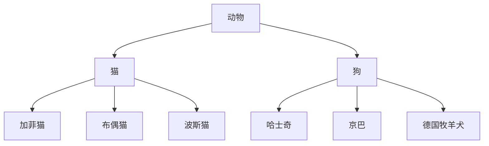

[TOC]


# 第二部分: C++核心

## 一. 内存分区

C++程序在执行时,将内存大方向划分为四个区域

- **代码区**:存放函数体的二进制代码,由**操作系统进行管理的**
- **全局区**:存放**全局变量**和**静态变量**以及**常量**
- **栈区**:由**编译器自动分配**释放,**存放函数的参数值**,**局部变量**等
- **堆区**:由**程序员分配和释放**,若程序员不释放程序结束时由操作系统回收

**内存四区意义:**
不同区域存放的数据,赋予不同的生命周期,给我们更大的灵活编程

### 1.1 程序运行前

在程序编译后，生成exe可执行程序，未执行该程序前分为两个区域

**代码区:**

- 存放CPU执行的机器指令
- 代码区是**共享的**，共享的目的是对于频繁被执行的程序，只需要在内存中有一份代码即可
- 代码区是**只读的**，使其只读的原因是防止程序意外地修改了它的指令

**全局区:**

- **全局变量**和**静态变量**存放在此.
- 全局区还包含了常量区,字符串常量和其他常量也存放在此.
- 该区域的数据在程序结束后由操作系统释放

### 1.2 程序运行时

**栈区:**

- 由编译器自动分配释放,存放函数的参数值,局部变量等
- 注意事项:不要返回局部变量的地址,栈区开辟的数据由编译器自动释放

**堆区:**

- 由程序员分配释放,若程序员不释放,程序结束时由操作系统回收
- 在C++中主要利用`new`在堆区开辟内存
- 使用`delete`回收内存(释放单个内存空间`delete p;`释放数组空间`delete[] p`)

**代码演示:**

```c++
int* func()
{
    //使用new开辟堆区空间
    int *p=new int(10);
    return p;
}

int main()
{
    int *p=func();
    cout<<*p<<endl;
    //回收内存
    delete p;
    return 0;
}
```

```
输出结果:
10
```

## 二. 引用

### 1. 引用的基本使用

**作用:**

- 给变量起别名,原理是取得变量的地址(与C略有不同)

**语法:**
`数据类型 &别名 = 原名`

```c++
int a = 10;
int &b = a;

cout<<"a: "<<a<<endl;
cout<<"b: "<<b<<endl;
```

```
输出结果:
10
10
```

### 2. 引用注意事项

- 引用必须初始化
- 引用在初始化后,不可以改变

```c++
//引用必须初始化
int &a;    //错误
```

```c++
//引用在初始化后,不可以改变
int a = 10;
int c = 20;
int &b = a;
&b = c;    //错误
```

### 3. 引用做函数参数

**作用:**

- 函数传参时,可以利用引用的技术让形参修饰实参

**优点:**

- 可以简化指针修改实参

**代码演示:**

```c++
//1. 地址传递
void func_1(int* a, int* b)
{
    int temp = *a;
    *a = *b;
    *b = temp;
}

//2. 引用传递
void func_2(int& a, int& b)
{
    int temp = a;
    a = b;
    b = temp;
}

int main()
{
    int a = 10, b = 20;
    func_1(&a,&b);
    cout << "a: " << a << " b: " << b << endl;
    a = 30, b = 40;
    func_2(a, b);
    cout << "a: " << a << " b: " << b << endl;
    return 0;
}
```

```
输出结果:
a: 20 b: 10
a: 40 b: 30
```

### 4. 引用做函数返回值

**作用:**

- 引用是可以作为函数的返回值存在的

**注意:**

- 不要返回局部变量引用

**用法:**

- 函数调用作为左值

**代码演示:**

```c++
//不要返回局部变量引用
int& func()
{
    int a = 10;        //局部变量存放在 栈区

    return a;
}
//全局变量
int b = 10;
int& func_2()
{
    return b;
}
//静态变量,存放在全局区
int& func_3()
{
    static c = 30;    
    return c;
}
int main()
{
    int &ref_1 = func();
    cout<<"ref_1 = "<<ref_1<<endl;    //部分编译器会保留一次局部变量
    cout<<"ref_2 = "<<ref_2<<endl;
    cout<<"ref_3 = "<<ref_3<<endl;
    return 0;
}
```

```
输出结果:
ref_1 = -858993460
ref_2 = 10
ref_3 = 30
```

### 5. 引用的本质

**本质:**

- 引用的本质在c++内部实现是一个值针常量

### 6. 常量引用

作用:

- 常量引用主要用来**修饰形参**，防止误操作

**在函数形参列表中，可以加`const`修饰形参，防止形参改变实参**

```c++
int& ref = 10;        //错误,引用必须引一块合法内存

//编译器修改代码为:
//int temp = 10;
//const int& ref = temp;此时代码正确
const in& ref = 10; 
```

```c++
void func(int& n)
{
    //此时变量也被修改了
    n = 100;
    cout<<"val = "<<n<<endl;
}
int main()
{
    int a = 10;
    func(a);
}
```

```
输出结果:
100
```

```c++
void func(const int& n)
{
    //此时n是不可修改的
    n = 100;
    cout<<"val = "<<n<<endl;
}
int main()
{
    int a = 10;
    func(a);
}
```

## 三. 函数高级：

#### 1. 函数默认参数:

在C++中,函数的形参是可以有默认值的.

语法: ` 返回值类型 函数名 (参数=默认值){}`

**代码演示:**

```c++
int func(int a,int b=10,int c=10)
{
    return a+b+c;
}
//1．如果某个位置参数有默认值，那么从这个位置往后，从左向右，必须都要有默认值
//2．如果函数声明有默认值，函数实现的时候就不能有默认参数
int main()
{
    cout<<func(10,20,30)<<endl;
    cout<<func(10)<endl;            //使用函数默认参数
    return 0;
}
```

```
输出结果:
60
30
```

如果某个位置参数有默认值，那么从这个位置往后，从左向右，必须都要有默认值

**代码演示:**

```c++
//正确示例
int func(int a,int b=10,int c=10)
{

}
//错误示例
int func(int a,int b=10,int c)
{

}
```

如果函数声明有默认参数，函数实现就不能有默认参数

**代码演示:**

```C++
int func(int a=10,int b=10);

//该用法错误,函数声明中已经有了默认参数,故函数实现中不能有默认参数
int func(int a=10,int b=10)
{

}
//正确用法
int func(int a,int b)
{

}
```

#### 2. 函数的占位参数

C++中函数的形参列表里**可以有占位参数**，用来做占位，调用函数时必须填补该位置

语法: `返回值类型 函数名（数据关型){}`

**代码演示:**

```c++
void func(int a ,int)
{
    cout<<"This is a function"<<endl;
}

int main()
{
    //调用函数,必须传入两个参数
    func(10,10);
}
```

#### 3. 函数重载

**作用:**函数名可以相同，提高复用性

**函数重载满足条件:**

1. 同一个作用域下

2. 函数名称相同

3. 函数参数类型不同,或者个数不同,或者顺序不同

   **代码演示:**

```c++
//函数重载必须在同一个作用域下

//参数类型不同作为函数重载条件
void func()
{
    cout<<"调用func()"<<endl;
}
void func(int a)
{
    cout<<"调用func(int a)"<<endl;
}
void func(double a)
{
    cout<<"调用func(double a)"<<endl;
}

//参数顺序不同作为函数重载条件
void func(int a,char b)
{
    cout<<"调用func(int a,char b)"<<endl;
}
void func(char a,int b)
{
    cout<<"调用func(char a,int b)"<<endl;
}
int main()
{
    func();//调用第一个重载函数
    func(1);//调用第二个重载函数
    func(1.0);//调用第三个重载函数
    func(1,'c');//调用第四个重载函数
    func('c',1);//调用第五个重载函数
}
```

```
输出结果:
调用func()
调用func(int a)
调用func(double a)
调用func(int a,char b)
调用func(char a,int b)
```

**注意:**函数的返回值不可以作为函数重载的条件

​    **代码演示:**

```c++
void func(int a)
{
    cout<<"调用 void func(int a)"<<endl;
}
int func(int a)
{
    cout<<"调用 int func(int a)"<<endl;
}
int main()
{
    //错误,编译器无法识别重载函数
    func(1);
}
```

##### 3.1 函数重载注意事项

###### 3.1.1 引用作为重载条件

​    **代码演示:**

```c++
//引用作为重载条件
void func(int &a)    
{
    cout<<"调用 void func(int &a)"<<endl;
}
void func(const int &a)
{
    cout<<"调用 void func(const int &a)"<<endl;
}
int main()
{
    int a=10;
    func(a);
    func(10);
    //原理常量:传入void func(int &a)非法,故只能传入void func(const int &a)
}
```

```
输出结果:
调用 void func(int &a)
调用 void func(const int &a)
```

###### 3.1.2 函数重载碰到函数默认参数

​    **代码演示:**

```C++
//函数重载碰到函数默认参数
void func(int a,int b=10)
{

}
void func(int a)
{

}
int main()
{
    //当函数重载遇到默认参数,出现二义性,编译器报错
    func(10);
}
```

## 四. 类和对象

C++面向对象的三大特性为:封装、继承、多态

C++认为万事万物都皆为对象，对象上有其属性和行为

具有相同性质的对象，我们可以抽象称为类，人属于人类，车属于车类

### 1. 封装

#### 1.1 封装的意义

**封装是C++面向对象三大特性之一**

**封装的意义:**

1. 将属性和行为作为一个整体，表现生活中的事物

2. 将属性和行为加以权限控制

**封装意义一:**

在设计类的时候，属性和行为写在一起，表现事物

语法:`class类名{ 访问权限:属性/行为 };`

​    **代码演示:**

```c++
//设计一个圆类
class Circle
{
    //访问权限,Class与stuct的区别, class默认为private不可访问
    public:
    //属性
    //半径
    int r;

    //行为
    //获取圆的周长
    double calculateC()
    {
        return 2*pi*r*r;
    }
}; 

int main()
{
    //通过圆类,创建具体的圆(对象)
    Circle cl;    //通过一个类创建一个对象(实例化)
    cl.r=10;
    cout<<"周长:"<<cl.calculateC()<<endl;
    return 0;
}
```

**示例:设计一个学生类,具有姓名学号的属性,可以给姓名学号赋值,可以显示姓名学号**

​    **实现代码:**

```C++
//学生类
class Student
{
    public:
    string name;
    long long Student_ID;

    void setName(string _name)
    {
        name=_name;
    }
    void setStudent_ID(long long _Student_ID)
    {
        Student_ID=_Student_ID;
    }

    void showName()
    {
        cout<<"姓名:"<<name<<endl;
    }
    void showStudent_ID()
    {
        cout<<"学号:"<<Student_ID<<endl;
    }
};
int main()
{
    Student st_1;
    st_1.name="xiaoming";        //用st_1.setName("xiaoming");替代
    st_1.Student_ID=2202201111;    //用st_1.setStudent_ID(2202201111);替代
    st_1.showName();
    st_1.showStudent_ID();
    return 0;
}
```

```
输出结果:
姓名:xiaoming
学号:2202201111
```

**封装意义二:**

类在设计时，可以把属性和行为放在不同的权限下，加以控制访问权限有三种:

1. `public `公共权限             成员    类内可以访问    类外可以访问

2. `protected` 保护权限      成员     类内可以访问    类外不可以访问   (和`private`没区别)

3. `private`私有权限            成员     类内可以访问     类外不可以访问

   **代码演示:**

```C++
class Person
{
    public:
    string name;
    protected:
    string car;
    private:
    int password;

    public:
    void func()
    {
        name="zhangsan";
        car="tuolaji";
        password=123456;
    }
};

int main()
{
    Person pl;            //实例化对象;
    pl.name="lisi";
    pl.car="benz";        //错误,类外不可以访问protect内成员
    pl.password=123;    //错误,类外不可以访问private内成员
}
```

#### 1.2 struct和class的区别

在C++中`struct`和`class`唯—的区别就在于**默认的访问权限**不同
**区别:**
`struc`t默认权限为公共

`class`默认权限为私有

#### 1.3 成员属性设置为私有

**优点:**

1. 将所有成员属性设置为私有，可以自己控制读写权限

2. 对于写权限，我们可以检测数据的有效性

### 2. 对象的初始化和清理

C++中的面向对象来源于生活，每个对象也都会有初始设置以及对象销毁前的清理数据的设置。

#### 2.1 构造函数和析构函数

C++利用了**构造函数**和**析构函数**解决上述问题,这两个函数将会被编译器自动调用,完成对象初始化和清理工作.对象的初始化和清理工作是编译器强制要我们做的事情,**因此如果我们不提供构造和析构,编译器会提供,编译器提供的构造函数和析构函数是空实现.**

1. 构造函数:主要作用在于创建对象时为对象的成员属性赋值,构造函数由编译器自动调用,无须手动调用.

2. 析构函数:主要作用在于对象销毁前系统自动调用,执行一些清理工作.

构造函数语法:`类名(){}`

1. 构造函数，没有返回值也不写`void`
2. 函数名称与类名相同
3. 构造函数可以有参数，因此可以发生重载
4. 程序在调用对象时候会自动调用构造，无须手动调用,而且只会调用一次

析构函数语法:`~类名(){}`

1. 析构函数，没有返回值也不写`void`
2. 函数名称与类名相同,在名称前加上符号~
3. 析构函数不可以有参数，因此不可以发生重载
4. 程序在对象销毁前会自动调用析构，无须手动调用,而且只会调用一次

​    **代码演示:**

```c++
class Person
{
    //构造函数,调用对象时调用,只调用一次
    Person()
    {

    }
    //析构函数,对象销毁时调用,只调用一次
    ~Person()
    {

    }
}
```

​    **注意:构造函数和析构函数都是必须的,如果我们未提供,编译器会提供一个空实现的构造和析构函数**

#### 2.2 构造函数的分类及调用

**两种分类方式:**
    按参数分为:有参构造和无参构造
​    按类型分为:普通构造和拷贝构造

**三种调用方式:**
    括号法
    显示法
​    隐式转换法

​    **代码演示:**

```c++
 //构造函数
class Person
{
public:
    Person()        //无参构造,也叫默认构造
    {
        cout<<"无参构造函数调用"<<endl;
    }
    Person(int a)    //有参构造
    {
        cout<<"有参构造函数调用"<<endl;
    }

    //拷贝构造函数
    Person(const Person &p)        //引用的方式传递,并用const限定,防止修改对象
    {
        cout<<"拷贝构造函数调用"<<endl;
    }
};
//调用
void test()
{
    //想要调用对象的构造函数和析构函数时,应该使构造函数和析构函数处于public部分
    //调用方法:

    //1.括号法:
    Person p1;//默认构造函数的调用
    Person p2(10);//有参构造函数的调用
    Person p3(p2);//拷贝构造函数的调用
    //注意:
    //Person p1();将无法调用构造函数,因为编译器认为它是一个函数的声明;

    //2.显示法
    Person p1;
    Person p2=Person(10);//有参构造,Person(10)创建了一个匿名对象
    Person p3=Person(p2);//拷贝构造,Person(p2)创建了一个匿名对象
    //匿名对象    特点:当前行执行结束后,系统会立即回收匿名对象
    //注意:
    //不要利用拷贝函数构造函数,初始化匿名对象,编译器会认为Person(p3)==Person p3;对象声明

    //3.隐式转换法
    Person p4=10;//相当于 Perosn p4=Person(10);有参构造
    Person p5=p4;//拷贝构造
}
int main()
{
    test();//函数结束后会释放构造的对象
    return 0;
}
```

#### 2.3 拷贝构造函数调用时机

C++中拷贝构造函数调用时机通常有三种情况

1. 使用一个已经创建完毕的对象来初始化一个新对象
2. 值传递的方式给函数参数传值
3. 以值方式返回局部对象

​    **代码演示:**

```c++
class Person
{
public:
    int age;
    Person()
    {
        cout<<"无参构造函数调用"<<endl;
    }
    Person(int _age)    
    {
        cout<<"有参构造函数调用"<<endl;
        age=_age;
    }

    Person(const Person &p)        
    {
        cout<<"拷贝构造函数调用"<<endl;
        age=p.age;
    }
};

//1.使用一个已经创建完毕的对象来初始化一个新对象
void test_1()
{
    Person p1(20);
    Person p2(p1);    //完全拷贝p1的成员
    cout<<"p2年龄:"<<p2.age<<endl;
}

int main()
{
    test_1();
    return 0;
}
```

```
输出结果:
有参构造函数调用
拷贝构造函数调用
p2年龄:20
```

```c++
class Person
{
public:
    int age;
    Person()
    {
        cout<<"无参构造函数调用"<<endl;
    }
    Person(int _age)    
    {
        cout<<"有参构造函数调用"<<endl;
        age=_age;
    }

    Person(const Person &p)        
    {
        cout<<"拷贝构造函数调用"<<endl;
        age=p.age;
    }
};

//2.值传递的方式给函数参数传值
void func_2(Person p)
{

}
void test_2()
{
    Person p;    //默认构造函数
    func_2(p);    //func_2()的形参构造为拷贝构造函数
}
int main()
{
    test_2();
    return 0;
}
```

```
输出结果:
无参构造函数调用
拷贝构造函数调用
```

```C++
class Person
{
public:
    int age;
    Person()
    {
        cout<<"无参构造函数调用"<<endl;
    }
    Person(int _age)    
    {
        cout<<"有参构造函数调用"<<endl;
        age=_age;
    }

    Person(const Person &p)        
    {
        cout<<"拷贝构造函数调用"<<endl;
        age=p.age;
    }
};

//3.以值方式返回局部对象
Person func_3()
{
    Person p;         //先调用默认构造函数
    return p;
}
void test_3()
{
    Person p=func_3();//这里是拷贝构造函数
}

int main()
{
    test_3();
    return 0;
}
```

```
输出结果:
无参构造函数调用
拷贝构造函数调用
```

#### 2.4 构造函数调用规则

**默认情况下，C++编译器至少给一个类添加3个函数**

1. 默认构造函数(无参，函数体为空)
2. 默认析构函数(无参，函数体为空)
3. 默认拷贝构造函数，对属性进行值拷贝

**构造函数调用规则如下:**

如果用户定义有参构造函数，c++不在提供默认无参构造，但是会提供默认拷贝构造
如果用户定义拷贝构造函数，C++不会再提供其他构造函数

#### 2.5 深拷贝与浅拷贝

**深浅拷贝是面试经典问题**

**浅拷贝**:简单的赋值拷贝操作
**深拷贝**:在堆区重新申请空间，进行拷贝操作

​    **代码演示:**

```c++
class Person
{
public:
    int age;
    int* height;
    Person()
    {
        cout<<"默认构造函数"<<endl;
    }

    Person(int _age,int _height)
    {
        age=_age;
        height = new int(_height);
        cout<<"有参构造函数"<<endl;
    }

    //自己实现拷贝构造函数,解决浅拷贝带来的问题
    Person (const Person &p)
    {
        cout<<"拷贝构造函数"<<endl;
        age = p.age;
        //height = p.height    //编译器默认实现的拷贝函数,相当于直接传递内存地址

        //深拷贝,重新开辟内存
        height = new int (*p.height);

    }
    ~Person()
    {
        //析构函数将堆区开辟的数据释放
        if(height!=NULL)
        {
            delete height;
            height=NULL;
        }
        cout<<"析构函数"<<endl;
    }
};
void func()
{
    Person p1(18,160);
    cout<<"p1的年龄:"<<p1.age<<"身高:"<<*p1.height<<endl;
    Person p2(p1);        //编译器提供默认的拷贝函数,进行浅拷贝

    //使用默认构造函数,会导致p2对象销毁时释放掉p1对象的height成员的内存,导致p1释放内存时报错


}
int main()
{
    func();
    return 0;
}
```


#### 2.6 初始化列表

**作用:**
C++提供了初始化列表语法，用来初始化属性
语法:`构造函数()∶属性1(值1),属性2(值2) ... {}`

​    **传统初始化操作**

​    **代码演示:**

```c++
class Person
{
public:
    int a,b,c;
    //传统初始化操作
    Person(int _a,int _b,int _c)
    {
        a=_a,b=_b,c=_c;
    }
};
void func()
{
    Person p(10,20,30);
    cout<<"p.a:"<<p.a<<endl;
    cout<<"p.b:"<<p.b<<endl;
    cout<<"p.c:"<<p.c<<endl;
}
int main()
{
    func();
    return 0;
}
```

```
输出结果:
p.a:10
p.b:20
p.c:30
```

​    **初始化列表初始化属性**

​    **代码演示:**

```c++
class Person
{
public:
    int a,b,c;
    //初始化列表初始化属性
   Person(int _a ,int _b ,int _c) :a(_a)，b(_b)，c(_c)
   {

   }

};
void func()
{
    Person p(10,20,30);
    cout<<"p.a:"<<p.a<<endl;
    cout<<"p.b:"<<p.b<<endl;
    cout<<"p.c:"<<p.c<<endl;
}
int main()
{
    func();
    return 0;
}
```

```
输出结果:
p.a:10
p.b:20
p.c:30
```

#### 2.7 类对象作为类成员

**C++类中的成员可以是另一个类的对象，我们称该成员为对象成员**

​    **代码演示:**

```c++
//类对象作为类成员

//手机类
class phone
{
public:
    string p_name;
    phone(string _p_name):p_name(_p_name)
    {
        cout<<"phone的构造函数"<<endl;
    }
    ~phone()
    {
        cout<<"phone的析构函数"<<endl;
    }
};

//人类
class Person
{
public:
    //Phone p1 = _p_name;  隐式转换法
    Person(string _name,string _p_name):name(_name),p1(_p_name)
    {
        cout<<"Person的构造函数"<<endl;
    }
    ~Person()
    {
        cout<<"Person的析构函数"<<endl;
    }
    //姓名
    string name;
    //手机
    phone p1;

};

//当其他类对象作为本类成员，构造时候先构造类对象，再构造自身
//析构函数调用的顺序与构造函数相反
void func()
{
    Person p("zhangsan","huawei");
    cout<<"name:"<<p.name<<"  phone:"<<p.p1.p_name<<endl;
}

int main()
{
    func();
    return 0;
}
```

```
输出结果:
phone的构造函数
Person的构造函数
name:zhangsan  phone:huawei
Person的析构函数
phone的析构函数
```

#### 2.8 静态成员

静态成员就是在成员变量和成员函数前加上关键字`static`，称为静态成员
静态成员分为:
**静态成员变量**

1. 所有对象共享同一份数据
2. 在编译阶段分配内存
3. 类内声明，类外初始化

**静态成员函数**

1. 所有对象共享同一个函数
2. 静态成员函数只能访问静态成员变量

​    **代码演示:**

```c++
//静态成员变量
class Person
{
public:
    static int a;
private:
    static int b;
};

//类内声明，类外初始化
int Person::a=10;
int Person::b=20;
//静态成员变量不属于某个对象,所有对象共享同一份数据
//静态成员变量的访问方式:
//1.通过对象访问
//2.通过类名访问
void func()
{
    //1.通过对象访问
    Person p1;
    cout<<p1.a<<endl;
    //2.通过类名访问
    cout<<Person::a<<endl;
    //类外不可访问私有成员对象
    //cout<<Person::b<<endl;        //错误
}

int main()
{
    func();
    return 0;
}
```

```c++
//静态成员函数
class Person
{
public:
    static void func()
    {
        a=100;      //静态成员函数 可以访问   静态成员变量
        //b=200;  //静态成员函数 不可以访问 非静态成员变量
        //无法区分来自哪个对象的成员变量
        cout<<"static void func()调用"<<endl;
    }
    static int a;        //静态成员变量
    int b;                //非静态成员变量
};
void test1()
{
    //1.通过对象访问
    Person p1;
    p.func();
    //2.通过类名访问
    Person::func();
}
```

### 3. C++对象模型和this指针

#### 3.1 成员变量和成员函数分开存储

在C++中，类内的**成员变量**和**成员函数**分开存储
只有**非静态成员变量**才属于类的对象上

​    **代码演示:**

```c++
//空对象占用空间
class Person
{

};
void test1()
{
    Person p;
    //空对象占用内存空间为: 1
    //C++编译器会给每个空对象也分配一个字节的空间,是为了区分空对象占空间的位置
    cout<<"Sizeof p = "<<sizeif(p)<<endl;
}
```

```
输出结果:
1
```

```C++
class Person
{
    //成员变量 和 成员函数 是分开储存的
    int a;//非静态成员变量,属于对象上
    static int b;//静态成员变量,不属于对象上
    void func1(){}//非静态成员函数,不属于对象上
    static void func2(){}//静态成员函数,不属于对象上
};
```

#### 3.2 this指针概念

每一个非静态成员函数只会诞生一份函数实例，也就是说多个同类型的对象会共用一块代码
那么问题是:这一块代码是如何区分那个对象调用自己的呢?

C++通过提供特殊的对象指针,`this`指针,解决上述问题.**`this`指针指向被调用的成员函数所属的对象**

`this`指针是隐含每一个非静态成员函数内的一种指针
`this`指针不需要定义,直接使用即可

**this指针的用途:**

1. 当形参和成员变量同名时,可用`this`指针来区分

2. 在类的非静态成员函数中返回对象本身,可使用`return*this`

​    **代码演示:**

```c++
class Person
{
public:
    int age;
     Person(int age)
     {
         this->age=age;
         //this指针指向被调用的成员函数所属的对象,在这里就是指向p1
     }
    void func(const Person &p)
    {
        this->age+=p.age;
    }
};
//1 解决名称冲突
void test1()
{
    Person p1(18);
    cout<<"p1的年龄: "<<p1.age<<endl;
}
```

```
输出结果:
p1的年龄: 18
```

```c++
class Person
{
public:
    int age;
     Person(int age)
     {
         this->age=age;
         //this指针指向被调用的成员函数所属的对象,在这里就是指向p1
     }
    //返回值应该是Person&,此时返回对象本体,返回Person时是一个新的对象
    Person& func(const Person &p)    
    {
        this->age+=p.age;
        return *this;                //返回对象本体
    }
};
//2返回对象本身用*this
void test2()
{
    Person p1(10);
    Person p2(10);
    p2.func(p1).func(p1).func(p1);    //链式编程思想
    cout<<"p2的年龄: "<<p2.age<<endl;
}
```

```
输出结果:
p2的年龄: 40
```

#### 3.3 空指针访问成员函数

C++中空指针也是可以调用成员函数的，但是也要**注意有没有用到`this`指针**
如果用到`this`指针，需要加以判断保证代码的健壮性

​    **代码演示:**

```c++
//空指针访问成员函数
class Perosn
{
public:
    int age;
    void showClassName()
    {
       cout << "this is Person class" << endl;
    }
    void showPersonAge()
    {
        if(this==NULL)
        {
            return;
        }
        //函数使用的成员前默认加了一个this->指针
        //报错原因是因为传入的指针是为NULL
        cout << "age = " <<age << end1;
    }
};
void test01()
{
    Person* p = NULL;
    p->showC1assName();
    p->showPersonAge();
}
```

```
输出结果:
this is Person class
```

#### 3.4  const 修饰成员函数

**常函数:**

1. 成员函数后加 `const `后我们称为这个函数为常函数
2. 常函数内不可以修改成员属性
3. 成员属性声明时加关键字`mutable`后,在常函数中依然可以修改

**常对象:**

1. 声明对象前加` const `称该对象为常对象
2. 常对象只能调用常函数

​    **代码演示:**

```c++
//常函数
class Person
{
public:
    int a;
    mutable int b;    //特殊变量，即使在常函数中，也可以修改这个值

    //this指针的本质 是指针常量 指针的指向是不可以修改的  
    //this相当于 Person* const this;
    //如果让this指向的值也不可以修改,应该是const Person* const this;
    void showPerson() const
    {
        this->a=100;    //this指针指向的值是可以修改的,但在常函数中无法修改
        this->b=200;    //mutable关键字修饰的变量可以在常函数中修改
    }

};
void test1()
{
    Person p;
    p.showPerson();
}
```

```c++
//常对象
const Person p;    //加上关键字const变成常对象
p.a=100;        //p为常对象,此时不可修改
p.b=100;        //b是特殊变量,在常对象条件下也可以修改
p.showPerson    //常对象只能调用常函数
```

### 4. 友元

在程序里，有些私有属性也想让类外特殊的一些函数或者类进行访问，就需要用到友元的技术
友元的目的就是让—个函数或者类访问另—个类中私有成员
友元的关键字为`friend`

**友元的三种实现:**

1. 全局函数做友元
2. 类做友元
3. 成员函数做友元

#### 4.1 全局函数做友元

​    **代码演示:**

```c++
//全局函数做友元
class Buiding
{
    //全局函数的声明:
    friend void Gfriend(Buiding* buiding);
public:
    string sittingRoom="客厅";
private:
    string bedRoom="卧室";
};
//全局函数
void Gfriend(Buiding* buiding)
{
    cout<<"全局函数正在访问: "<<buiding->sittingRoom<<endl;
    cout<<"全局函数正在访问: "<<buiding->bedRoom<<endl;
    //此时可以访问私有成员
}
int main()
{
    Buiding buiding;
    Gfriend(&buiding);
    return 0;
}
```

```
输出结果:
全局函数正在访问: 客厅
全局函数正在访问: 卧室
```

#### 4.2 类做友元

​    **代码演示:**

```c++
//类做友元
class Buiding
{
    //友元类的声明
    friend class Gfriend;
public:
    Buiding();
    string sittingRoom="客厅";
private:
    string bedRoom="卧室";
};
class Gfriend
{
public:
    Gfriend();
    Buiding* buiding;
    void visit();    //参观函数,访问Buiding中的属性
};

//类外写成员函数
Buiding::Buiding()
{
    sittingRoom="客厅";
    string bedRoom="卧室";
}
Gfriend::Gfriend()
{
    buiding =new Buiding;
}
void Gfriend::visit()
{
    cout<<"Gfriend类正在访问: "<<buiding->sittingRoom<<endl;
    cout<<"Gfriend类正在访问: "<<buiding->bedRoom<<endl;
}

int main()
{
    Gfriend x;
    x.visit();
    return 0;
}
```

```
输出结果:
Gfriend类正在访问: 客厅
Gfriend类正在访问: 卧室
```

#### 4.3 成员函数做友元

​    **代码演示:**

```c++
//成员函数做友元

class Buiding;//声明Buiding类
class Gfriend
{
public:
    Gfriend();
    Buiding* buiding;
    void visit1();    //让visit1函数可以访问Buiding中的私有成员
    void visit2();    //让visit2函数不可以访问Buiding中的私有成员
};

class Buiding
{
    //成员函数做友元的声明,需要先声明Gfriend类,否则报错
    friend void Gfriend::visit1();
public:
    Buiding();
    string sittingRoom = "客厅";
private:
    string bedRoom = "卧室";
};


Buiding::Buiding()
{
    sittingRoom = "客厅";
    string bedRoom = "卧室";
}
Gfriend::Gfriend()
{
    buiding = new Buiding;
}
void Gfriend::visit1()
{
    cout << "Gfriend::visit1()正在访问: " << buiding->bedRoom << endl;
}

void Gfriend::visit2()
{
    cout << "Gfriend::visit2()正在访问: " << buiding->sittingRoom << endl;
}

int main()
{
    Gfriend x;
    x.visit1();
    x.visit2();
    return 0;
}
```

```
输出结果:
Gfriend::visit1()正在访问: 卧室
Gfriend::visit2()正在访问: 客厅
```

### 5. 运算符重载

**运算符重载概念:**对已有的运算符重新进行定义，赋予其另一种功能，以适应不同的数据类型

**实现方法:**

1. 成员函数重载
2. 全局函数重载

#### 5.1 加号运算符重载

**作用:**
实现两个自定义数据类型相加的运算

**注意:**

运算符重载也可以发生函数重载

​    **代码演示:**

```c++
//加号运算符重载
class moduel
{
public:
    //1.成员函数重载+号
    //成员函数重载本质调用
    //Person p3 = pl.operator+(p2);
    moduel operator+(moduel &p)
    {
        moduel temp;
        temp.a=this->a+p.a;
        temp.b=this->b+p.b;
        return temp;
    }
    int a;
    int b;
};
void test()
{
    moduel p1,p2;
    p1.a=10;
    p1.b=10;
    p2.a=20;
    p2.b=20;

    moduel p3 = p1 + p2;
    cout<<"p3,a"<<p3.a<<endl;
    cout<<"p3.b"<<p3.b<<endl;

}
//2.全局函数重载+号
//全局函数重载本质调用
//Person p3 = operator+(pl，p2);
moduel operator+(moduel &p1,moduel &p2)
{
    moduel temp;
    temp.a=p1.a+p2.a;
    temp.b=p1.b+p2.b;
    return temp;
}
int main()
{
    func();
    return 0;
}
```

#### 5.2左移运算符重载(右移同理)

**作用:**

可以输出自定义数据类型

```c++
//左移运算符重载
class moduel
{
    //将运算符重载设为友元函数
    friend ostream& operator<<(ostream& cout,moduel &p);
public:
    moduel(int _a,int _b):a(_a),b(_b)
    {

    }
private:
    int a;
    int b;
};
//只能利用全局函数重载左移运算符
//本质operator<< (cout,p)简化cout << p
ostream& operator<<(ostream& cout,moduel &p)
{
    cout<<"a: "<<p.a<<" b: "<<p.b;
    return cout;
    //链式编程思想
}
int main()
{
    moduel p(10,10);
    cout<<p<<endl;
    return 0;
}
```

```
输出结果:
a: 10 b: 10
```

#### 5.3 递增运算符重载

**作用:**

通过重载递增运算符，实现自己的整型数据

```c++
//重载递增运算符
//自定义整型

class MyInteger
{
    friend ostream& operator<<(ostream& cout, MyInteger p);
public:
    MyInteger()
    {
        num = 0;
    }
    //重载++运算符
    //1.前置递增
    MyInteger& operator++()
    {
        num++;
        return *this;
    }
    //2.后置递增
    //Myinteger operator++(int)        占位参数,可以用于区分前置和后置递增
    MyInteger operator++(int)
    {
        MyInteger temp=*this;
        num++;
        return temp;
    }
private:
    int num;
};

//重载<<运算符
ostream& operator<<(ostream& cout, MyInteger p)
{
    cout << p.num;
    return cout;
}

int main()
{
    MyInteger myint1,myint2;
    cout << ++myint1 << endl;    
    cout << myint1 << endl;

    cout << myint2++ << endl;
    cout << myint2 << endl;
    return 0;
}
```

```
输出结果:
1
1
0
1
```

#### 5.4 赋值运算符重载

c++编译器至少给—个类添加4个函数

1. 默认构造函数(无参，函数体为空)
2. 默认析构函数(无参，函数体为空)
3. 默认拷贝构造函数，对属性进行值拷贝
4. 赋值运算符`operator=`对属性进行值拷贝

**如果类中有属性指向堆区，做赋值操作时也会出现深浅拷贝问题**

```c++
//赋值运算符重载
class Person
{
public:
    int* age;
    Person(int _age)
    {
        //开辟堆区空间
        age = new int (_age);
    }

    ~Person()
    {
        if(age!=NULL)
        {
            delete age;
            age=NULL;
        }
    }

    //重载赋值运算符
    Person& operator=(Person& p)
    {
       if(age!=NULL)
       {
           delete age;
           age=NULL;
       }
        //深拷贝
        age = new int(*p.age); 
        return *this;
        //链式
    }
};
int main()
{
    Person p1(18);
    Person p2(20);
    Person p3(30);
    p3 = p2 = p1;    //未设置重载赋值运算符函数时,编译器默认的浅拷贝函数,p2释放内存后,p1又重复释放了内存,产生报错
    cout<<"p1: "<<*p1.age<<endl;
    cout<<"p2: "<<*p2.age<<endl;
    cout<<"p3: "<<*p3.age<<endl;
    return 0;
}
```

```
输出结果:
p1: 18
p2: 18
p3: 18
```

#### 5.5 关系运算符重载

**作用:**

重载关系运算符，可以让两个自定义类型对象进行对比操作

​    **代码演示:**

```c++
//关系运算符重载
class Person
{
public:
    string name;
    int age;
    Person(string _name,int _age):name(_name),age(_age)
    {

    }
    //重载==
    bool operator==(Person& p)
    {
        if(this->name==p.name&&this->age==p.age)
            return true;
        else return false;
    }
    //重载!=
    bool operator!=(Person& p)
    {
        if(this->name!=p.name||this->age!=p.age)
            return true;
        else return false;
    }
};
int main()
{
    Person p1("Tom",18);
    Person p2("Nike",20);
    if(p1==p2)
        cout<<"true"<<endl;
    else if(p1!=p2)
        cout<<"false"<<endl;
    return 0;
}
```

```
输出结果:
false
```

#### 5.6 函数调用运算符重载

1. 函数调用运算符`()`也可以重载
2. 由于重载后使用的方式非常像函数的调用，因此称为仿函数
3. 仿函数没有固定写法，非常灵活

​    **代码演示:**

```c++
//函数调用运算符重载
//打印输出类
class MyPrint
{
public:
    //重载函数调用运算符
    void operator()(string test)
    {
        cout<<test<<endl;
    }
    int MyAdd()(int a,int b)
    {
        return a+b;
    }
};
int main()
{
    MyPrint myPrint;
    //由于使用起来非常类似于函数调用，因此称为仿函数
    myPrint("hello world");    
    //匿名函数对象
    cout<<MyAdd()(100,100)<< endl;
    return 0;
}
```

### 6. 继承

**继承是面向对象三大特性之一**

有些类与类之间存在特殊的关系，例如下图中:




我们发现,定义这些类时,下级别的成员除了拥有上一级的共性,还有自己的特性.

这个时候我们就可以考虑利用继承的技术.减少重复代码.

#### 6.1 继承的基本语法

基本语法:`class A : public B;`

- A类称为**子类**或**派生类**

- B类称为**父类**或**基类**

**派生类中的成员，包含两大部分:**
—类是从基类继承过来的,一类是自己增加的成员.
从基类继承过过来的表现其共性,而新增的成员体现了其个性.

```c++
class BaseClass
{
public:
    int a;
    int b;
    int c;
};
class Class_A:public BaseClass
{
    Class_A()
    {
        cout<<"Class_A: "<<a<<" "<<b<<" "<<c<<endl;
    }
}
class Class_B:public BaseClass
{
    Class_A()
    {
        cout<<"Class_B: "<<a<<" "<<b<<" "<<c<<endl;
    }
}
class Class_C:public BaseClass
{
    Class_A()
    {
        cout<<"Class_C: "<<a<<" "<<b<<" "<<c<<endl;
    }
}
```

#### 6.2 继承方式

**继承的语法:**`class子类∶继承方式 父类`
**继承方式—共有三种:**

1. 公共继承
2. 保护继承
3. 私有继承


   **代码演示:**

```c++
//继承方式
//公共继承
class Base
{
public:
    int a;
protected:
    int b;
private:
    int c;
};
class A:public Base
{
public:
    void func()
    {
        a=10;    //父类中的公共权限成员到子类中依然是公共权限
        b=10;    //父类中的保护权限成员到子类中依然是保护权限(类内可以访问,类外不可访问)
        //c=10;    //父类中的私有权限成员 子类访问不到
    }
};
class B:protected Base
{
public:   
    voida func()
    {
        a=10;    //此时为保护权限
        b=10;    //保护权限不变
        //c=10;    //子类不可访问
    }
};
class C:private Base
{
public:   
    voida func()
    {
        a=10;    //此时为私有权限
        b=10;    //此时为私有权限
        //c=10;    //,私有权限不变,子类不可访问
    }
};
```

#### 6.3 继承中的对象模型

**使用vs2022开发工具查看对象模型:**

**语法:**`cl /d1 reportSingleClassLayout类名 目标文件.cpp`

**示例:**

​        查看父类


#### 6.4 继承中构造和析构顺序

**构造先构造父类，析构先析构子类**

**代码演示:**

```c++
//继承中的构造和析构顺序
class Parent
{
public:
    Parent()
    {
        cout << "Parent的构造"<<endl;
    }
    ~Parent()
    {
        cout << "Parent的析构"<<endl;
    }
};
class Son :public Parent
{
public:
    Son()
    {
        cout << "Son的构造"<<endl;
    }
    ~Son()
    {
        cout << "Son的析构"<<endl;
    }
};
int main()
{
    Son s;
    return 0;
}
```

```
输出结果：
Parent的构造
Son的构造
Son的析构
Parent的析构
```

#### 6.5 继承同名成员处理方式

**当子类与父类出现同名的成员，通过子类对象，如何访问到子类或父类中同名的数据**

- 访问子类同名成员直接访问即可
- 访问父类同名成员需要加作用域(`Son.Parent::func()`)

**代码演示:**

```c++
//同名成员属性的处理方式
class Parent
{
public:
    int a;
    Parent()
    {
        a = 10;
    }
};
class Son :public Parent
{
public:
    int a = 20;
    Son()
    {
        a = 20;
    }
};
int main()
{
    Son s;
    //访问子类下成员
    cout << "       s.a:\t" << s.a << endl;
    //访问子类继承的父类的成员
    cout << "s.Parent::a:\t" << s.Parent::a << endl;
    return 0;
}
```

```
输出结果:
       s.a:      20
s.Parent::a:      10
```

```c++
//同名成员函数的处理方式
class Parent
{
public:
    void func()
    {
        cout<<"s.Parent::func()"<<endl;
    }
    //重载函数
    void func(int)
    {
        cout<<"s.Parent::func(int)"<<endl;
    }
};
class Son :public Parent
{
public:
    void func()
    {
        cout<<"s.func()"<<endl;
    }
};
int main()
{
    Son s;
    //调用子类中的同名成员函数
    s.func();
    //调用父类中的同名成员函数
    s.Parent::func();
    //调用父类中的重载函数
    s.Parent::func(100);
    return 0;
}
```

```c++
输出结果:
s.func()
s.Parent::func()
s.Parent::func(int)
```

#### 6.6 继承同名静态成员处理方式

**静态成员和非静态成员出现同名，处理方式—致**

- 访问子类同名成员直接访问即可
- 访问父类同名成员需要加作用域

```c++
//继承中的同名静态成员属性的处理
class Parent
{
public:
    static int a;
};
int Parent::a = 20;
class Son :public Parent
{
public:
    static int a;
};
int Son::a = 40;
int main()
{
    Son s;
    cout << "通过对象访问" << endl;
    //访问子类中同名静态成员属性
    cout << "       s.a:\t" << s.a << endl;
    //访问父类中同名静态成员属性
    cout << "s.Parent::a:\t" << s.Parent::a << endl;

    cout <<endl<<endl<< "通过类名访问" << endl;
    cout << "       Son::a:\t" << Son::a << endl;
    cout << "Son::Parent::a:\t" << Son::Parent::a << endl;
    return 0;
}
```

```
输出结果:
通过对象访问
       s.a:     20
s.Parent::a:    20


通过类名访问
       Son::a:  20
Son::Parent::a: 20
```

```c++
//继承中的同名静态成员函数的处理
class Parent
{
public:
    static void func()
    {
        cout << "       s.Parent::func():\t" << endl;
    }
};
class Son :public Parent
{
public:
    static void func()
    {
        cout << "       s.func():\t" << endl;
    }
};
int main()
{
    Son s;
    cout << "通过对象访问" << endl;
    //访问子类中同名静态成员函数
    s.func();
    //访问父类中同名静态成员函数
    s.Parent::func();

    cout << endl << endl << "通过类名访问" << endl;
    Son::func();
    Son::Parent::func();
    return 0;
}
```

```
输出结果:
通过对象访问
       s.func():
       s.Parent::func():


通过类名访问
       s.func():
       s.Parent::func():
```

#### 6.7 多继承语法

**C++允许一个类继承多个类**
语法:`class 子类:继承方式 父类1，继承方式 父类2...`
多继承可能会引发父类中有同名成员出现，需要加作用域区分
**C++实际开发中不建议用多继承**

#### 6.8 菱形继承

**概念:**
两个派生类继承同一个基类,又有某个类同时继承者两个派生类
**这种继承被称为菱形继承，或者钻石继承**.

**代码演示:**

```c++
//动物类
class animal
{
public:
    int age;
};
//羊类
class sheep :public animal
{
public:
};
//驼类
class camel :public animal
{
public:
};
//羊驼类
class alpaca :public sheep, public camel
{
public:

};

int main()
{
    alpaca apa;
    apa.sheep::age = 10;
    apa.camel::age = 20;
    cout << "apa.sheep::age:\t" << apa.sheep::age << endl;
    cout << "apa.camel::age:\t" << apa.camel::age << endl;
    return 0;
}
```

```
输出结果:
apa.sheep::age: 10
apa.camel::age: 20
```

```c++
//利用虚继承,解决菱形继承问题,关键字(virtual)
//animal类为 虚基类
//动物类
class animal
{
public:
    int age;
};
//羊类
class sheep :virtual public animal
{
public:
};
//驼类
class camel :virtual public animal
{
public:
};
//羊驼类
class alpaca :public sheep, public camel
{
public:

};

int main()
{
    alpaca apa;
    apa.sheep::age = 10;
    apa.camel::age = 20;
    //使用虚继承后,两个父类只有一份相同的数据
    cout << "apa.sheep::age:\t" << apa.sheep::age << endl;
    cout << "apa.camel::age:\t" << apa.camel::age << endl;
    return 0;
}
```

```
输出结果:
apa.sheep::age: 20
apa.camel::age: 20
```

### 7. 多态

#### 7.1 多态的基本概念

**多态是C++面向对象三大特性之一**
**多态分为两类:**

- 静态多态:函数重载和运算符重载属于静态多态，复用函数名
- 动态多态:派生类和虚函数实现运行时多态

静态多态和动态多态区别:

- 静态多态的函数地址早绑定–编译阶段确定函数地址
- 动态多态的函数地址晚绑定–运行阶段确定函数地址

