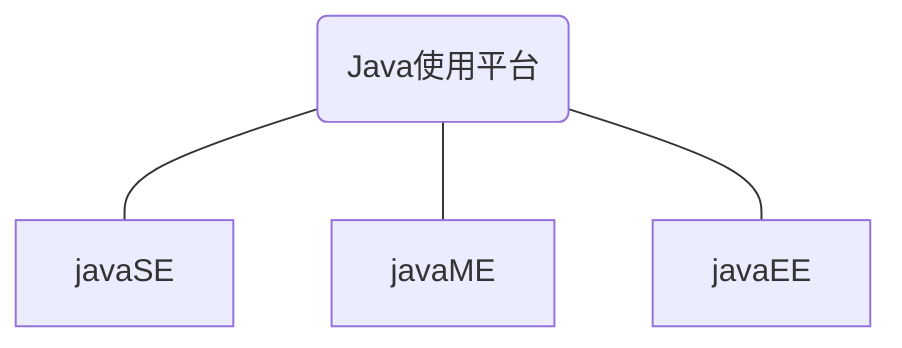
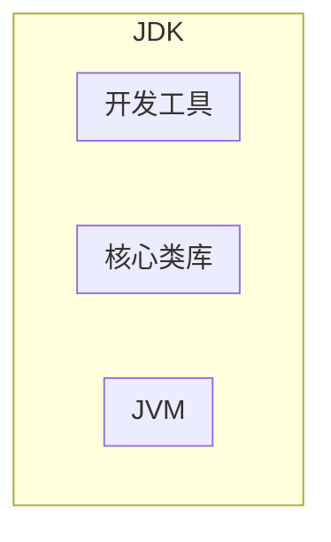
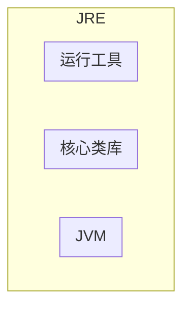
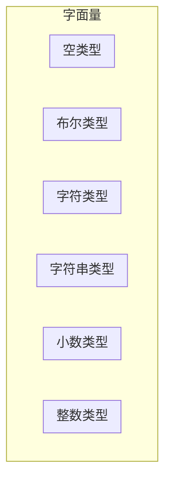
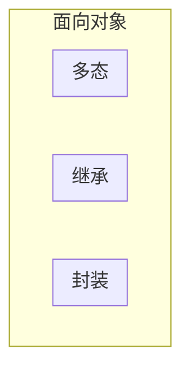

[TOC]


# 一. 基础

## 1. Java基本知识

### 1.1 第一个Java程序

```java
public class helloworld {
    public static void main(String[] args)
    {
        System.out.println("hello world");
    }
}
```

### 1.2 Java中的输入输出语句

1. `println`

```java
System.out.println("helloworld");	//该语句将输出"helloworld"
```

2. `Scanner`

```java
import java.util.Scanner;
Scanner sc = new Scanner(System.in);
int num = sc.nextInt();	//输入一个整数
```

#### 1.2.1 Scanner的注意事项

```java
//nextInt()遇到空格,回车会停止
System.out.println("请输入一个整数:");
int num = sc.nextInt();
System.out.println(num);
System.out.println("请输入第二个整数:");
int num2= sc.nextInt();
System.out.println(num2);

//next()遇到空格,回车会停止
System.out.println("请输入一个字符串:");
String str1 = sc.next();
System.out.println(str1);
System.out.println("请输入第二个字符串:");
String str2  = sc.next();
System.out.println(str2);

//nextLine()遇到空格,制表符都不会停止,遇到回车停止
System.out.println("请输入一个字符串:");
String str1 = sc.nextLine();
System.out.println(str1);
System.out.println("请输入第二个字符串:");
String str2  = sc.nextLine();
System.out.println(str2); 
```

### 1.3 使用JDK编译运行Java程序

1. 编译Java程序

```bash
javac helloworld.java	//javac将.java文件编译成.class 文件
```

2. 运行Java程序

```bash
java helloworld			//java用于运行.class 文件
```

### 1.4 Java的三大使用平台



1. javaSE
   - Java 语言的(标准版)，用于桌面应用的开发，是其他两个版本的基础。

2. javaME
   - Java语言的（小型版），用于嵌入式电子设备或者小型移动设备。

3. javaEE
   - **是一套规范**，使用Java语言开发企业级Web应用，它提供Web 服务、组件模型、管理和通信 API（比如：tomcat,JSP,Servelt,其他封装的框架等等）

### 1.5 Java的主要特征


### 1.6 JRE和JDK

JDK是Java的开发环境



JRE是Java的运行环境



### 1.7 IDEA中的项目结构

- project(项目)
  - module(模块)
    - package(包)
      - class(类)，在类中编写代码

## 2. Java基础语法

### 2.1 字面量

即数据在代码中的书写格式



### 2.2 变量

#### 2.2.1 定义方式

**语法:**

```java
 数据类型 变量名 = 数据值
```

#### 2.2.2 数据类型

| 数据类型 | 描述           | 取值范围                                          |
| -------- | -------------- | ------------------------------------------------- |
| byte     | 整数，一字节   | -128~127                                          |
| short    | 整数，两字节   | -32768~32767                                      |
| int      | 整数，四字节   | -2147483648~2147483647 (10位数)                   |
| long     | 整数，八字节   | -9223372036854775808~9223372036854775807 (19位数) |
| float    | 浮点数，四字节 | -3.401298e-38到3.402823e+38                       |
| double   | 浮点数，八字节 | -4.9000000e-324到1.797693e+308                    |
| char     | 字符           | 0-65535                                           |
| String   | 字符串型       |                                                   |
| boolean  | 布尔           | true，false                                       |

**注意:**

- 使用long类型，在数据值后面需要加上一个L后缀
- 使用float类型，在数据值后面需要加上一个F后缀

#### 2.2.3 标识符

即给**类**，**方法**，**变量**等起的名字。

标识符命名规则

- 由数字、字母、下划线(_)和美元符($)组成
- 不能以数字开头
- 不能是关键字(保留字)

- 区分大小写

命名建议

- 小驼峰命名法:**方法**、**变量**
  - 标识符是一个单词的时候，全部小写
  - 标识符由多个单词组成的时候，第一个单词首字母小写，其他单词首字母大写
- 大驼峰命名法:**类名**
  - 标识符是一个单词的时候，首字母大写
  - 标识符由多个单词组成的时候，每个单词的首字母大写

### 2.3 运算符和表达式

运算符

- 对字面量或者变量进行操作的符号

表达式

- 用运算符把字面量或者变量连接起来，符合java语法的式子就可以称为表达式。
- 不同运算符连接的表达式体现的是不同类型的表达式。

#### 2.3.1 算数运算符

| 符号 | 作用       |
| ---- | ---------- |
| +    | 加         |
| -    | 减         |
| *    | 乘         |
| /    | 除         |
| %    | 取模，取余 |
| ++   | 自增       |
| --   | 自减       |

**注意:**

- `i++`是先将`i`原来的值赋出去后，再自增
- `++i`是先将`i`自增后，再将`i`的值赋出去
- `i--`、`--i`和`i++`、`++i`同理

```java
int i = 10;
int X = i++;	//x=10
int y = ++i;	//x=11
```

#### 2.3.2 隐式转换和强制转换

隐式转换(自动类型提升)

- 取值**范围小**的数值==>取值**范围大**的数值
- 取值范围小的，和取值范围大的进行运算，小的会先提升为大的，再进行运算
- `byte` `short` ` char`三种类型的数据在运算的时候，都会直接先提升为`int`，然后再进行运算

强制转化

- 取值**范围大**的数值==>取值**范围小**的数值
- 语法:`目标数据类型 变量名 = (目标数据类型)被强转的数据;`

#### 2.3.3 赋值运算符

| 符号 | 作用       | 说明                      |
| ---- | ---------- | ------------------------- |
| =    | 赋值       | int a=10，将10赋值给变量a |
| +=   | 加后赋值   | a+=b，将a+b的值给a        |
| -=   | 减后赋值   | a-=b，将a-b的值给a        |
| *=   | 乘后赋值   | a*=b，将axb的值给a        |
| /=   | 除后赋值   | a/=b，将a÷b的商给a        |
| %=   | 取余后赋值 | a%=b，将a÷b的余数给a      |

#### 2.3.4 关系运算符

| 符号 | 说明                                                    |
| ---- | ------------------------------------------------------- |
| ==   | a==b，判断a和b的值是否相等，成立为true，不成立为false   |
| !=   | a!=b，判断a和b的值是否不相等，成立为true，不成立为false |
| >    | a>b，判断a是否大于b，成立为true，不成立为false          |
| >=   | a>=b，判断a是否大于等于b，成立为true，不成立为false     |
| <    | a<b，判断a是否小于b，成立为true，不成立为false          |
| <=   | a<=b，判断a是否小于等于b，成立为true，不成立为false     |

#### 2.3.5 逻辑运算符

| 符号 | 作用        | 说明                         |
| ---- | ----------- | ---------------------------- |
| &    | 逻辑与（且) | 并且，两边都为真，结果才是真 |
| \|   | 逻辑或      | 或者，两边都为假，结果才是假 |
| ^    | 逻辑异或    | 相同为false，不同为true      |
| !    | 逻辑非      | 取反                         |

##### 2.3.5.1 短路逻辑运算符

**短路:**

- 即逻辑运算符左边表达式不成立，就不执行右边的表达式
- 普通的逻辑运算符会判断运算符两边的表达式，即会执行两边的表达式

| 符号 | 作用   | 说明                         |
| ---- | ------ | ---------------------------- |
| &&   | 短路与 | 结果和&相同，但是有短路效果  |
| \|\| | 短路或 | 结果和\|相同，但是有短路效果 |

#### 2.3.6 三元运算符

**语法:**

- (表达式1)?(表达式2):(表达式3)

- 即`if`...`else`

#### 2.3.7 位运算符

| 运算符 | 含义       | 运算规则             |
| ------ | ---------- | -------------------- |
| <<     | 左移       | 向左移动，低位补0    |
| >>     | 右移       | 向右移动，高位补0或1 |
| >>>    | 无符号右移 | 向右移动，高位补0    |

### 2.4 流程控制语句

#### 2.4.1 顺序结构

顺序结构语句是Java程序默认的执行流程，按照代码的先后顺序，从上到下依次执行

#### 2.4.2 分支结构

1. `if`语句

```java
if(关系表达式){
    代码块
}
```

2. `if`...`else`

```java
if(关系表达式){
    代码块1
}else{
    代码块2
}
```

3. `if`...`else if`...`else`

```java
if(关系表达式){
    代码块1
}else if(关系表达式){
    代码块2
}else{
    代码块3
}
```

4. `switch`

```java
switch(表达式){
    case 值1:
        语句1;
        break;
    case 值2:
        语句2;
        break;
    case 值3:
        语句3;
        break;
    ...
    default:
        语句体n;
        break;
}
```

**注意:**

- 如果没有发现break，那么程序会继续执行下一个case的语句体，一直遇到break或者右花括号为止

#### 2.4.3 循环结构

1. `for`循环

```Java
for(初始化语句;条件判断语句;条件控制语句){
    循环体
}
```

2. `while`循环

```java
初始化语句;
while(条件判断语句){
    循环体;
    条件控制语句;
}
```

3. `for`和` while `的区别
   - `for`循环中，控制循环的变量,因为归属`for`循环的语法结构中，在`for`循环结束后，就不能再次被访问到了
   - `for`循环中:知道循环次数或者循环的范围
   - `while`循环中，控制循环的变量，对于`while`循环来说不归属其语法结构中，在`while`循环结束后，该变量还可以继续使用
   - `while`循环，不知道循环的次数和范围，只知道循环的结束条件。

3. `do`...`while`循环

```java
初始化语句
do{
    循环体
    条件控制语句    
}while(条件判断语句)
```

#### 2.4.4 循环控制结构

1. `continue`语句
   - 结束本次循环，进行下次循环
2. `break`语句
   - 结束整个循环

### 2.5 数组

#### 2.5.1 数组的概念

数组指的是一种容器，可以用来存储同种数据类型的多个值

- 数组容器在存储数据的时候，需要结合隐式转换考虑。
- 尽量使容器的类型，和存储的数据类型保持一致

#### 2.5.2 数组的定义

语法1:

```java
数据类型 []数组名
int []array
```

语法2:

```java
数据类型 数组名[]
int array[]
```

#### 2.5.3 数组的初始化

##### 2.5.3.1 数组的静态初始化

初始化:在内存中，为数组容器开辟空间，并将数据存入容器中的过程

语法(完整格式):

```java
数据类型[] 数组名=new数据类型[]{元素1，元素2，元素3...};
int[] array = new int[]{11,22,33};
```

语法(简写格式):

```java
数据类型[] 数组名={元素1，元素2，元素3...};
int[] array = {11,22,33};
```

##### 2.5.3.2 数组的动态初始化

动态初始化:初始化时只指定数组长度，由系统为数组分配初始值。

```java
数据类型[]数组名=new数据类型[数组长度];
int[] arr = new int[3];
```

数组默认初始化值的规律

- 整数类型:默认初始化值0
- 小数类型:默认初始化值0.0
- 字符类型:默认初始化值 '/u0000' 空格
- 布尔类型:默认初始化值false
- 引用数据类型:默认初始化值 null

##### 2.5.3.3 动态初始化和静态初始化的区别

动态初始化:手动指定数组长度，由系统给出默认初始化值。

- 只明确元素个数，不明确具体数值，推荐使用动态初始化

静态初始化:手动指定数组元素，系统会根据元素个数，计算出数组的长度。

- 需求中已经明确了要操作的具体数据，直接静态初始化即可。

#### 2.5.4 数组的地址值和元素访问

##### 2.5.4.1 数组的地址值

数组的地址值表示数组在内存中的位置

```java
int[] array = {11,22,33};
System.out.println(array); //[I@776ec8df
```

Java地址含义

- `[`:表示当前是一个数组
- `I`:表示当前数组元素都是`int`类型
- `@`表示一个间隔符号(固定格式)
- `776ec8df`数组的地址值

##### 2.5.4.2 数组元素访问

语法:

```java
数组名[索引];	//索引从0开始
array[1];
```

##### 2.5.4.3 数组的遍历

数组遍历:将数组中所有的内容取出来

```java
for(int i = 0;i < arr.length;i++){
    System.out.println(arr[i]);
}
```

#### 2.5.5 数组的内存图

栈

- 方法运行时使用的内存，比如main方法运行，进入方法栈中执行

堆

- 存储对象或者数组，new来创建的，都存储在堆内存

方法区

- 存储可以运行的class文件

本地方法栈

- JVM在使用操作系统功能的时候使用，与开发无关

寄存器

- 给CPU使用，与开发无关

### 2.6 方法

方法（method）是程序中最小的执行单元。

#### 2.6.1 方法的定义

**语法:**

```java
public static 返回值类型 方法名(参数1,参数2,....){
    方法体
    return 返回值;
}
```

#### 2.6.2 形参和实参

形参:

- 全称形式参数，是指方法定义中的参数

实参:

- 全称实际参数，方法调用中的参数

```java
public static void main(String[] args){
    method(10,20);//这里的10，20是实参
}
public static void method(int a,int b){
    //a和b都是形参
}
```

#### 2.6.3 方法的重载

**方法的重载**

- 在同一个类中，定义了多个**同名的方法**，这些同名的方法具有同种的功能。
- 每个方法具有**不同的参数类型**或**参数个数**，这些同名的方法，就构成了重载关系

```java
//method发生了重载(函数参数个数不同)
public static void method(int a,int b){
    
}
public static void method(int a,int b,int c){

}
//不同参数类型重载
public static void method(int a,int b){
    
}
public static void method(double a,double b){

}
```

### 2.7 包

​	**什么是包？**

- 包就是文件夹。用来管理各种不同功能的Java类，方便后期代码维护。
- 包名的规则:公司域名反写＋包的作用，需要全部英文小写，见名知意。

**使用其他类的规则**

- 使用其他类时，需要使用全类名。

```java
public class Test {
	public static void main(String[] args) {
		com.example.domain.Student s = new com.example.domain.Student(); // 完整写法，使用全类名
	}
}
```

- 可以使用`import`关键字导入类

```java
import com.example.domain.Student;
public class Test {
	public static void main(String[] args) {
		 Student s = new Student(); // 导包后只需要写类名就行了
	}
}
```

- 使用同一个包中的类时，不需要导包。
- 使用java.lang包中的类时，不需要导包。
- 其他情况都需要导包
- 如果同时使用两个包中的同名类，需要用全类名。

### 2.8 final关键字

**final修饰方法:**

- 表明该方法是最终方法，不能被重写

**final修饰类:**

- 表明该类是最终类，不能被继承

**final修饰变量:**

- 叫做常量，只能被赋值一次

**final注意事项**

- final修饰的变量是基本类型:那么变量存储的数据值不能发生改变。
- final修饰的变量是引用类型:那么变量存储的地址值不能发生改变，对象内部的可以改变。

final相当于c++的 const关键字，即不可修改，但也有Java的特性即不可继承

### 2.9 常量

**常量命名规则**

- 单个单词:全部大写
- 多个单词:全部大写，单词之间用下划线隔开

### 2.10 权限修饰符

**权限修饰符**

- 权限修饰符:是用来控制一个成员能够被访问的范围的。
- 可以修饰成员变量，方法，构造方法，内部类。

```java
public class Student {
    private String name;
    private int age;
}
```

**权限修饰符的分类**

- 四种作用范围从小到大(priavate<默认<protected<public)

| 修饰符    | 同一个类中 | 同一个包中其他类 | 不同包下的子类 | 不同包下的无关类 |
| --------- | ---------- | ---------------- | -------------- | ---------------- |
| private   | √          |                  |                |                  |
| 默认      | √          | √                |                |                  |
| protected | √          | √                | √              |                  |
| public    | √          | √                | √              | √                |

**使用情况**

- private 只能自己用
- 默认 只能本包中用
- protected 受保护的
- public 公共的

**使用规则**

- 实际开发中，一般只用private和public
- 成员变量私有
- 方法公开

### 2.11 代码块

**代码块的分类**

- 局部代码块
- 构造代码块
- 静态代码块

**局部代码块**

```java
public class Test {
	public static void main(String[] args) {
        { // 局部代码块 局部变量只有在局部代码块中有效，运行完代码块中的内容，变量自动淘汰
			int a = 10;
			system.out.println(a);
		}
    }
}
```

**构造代码块**

```java
public class student {
	private String name;
    private int age;
	{ // 构造代码块，写在成员变量位置，作用：可以把多个构造方法中重复的代码抽离出来
        // 构造代码块的执行时机，优先于构造方法执行
		System.out.println("开始创建对象了");
    }
	public student() {
	}
	public student ( String name,int age) {
		this.name = name;
		this.age = age;
	}
}
```

**静态代码块**

```java
public class student {
	private String name;
    private int age;
	static{ // 静态代码块，写在成员变量位置，
        // 特点：需要通过static关键字修饰，随着类的加载而加载，并且自动触发、只执行一次
        // 使用场景:在类加载的时候，做一些数据初始化的时候使用。
		System.out.println("开始创建对象了");
    }
	public student() {
	}
	public student ( String name,int age) {
		this.name = name;
		this.age = age;
	}
}
```

### 2.12 可变参数

可变参数

- 方法形参的个数是可以发生变化的
- 在方法的形参中最多只能写一个可变参数
- 如果除了可变参数以外，还有其他的形参，那么可变参数要写在最后

格式: `属性类型...args`

```java
public static void main(String[] args) {
  System.out.println(func("add", 1, 2, 3, 4, 5));
  System.out.println(func("sub", 1, 2, 3, 4, 5));
  System.out.println(func("mul", 1, 2, 3, 4, 5));
  System.out.println(func("div", 1, 2, 3, 4, 5));
    /**
     * 15
     * -13
     * 120
     * 0
     */
}

public static int func(String pattern, int num, int... args) {
  switch (pattern) {
    case "add":
      return add(num, args);
    case "sub":
      return sub(num, args);
    case "mul":
      return mul(num, args);
    case "div":
      return div(num, args);
    default:
      return 0;
  }
}

private static int div(int num, int[] args) {
  int result = num;
  for (int arg : args) {
    result /= arg;
  }
  return result;
}

private static int mul(int num, int[] args) {
  int result = num;
  for (int arg : args) {
    result *= arg;
  }
  return result;
}

private static int sub(int num, int[] args) {
  int result = num;
  for (int arg : args) {
    result -= arg;
  }
  return result;
}

private static int add(int num, int[] args) {
  int result = num;
  for (int arg : args) {
    result += arg;
  }
  return result;
}
```


#  二.  面向对象




## 1. 类和对象

**类(设计图)**

- 是对象共同特征的描述

**对象:**

- 是真实存在的具体东西。

### 1.1 类的基本概念

#### 1.1.1 定义类和实例化对象

```java	
//定义一个类
public class类名{
	1、成员变量（代表属性,一般是名词)
    2、成员方法（代表行为,一般是动词)
    3、构造器    
    4、代码块
	5、内部类
}
```

```java
//实例化对象
类名 对象名 = new 类名();
//访问对象属性
对象名.属性;
//访问对象方法
对象名.方法();
```

**注意:**

- 用来描述一类事物的类，专业叫做:`Javabean`类。
  - 在`Javabean`类中，是不写`main`方法的。
- 编写`main`方法的类，叫做测试类。
  - 我们可以在测试类中创建`javabean`类的对象并进行赋值调用。

- 类名首字母建议大写，需要见名知意，驼峰模式。
- 一个`Java`文件中可以定义多个`class`类，且只能一个类是`public`修饰，而且`public`修饰的类名必须成为代码文件名。

#### 1.1.2 private和public关键字

**private关键字**

- 是一个权限修饰符
- 可以修饰成员（成员变量和成员方法)
- 被`private`修饰的成员只能在本类中才能访问

**public关键字**

- 对外允许访问的成员可以使用`public`修饰

#### 1.1.3 成员变量和局部变量

成员变量

- 定义在类里面的变量为成员变量

局部变量

- 定义在类方法中的变量局部变量

#### 1.1.4 就近原则

就近原则

- 使用变量时，谁离得近用谁

#### 1.1.5 this关键字

this关键字

- `this`关键字指向离关键字最近的对象，使用`this`关键字可以获取局部变量

- `this`关键字可以用来区分成员变量和局部变量

#### 1.1.6 构造方法

构造方法

- 构造方法也叫作构造器、构造函数。
- 构造方法在创建对象的时候给成员变量进行赋值。

**语法:**

```java 
public class 类名{
    修饰符 类名(参数){
        方法体
    }
}
```

特点

- 方法名与类名相同，大小写也要一致
- 没有返回值类型，没有具体的返回值

执行时机

- 创建对象的时候由虚拟机调用，不能手动调用构造方法
- 每创建一次对象，就会调用一次构造方法

注意:

- 如果没有定义构造方法，系统将给出一个默认的无参数构造方法
- 如果定义了构造方法，系统将不再提供默认的构造方法

构造方法的重载:

- 带参构造方法，和无参数构造方法，两者方法名相同，但是参数不同，这叫做构造方法的重载

推荐:

- 无论是否使用，都**手动书写无参数构造方法**，和**带全部参数的构造方法**

#### 1.1.7 类的分类

**Javabean类**

- 用来描述一类事物的类。比如，Student，Teacher，Dog，Cat等
- 类名见名知意

**测试类**

- 用来检查其他类是否书写正确，带有main方法的类，是程序的入口

**工具类**

- 不是用来描述一类事物的，而是帮我们做一些事情的类。
- 类名见名知意
- 私有化构造方法
- **方法定义为静态**

### 1.2 对象的概念

#### 1.2.1 标准的JavaBean

标准的`JavaBean`

- 类名需要见名知意
- 成员变量使用`private`修饰
- 提供至少两个构造方法
  - 无参构造方法
  - 带全部参数的构造方法
- 成员方法
  - 提供每一个成员变量对应的`setXxx()`/`getXxx()`
  - 如果还有其他行为，也需要写上

#### 1.2.2 对象的内存图

实例化一个对象的过程

1. 加载`class`文件
2. 申明局部变量
3. 在堆内存中开辟一个空间
4. 默认初始化
5. 显示初始化
6. 构造方法初始化
7. 将堆内存中的地址值赋值给左边的局部变量

### 1.3 一些常用的类

#### 1.3.1 字符串类String

`java.lang.String`类代表字符串

Java程序中的**所有字符串文字**（例如“abc”）都为此类的对象。

```java
String str = "abcd";
```

**注意:**

- 字符串的内容是不会发生改变的，它的对象在创建后不能被更改。

##### 1.3.1.1 创建String的两种方法

1. 直接赋值法

```java
String str = "abcd";
```

1. new一个String对象

| 构造方法                         | 说明                             |
| -------------------------------- | -------------------------------- |
| `public string()`                | 创建空白字符串，不含任何内容     |
| `public string(string original)` | 根据传入的字符串，创建字符串对象 |
| `public string(char[] chs)`      | 根据字符数组，创建字符串对象     |
| `public string(byte[] chs)`      | 根据字节数组，创建字符串对象     |

##### 1.3.1.2 字符串的比较

| 方法                                       | 描述                              |
| ------------------------------------------ | --------------------------------- |
| `boolean equals方法(要比较的字符串)`       | 完全一样结果才是true，否则为false |
| `boolean equalsIgnoreCase(要比较的字符串)` | 忽略大小写的比较                  |

##### 1.3.1.3 遍历字符串

| 方法                            | 描述               |
| ------------------------------- | ------------------ |
| `public char charAt(int index)` | 根据索引返回字符   |
| `public int length()`           | 返回此字符串的长度 |

##### 1.3.1.4 字符串容器StringBuilder

简介

- `StringBuilder`可以看成是一个容器，创**建之后里面的内容是可变的**

作用

- 提高字符串的操作效率

**StringBuilder的构造方法**

| 方法                               | 描述                                       |
| ---------------------------------- | ------------------------------------------ |
| `public StringBuilder()`           | 创建一个空白可变字符串对象，不含有任何内容 |
| `public StringBuilder(String str)` | 根据字符串的内容，来创建可变字符串对象     |

**StringBuilder常用方法**

| 方法                                     | 描述                                                       |
| ---------------------------------------- | ---------------------------------------------------------- |
| `public StringBuilder append (任意类型)` | 添加数据，并返回对象本身                                   |
| `public StringBuilder reverse()`         | 反转容器中的内容                                           |
| `public int length()`                    | 返回长度（字符出现的个数)                                  |
| `public String toString()`               | 通过`toString()`就可以实现把`StringBuilder` 转换为`String` |

##### 1.3.1.5 字符串容器StringJoiner

简介

- `StringJoiner`跟`StringBuilder`一样，也可以看成是一个容器，创建之后里面的内容是可变的。

作用

- 提高字符串的操作效率，而且代码编写特别简洁，但是目前市场上很少有人用。

`StringJoiner`在`JDK8`之后出现

 **StringJoiner的构造方法**

| 方法                                                 | 描述                                                         |
| ---------------------------------------------------- | ------------------------------------------------------------ |
| `public StringJoiner(间隔符号)`                      | 创建一`StringJoiner`对象，指定拼接时的间隔符号               |
| `public StringJoiner (间隔符号，开始符号，结束符号)` | 创建一个`StringJoiner`对象，指定拼接时的间隔符号、开始符号、结束符号 |

**StringJoiner的常用方法**

| 方法                                   | 描述                                       |
| -------------------------------------- | ------------------------------------------ |
| `public StringJoiner add (添加的内容)` | 添加数据，并返回对象本身                   |
| `public int length()`                  | 返回长度(字符出现的个数)                   |
| `public String toString()`             | 返回一个字符串(该字符串就是拼接之后的结果) |

#### 1.3.2 集合类ArrayList

集合(ArrayList)是一种长度可变的存储类

集合可以存储

- 引用数据类型
- 基本数据类型(包装类)

集合与数组的区别

- 集合的长度可变,数组长度不可变
- 集合存储基本数据类型时,需要转换为包装类

##### 1.3.2.1 集合的创建方法

```java
//完整格式
ArrayList<int> list = new ArrayList<int>();
//缩写格式
ArrayList<int> list = new ArrayList<>(); //JDK7以上支持
```

##### 1.3.2.2 集合的常用方法

| 方法                   | 描述                                |
| ---------------------- | ----------------------------------- |
| `boolean add(E e)`     | 添加元素，返回值表示是否添加成功    |
| `boolean remove(E e)`  | 删除指定元素,返回值表示是否删除成功 |
| `E remove(int index)`  | 删除指定索引的元素,返回被删除元素   |
| `E set(int index,E e)` | 修改指定索引下的元素,返回原来的元素 |
| `E get(int index)`     | 获取指定索引的元素                  |
| `int size()`           | 集合的长度，也就是集合中元素的个数  |


### 1.4 静态

static表示**静态**，是Java中的一个修饰符，可以修饰成员方法，成员变量，被static修饰的**成员变量**，叫做**静态变量**，被static修饰的**成员方法**，叫做**静态方法**

#### 1.4.1 静态变量

**特点**

- 被该类所有对象共享
- 不属于对象，属于类。
- 随着类的加载而加载，优先于对象存在

**调用方法**

- 类名调用（推荐）
- 对象名调用

#### 1.4.2 静态方法

**特点**

- 多用在测试类和工具类中
- Javabean类中很少会用

**调用方法**

- 类名调用（推荐）
- 对象名调用

#### 1.4.3 static的注意事项

**static的注意事项**

- 静态方法**只能访问静态变量和静态方法**
- 非静态方法可以访问静态变量或者静态方法，也可以访问非静态的成员变量和非静态的成员
- 方法静态方法中是**没有this关键字**


## 2. 继承

继承是面向对象三大特征之一，可以让类跟类之间产生子父的关系。

### 2.1 继承的概念

Java中提供一个关键字extends，用这个关键字，我们可以让一个类和另一个类建立起继承关系。

```java
public class 子类 extends 父类{}
```

- Student称为子类（派生类), Person称为父类(基类或超类)

**使用继承的好处**

- 可以把多个子类中重复的代码抽取到父类中，子类可以直接使用，减少代码冗余，提高代码的复用性
- 子类可以在父类的基础上，增加其他的功能，使子类更强大。

**什么时候用继承?**

- 当类与类之间，存在相同(共性)的内容，并满足子类是父类中的一种，就可以考虑使用继承，来优化代码

**继承后子类的特点?**

- 子类可以得到父类的属性和行为，子类可以使用。
- 子类可以在父类的基础上，增加其他的功能，使子类更强大。
- 子类只能访问父类中的非私有成员

**Java中的继承**

- Java只支持单继承，不支持多继承
- Java支持多层继承


### 2.2 子类和父类的关系

**子类能继承父类中的哪些内容？**

|          | 私有     | 非私有   |
| -------- | -------- | -------- |
| 构造方法 | 不能继承 | 不能继承 |
| 成员变量 | 能继承   | 能继承   |
| 成员方法 | 不能继承 | 能继承   |


### 2.3 继承中成员变量的访问特点

**就近原则**

- 先在局部位置找，本类成员位置找，父类成员位置找，逐级往上。

### 2.4 方法重写

当父类的方法不能满足子类现在的需求时，需要进行方法重写

**格式**

- 在继承体系中，子类出现了和父类中一模一样的方法声明，我们就称子类这个方法是重写的方法。

**`@Override`重写注解**

- `@Override`是放在重写后的方法上，校验子类重写时语法是否正确。
- 建议重写方法都加`@Override`注解

**重写的注意事项**

- 重写万法的名称、形参列表必须与父类中的一致。

- 子类重写父类方法时，返回值类型子类必须小于等于父类
- 重写的方法尽量和父类保持一致。
- 只有被添加到虚方法表中的方法才能被重写


### 2.5 继承中构造方法的特点

**继承中构造方法的访问特点是什么?**

- 子类不能继承父类的构造方法，但是可以通过super调用
- 子类构造方法的第一行，有一个默认的`super()`;
- 默认先访问父类中无参的构造方法，再执行自己。
- 如果想要方法文父类有参构造，必须手动书写。


## 3. 多态

### 3.1 多态概念

**什么是多态**

- 同类型的对象，表现出的不同形态。

**多态的表现形式**

- 父类对象 对象名称 = 子类对象

**多态的前提**

- 有继承和实现关系
- 有父类引用指向子类对象
- 有方法的重写

**多态的好处**

- 使用父类型作为参数，可以接收所有子类对象，体现多态的扩展性与便利

### 3.2 多态的调用规则

**调用成员变量**

- 编译看左边，运行也看左边
- 编译看左边: javac编译代码的时候，会看左边的父类中有没有这个变量，如果有，编译成功，如果没有编译失败。
- 运行也看左边: java运行代码的时候，实际获取的就是左边父类中成员变量的值

**调用成员方法**

- 编译看左边，运行看右边
- 编译看左边: javac编译代码的时候，会看左边的父类中有没有这个方法，如果有，编译成功，如果没有编译失败。
- 运行看右边: java运行代码的时候，实际上运行的是子类中的方法。如果子类没有，就会运行父类的方法

### 3.3 多态的优势和弊端

**多态的优势**

- 在多态形式下，右边对象可以实现解耦合，便于扩展和维护。

```java
//在多态形式下，右边对象可以实现解耦合，便于扩展和维护
Person p = new Student();
p.work(); // 业务逻辑发生变化时，后续代码无需修改 例如 Student改为Teacher
```

- 定义方法的时候，使用父类型作为参数，可以接收所有子类对象，体现多态的扩展性与便利。

**多态的弊端**

- 不能使用子类的特有功能，如果要使用，可以通过强制类型转换为子类的类型

```java
// 通过强制类型转换为子类的类型
Person p = new Student();
Student s = (Student)p;
```

- 转换类型与真实对象类型不一致会报错

### 3.4 instanceof关键字

判断对象的类型时可以使用`instanceof`关键字进行判断

```java
if (a instanceof Animal) {
    a.func();
} else if (d instanceof Dog) {
    d.func();
}
```


## 4. 接口

### 4.1 抽象类和抽象方法

**抽象方法**

- 将**共性的行为（方法）**抽取到父类之后。由于每一个子类执行的内容是不一样，所以，在父类中不能确定具体的方法体。该方法就可以定义为**抽象方法**。

**抽象类**

- 如果一个类中存在抽象方法，那么该类就必须声明为抽象类

**抽象方法的定义格式**

- `public abstract 返回值类型 方法名(参数列表)`

**抽象类的定义格式**

- `public abstract class 类名{}`

**抽象类和抽象方法的注意事项**

- 抽象类不能实例化
- 抽象类中不一定有抽象方法，有抽象方法的类一定是抽象类
- 可以有构造方法
- 抽象类的子类
  - **要么重写抽象类中的所有抽象方法**
  - 要么是抽象类

### 4.2 接口

**接口的定义和使用**

- 接口用关键字interface来定义
  - `public interface 接口名{}`
- 接口不能实例化
- 接口和类之间是实现关系，通过implements关键字表示
  - `public class 类名 implements 接口名 {}`
- 接口的子类（实现类)
  - 要么重写接口中的所有抽象方法
  - 要么是抽象类

**接口的注意**

- 接口和类的实现关系，可以单实现，也可以多实现。
  - `public class 类名 implements 接口名1, 接口名2{}`
- 实现类还可以在继承一个类的同时实现多个接口。
  - `public class 类名 extends 父类 implements 接口名1, 接口名2{}`

**接口中成员的特点**

- 成员变量
  - 只能是常量
  - 默认修饰符:`public static final`
- 构造方法
  - 没有
- 成员方法
  - 只能是抽象方法
  - 默认修饰符:`public abstract`

**接口和类之间的关系**

- 类和类的关系
  - 继承关系，只能单继承，不能多继承，但是可以多层继承

- 类和接口的关系
  - 实现关系，可以单实现，也可以多实现，还可以在继承一个类的同时实现多个接口

- 接口和接口的关系
  - 继承关系，可以单继承，也可以多继承

**各代JDK对接口支持的方法**

- JDK7以前:接口中只能定义抽象方法。
- JDK8的新特性:接口中可以定义有方法体的方法。（默认、静态)
- JDK9的新特性:接口中可以定义私有方法。

**JDK8以后接口中新增的默认方法**

- 允许在接口中定义默认方法，需要使用关键字default修饰
  - 作用:解决接口升级的问题
- 接口中默认方法的定义格式:
  - 格式: public default返回值类型方法名(参数列表){}
  - 范例:public default void show(){}
- 接口中默认方法的注意事项:
  - 默认方法不是抽象方法，所以不强制被重写。但是如果被重写，重写的时候去掉default关键字
  - public可以省略，default不能省略
  - 如果实现了多个接口，多个接口中存在相同名字的默认方法，子类就必须对该方法进行重写

**JDK8以后接口中新增的静态方法**

- 允许在接口中定义定义静态方法，需要用static修饰
- 接口中静态方法的定义格式:
  - 格式: `public static返回值类型方法名(参数列表){}`
  - 范例: `public static void show(){}`
- 接口中静态方法的注意事项:
  - 静态方法只能通过接口名调用，不能通过实现类名或者对象名调用
  - public可以省略，static不能省略

**JDK9以后接口中新增的私有方法**

- 接口中私有方法的定义格式:
  - 格式1: `private 返回值类型 方法名(参数列表){}`
  - 范例1: `private void show(){}`
  - 格式2: `private static 返回值类型 方法名(参数列表){}`
  - 范例2: `private static void method(){}`

### 4.3 适配器设计模式

设计模式

- 设计模式（Design pattern）是一套被反复使用、多数人知晓的、经过分类编目的、代码设计经验的总结。使用设计模式是为了可重用代码、让代码更容易被他人理解、保证代码可靠性、程序的重用性。

适配器设计模式

- 解决接口与接口实现类之间的矛盾问题

接口，接口实现类，接口适配器目录结构


- 接口定义


- 适配器(抽象类)定义


- 实现类定义


### 4.4 内部类

写在类里面的类叫内部类

```java
public class Car { // 外部类
    String carName;
    int carAge;
    int carColor;
    class Engine { // 内部类
        String engineName;
        int engineAge;
    }
}
```

**内部类的访问特点:**

- 内部类可以直接访问外部类的成员，包括私有
- 外部类要访问内部类的成员，必须创建对象

**内部类的分类**

- 成员内部类
- 静态内部类
- 局部内部类
- 匿名内部类

**成员内部类**

- **写在成员位置的，属于外部类的成员。**
- 成员内部类可以被一些修饰符所修饰，比如: private，默认，protected,public,static等
- 创建成员内部类对象的格式：`外部类名.内部类名 对象名 = new 外部类名.内部类名();`

**静态内部类**

- 静态内部类只能访问外部类中的静态变量和静态方法，如果想要访问非静态的需要创建对象。
- 创建静态内部类对象的格式: `外部类名.内部类名 对象名=new 外部类名.内部类名();`
- 调用静态方法的格式:`外部类名.内部类名.方法名();`

**局部内部类**

- **将内部类定义在方法里面就叫做局部内部类**，类似于方法里面的局部变量。
- 外界是无法直接使用，需要在方法内部创建对象并使用。
- 该类可以直接访问外部类的成员，也可以访问方法内的局部变量。

**匿名内部类(重要)**

- 匿名内部类本质上就是隐藏了名字的内部类。

```java
// 格式
new 类名或者接口名 () {
    重写方法
};
```

- 包含了继承或实现，方法重写，创建对象。整体就是一个类的子类对象或者接口的实现类对象
- 使用场景
  - 当方法的参数是接口或者类时，以接口为例，可以传递这个接口的实现类对象，如果实现类只要使用一次，就可以用匿名内部类简化代码。


# 三. 常用API

## 1. 常用工具类

### 1.1 Math类

Math

- 是一个帮助我们用于进行数学计算的工具类
- 私有化构造方法，所有的方法都是静态的

Math类的常用方法

| 方法名                    | 说明                                  |
| ------------------------- | ------------------------------------- |
| `abs(int a)`              | 获取参数绝对值                        |
| `ceil(double a)`          | 向上取整                              |
| `floor(double a)`         | 向下取整                              |
| `round(float a)`          | 四舍五入                              |
| `max(int a,int b)`        | 获取两个int值中的较大值               |
| `pow(double a, double b)` | 返回a的b次幂的值                      |
| `random()`                | 返回值为double的随机值，范围[0.0,1.0) |

### 1.2 System类

System

- System也是一个工具类，提供了一些与系统相关的方法

System类中常用方法

| 方法名                                                       | 说明                                                         |
| ------------------------------------------------------------ | ------------------------------------------------------------ |
| `public static void exit(int status)`                        | 终止当前运行的Java虚拟机，status 0表示正常退出，非0表示异常停止 |
| `public static long currentTimeMillis()`                     | 返回当前系统的时间毫秒值形式                                 |
| `public static void arraycopy(数据源数组,起始索引,目的地数组,起始索引,拷贝个数)` | 数组拷贝                                                     |


### 1.3 Runtime类

Runtime

- Runtime表示当前虚拟机的运行环境

Runtime类常用方法

| 方法名                                | 说明                                     |
| ------------------------------------- | ---------------------------------------- |
| `public static Runtime getRuntime()`  | 当前系统的运行环境对象                   |
| `public void exit(int status)`        | 停止虚拟机                               |
| `public int availableProcessors()`    | 获得CPU的线程数                          |
| `public long maxMemory()`             | VM能从系统中获取总内存大小（单位byte)    |
| `public long totalMemory()`           | JVM已经从系统中获取总内存大小（单位byte) |
| `public long freeMemory()`            | JVM剩余内存大小（单位byte)               |
| `public Process exec(String command)` | 运行cmd命令                              |


### 1.4 Object和Objects

Object

- Object是Java中的顶级父类。所有的类都直接或间接的继承于Object类。
- Obiect类中的方法可以被所有子类访问

Object构造方法

| 方法名            | 说明     |
| ----------------- | -------- |
| `public Object()` | 空参构造 |

Object的成员方法

| 方法名                              | 说明                     |
| ----------------------------------- | ------------------------ |
| `public String toString()`          | 返回对象的字符串表示形式 |
| `public boolean equals(object obj)` | 比较两个对象是否相等     |
| `protected object clone(int a)`     | 对象克隆                 |

- 如果没有重写equals方法，那么默认使用object中的方法进行比较，比较的是地址值是否相等
- Object中的克隆是浅克隆

**对象克隆**

- 把A对象的属性值完全拷贝给B对象，也叫对象拷贝,对象复制
- 浅克隆：不管对象内部的属性是基本数据类型还是引用数据类型，都完全拷贝过来
- 深克隆：基本数据类型拷贝过来，字符串复用，引用数据类型会重新创建新的

Objects

- Objects是一个工具类，提供了一些方法去完成一些功能。

**Objects的成员方法**

| 方法名                                             | 说明                                     |
| -------------------------------------------------- | ---------------------------------------- |
| `public static boolean equals(Object a, Object b)` | 先做非空判断，比较两个对象               |
| `public static boolean isNull(Object obj)`         | 判断对象是否为null，为null返回true ,反之 |
| `public static boolean nonNul1(Object obj)`        | 判断对象是否为null，跟isNull的结果相反   |


### 1.5 BigInteger

BigInteger

- 大整数

**BigInteger构造方法**

| 方法名                                     | 说明                                     |
| ------------------------------------------ | ---------------------------------------- |
| `public BigInteger(int num, Random rnd)`   | 获取随机大整数，范围: [0 ~ 2的num次方-1] |
| `public BigInteger(String val)`            | 获取指定的大整数                         |
| `public BigInteger(String val, int radix)` | 获取指定进制的大整数                     |

- 对象一旦创建，内部记录的值不能发生改变

**BigInteger常见方法**	

| 方法名                                                   | 说明                              |
| -------------------------------------------------------- | --------------------------------- |
| `public BigInteger add(BigInteger val)`                  | 加法                              |
| `public BigInteger subtract(BigInteger val)`             | 减法                              |
| `public BigInteger multiply(BigInteger val)`             | 乘法                              |
| `public BigInteger divide(BigInteger val)`               | 除法，获取商                      |
| `public BigInteger[] divideAndRemainder(BigInteger val)` | 除法，获取商和余数                |
| `public boolean equals(object x)`                        | 比较是否相同                      |
| `public BigInteger pow( int exponent)`                   | 次幂                              |
| `public BigInteger max/min(BigInteger val)`              | 返回较大值/较小值                 |
| `public int intValue(BigInteger val)`                    | 转为int类型整数，超出范围数据有误 |

**BigInteger的存储上限**

- 存储方式：`[1,-2147483648,0]`

数组的最大长度是int的最大值:2147483647
数组中每一位能表示的数字:-2147483648 ~2147483647

Biglnteger能表示的最大数字为:42亿的21亿次方

### 1.6 BigDecimal

 程序中计算不精确问题

```java
public class main {
  public static void main(String[] args) {
    System.out.println(0.01 + 0.09);
    System.out.println(0.216 - 0.1);
    System.out.println(0.226 * 0.01);
    System.out.println(0.09 / 0.1);
  }
}
```

运行结果

```
0.09999999999999999
0.11599999999999999
0.0022600000000000003
0.8999999999999999
```

**计算机中小数的表示**


**Java基本类型中的浮点数**

| 类型   | 占用字节数 | 总bit位数 | 小数部分bit位数 |
| ------ | ---------- | --------- | --------------- |
| float  | 4个字节    | 32个bit位 | 23个bit位       |
| double | 8个字节    | 64个bit位 | 52个bit位       |

**BigDecima的作用**

- 用于小数的精确计算
- 用来表示很大的小数

**BigDecimal的使用**

| 方法名                                                       | 说明     |
| ------------------------------------------------------------ | -------- |
| `public static BigDecimal valueof(double val)`               | 获取对象 |
| `public BigDecimal add(BigDecimal val)`                      | 加法     |
| `public BigDecimal subtract(BigDecimal val)`                 | 减法     |
| `public BigDecimal multiply(BigDecimal val)`                 | 乘法     |
| `public BigDecimal divide(BigDecimal val)`                   | 除法     |
| `public BigDecimal divide(BigDecimal val，精确几位，舍入模式)` | 除法     |

### 1.7 Date类

**世界时间标准**

- **原子钟**，利用绝原子的震动的频率（9,192,631,770次=1秒）计算出来的时间，作为**世界标准时间(UTC)**。
- 中国标准时间：世界标准时间+8小时

Date类

- Date类是一个JDK写好的Javabean类，用来描述时间，精确到毫秒。
- 利用空参构造创建的对象，默认表示系统当前时间
- 利用有参构造创建的对象，表示指定的时间。

### 1.8 SimpleDateFormat类

**SimpleDateFormat类作用**

- 格式化:把时间变成我们喜欢的格式。
- 解析:把字符串表示的时间变成Date对象。

**构造方法**

| 构造方法                                  | 说明                                     |
| ----------------------------------------- | ---------------------------------------- |
| `public simpleDateFormat()`               | 构造一个simpleDateFormat,使用默认格式    |
| `public simpleDateFormat(String pattern)` | 构造一个simpleDateFormat，使用指定的格式 |

**常用方法**

| 常用方法                                | 说明                     |
| --------------------------------------- | ------------------------ |
| `public final String format(Date date)` | 格式化(日期对象->字符串) |
| `public Date parse(String source)`      | 解析（字符串->日期对象)  |

**格式化的时间形式的常用的模式对应关系如下**


### 1.9 Calendar类

Calendar类

- Calendar代表了系统当前时间的日历对象，可以里独修改、获取时同中的年，月，口
- **Calendar是一个抽象类，不能直接创建对象。**

**获取Calendar日历类对象的方法**

| 方法名                                 | 说明                   |
| -------------------------------------- | ---------------------- |
| `public static Calendar getInstance()` | 获取当前时间的日历对象 |

**Calendar常用方法**

| 方法名                                     | 说明                        |
| ------------------------------------------ | --------------------------- |
| `public final Date getTime()`              | 获取日期对象                |
| `public final setTime(Date date)`          | 给日历设置日期对象          |
| `public long getTimeInMillis()`            | 拿到时间毫秒值              |
| `public void setTimeInMillis(long millis)` | 给日历设置时间毫秒值        |
| `public int get(int field)`                | 取日历中的某个字段信息      |
| `public void set(int field,int value)`     | 修改日历的某个字段信息      |
| `public void add(int field,int amount)`    | 为某个字段增加/减少指定的值 |

### 1.10 JDK8新增时间类


### 1.11 Arrays类

Arrays类

- 操作数组的工具类。

| 方法名                                                     | 说明                     |
| ---------------------------------------------------------- | ------------------------ |
| `public static String toString(数组)`                      | 把数组拼接成一个字符串   |
| `public static int binarySearch(数组，查找的元素)`         | 二分查找法查找元素       |
| `public static int[] copyOf(原数组,新数组长度)`            | 拷贝数组                 |
| `public static int[] copyOfRange(原数组,起始索引,结束索引` | 拷贝数组（指定范围)      |
| `public static void fill(数组,元素)`                       | 填充数组                 |
| `public static void sort(数组)`                            | 按照默认方式进行数组排序 |
| `public static void sort(数组，排序规则)`                  | 按照指定的规则排序       |


## 2. 正则表达式

### 2.1 正则表达式的规则

**正则表达式**

- 可以校验字符串是否满足一定的规则，并用来校验数据格式的合法性。

**字符类**

| 表达式          | 说明                                   |
| --------------- | -------------------------------------- |
| `[abc]`         | 只能是a, b,或c                         |
| `[^abc]`        | 除了a, b, c之外的任何字符              |
| `[a-zA-Z]`      | a到zA到Z，包括（范围)                  |
| `[a-d[m-p]]`    | a到d，或m到p                           |
| `[a-z&&[def]]`  | a-z和def的交集。为: d, e, f            |
| `[a-z&&[^bc]]`  | a-z和非bc的交集。（等同于[ad-z])       |
| `[a-z&&[^m-p]]` | a到z和除了m到p的交集。(等同于[a-lq-z]) |

**预定义字符（只匹配一个字符）**

| 表达式 | 说明                             |
| ------ | -------------------------------- |
| `.`    | 任何字符                         |
| `\d`   | 一个数字:[0-9]                   |
| `\D`   | 非数字:`[^0-9]`                  |
| `\s`   | 一个空白字符:`[\t\n\x0B\f\r]`    |
| `\S`   | 非空白字符:`[^\s]`               |
| `\w`   | `[a-zA-Z_0-9]`英文、数字、下划线 |
| `\W`   | `[^\w]`一个非单词字符            |

**数量词**

| 表达式   | 说明                |
| -------- | ------------------- |
| `X?`     | X ，一次或0次       |
| `X*`     | X，零次或多次       |
| `X+`     | X，一次或多次       |
| `X{n}`   | X，正好n次          |
| `X{n, }` | X，至少n次          |
| `x{n,m}` | X，至少n但不超过m次 |

**符号**

| 符号        | 含义                 | 举例             |
| ----------- | -------------------- | ---------------- |
| `?`         | 0次或1次             | `\\d?`           |
| `*`         | 0次或多次            | `\\d* (abc)*`    |
| `+`         | 1次或多次            | `\\d+ (abc)+`    |
| `{}`        | 具体次数             | `a{7} \\d{7,19}` |
| `(?i)`      | 忽略后面字符的大小写 | `(?i)abc`        |
| `a((?i)b)c` | 只忽略b的大小写      | `a((?i)b)c`      |

**条件**

| 符号 | 说明                                                         |
| ---- | ------------------------------------------------------------ |
| `?`  | 表示前面的数据为                                             |
| `|`  | 表示或者                                                     |
| `=`  | 表示在前面的数据后面要接的数据，举例`Java(?=8|11|17)`，表示是Java8或者Java11或者Java17，但是只要`?`前面的数据即Java |
| 空   | 表示连接，例如`Java(8|11|17)`，即Java8或者Java11或者Java17，输出也为Java8或者Java11或者Java17 |
| `:`  | 表示排除后面带有`:`符号后面的数据的数据，例如`Java(?:8|11|17)`即不要Java8和Java11和Java17 |

**贪婪匹配和非贪婪匹配**

| 符号       | 说明                                     |
| ---------- | ---------------------------------------- |
| `+或者*`   | 表示贪婪匹配，例如`ab+`将匹配尽可能多的b |
| `+?或者*?` | 表示非贪婪匹配                           |

**分组**

分组

- 分组就是一个小括号
- 每组是有组号的，也就是序号。
- 规则1:从1开始，连续不间断。
- 规则2:以左括号为基准，最左边的是第一组，其次为第二组，以此类推。 `(\\d+)(\\d+)(\\d+)`
- 内部使用`\\1`表示内部使用编号为1的组
- 外部使用`$1`表示外部使用编号为1的组

```java
String str = "我要学学编编编编编编编程程程程程程程";
String result = str.replaceAll("(.)\\1+", "$1");
System.out.println(result); // 我要学编程
```

**捕获分组**

- 捕获分组就是把这一组的数据捕获出来，再用一次。例如`(.+).+\\1`其中`\\1`就是把第一组再拿出来用一次
- 重复捕获分组，`(.+).+\\1*`其中`*`表示重复用1组0次或多次

**非捕获分组**

- 分组之后不需要再用本组数据，没有组好号，仅仅是把数据括起来。
- `(?:)`,`(?=)`,`(?!)`都是非捕获分组

### 2.2 正则表达式的应用

1. 检测文本是否符合正则规则

```java
public static void main(String[] args) {
  // 列出几个测试的手机号
  String[] phoneNumbers = {
      "13812345678",
      "138123456789",
      "1381234567",
      "1381234567890",
      "1381234567a"
  };
  // 遍历数组, 使用正则匹配
  for (String number : phoneNumbers) {
    System.out.println(number + " is " + (number.matches("1[3-9]\\d{9}")? "valid" : "invalid"));
  }
}
```

输出结果

```
13812345678 is valid
138123456789 is invalid
1381234567 is invalid
1381234567890 is invalid
1381234567a is invalid
```

2. 获取匹配的文本

爬取网页数据


```java
public static void main(String[] args) throws Exception {
  URL url = new URL("http://m.fsdpp.cn/suibi/13144755514090.html");
  URLConnection conn = url.openConnection();
  BufferedReader br = new BufferedReader(new java.io.InputStreamReader(conn.getInputStream()));
  String line;
  // 正则表达式
  String regex = "[1-9]\\d{17}";
  // 编译正则表达式，Pattern对象是正则表达式编译后在内存中的表示形式
  Pattern pattern = Pattern.compile(regex);
  while ((line = br.readLine()) != null) {
    // 通过正则表达式对象得到一个匹配器对象
    Matcher matcher = pattern.matcher(line);
    while (matcher.find()) { // 如果匹配到了
      System.out.println(matcher.group()); // 打印匹配到的内容
    }
  }
}
```

```java
410882197411292738
210124198508162281
210502198412020944
210411198504282942
622723198602013412
210304198504260488
210421198403162020
210303198412082729
210302198607160938
```


**正则表达式在字符串方法中的使用**

| 方法名                                                  | 说明                               |
| ------------------------------------------------------- | ---------------------------------- |
| `public string[] matches (string regex)`                | 判断字符串是否满足正则表达式的规则 |
| `public string replaceAll(String regex, String newStr)` | 按照正则表达式的规则进行替换       |
| `public string[] split(String regex)`                   | 按照正则表达式的规则切割字符串     |


## 3. 包装类

包装类

- 基本数据类型对应的引用类型

### 3.1 Integer

 

| 方法名                                       | 说明                                |
| -------------------------------------------- | ----------------------------------- |
| `public static String toBinaryString(int i)` | 得到二进制                          |
| `public static String toOctalString(int i)`  | 得到八进制                          |
| `public static String toHexString(int i)`    | 得到十六进制                        |
| `public static int parselnt(String s)`       | 将字符串类型的整数转成int类型的整数 |


## 4. Lambda 表达式

### 4.1 函数式编程

函数式编程

- 函数式编程（Functional programming）是一种思想特点。
- 函数式编程思想，忽略面向对象的复杂语法，强调做什么，而不是谁去做。

### 4.2 Lambda表达式

Lambda表达式

- Lambda表达式是JDK8开始后的一种新语法形式。
- Lambda表达式可以用来简化匿名内部类的书写
- Lambda表达式只能简化函数式接口的匿名内部类的写法
- 函数式接口
  - 有且仅有一个抽象方法的接口叫做函数式接口，接口上方可以加`@FunctionalInterface`注解

```java
// 函数式匿名内部类
Arrays.sort(arr, new Comparator<Integer>() {
    @Override
    public int compare(Integer o1, Integer o2) {
        return o1 - o2;
    }
})
```

使用过Lambda表达式代替重写

```java
Arrays.sort(arr, (Integer o1, Integer o2) -> {
        return o1 - o2;
    }
)
```


## 5. 集合


### 5.1 集合体系

| 集合体系         | 集合类别 | 填充数据     |
| ---------------- | -------- | ------------ |
| `Collection`体系 | 单列集合 | 填充一个数据 |
| `Map`体系        | 双列集合 | 填充一堆数据 |

`Collection`体系

- Collection是单列集合的祖宗接口，它的功能是全部单列集合都可以继承使用的。


- List系列集合:添加的元素是有序、可重复、有索引
- Set系列集合:添加的元素是无序、不重复、无索引

`Map`体系


### 5.2 Collection集合

Collection

- collection是单列集合的祖宗接口，它的功能是全部单列集合都可以继承使用的。

**Collection常用方法**

| 方法名称                              | 说明                             |
| ------------------------------------- | -------------------------------- |
| `public boolean add(E e)`             | 把给定的对象添加到当前集合中     |
| `public void clear()`                 | 清空集合中所有的元素             |
| `public boolean remove(E e)`          | 把给定的对象在当前集合中删除     |
| `public boolean contains(Object obj)` | 判断当前集合中是否包含给定的对象 |
| `public boolean isEmpty()`            | 判断当前集合是否为空             |
| `public int size()`                   | 返回集合中元素的个数/集合的长度  |

**Collection遍历方式**

- 迭代器通历
- 增强for遍历
- Lambda表达式遍历

**迭代器通历**

- 迭代器不依赖索引
- 迭代器在Java中的类是Iterator，迭代器是集合专用的遍历方式。

Collection集合获取迭代器

| 方法名称                 | 说明                                    |
| ------------------------ | --------------------------------------- |
| `Iterator<E> iterator()` | 返回迭代器对象，默认指向当前集合的0索引 |

lterator中的常用方法

| 方法名称            | 说明                                                      |
| ------------------- | --------------------------------------------------------- |
| `boolean hasNext()` | 判断当前位置是否有元素，有元素返回true ,没有元素返回false |
| `E next()`          | 获取当前位置的元素，并将迭代器对象移向下一个位置。        |

**增强for遍历**

- 增强for的底层就是迭代器，为了简化迭代器的代码书写的。
- 它是JDK5之后出现的，其内部原理就是一个lterator迭代器
- 所有的单列集合和数组才能用增强for进行遍历。

格式

```java
for (元素的数据类型 变量名 : 数组或集合) {
    
}
```

**Lambda表达式遍历**

- 得益于JDK 8开始的新技术Lambda表达式，提供了一种更简单、更直接的遍历集合的方式。

格式

```java
collection.forEach((String s) -> {
    System.out.println(s);
})
```

#### 5.2.1 List集合

List集合的特点

- 有序:存和取的元素顺序一致
- 有索引:可以通过索引操作元素
- 可重复:存储的元素可以重复

List集合的实现类

- ArrayList
- LinkList

**List集合特有方法**

| 方法名称                        | 说明                                   |
| ------------------------------- | -------------------------------------- |
| `void add(int index,E element)` | 在此集合中的指定位置插入指定的元素     |
| `E remove(int index)`           | 删除指定索引处的元素，返回被删除的元素 |
| `E set(int index,E element)`    | 修改指定索引处的元素，返回被修改的元素 |
| `E get(int index)`              | 返回指定索引处的元素                   |

**List集合的遍历方式**

- 迭代器遍历
- 列表迭代器遍历
- 增强for遍历
- Lambda表达式遍历
- 普通for循环(因为List集合存在索引)


##### 5.2.1.1 ArrayList

ArrayList

- ArrayList是基于数组结构的

原理

- 利用空参创建的集合，在底层创建一个默认长度为0的数组
- 添加第一个元素时，底层会创建一个新的长度为10的数组
- 存满时，会扩容1.5倍
- 如果一次添加多个元素，1.5倍还放不下，则新创建数组的长度以实际为准

**集合的创建方法**

```java
//完整格式
ArrayList<int> list = new ArrayList<int>();
//缩写格式
ArrayList<int> list = new ArrayList<>(); //JDK7以上支持
```

**集合的常用方法**

| 方法                   | 描述                                |
| ---------------------- | ----------------------------------- |
| `boolean add(E e)`     | 添加元素，返回值表示是否添加成功    |
| `boolean remove(E e)`  | 删除指定元素,返回值表示是否删除成功 |
| `E remove(int index)`  | 删除指定索引的元素,返回被删除元素   |
| `E set(int index,E e)` | 修改指定索引下的元素,返回原来的元素 |
| `E get(int index)`     | 获取指定索引的元素                  |
| `int size()`           | 集合的长度，也就是集合中元素的个数  |

##### 5.2.1.2 LinkList

LinkList

- 底层数据结构是双链表，查询慢，增删快，但是如果操作的是首尾元素，速度也是极快的。

**LinkList特有方法**

| 特有方法                    | 说明                             |
| --------------------------- | -------------------------------- |
| `public void addFirst(E e)` | 在该列表开头插入指定的元素       |
| `public void addLast(E e)`  | 将指定的元素追加到此列表的末尾   |
| `public E getFirst()`       | 返回此列表中的第一个元素         |
| `public E getLast()`        | 返回此列表中的最后一个元素       |
| `public E removeFirst()`    | 从此列表中删除并返回第一个元素   |
| `public E removeLast()`     | 从此列表中删除并返回最后一个元素 |


#### 5.2.2 Set集合

Set集合

- 无序:存取顺序不一致
- 不重复:可以去除重复
- 无索引:没有带索引的方法，所以不能使用普通for循环遍历，也不能通过索引来获取元素

Set集合的实现类

- HashSet :无序、不重复、无索引
- LinkedHashSet:有序、不重复、无索引
- TreeSet: 可排序、不重复、无索引

##### 5.2.2.1 HashSet

哈希值

- 根据hashCode方法算出来的int类型的整数
- 该方法定义在Object类中，所有对象都可以调用，默认使用地址值进行计算
- 一般情况下，会重写hashCode方法，利用对象内部的属性值计算哈希值

对象的哈希值特点

- 如果没有重写hashCode方法，不同对象计算出的哈希值是不同的
- 如果已经重写hashcode方法，不同的对象只要属性值相同，计算出的哈希值就是一样的
- 在小部分情况下，不同的属性值或者不同的地址值计算出来的哈希值也有可能一样。（哈希碰撞)

重写HashCode方法


Hashset底层原理

- HashSet集合底层采取哈希表存储数据
- 哈希表是一种对于增删改查数据性能都较好的结构
- JDK8以后，当链表长度超过8，而且数组长度大于等于64时，自动转换为红黑树
- 如果集合中存储的是自定义对象，必须要重韦hashCode和equals方法

哈希表组成

- JDK8之前:数组+链表
- JDK8开始:数组+链表+红黑树

##### 5.2.2.2 LinkedHashSet

LinkedHashSet

- 有序、不重复、无索引。
- 这里的**有序指的是保证存储和取出的元素顺序一致**

LinkedHashSet底层原理

- 底层数据结构是依然哈希表，只是每个元素又额外的多了一个双链表的机制记录存储的顺序。

##### 5.2.2.3 TreeSet

TreeSet

- 不重复、无索引、可排序
- **可排序:按照元素的默认规则（有小到大）排序。**
- TreeSet集合底层是基于红黑树的数据结构实现排序的，增删改查性能都较好。

TreeSet集合默认的规则

- 对于数值类型:Integer , Double，默认按照从小到大的顺序进行排序。
- 对于字符、字符串类型:按照字符在ASCII码表中的数字升序进行排序。

TreeSet的两种比较方式

- 方式一:默认排序/自然排序:Javabean类实现Comparable接口指定比较规则
- 方式二:比较器排序:创建TreeSet对象时候，传递比较器Comparator指定规则
- 使用原则:默认使用第一种，如果第一种不能满足当前需求，就使用第二种

```java
// Javabean类实现Comparable接口指定比较规则
public class Student implements Comparable<Student>{
  private String name;
  private int age;

  public String getName() {
    return name;
  }

  public void setName(String name) {
    this.name = name;
  }

  public int getAge() {
    return age;
  }

  public void setAge(int age) {
    this.age = age;
  }

  @Override
  public int compareTo(Student o) {
    // 按照年龄升序排序
    return this.getAge() - o.getAge();
  }
}

```


### 5.3 Map集合

Map

- Map是双列集合的顶层接口，它的功能是全部双列集合都可以继承使用的

**Map的常用方法**

| 方法名称                              | 说明                                                         |
| ------------------------------------- | ------------------------------------------------------------ |
| `V put(K key,v value)`                | 添加元素。在添加数据的时候，如果键是存在的，那么会把原有的键值对对象覆盖，会把被覆盖的值进行返回。 |
| `V remove(object key)`                | 根据键删除键值对元素。删除元素时会将值返回                   |
| `void clear()`                        | 移除所有的键值对元素                                         |
| `boolean containsKey(Object key)`     | 判断集合是否包含指定的键                                     |
| `boolean containsValue(Object value)` | 判断集合是否包含指定的值                                     |
| `boolean isEmpty()`                   | 判断集合是否为空                                             |
| `int size()`                          | 集合的长度，也就是集合中键值对的个数                         |

**Map的遍历方式**

- 键找值
- 键值对
- Lambda表达式

**键找值**

```java
public static void main(String[] args) {
  Map<String,String> map = new HashMap<String,String>();
  // 插入测试数据
  map.put("1","a");
  map.put("2","b");
  map.put("3","c");
  Set<String> key = map.keySet();
  for (String s : key) {
    System.out.println(s + " " + map.get(s));
  }
}
```

**键值对**

```java
public static void main(String[] args) {
  Map<String,String> map = new HashMap<String,String>();
  // 插入测试数据
  map.put("1","a");
  map.put("2","b");
  map.put("3","c");
  Set<Map.Entry<String, String>> entries = map.entrySet();
  for (Map.Entry<String, String> entry : entries) {
    System.out.println(entry.getKey() + " " + entry.getValue());
  }
}
```

**Lambda表达式**

```java
public static void main(String[] args) {
  Map<String,String> map = new HashMap<String,String>();
  // 插入测试数据
  map.put("1","a");
  map.put("2","b");
  map.put("3","c");
  map.forEach((k,v)->{
    System.out.println(k + " " + v);
  });
}
```


#### 5.3.1 HashMap

HashMap

- HashMap是Map里面的一个实现类。
- 没有额外需要学习的特有方法，直接使用Map里面的方法就可以了。
- 特点都是由键决定的:无序、不重复、无索引
- HashMap跟HashSet底层原理是一模一样的，都是哈希表结构
- HashMap的键位置如果存储的是自定义对象，需要重写hashCode和lequals方法。

#### 5.3.2 LinkedHashMap

LinkedHashMap

- 由键决定:有序、不重复、无索引。
- 这里的有序指的是保证存储和取出的元素顺序一致
- 原理:底层数据结构是依然哈希表，只是每个键值对元素又额外的多了一个双链表的机制记录存储的顺序。

#### 5.3.3 TreeMap

TreeMap

- TreeMap跟TreeSet底层原理一样，都是红黑树结构的。
- 由键决定特性:不重复、无索引、可排序
- 可排序:对键进行排序。
- 注意:默认按照键的从小到大进行排序，也可以自己规定键的排序规则


### 5.4 Collections

Collections

- java.util.Collections:是集合工具类
- 作用:Collections不是集合，而是集合的工具类。

Collections常用API

| 方法名称                                                     | 说明                            |
| ------------------------------------------------------------ | ------------------------------- |
| `public static <T> boolean addA11(Collection<T> c，T... elements)` | 批量添加元素                    |
| `public static void shuffle(List<?> list)`                   | 打乱List集合元素的顺序          |
| `public static <T> void sort(List<T> list)`                  | 排序                            |
| `public static <T> void sort(List<T> list，Comparator<T> c)` | 根据指定的规则进行排序          |
| `public static <T> int binarysearch (List<T> list，T key)`   | 以二分查找法查找元素            |
| `public static <T> void copy(List<T> dest, List<T> src)`     | 拷贝集合中的元素                |
| `public static <T> int fill (List<T> list,T obj)`            | 使用指定的元素填充集合          |
| `public static <T> void max/min(collection<T> coll)`         | 根据默认的自然排序获取最大/小值 |
| `public static <T> void swap(List<?> list, int i, int j)`    | 交换集合中指定位置的元素        |


### 5.5 不可变集合

**不可变集合**

- 如果某个数据不能被修改，把它防御性地拷贝到不可变集合中是个很好的实践。
- 或者当集合对象被不可信的库调用时，不可变形式是安全的。

**格式**

- 在List、Set、Map接口中，都存在静态的of方法，可以获取一个不可变的集合。

| 方法名称                                 | 说明                               |
| ---------------------------------------- | ---------------------------------- |
| `static <E> List<E> of(E...elements)`    | 创建一个具有指定元素的List集合对象 |
| `static <E> Set<E> of(E...elements)`     | 创建一个具有指定元素的Set集合对象  |
| `static <K,V> Map<K,V> of(E...elements)` | 创建一个具有指定元素的Map集合对象  |

- List:直接用
- Set:元素不能重复
- Map:元素不能重复、键值对数量最多是10个。超过10个用ofEntries方法


### 5.6 properties

properties

- properties是一个双列集合集合，拥有Map集合所有的特点
- 有一些特有的方法可以把集合中的数据，按照键值对的形式写到配置文件当中。也可以把配置文件中的数据，读取到集合中来。


## 6. Stream流

Stream流

- 结合了Lambda表达式，简化集合、数组的操作

Stream流的使用步骤:

1. 先得到一条Stream流（流水线)，并把数据放上去

2. 使用中间方法对流水线上的数据进行操作
3. 使用终结方法对流水线上的数据进行操作


### 6.1 获取数据方式

| 获取方式     | 方法名                                          | 说明                                                         |
| ------------ | ----------------------------------------------- | ------------------------------------------------------------ |
| 单列集合     | `default Stream<E> stream()`                    | collection中的默认方法                                       |
| 双列集合     | 无                                              | 无法直接使用stream流                                         |
| 数组         | `public static <T> Stream<T> stream(T[] array)` | Arrays工具类中的静态方法                                     |
| 一堆零散数据 | `public static<T> Stream<T> of(T... values)`    | Stream接口中的静态方法，方法的形参是一个可变参数，可以传递一堆零散的数据，也可以传递数组<br/>但是数组必须是引用数据类型的，如果传递基本数据类型，是会把整个数组当做一个元素，放到Stream当中。 |

```java
public static void main(String[] args) {
  ArrayList<String> list = new ArrayList<String>();
  list.add("one");
  list.add("two");
  list.add("three");
  list.add("four");

  list.stream().forEach(s -> {
    System.out.println(s);
  });
  System.out.println("====================================");
  Map<String,String> map = new HashMap<String,String>();
  map.put("1","one");
  map.put("2","two");
  map.put("3","three");
  map.put("4","four");

  map.keySet().forEach(key -> {
    System.out.println(key + " : " + map.get(key));
  });
  System.out.println("====================================");
  Stream.of("one","two","three","four").forEach(s -> {
    System.out.println(s);
  });
}

/**
* one
* two
* three
* four
* ====================================
* 1 : one
* 2 : two
* 3 : three
* 4 : four
* ====================================
* one
* two
* three
* four
*/
```


### 6.2 中间方法

| 名称                                               | 说明                                 |
| -------------------------------------------------- | ------------------------------------ |
| `Stream<T> filter(Predicate<? super T> predicate)` | 过滤                                 |
| `Stream<T> limit(long maxSize)`                    | 获取前几个元素                       |
| `Stream<T> skip(long n)`                           | 跳过前几个元素                       |
| `Stream<T> distinct()`                             | 元素去重，依赖(hashCode和equals方法) |
| `static <T> Stream<T> concat(Stream a, Stream b)`  | 合并a和b两个流为一个流               |
| `Stream<R> map(Function<T ，R> mapper)`            | 转换流中的数据类型                   |

- 中间方法，返回新的Stream流，原来的Stream流只能使用一次，建议使用链式编程
- 修改Stream流中的数据，不会影响原来集合或者数组中的数据
  好件 

### 6.3 结束方法

| 名称                            | 说明                       |
| ------------------------------- | -------------------------- |
| `void forEach(Consumer action)` | 遍历                       |
| `long count()`                  | 统计                       |
| `toArray()`                     | 收集流中的数据，放到数组中 |
| `collect(Collector collector)`  | 收集流中的数据，放到集合中 |

```java
public static void main(String[] args) {
  HashSet<String> set = new HashSet<>();
  set.add("a");
  set.add("b");
  set.add("c");
  set.add("d");

  String[] strings = set.stream().toArray(String[]::new);
  System.out.println(Arrays.toString(strings));
}
```


# 四. 进阶

## 1. 泛型

**泛型**

- 是JDK5中引入的特性，可以在编译阶段约束操作的数据类型，并进行检查。
- 泛型的格式:<数据类型>
- 注意:泛型只能支持引用数据类型。

泛型的好处

- 统一数据类型。
- 把运行时期的问题提前到了编译期间，避免了强制类型转换可能出现的异常，因为在编译阶段类型就能确定下来。

- 扩展知识点:Java中的泛型是伪泛型，即只是在存入时进行了检查，并在取出时进行了强转，存储时还是Object类型

**泛型类**

- 当一个类中，某个变量的数据类型不确定时，就可以定义带有泛型的类

```java
修饰符 class 类名<类型>{
    
}
// 例如
public class ArrayList<E> {
    // 此处E可以理解为变量，但是不是用来记录数据的，而是记录数据的类型，可以写成:T、E、K、V等
    
}
```

**泛型方法**

- 方法中形参类型不确定时，可以使用类名后面定义的泛型`<E>`

```java
修饰符<类型>返回值类型 方法名(类型变量名){
    
}
// 例如
public <T> void show(T t) {
    
}
// 例如
public class MyArrayList <E>{
	public boolean add(E e){
		obj[size] = e;
		size++;
		return true;
	}
}
```

**泛型接口**

```java
修饰符 interface 接口名<类型>{
    
}
// 例如
public interface List<E>{
    
}
```

**泛型的继承性**

- 泛型不具备继承性，但是数据具备继承性

**泛型的通配符**

- 泛型的通配符:`?`
  - `? extend E`  只能是某一个类型，及其子类型，其他类型不支持 (上限)
  - `? super E `只能是某一类型，及其父类型，其他类型不支持 (下限)

## 2. 方法引用

方法引用

- 把已经有的方法拿过来用，当做函数式接口中抽象方法的方法体

要求

- 引用处必须是函数式接口
- 被引用的方法必须已经存在
- 被引用方法的形参和返回值需要跟抽象方法保持一致
- 被引用方法的功能要满足当前需求

```java
public class main {
  public static void main(String[] args) {
    Integer[] arr = { 3, 2, 1, 3, 4, 5 };
    Arrays.sort(arr,main::subtraction);
    System.out.println(Arrays.toString(arr)); // [1, 2, 3, 3, 4, 5]
  }
  public static int subtraction(int a, int b) {
    return a - b;
  }
}
```

### 2.1 方法引用分类

分类

- 引用静态方法
- 引用成员方法
- 引用构造方法

### 2.2 引用静态方法

格式：`类名::静态方法名`

### 2.3 引用成员方法

格式：`类名::成员方法名`

- 表示被引用方法的调用者，决定了可以引用哪些类中的方法。在Stream流当中，第一个参数一般都表示流里面的每一个数据。假设流里面的数据是字符串，那么使用这种方式进行方法引用，只能引用string这个类中的方法

格式：`其他类名::成员方法名`

- 其他类:`其他类对象::方法名`
- 本类:`this::方法名`
- 父类:`super::方法名`

### 2.4 引用构造方法

格式：`类名::new`

- 例如：`Student::new`

引用数组的构造方法

格式：`数据类型[]::new`

- 例子：`int[]::new`


## 3. 异常

异常

- 异常就是代表程序出现的问题


Error

- 代表的系统级别错误（属于严重问题)
  系统一旦出现问题，sun公司会把这些错误封装成Error对象。Error是给sun公司自己用的，不是给我们程序员用的。因此我们开发人员不用管它。

Exception:

- 叫做异常，代表程序可能出现的问题。
  我们通常会用Exception以及他的子类来封装程序出现的问题。

运行时异常

- RuntimeException及其子类，编译阶段不会出现异常提醒。
  运行时出现的异常（如:数组索引越界异常)

编译时异常

- 编译阶段就会出现异常提醒的。（如:日期解析异常)

### 3.1 异常的处理方式

异常的处理方式

- JVM默认的处理方式
- 自己处理
- 抛出异常

**JVM默认的处理方式**

1. 把异常的名称，异常原因及异常出现的位置等信息输出在了控制台
2. 程序停止执行，异常下面的代码不会再执行了

**自己处理**

格式

```java
try {
    可能出现异常的代码;
} catch(异常类名 变量名) {
    异常的处理代码;
} finally {
    一定会执行的代码，除非JVM退出
}
```

- 目的:当代码出现异常时，可以让程序继续往下执行。

- 如果我们要捕获多个异常，这些异常中如果存在父子关系的话，那么父类一定要写在下面

- 在JDK7之后，我们可以在catch中同时捕获多个异常，中间用|进行隔开表示如果出现了A异常或者B异常的话，采取同一种处理方案

**抛出异常**

throws

- 写在方法定义处，表示声明一个异常
- 告诉调用者，使用本方法可能会有哪些异常

```java
public void 方法() throws 异常类名1,异常类名2... {
    ...
}
```

throw

- 写在方法内，结束方法
- 手动抛出异常对象，交给调用者方法中下面的代码不再执行了

```java
public void 方法() {
    throw new Exception();
}
```


### 3.2 异常的常用方法

**Throwable的成员方法**

| 方法名称                         | 说明                                                         |
| -------------------------------- | ------------------------------------------------------------ |
| `public string getMessage()`     | 返回此 throwable的详细消息字符串                             |
| `public string toString()`       | 返回此可抛出的简短描述                                       |
| `public void printStackTrace( )` | 把异常的错误信息输出在控制台，仅仅是打印信息，不会停止程序运行 |


### 3.3 自定义异常

自定义异常

1. 定义异常类
2. 写继承关系
3. 空参构造
4. 带参构造

```java
public class NameFormatException extends RuntimeException {
  // 运行时异常继承RuntimeException
  // 编译时异常继承Exception

  public NameFormatException() {
  }

  public NameFormatException(String message) {
    super(message);
  }
}
```


## 4. File

### 4.1 路径

相对路径

- 是目标文件相对当前可执行文件的路径
- 不带盘符

绝对路径

- 是目标文件在系统中的准确位置
- 带盘符

### 4.2 File

File

- File对象就表示一个路径，可以是文件的路径、也可以是文件夹的路径
- 这个路径可以是存在的，也允许是不存在的

| 方法名称                                   | 说明                                               |
| ------------------------------------------ | -------------------------------------------------- |
| `public File(string pathname)`             | 根据文件路径创建文件对象                           |
| `public File(String parent，String child)` | 根据父路径名字符串和子路径名字符串创建文件对象     |
| `public File(File parent，String child)`   | 根据父路径对应文件对象和子路径名字符串创建文件对象 |

### 4.3 File常用成员方法

**File常用成员方法（判断、获取）**

| 方法名称                          | 说明                                |
| --------------------------------- | ----------------------------------- |
| `public boolean isDirectory()`    | 判断此路径名表示的File是否为文件夹  |
| `public boolean isFile()`         | 判断此路径名表示的File是否为文件    |
| `public boolean exists()`         | 判断此路径名表示的File是否存在      |
| `public long length()`            | 返回文件的大小（字节数量)           |
| `public string getAbsolutePath()` | 返回文件的绝对路径                  |
| `public string getPath()`         | 返回定义文件时使用的路径            |
| `public string getName()`         | 返回文件的名称,带后缀               |
| `public long lastModified()`      | 返回文件的最后修改时间（时间毫秒值) |

**File常用成员方法（创建、删除）**

| 方法名称                         | 说明                 |
| -------------------------------- | -------------------- |
| `public boolean createNewFile()` | 创建一个新的空的文件 |
| `public boolean mkdir()`         | 创建单级文件夹       |
| `public boolean mkdirs()`        | 创建多级文件夹       |
| `public boolean delete()`        | 删除文件、空文件夹   |

**File常用成员方法（获取并遍历）**

| 方法名称                    | 说明                     |
| --------------------------- | ------------------------ |
| `public File[] listFiles()` | 获取当前该路径下所有内容 |


## 5. IO流

IO流

- 用于读写文件中的数据（可以读写文件，或网络中的数据..)

IO流按照流向可以分类哪两种流?

- 输出流:程序->文件
- 输入流:文件->程序

IO流按照操作文件的类型可以分类哪两种流?

- 字节流:可以操作所有类型的文件
- 字符流:只能操作纯文本文件

### 5.1 IO流体系


### 5.2 字节流

#### 5.2.1 FileOutputStream

FileOutputStream

- 操作本地文件的字节输出流，可以把程序中的数据写到本地文件中。
- 第一个参数是目标文件的路径，第二个参数是是否开启续写

```java
public static void main(String[] args) throws Exception{
  FileOutputStream fos = new FileOutputStream("a.txt");
  String str = "Hello World!";
  byte[] bytes = str.getBytes();
  fos.write(bytes);
  fos.close();
}
```

创建字节输出流对象

- 细节1:参数是字符串表示的路径或者File对象都是可以的
- 细节2∶如果文件不存在会创建一个新的文件，但是要保证父级路径是存在的。细节3:如果文件已经存在，则会清空文件

写数据

- 细节: write方法的参数是整数，但是实际上写到本地文件中的是整数在ASCIl上对应的字符

释放资源

- 细节:每次使用完流之后都要释放资源

**FileOutputStream写数据的3种方式**

| 方法名称                                 | 说明                         |
| ---------------------------------------- | ---------------------------- |
| `void write(int b)`                      | 一次写一个字节数据           |
| `void write(byte[] b)`                   | 一次写一个字节数组数据       |
| `void write(byte[] b, int off, int len)` | 一次写一个字节数组的部分数据 |

#### 5.2.2 FileInputStream

FileInputStream

- 操作本地文件的字节输入流，可以把本地文件中的数据读取到程序中来。

**FilelnputStream流程**

1. 创建字节输入流对象
   - 如果文件不存在，就直接报错。
2. 读取数据
   - 一次读一个字节，读出来的是数据在ASCII上对应的数字
   - 读到文件末尾了, read方法返回-1。
3. 释放资源
   - 每次使用完流必须要释放资源。

**FileInputStream读取文件**

| 方法名称                         | 说明                   |
| -------------------------------- | ---------------------- |
| `public int read()`              | 一次读一个字节数据     |
| `public int read(byte[] buffer)` | 一次读一个字节数组数据 |


### 5.3 字符集


计算机的存储规则

1. GB2312字符集:1980年发布，1981年5月1日实施的简体中文汉字编码国家标准。
   收录7445个图形字符，其中包括6763个简体汉字

2. BIG5字符集∶台湾地区繁体中文标准字符集，共收录13053个中文字，1984年实施。
3. GBK字符集:2000年3月17日发布，收录21003个汉字。
     包含国家标准GB13000-1中的全部中日韩汉字，和BIG5编码中的所有汉字。
       windows系统默认使用的就是GBK。系统显示:ANSI
4. Unicode字符集:国际标准字符集，它将世界各种语言的每个字符定义一个唯一的编码，以满足跨语言、跨平台的文本信息转换。

**Unicode的编码规则**

- UTF-16编码规则:用2~4个字节保存
- UTF-8编码规则:用1~4个字节保存，中文3字节，英文1字节


**为什么会有乱码?**

- 原因1:读取数据时未读完整个汉字
- 原因2:编码和解码时的方式不统一

**Java中编码的方法**

| String类中的方法                              | 说明                 |
| --------------------------------------------- | -------------------- |
| `public byte[] getBytes()`                    | 使用默认方式进行编码 |
| `public byte[] getBytes (String charsetName)` | 使用指定方式进行编码 |

**Java中解码的方法**

| String类中的方法                           | 说明                 |
| ------------------------------------------ | -------------------- |
| `String(byte[] bytes)`                     | 使用默认方式进行解码 |
| `String(byte[] bytes，String charsetName)` | 使用指定方式进行解码 |

### 5.4 字符流

#### 5.4.1 FileReader

1. 创建字符输入流对象

| 构造方法                             | 说明                       |
| ------------------------------------ | -------------------------- |
| `public FileReader(File file)`       | 创建字符输入流关联本地文件 |
| `public FileReader(String pathname)` | 创建字符输入流关联本地文件 |

- 如果文件不存在，就直接报错。

2. 读取数据

| 成员方法                         | 说明                         |
| -------------------------------- | ---------------------------- |
| `public int read()`              | 读取数据，读到末尾返回-1     |
| `public int read(char[] buffer)` | 读取多个数据，读到末尾返回-1 |

- 按字节进行读取y遇到中文，一次读多个字节，读取后解码，返回一个整数
- 读到文件末尾了,read方法返回-1。

3. 释放资源

#### 5.4.2 FileWriter

**FileWriter构造方法**

| 构造方法                                            | 说明                             |
| --------------------------------------------------- | -------------------------------- |
| `public FileWriter(File file)`                      | 创建字符输出流关联本地文件       |
| `public FileWriter(String pathname)`                | 创建字符输出流关联本地文件       |
| `public FileWriter(File file, boolean append)`      | 创建字符输出流关联本地文件，续写 |
| `public FileWriter(String pathname,boolean append)` | 创建字符输出流关联本地文件，续写 |

**FileWriter成员方法**

| 成员方法                                      | 说明                   |
| --------------------------------------------- | ---------------------- |
| `void write(int c)`                           | 写出一个字符           |
| `void write(String str)`                      | 写出一个字符串         |
| `void write(String str, int off， int len)`   | 写出一个字符串的一部分 |
| `void write(char[] cbuf)`                     | 写出一个字符数组       |
| `void write(char[] cbuf， int off， int len)` | 写出字符数组的一部分   |

### 5.5 缓冲流

缓存流

- 底层自带了长度为8192的缓冲区提高性能

#### 5.5.1 字节缓冲流

| 方法名称                                       | 说明                                     |
| ---------------------------------------------- | ---------------------------------------- |
| `public BufferedInputStream(InputStream is)`   | 把基本流包装成高级流，提高读取数据的性能 |
| `public BufferedOutputStream(OutputStream os)` | 把基本流包装成高级流，提高写出数据的性能 |

```java
public static void main(String[] args) throws Exception{
  BufferedInputStream bis = new BufferedInputStream(new FileInputStream("a.txt"));
  BufferedOutputStream bos = new BufferedOutputStream(new FileOutputStream("b.txt"));
  long start = System.currentTimeMillis();
  System.out.println("开始复制");
  byte[] bytes = new byte[1024];
  int len;
  while ((len = bis.read(bytes)) != -1) {
    bos.write(bytes, 0, len);
  }
  long end = System.currentTimeMillis();
  System.out.println("复制完成 耗时：" + (end - start) + "ms");
  bis.close();
  bos.close();
}
```

#### 5.5.2 字符缓冲流

字符缓冲流的构造方法

| 方法名称                          | 说明               |
| --------------------------------- | ------------------ |
| `public BufferedReader(Reader r)` | 把基本流变成高级流 |
| `public BufferedWriter(Writer r)` | 把基本流变成高级流 |

**字符缓冲流特有方法**

| 字符缓冲输入流特有方法     | 说明                                         |
| -------------------------- | -------------------------------------------- |
| `public string readLine()` | 读取一行数据，如果没有数据可读了，会返回null |

| 字符缓冲输出流特有方法  | 说明         |
| ----------------------- | ------------ |
| `public void newLine()` | 跨平台的换行 |

### 5.6 转换流

转换流

- 是字符流和字节流之间的桥梁

转换流作用

- 字节流想要使用字符流中的方法


### 5.7 序列化流

序列化流

- 可以把Java中的对象写到本地文件中

#### 5.7.1 序列化流

 需要序列化的Javabean类需要实现Serializable接口

- Serializable接口为标记型接口

**构造方法**

| 构造方法                                      | 说明                 |
| --------------------------------------------- | -------------------- |
| `public ObjectOutputStream(OutputStream out)` | 把基本流包装成高级流 |

**成员方法**

| 成员方法                                    | 说明                           |
| ------------------------------------------- | ------------------------------ |
| `public final void writeObject(Object obj)` | 把对象序列化（写出）到文件中去 |

#### 5.7.2 反序列化流

反序列化流

- 可以把序列化到本地文件中的对象，读取到程序中来

注意

- 序列化类时会计算出一个文件版本号，当文件中的版本号，跟Javabean的版本号不匹配时，运行会报错
- 可以自定义版本号，如下

```java
public class Student implements Serializble {
    private static final long serialersionUID = 1L; // 指定版本号
    // 其他属性
    // ...
}
```

通过设置IDEA快速设置版本号


瞬态关键字

- `transient`，不会把当前属性序列化到本地文件当中

**构造方法**

| 构造方法                                    | 说明               |
| ------------------------------------------- | ------------------ |
| `public ObjectInputStream(InputStream out)` | 把基本流变成高级流 |

**成员方法**

| 成员方法                     | 说明                                       |
| ---------------------------- | ------------------------------------------ |
| `public Object readObject()` | 把序列化到本地文件中的对象，读取到程序中来 |


### 5.8 打印流

打印流

- 打印流一般是指: PrintStream,Printwriter两个类

#### 5.8.1 字节打印流

**构造方法**

| 构造方法                                                     | 说明                         |
| ------------------------------------------------------------ | ---------------------------- |
| `public PrintStream(OutputStream/File/String)`               | 关联字节输出流/文件/文件路径 |
| `public PrintStream(String fileName,Charset charset)`        | 指定字符编码                 |
| `public PrintStream(OutputStream out, boolean autoFlush)`    | 自动刷新                     |
| `public Printstream(OutputStream out, boolean autoFlush, String encoding)` | 指定字符编码且自动刷新       |

**成员方法**

| 成员方法                                            | 说明                                      |
| --------------------------------------------------- | ----------------------------------------- |
| `public void write(int b)`                          | 常规方法:规则跟之前一样，将指定的字节写出 |
| `public void println(Xxx xx)`                       | 特有方法:打印任意数据，自动刷新，自动换行 |
| `public void print(xxx xx)`                         | 特有方法:打印任意数据，不换行             |
| `public void printf(String format，Object... args)` | 特有方法:带有占位符的打印语句，不换行     |

#### 5.8.2 字符打印流

**构造方法**

| 构造方法                                                     | 说明                         |
| ------------------------------------------------------------ | ---------------------------- |
| `public PrintWriter(Write/File/String)`                      | 关联字节输出流/文件/文件路径 |
| `public PrintWriter(String fileName，Charset charset)`       | 指定字符编码                 |
| `public PrintWriter(Write w, boolean autoFlush)`             | 自动刷新                     |
| `public PrintWriter(OutputStream out，boolean autoFlush,Charset charset)` | 指定字符编码且自动刷新       |


### 5.9 解压缩流


### 5.10 常用工具包

#### 5.10.1 Common-io

Commons-io

- Commons-io是apache开源基金组织提供的一组有关IO操作的开源工具包。

**常用方法-FileUtils类**

| FileUtils类（文件/文件夹相关)                                | 说明                         |
| ------------------------------------------------------------ | ---------------------------- |
| `static void copyFile(File srcFile，File destFile)`          | 复制文件                     |
| `static void copyDirectory(File srcDir, File destDir)`       | 复制文件夹                   |
| `static void copyDirectoryToDirectory(File srcDir，File destDir)` | 复制文件夹                   |
| `static void deleteDirectory(File directory)`                | 删除文件夹                   |
| `static void cleanDirectory(File directory)`                 | 清空文件夹                   |
| `static string readFileToString(File file,Charset encoding)` | 读取文件中的数据变成成字符串 |
| `static void write(File file,CharSequence data,string encoding)` | 写出数据                     |

**常用方法-IOUtils类（流相关相关)**

| IOUtils类（流相关相关)                                       | 说明       |
| ------------------------------------------------------------ | ---------- |
| `public static int copy(InputStream input，OutputStream output)` | 复制文件   |
| `public static int copyLarge(Reader input, Writer output)`   | 复制大文件 |
| `public static String readLines(Reader input)`               | 读取数据   |
| `public static void write(String data,outputStream output)`  | 写出数据   |

#### 5.10.2 Hutool


**IO操作工具类**

| 相关类              | 说明                          |
| ------------------- | ----------------------------- |
| `IoUtil`            | 流操作工具类                  |
| `FileUtil`          | 文件读写和操作的工具类        |
| `FileTypeUtil`      | 文件类型判断工具类            |
| `WatchMonitor`      | 目录、文件监听                |
| `ClassPathResource` | 针对ClassPath中资源的访问封装 |
| `FileReader`        | 封装文件读取                  |
| `FileWriter`        | 封装文件写入                  |


## 6. 多线程

线程

- 线程是操作系统能够进行运算调度的最小单位。它被包含在进程之中，是进程中的实际运作单位。

进程

- 进程是程序的基本执行实体

并发

- 在同一时刻，有多个指令在单个CPU上交替执行

并行

- 在同一时刻，有多个指令在多个CPU上同时执行

### 6.1 多线程的实现方式

多线程的实现方式

1. 继承Thread类的方式进行实现
2. 实现Runnable接口的方式进行实现
3. 利用Callable接口和Future接口方式实现

#### 6.1.1 继承Thread类的方式进行实现

```java
public class MyThread extends Thread {
  @Override
  public void run() {
    for (int i = 0; i < 100; i++) {
      System.out.println(getName() + " is running");
    }
  }
}
```

测试

```java
public static void main(String[] args) {
  MyThread t1 = new MyThread();
  MyThread t2 = new MyThread();
  t1.setName("t1");
  t2.setName("t2");
  t1.start();
  t2.start();
}
```

#### 6.1.2 实现Runnable接口

```java
public class ThreadRunnable implements Runnable{
  @Override
  public void run() {
    for (int i = 0; i < 100; i++) {
      Thread t= Thread.currentThread();
      System.out.println(t.getName() + " " + i);
    }
  }
}
```

```java
public class main {
  public static void main(String[] args) {
    ThreadRunnable tr = new ThreadRunnable();
    Thread t1 = new Thread(tr);
    Thread t2 = new Thread(tr);
    t1.setName("Thread 1");
    t2.setName("Thread 2");
    t1.start();
    t2.start();
  }
}
```

#### 6.1.3 实现Callable接口和Future接口

实现Callable接口和Future接口

- 可以获取到多线程运行的结果

实现步骤

1. 创建一个类Mycallable实现callable接口
2. 重写call（是有返回值的，表示多线程运行的结果）
3. 创建MyCallable的对象（表示多线程要执行的任务）
4. 创建FutureTask的对象（作用管理多线程运行的结果）
5. 创建Thread类的对象，并启动（表示线程）

```java
public class ThreadCallable implements Callable<Integer> {
  @Override
  public Integer call() throws Exception {
    int sum= 0;
    for (int i = 0; i < 100; i++) {
      sum += i;
    }
    return sum;
  }
}
```

```java
public class main {
  public static void main(String[] args) {
    // 创建线程任务
    ThreadCallable tc = new ThreadCallable();
    // 创建FutureTask对象，用于管理线程返回值
    FutureTask<Integer> ft = new FutureTask<>(tc);
    // 创建线程对象
    Thread t = new Thread(ft);
    // 启动线程
    t.start();
    try {
      // 获取线程返回值
      System.out.println(ft.get());
    } catch (Exception e) {
      e.printStackTrace();
    }
  }
}
```

#### 6.1.4 三种方式对比

|                  | 优点                                         | 缺点                                       |
| ---------------- | -------------------------------------------- | ------------------------------------------ |
| 继承Thread类     | 编程比较简单，可以直接使用Thread类中的方法   | 可以扩展性较差，不能再继承其他的类         |
| 实现Runnable接口 | 扩展性强，实现该接口的同时还可以继承其他的类 | 编程相对复杂，不能直接使用Thread类中的方法 |
| 实现callable接口 | 扩展性强，实现该接口的同时还可以继承其他的类 | 编程相对复杂，不能直接使用Thread类中的方法 |


### 6.2 常用成员方法

| 方法名称                           | 说明                                     |
| ---------------------------------- | ---------------------------------------- |
| `String getName()`                 | 返回此线程的名称                         |
| `void setName(String name)`        | 设置线程的名字（构造方法也可以设置名字） |
| `static Thread currentThread()`    | 获取当前线程的对象                       |
| `static void sleep(long time)`     | 让线程休眠指定的时间，单位为毫秒         |
| `setPriority(int newPriority)`     | 设置线程的优先级                         |
| `final int getPriority()`          | 获取线程的优先级                         |
| `final void setDaemon(boolean on)` | 设置为守护线程                           |
| `public static void yieId()`       | 出让线程/礼让线程                        |
| `public static void join()`        | 插入线程/插队线程                        |


### 6.3 线程安全问题和同步代码块

多个线程操作同一个数据时会出现问题，可能出现重复，甚至超出的问题

```java
public class main {
  public static void main(String[] args) {
    MyThread t1 = new MyThread();
    MyThread t2 = new MyThread();
    t1.start();
    t2.start();
  }
}

public class MyThread extends Thread{
  static int count = 0;
  @Override
  public void run() {
    while (true) {
      if (count >= 100) {
        break;
      }
      try {
        sleep(100);
      } catch (InterruptedException e) {
        throw new RuntimeException(e);
      }
      System.out.println(Thread.currentThread().getName() + " " + count++);
    }
  }
}
```


解决方案：使用同步代码块

**同步代码块**

- 把操作共享数据的代码锁起来

**格式**

```java
synchronized (锁){
	操作共享数据的代码
}
```

**特点**

- 锁默认打开，有一个线程进去了，锁自动关闭
- 里面的代码全部执行完毕，线程出来，锁自动打开

```java
public class MyThread extends Thread{
  static int count = 0;
  // 锁对象，一定要是唯一
  static Object lock = new Object();
  @Override
  public void run() {
    while (true) {
      // 同步代码块
      synchronized (lock) {
        if (count >= 100) {
          break;
        }
        System.out.println(Thread.currentThread().getName() + " " + count++);
      }
      // 随眠线程不要放在同步代码块中
      try {
        sleep(100);
      } catch (InterruptedException e) {
        throw new RuntimeException(e);
      }
    }
  }
}
```

### 6.4 同步方法

同步方法

- 就是把synchronized关键字加到方法上

格式:

- `修饰符 synchronized 返回值类型方法名(方法参数){...}`

特点

- 同步方法是锁住方法里面所有的代码
- 锁对象不能锁自己，但是可以锁字节码对象`MyThread.`


### 6.5 Lock锁

虽然我们可以理解同步代码块和同步方法的锁对象问题,
但是我们并没有直接看到在哪里加上了锁，在哪里释放了锁，
为了更清晰的表达如何加锁和释放锁，JDK5以后提供了一个新的锁对象Lock

**Lock锁**

- Lock实现提供比使用synchronized方法和语句可以获得更广泛的锁定操作Lock中提供了获得锁和释放锁的方法，手动上锁、手动释放锁
  - `void lock()`:获得锁
  - `void unlock()`:释放锁，解锁应该放在`finally`中

Lock是接口不能直接实例化，这里采用它的实现类`ReentrantLock`来实例化`ReentrantLock`的构造方法
`ReentrantLock()`:创建一个`ReentrantLock`的实例

```java
public class MyThread extends Thread {
  static int count = 0;
  static Lock lock = new ReentrantLock();

  @Override
  public void run() {
    while (true) {
      lock.lock();
      try {
        if (count >= 100) {
          break;
        }
        System.out.println(Thread.currentThread().getName() + " " + count++);

      } catch (Exception e) {
        throw e;
      } finally {
        lock.unlock();
      }
      // 随眠线程不要放在同步代码块中
      try {
        sleep(20);
      } catch (InterruptedException e) {
        throw new RuntimeException(e);
      }
    }
  }
}
```


### 6.6 死锁

**死锁**

- 当两个以上的运算单元，双方都在等待对方停止执行，以获取系统资源，但是没有一方提前退出时，就称为死锁。

**一种死锁情况：**

```java
public class MyThread extends Thread {
  static int count = 0;
  static Object objA = new Object();
  static Object objB = new Object();

  @Override
  public void run() {
    while (true) {
      if ("线程A".equals(getName())) {
        synchronized (objA) {
          System.out.println("线程A拿到A锁，准备拿B锁");
          synchronized (objB) {
            System.out.println("线程A拿到B锁");
          }
        }
      } else if ("线程B".equals(getName())) {
        synchronized (objB) {
          System.out.println("线程B拿到B锁，准备拿A锁");
          synchronized (objA) {
            System.out.println("线程B拿到A锁");
          }
        }
      }
    }
  }
}
```

### 6.7 等待唤醒机制（生产者和消费者）

**生产者和消费者（等待唤醒机制）**

- 生产者消费者模式是一个十分经典的多线程协作的模式
- 可以实现多线程交替运行的效果

​	**常见方法**

| 方法名称           | 说明                             |
| ------------------ | -------------------------------- |
| `void wait()`      | 当前线程等待，直到被其他线程唤醒 |
| `void notify()`    | 随机唤醒单个线程                 |
| `void notifyAl1()` | 唤醒所有线程                     |

```java
// Desk.java
public class Desk {
  // 是否有食物 0:没有 1:有
  public static int foodFlag = 0;
  // 总个数
  public static int count = 10;
  // 锁对象
  public static Object lock = new Object();
}

// Cook.java
public class Cook extends Thread{

  @Override
  public void run() {
    /**
     * 1. 循环
     * 2. 同步代码块
     * 3. 判断共享数据到了末尾
     * 4. 执行核心逻辑
     */
    while (true) {
      synchronized (Desk.lock) {
        if (Desk.count == 0) {
          break;
        } else {
          // 判断桌子上是否有食物
          if (Desk.foodFlag == 1) {
            // 如果有就等待
            try {
              Desk.lock.wait();
            } catch (InterruptedException e) {
              e.printStackTrace();
            }
          } else {
            // 如果没有就做
            System.out.println("厨师做了一碗面条");
            Desk.foodFlag = 1;
            Desk.lock.notifyAll(); // 唤醒和这把锁绑定的所有线程
          }
        }
      }
    }
  }
}

// Foodie.java
public class Foodie extends Thread{

  @Override
  public void run() {
    /**
     * 1. 循环
     * 2. 同步代码块
     * 3. 判断共享数据到了末尾
     * 4. 执行核心逻辑
     */
    while (true) {
      synchronized (Desk.lock) {
        if (Desk.count == 0) {
          break;
        } else {
          if (Desk.foodFlag == 0) {
            // 如果没有就等待
            try {
              Desk.lock.wait();
            } catch (InterruptedException e) {
              e.printStackTrace();
            }
          } else {
            // 如果有就吃
            Desk.count--;
            System.out.println("还能吃"+Desk.count+"碗面条");
            Desk.lock.notifyAll(); // 唤醒和这把锁绑定的所有线程
            Desk.foodFlag = 0;
          }
        }
      }
    }
  }
}

// main.java
public class main {
  public static void main(String[] args) {
    // 生产者和消费者交替执行
    Cook cook = new Cook();
    Foodie foodie = new Foodie();
    cook.start();
    foodie.start();

  }
}

// 运行结果
厨师做了一碗面条
还能吃9碗面条
厨师做了一碗面条
还能吃8碗面条
厨师做了一碗面条
还能吃7碗面条
厨师做了一碗面条
还能吃6碗面条
厨师做了一碗面条
还能吃5碗面条
厨师做了一碗面条
还能吃4碗面条
厨师做了一碗面条
还能吃3碗面条
厨师做了一碗面条
还能吃2碗面条
厨师做了一碗面条
还能吃1碗面条
厨师做了一碗面条
还能吃0碗面条
```


### 6.8 等待唤醒机制(阻塞队列方式实现)

**阻塞队列**

- 底层使用同步代码实现的队列
- 放入元素方法`put`
- 取出元素方法`take`


**阻塞队列的继承结构**


**代码实现**

```java
// main
public static void main(String[] args) {
 ArrayBlockingQueue<String> queue = new ArrayBlockingQueue<>(1);
 Cook cook = new Cook(queue);
 Foodie foodie = new Foodie(queue);
 cook.start();
 foodie.start();
}

// Cook
public class Cook extends Thread{
  ArrayBlockingQueue<String> queue;

  public Cook(ArrayBlockingQueue<String> queue) {
    this.queue = queue;
  }

  @Override
  public void run() {
    while (true) {
      // 不断把面条加入阻塞队列中
      try {
        queue.put("面条");
        System.out.println("厨师做了一碗面条");
      } catch (InterruptedException e) {
        e.printStackTrace();
      }
    }
  }
}

// Foodie
public class Foodie extends Thread{
  ArrayBlockingQueue<String> queue;

  public Foodie(ArrayBlockingQueue<String> queue) {
    this.queue = queue;
  }

  @Override
  public void run() {
    while (true) {
      // 不断从阻塞队列中取出面条
      try {
        String take = queue.take();
        System.out.println("吃货吃了一碗" + take);
      } catch (InterruptedException e) {
        e.printStackTrace();
      }
    }
  }
}
```

### 6.9 线程状态

| 状态                       | 说明             |
| -------------------------- | ---------------- |
| 新建状态（NEW )            | 创建线程对象     |
| 就绪状态（RUNNABLE )       | start方法        |
| 阻塞状态（BLOCKED )        | 无法获得锁对象   |
| 等待状态（ WAITING )       | wait方法         |
| 计时等待（TIMED WAITING ） | sleep方法        |
| 结束状态（TERMINATED ）    | 全部代码运行完毕 |


### 6.10 线程池

**线程池**

- 一种线程使用模式。线程过多会带来调度开销，进而影响缓存局部性和整体性能。而线程池维护着多个线程，等待着监督管理者分配可并发执行的任务。这避免了在处理短时间任务时创建与销毁线程的代价。

**线程池原理**

1. 创建一个池子，池子中是空的
2. 提交任务时，池子会创建新的线程对象，任务执行完毕，线程归还给池子下回再次提交任务时，不需要创建新的线程，直接复用已有的线程即可
3. 但是如果提交任务时，池子中没有空闲线程，也无法创建新的线程，任务就会排队等待

**线程池使用**

1. 创建线程池
2. 提交任务
3. 所有的任务全部执行完毕，关闭线程池

**创建线程池**

- `Executors`线程池的工具类通过调用方法返回不同类型的线程池对象。

| 方法名称                                                     | 说明                     |
| ------------------------------------------------------------ | ------------------------ |
| `public static Executorservice newCachedThreadPool()`        | 创建一个没有上限的线程池 |
| `public static ExecutorService newFixedThreadPool(int nThreads)` | 创建有上限的线程池       |

**代码实现**

```java
// main
public static void main(String[] args) {
  ExecutorService pool = Executors.newCachedThreadPool();
  pool.submit(new MyRunnable());
  pool.submit(new MyRunnable());
  pool.submit(new MyRunnable());
  pool.shutdown();
}

// MyRunnable
public class MyRunnable implements Runnable {
  @Override
  public void run() {
    for (int i = 0; i < 100; i++) {
      System.out.println(Thread.currentThread().getName() + "----" + i);
    }
  }
}

```

**自定义线程池**

使用`ThreadPoolExecutor`

| 参数                        | 说明                              |
| --------------------------- | --------------------------------- |
| 参数一:核心线程数量         | 不能小于0                         |
| 参数二:最大线程数           | 不能小于0，最大数量>=核心线程数量 |
| 参数三:空闲线程最大存活时间 | 不能小于0                         |
| 参数四:时间单位             | 用TimeUnit指定                    |
| 参数五:任务队列             | 不能为null                        |
| 参数六:创建线程工厂         | 不能为null                        |
| 参数七:任务的拒绝策略       | 不能为null                        |

```java
public static void main(String[] args) {
  ThreadPoolExecutor pool = new ThreadPoolExecutor(
      3, // 核心线程数
      6, // 最大线程数
      60, // 最大存活时间
      TimeUnit.SECONDS, // 时间单位
      new ArrayBlockingQueue<>(3), // 任务队列
      Executors.defaultThreadFactory(), // 线程工厂
      new ThreadPoolExecutor.AbortPolicy() // 拒绝策略
  );
}
```

**最大并行数**

- 即CPU线程数，也叫逻辑处理器


**线程池的合适大小**

1. CPU密集型运算

   - 最大并行数+1

2. IO密集型运算

$$
最大并行数\times期望CPU利用率\times\frac{总时间(CPU计算时间+等待时间)}{CPU计算时间}
$$

 

## 7. 网络编程

**什么是网络编程?**

- 在网络通信协议下，不同计算机上运行的程序，进行的数据传输。

**常见的软件架构**

- C/S: Client/Server 客户端/服务器
- B/S: Browser/Server 浏览器/服务器

**通信的软件架构CS\BS的各有什么区别和优缺点**

- CS:客户端服务端模式需要开发客户端
- BS:浏览器服务端模式不需要开发客户端。
- CS:适合定制专业化的办公类软件如:IDEA、网游
- BS:适合移动互联网应用，可以在任何地方随时访问的系统。

### 7.1 网络编程三要素

**网络编程三要素**

- IP
  - 设备在网络中的地址，是唯一的标识。
- 端口号
  - 应用程序在设备中唯一的标识。
- 协议
  - 数据在网络中传输的规则，常见的协议有UDP、TCP、http、https、ftp.

#### 7.1.1 IP

**IP**

- 全称: Internet Protocol，是互联网协议地址，也称IP地址。是分配给上网设备的数字标签。
- 通俗理解
  上网设备在网络中的地址，是唯一的
- 常见的IP分类为
  lPv4、IPv6

**IPv4**

- 全称:Internet Protocol version 4，互联网通信协议第四版。
- 采用32位地址长度，分成4组

**lPv6**

- 全称:Internet Protocol version 6，互联网通信协议第六版。
- 由于互联网的蓬勃发展，IP地址的需求量愈来愈大，而IPv4的模式下IP的总数是有限的。
- 采用128位地址长度，分成8组。

**lPv4的地址分类形式**

- 公网地址(万维网使用)和私有地址(局域网使用)。
- 192.168.开头的就是私有址址，范围即为192.168.0.0--192.168.255.255，专门为组织机构内部使用，以此节省IP

**特殊IP地址**

- 127.0.0.1，也可以是localhost:是回送地址也称本地回环地址，也称本机IP，永远只会寻找当前所在本机。

#### 7.1.2 端口

**端口号**

- 应用程序在设备中唯一的标识。
- 由两个字节表示的整数，取值范围:0~65535
  其中0~1023之间的端口号用于一些知名的网络服务或者应用。
- 一个端口号只能被一个应用程序使用。

#### 7.1.3 协议

**协议**

- 计算机网络中，连接和通信的规则被称为网络通信协议
  - OSI参考模型:世界互联协议标准，全球通信规范，单模型过于理想化，未能在因特网上进行广泛推广
  - TCP/IP参考模型(或TCP/IP协议):事实上的国际标准。


| OSI参考模型 | TCP/IP参考模型  | TCP/IP参考模型各层对应协议 | 面向哪些                                                     |
| ----------- | --------------- | -------------------------- | ------------------------------------------------------------ |
| 应用层      | 应用层          | HTTP、FTP、Telnet、DNS...  | 一把是应用程序需要关注的。如浏览器，邮箱。程序员一般在这一层开发 |
| 表示层      | 应用层          | HTTP、FTP、Telnet、DNS...  |                                                              |
| 会话层      | 应用层          | HTTP、FTP、Telnet、DNS...  |                                                              |
| 传输层      | 传输层          | TCP、UDP、...              | 选择传输使用的TCP ,UDP协议                                   |
| 网络层      | 网络层          | IP、ICMP、ARP...           | 封装自己的IP，对方的IP等信息                                 |
| 数据链路层  | 物理+数据链路层 | 硬件设备。                 | 转换成二进制利用物理设备传输                                 |
| 物理层      | 物理+数据链路层 | 硬件设备。                 | 转换成二进制利用物理设备传输                                 |

### 7.2 通信协议

#### 7.2.1 UDP协议

**UDP协议**

- 用户数据报协议(User Datagram Protocol)
- UDP是**面向无连接**通信协议。
  速度快，有大小限制一次最多发送64K，数据不安全，易丢失数据

**UDP发送数据步骤**

1. 创建发送端的DatagramSocket对象
2. 数据打包(DatagramPacket)
3. 发送数据
4. 释放资源

**UDP接收数据步骤**

1. 创建接收端的DatagramSocket对象
2. 接收打包好的数据
3. 解析数据包
4. 释放资源

```java
public class UDPSend {
  public static void main(String[] args) throws Exception {
    // 1. 创建DataGramSocket对象
    DatagramSocket ds = new DatagramSocket(8083);

    // 2. 打包数据
    String str = "hello world";
    byte[] bytes = str.getBytes();
    InetAddress address = InetAddress.getByName("localhost");
    int port = 8082;
    DatagramPacket dp = new DatagramPacket(bytes, bytes.length, address, port);

    // 3. 发送数据包
    System.out.println("send to: " + address + ":" + port);
    ds.send(dp);

    // 4. 关闭资源
    ds.close();
  }
}

public class UDPReceive {
  public static void main(String[] args) throws Exception {
    // 1. 创建DataGramSocket对象
    DatagramSocket ds = new DatagramSocket(8082);
    byte[] bytes = new byte[1024];

    // 2. 接收数据包
    DatagramPacket dp = new DatagramPacket(bytes, bytes.length);
    System.out.println("waiting for data...");
    ds.receive(dp); // 阻塞式方法

    // 3. 解析数据包
    byte[] data = dp.getData();
    int length = dp.getLength();
    InetAddress address = dp.getAddress();
    int port = dp.getPort();
    System.out.println("data: " + new String(data, 0, length));
    System.out.println("receive from: " + address + ":" + port);

    // 4. 关闭资源
    ds.close();
  }
}

// 运行结果
send to: localhost/127.0.0.1:8082

waiting for data...
data: hello world
receive from: /127.0.0.1:8083
```

**UDP的三种通信方式**

- 单播
  - 以前的代码就是单播
- 组播
  - 组播地址:224.0.0.0~239.255.255.255
    其中224.0.0.0~224.0.0.255为预留的组播地址

```java
public class UDPSend {
  public static void main(String[] args) throws Exception {
    // 1. 创建MulticastSocket对象
    MulticastSocket ms = new MulticastSocket(3005);

    // 2. 打包数据
    String str = "hello world";
    byte[] bytes = str.getBytes();
    InetAddress address = InetAddress.getByName("224.0.0.1");
    int port = 8082;
    DatagramPacket dp = new DatagramPacket(bytes, bytes.length, address, port);

    // 3. 发送数据包
    System.out.println("send to: " + address + ":" + port);
    ms.send(dp);

    // 4. 关闭资源
    ms.close();
  }
}

public class UDPReceive1 {
  public static void main(String[] args) throws Exception {
    // 1. 创建MulticastSocket对象
    MulticastSocket ms = new MulticastSocket(8082);

    // 2. 将本机添加到224.0.0.1的组中
    InetAddress address = InetAddress.getByName("224.0.0.1");
    ms.joinGroup(address);

    // 2. 接收数据包
    byte[] bytes = new byte[1024];
    DatagramPacket dp = new DatagramPacket(bytes, bytes.length);
    System.out.println("waiting for data...");
    ms.receive(dp); // 阻塞式方法

    // 3. 解析数据包
    byte[] data = dp.getData();
    int length = dp.getLength();
    String ip = dp.getAddress().getHostAddress();
    int port = dp.getPort();
    System.out.println("data: " + new String(data, 0, length));
    System.out.println("receive from: " + address + ":" + port);

    // 4. 关闭资源
    ms.close();
  }
}

public class UDPReceive2 {
  public static void main(String[] args) throws Exception {
  	// ...
  }
}

public class UDPReceive3 {
  public static void main(String[] args) throws Exception {
  	// ...
  }
}
```

- 广播
  - 广播地址:255.255.255.255

#### 7.2.2 TCP协议

**TCP协议**

- 传输控制协议TCP(Transmission Control Protocol)
- TCP协议是**面向连接**的通信协议。
  速度慢，没有大小限制，数据安全。

- TCP通信协议是一种可靠的网络协议，它在通信的两端各建立一个Socket对象通信之前要保证连接已经建立（未连接会报错）
- 通过Socket产生IO流来进行网络通信


**TCP通信客户端**

1. 创建客户端的Socket对象(Socket)与指定服务端连接

   `Socket(string host,int port)`

2. 获取输出流，写数据
   `outputstream getoutputstream()`

3. 释放资源 `void close()`

**TCP通信服务器**

1. 创建服务器端的Socket对象(ServerSocket)

   `ServerSocket(int port)`

2. 监听客户端连接，返回一个Socket对象

   `Socket accept()`

3. 获取输入流，读数据，并把数据显示在控制台

   `Inputstream getInputStream()`

4. 释放资源
   `void close()`

**TCP通信程序（三次握手）**


**TCP通信程序（四次挥手）**


## 8. 反射

什么是反射?

- 反射允许对封装类的字段，方法和构造函数的信息进行编程访问。

例如IDEA的代码提示功能，利用了反射获取类的信息


反射获取信息和使用


### 8.1 获取Class对象

获取class对象的三种方式

- `Class.forName("全类名");`
- `类名.class`
- `对象.getClass();`

### 8.1 获取构造方法

**Class类中用于获取构造方法的方法**

| 方法名                                                       | 说明                           |
| ------------------------------------------------------------ | ------------------------------ |
| `Constructor<?>[] getConstructors()`                         | 返回所有公共构造方法对象的数组 |
| `Constructor<?>[]getDeclaredConstructors()`                  | 返回所有构造方法对象的数组     |
| `Constructor<T>getConstructor(Class<?>... parameterTypes)`   | 返回单个公共构造方法对象       |
| `Constructor<T>getDeclaredConstructor(Class<?>... parameterTypes)` | 返回单个构造方法对象           |

**Constructor类中用于创建对象的方法**

| 方法名                              | 说明                                  |
| ----------------------------------- | ------------------------------------- |
| `T newInstance(Object... initargs)` | 根据指定的构造方法创建对象            |
| `setAccessible(boolean flag)`       | 暴力反射。设置为true,表示取消访问检查 |

### 8.2 获取成员变量

**Class类中用于获取成员变量的方法**

| 方法名                                | 说明                           |
| ------------------------------------- | ------------------------------ |
| `Field [] getFields()`                | 返回所有公共成员变量对象的数组 |
| `Field[] getDeclaredFields()`         | 返回所有成员变量对象的数组     |
| `Field getField(String name)`         | 返回单个公共成员变量对象       |
| `Field getDeclaredField(String name)` | 返回单个成员变量对象           |

**Field类中用于创建对象的方法**

| 方法名                               | 说明     |
| ------------------------------------ | -------- |
| `void set(Object obj, Object value)` | 赋值     |
| `Object get(Object obj)`             | 获取值。 |

### 8.3 获取成员方法

**Class类中用于获取成员方法的方法**

| 方法名                                                       | 说明                                       |
| ------------------------------------------------------------ | ------------------------------------------ |
| `Method[] getMethods()`                                      | 返回所有公共成员方法对象的数组，包括继承的 |
| `Method[] getDeclaredMethods()`                              | 返回所有成员方法对象的数组，不包括继承的   |
| `Method getMethod(String name, Class<?>... parameterTypes)`  | 返回单个公共成员方法对象                   |
| `Method getDeclaredMethod(String name, Class<?>... parameterTypes)` | 返回单个成员方法对象                       |

**Method类中用于创建对象的方法**

`Object invoke(Object obj, Object...args)`运行方法

- 参数一:用obj对象调用该方法
- 参数二:调用方法的传递的参数（如果没有就不写)
- 返回值:方法的返回值（如果没有就不写)


## 9. 动态代理

代理

- 代理可以无侵入式的给对象增强其他的功能

代理长什么样?

- 代理里面就是对象要被代理的方法

Java通过什么来保证代理的样子?

- 通过接口保证，后面的对象和代理需要实现同一个接口接口中就是被代理的所有方法

### 9.1 为Java对象创建一个代理

java.lang.reflect.Proxy类:提供了为对象产生代理对象的方法:
```java
public static Object newProxyInstance(ClassLoader loader,Class<?>[] interfaces,InvocationHandler h);
参数一:用于指定用哪个类加载器，去加载生成的代理类
参数二:指定接口，这些接口用于指定生成的代理长什么，也就是有哪些方法
参数三:用来指定生成的代理对象要干什么事情
```


## 10. 注解

### 10.1 什么是注解

注解（`Annotation`）是Java SE 5.0 版本开始引入的概念，它是对 Java 源代码的说明，是一种元数据（描述数据的数据）。

- 注解的定义通过 `@interface` 表示，所有的注解会自动继承 `java.lang.Annotation` 接口，且不能再继承别的类或是接口。
- 注解的成员参数只能用 `public` 或默认 (`default`) 访问权修饰来进行修饰。
- 成员参数只能使用 8 种基本类型（byte、short、char、int、long、float、double、boolean）和 String、Enum、Class、annotations等数据类型，及其数组。
- 获取类方法和字段的注解信息，只能通过 Java 的反射技术来获取 Annotation 对象。
- 注解可以没有定义成员，只做标识。


### 10.2 注解的分类

按照来源划分，注解可以分为 3 类

1. JDK的注解
2. 第三方的注解
3. 自定义注解

#### 10.2.1 JDK注解

JAVA内置注解在 `java.lang` 中，4个元注解在 `java.lang.annotation` 中。

**JAVA内置注解**

- @Override （标记重写方法）
- @Deprecated （标记过时）
- @SuppressWarnings （忽略警告）

**元注解 (注解的注解)**

- @Target （注解的作用目标）
- @Retention （注解的生命周期）
- @Document （注解是否被包含在JavaDoc中）
- @Inherited （是否允许子类继承该注解）

**@Target**

`@Target` 注解表明该注解可以应用的JAVA元素类型。

| Target类型                  | 描述                                                         |
| --------------------------- | ------------------------------------------------------------ |
| ElementType.TYPE            | 应用于类、接口（包括注解类型）、枚举                         |
| ElementType.FIELD           | 应用于属性（包括枚举中的常量）                               |
| ElementType.METHOD          | 应用于方法                                                   |
| ElementType.PARAMETER       | 应用于方法的形参                                             |
| ElementType.CONSTRUCTOR     | 应用于构造函数                                               |
| ElementType.LOCAL_VARIABLE  | 应用于局部变量                                               |
| ElementType.ANNOTATION_TYPE | 应用于注解类型                                               |
| ElementType.PACKAGE         | 应用于包                                                     |
| ElementType.TYPE_PARAMETER  | 1.8版本新增，应用于类型变量                                  |
| ElementType.TYPE_USE        | 1.8版本新增，应用于任何使用类型的语句中（例如声明语句、泛型和强制转换语句中的类型） |

**@Retention**

`@Retention`  表明该注解的生命周期。

| 生命周期类型            | 描述                                                         |
| ----------------------- | ------------------------------------------------------------ |
| RetentionPolicy.SOURCE  | 编译时被丢弃，不包含在类文件中                               |
| RetentionPolicy.CLASS   | JVM加载时被丢弃，包含在类文件中，默认值                      |
| RetentionPolicy.RUNTIME | 始终不会丢弃，可以使用反射获得该注解的信息。由JVM 加载，包含在类文件中，在运行时可以被获取到。自定义的注解最常用的使用方式。 |

**@Document**

表明该注解标记的元素可以被Javadoc 或类似的工具文档化

**@Inherited**

表明使用了@Inherited注解的注解，所标记的类的子类也会拥有这个注解。


#### 10.2.2 第三方注解

如各种框架的注解，如 Spring 的注解

- @Autowired
- @Service
- ...

#### 10.2.3 自定义注解

使用元注解定义自己的注解


### 10.3 注解的语法

```java
/**
 * 修饰符 @interface 注解名 {
 * 注解元素的声明1
 * 注解元素的声明2
 * }
 */
```

 - 修饰符：访问修饰符必须为public,不写默认为pubic；
 - 关键字：必须为@interface；
 - 注解名： 注解名称为自定义注解的名称，使用时还会用到；
 - 注解类型元素：注解类型元素是注解中内容，可以理解成自定义接口的实现部分；

```java
@Target({ElementType.TYPE})
@Retention(RetentionPolicy.RUNTIME)
@Documented
public @interface MyTestAnnotation {
    /**
     *    注解的元素声明的两种形式
     *    type elementName();
     *    type elementName() default value;  
     */
    String value() default "test";
}
```

下面结合注解的语法，给出 `@Service` 注解的示例。

```java
@Target({ElementType.TYPE})// ElementType.TYPE 代表在注解上使用
@Retention(RetentionPolicy.RUNTIME)// RetentionPolicy.RUNTIME 代表运行时使用，可以通过反射获取到
@Documented//包含在JavaDoc中
@Component//允许通过包扫描的方式自动检测
public @interface Service {

    /**
     * The value may indicate a suggestion for a logical component name,
     * to be turned into a Spring bean in case of an autodetected component.
     * @return the suggested component name, if any (or empty String otherwise)
     */
    @AliasFor(annotation = Component.class)
    String value() default "";
}
```


### 10.4 利用反射解析注解

#### 10.4.1 相关API

对于定义的注解，可以使用反射技术对注解进行处理。`java.lang.reflect.AnnotationElement` 接口提供了该功能。如下图所示，反射相关的类 `Class`, `Method`, `Field` 都实现了 `AnnotationElement` 接口。


因此，只要我们通过反射拿到 `Class`, `Method`, `Field` 类，就能够通过 `getAnnotation(Class)` 拿到我们想要的注解并取值。获取类方法和字段的注解信息，常用的方法包括

- `isAnnotationPresent`：判断当前元素是否被指定注解修饰
- `getAnnotation`：返回指定的注解
- `getAnnotations`：返回所有的注解


#### 10.4.2 示例

此处给出利用反射技术，对自定义注解进行解析的示例。

1. 定义自定义注解
2. 配置注解
3. 利用反射解析注解

**定义自定义注解**

```java
@Target({ElementType.TYPE})
@Retention(RetentionPolicy.RUNTIME)
@Documented
public @interface MyTestAnnotation {
    String value() default "test";
}
```

**配置注解**

```java
@Data
@Builder
@MyTestAnnotation
public class MyBean {
    private String name;
    private int age;
}
```

**利用反射解析注解**

```java
public class MyTest {

    //isAnnotationPresent：判断当前元素是否被指定注解修饰
    //getAnnotation：返回指定的注解
    //getAnnotations：返回所有的注解
    public static void main(String[] args) {
        try {
            //获取MyBean的Class对象
            MyBean myBean = MyBean.builder().build();
            Class clazz = myBean.getClass();
            
            //判断myBean对象上是否有MyTestAnnotation注解
            if (clazz.isAnnotationPresent(MyTestAnnotation.class)) {
                System.out.println("MyBean类上配置了MyTestAnnotation注解！");
                //获取该对象上MyTestAnnotation类型的注解
                MyTestAnnotation myTestAnnotation = (MyTestAnnotation) clazz.getAnnotation(MyTestAnnotation.class);
                System.out.println(myTestAnnotation.value());
            } else {
                System.out.println("MyBean类上没有配置MyTestAnnotation注解！");
            }
        } catch (Exception e) {
            e.printStackTrace();
        }
    }
}
```

运行程序，结果如下

```
MyBean类上配置了MyTestAnnotation注解！
test
```

