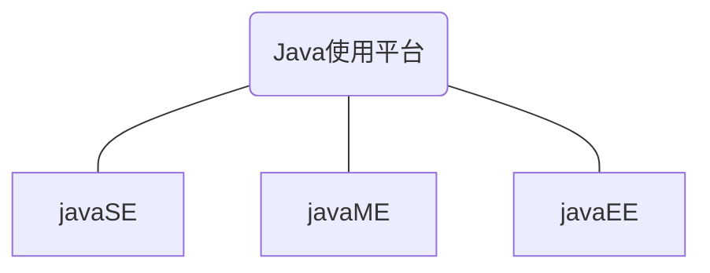
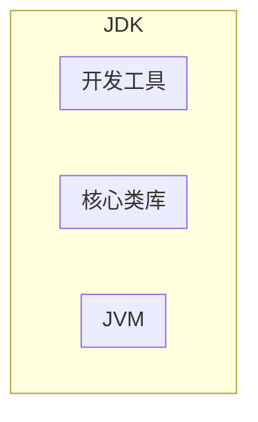
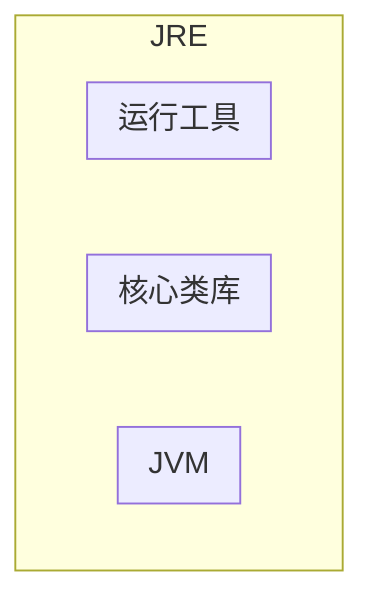
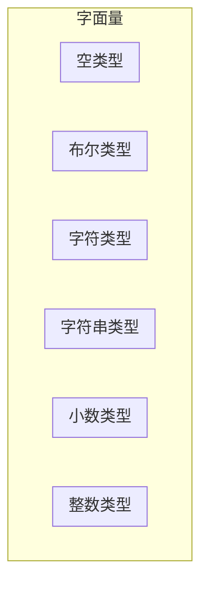
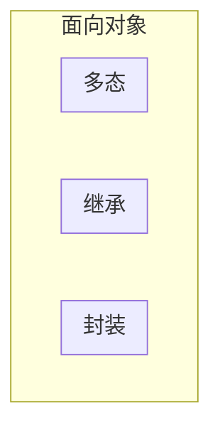

[TOC]


## 一. Java基础

### 1. Java基本知识

#### 1.1 第一个Java程序

```java
public class helloworld {
    public static void main(String[] args)
    {
        System.out.println("hello world");
    }
}
```

#### 1.2 Java中的输入输出语句

1. `println`

```java
System.out.println("helloworld");	//该语句将输出"helloworld"
```

2. `Scanner`

```java
import java.util.Scanner;
Scanner sc = new Scanner(System.in);
int num = sc.nextInt();	//输入一个整数
```

##### 1.2.1 Scanner的注意事项

```java
//nextInt()遇到空格,回车会停止
System.out.println("请输入一个整数:");
int num = sc.nextInt();
System.out.println(num);
System.out.println("请输入第二个整数:");
int num2= sc.nextInt();
System.out.println(num2);

//next()遇到空格,回车会停止
System.out.println("请输入一个字符串:");
String str1 = sc.next();
System.out.println(str1);
System.out.println("请输入第二个字符串:");
String str2  = sc.next();
System.out.println(str2);

//nextLine()遇到空格,制表符都不会停止,遇到回车停止
System.out.println("请输入一个字符串:");
String str1 = sc.nextLine();
System.out.println(str1);
System.out.println("请输入第二个字符串:");
String str2  = sc.nextLine();
System.out.println(str2); 
```

#### 1.2 使用JDK编译运行Java程序

1. 编译Java程序

```bash
javac helloworld.java	//javac将.java文件编译成.class 文件
```

2. 运行Java程序

```bash
java helloworld			//java用于运行.class 文件
```

#### 1.3 Java的三大使用平台



1. javaSE
   - Java 语言的(标准版)，用于桌面应用的开发，是其他两个版本的基础。

2. javaME
   - Java语言的（小型版），用于嵌入式电子设备或者小型移动设备。

3. javaEE
   - Java语言的（企业版)，用于Web方向的网站开发。在这个领域，是当之无愧的第一

#### 1.4 Java的主要特征


#### 1.5 JRE和JDK

JDK是Java的开发环境



JRE是Java的运行环境



#### 1.6 IDEA中的项目结构

- project(项目)
  - module(模块)
    - package(包)
      - class(类)，在类中编写代码

### 2. Java基础语法

#### 2.1 字面量

即数据在代码中的书写格式



### 2.2 变量

#### 2.2.1 定义方式

**语法:**

```java
 数据类型 变量名 = 数据值
```

#### 2.2.2 数据类型

| 数据类型 | 描述           | 取值范围                                          |
| -------- | -------------- | ------------------------------------------------- |
| byte     | 整数，一字节   | -128~127                                          |
| short    | 整数，两字节   | -32768~32767                                      |
| int      | 整数，四字节   | -2147483648~2147483647 (10位数)                   |
| long     | 整数，八字节   | -9223372036854775808~9223372036854775807 (19位数) |
| float    | 浮点数，四字节 | -3.401298e-38到3.402823e+38                       |
| double   | 浮点数，八字节 | -4.9000000e-324到1.797693e+308                    |
| char     | 字符           | 0-65535                                           |
| String   | 字符串型       |                                                   |
| boolean  | 布尔           | true，false                                       |

**注意:**

- 使用long类型，在数据值后面需要加上一个L后缀
- 使用float类型，在数据值后面需要加上一个F后缀

#### 2.2.3 标识符

即给**类**，**方法**，**变量**等起的名字。

标识符命名规则

- 由数字、字母、下划线(_)和美元符($)组成
- 不能以数字开头
- 不能是关键字(保留字)

- 区分大小写

命名建议

- 小驼峰命名法:**方法**、**变量**
  - 标识符是一个单词的时候，全部小写
  - 标识符由多个单词组成的时候，第一个单词首字母小写，其他单词首字母大写
- 大驼峰命名法:**类名**
  - 标识符是一个单词的时候，首字母大写
  - 标识符由多个单词组成的时候，每个单词的首字母大写

### 2.3 运算符和表达式

运算符

- 对字面量或者变量进行操作的符号

表达式

- 用运算符把字面量或者变量连接起来，符合java语法的式子就可以称为表达式。
- 不同运算符连接的表达式体现的是不同类型的表达式。

#### 2.3.1 算数运算符

| 符号 | 作用       |
| ---- | ---------- |
| +    | 加         |
| -    | 减         |
| *    | 乘         |
| /    | 除         |
| %    | 取模，取余 |
| ++   | 自增       |
| --   | 自减       |

**注意:**

- `i++`是先将`i`原来的值赋出去后，再自增
- `++i`是先将`i`自增后，再将`i`的值赋出去
- `i--`、`--i`和`i++`、`++i`同理

```java
int i = 10;
int X = i++;	//x=10
int y = ++i;	//x=11
```

#### 2.3.2 隐式转换和强制转换

隐式转换(自动类型提升)

- 取值**范围小**的数值==>取值**范围大**的数值
- 取值范围小的，和取值范围大的进行运算，小的会先提升为大的，再进行运算
- `byte` `short` ` char`三种类型的数据在运算的时候，都会直接先提升为`int`，然后再进行运算

强制转化

- 取值**范围大**的数值==>取值**范围小**的数值
- 语法:`目标数据类型 变量名 = (目标数据类型)被强转的数据;`

#### 2.3.3 赋值运算符

| 符号 | 作用       | 说明                      |
| ---- | ---------- | ------------------------- |
| =    | 赋值       | int a=10，将10赋值给变量a |
| +=   | 加后赋值   | a+=b，将a+b的值给a        |
| -=   | 减后赋值   | a-=b，将a-b的值给a        |
| *=   | 乘后赋值   | a*=b，将axb的值给a        |
| /=   | 除后赋值   | a/=b，将a÷b的商给a        |
| %=   | 取余后赋值 | a%=b，将a÷b的余数给a      |

#### 2.3.4 关系运算符

| 符号 | 说明                                                    |
| ---- | ------------------------------------------------------- |
| ==   | a==b，判断a和b的值是否相等，成立为true，不成立为false   |
| !=   | a!=b，判断a和b的值是否不相等，成立为true，不成立为false |
| >    | a>b，判断a是否大于b，成立为true，不成立为false          |
| >=   | a>=b，判断a是否大于等于b，成立为true，不成立为false     |
| <    | a<b，判断a是否小于b，成立为true，不成立为false          |
| <=   | a<=b，判断a是否小于等于b，成立为true，不成立为false     |

#### 2.3.5 逻辑运算符

| 符号 | 作用        | 说明                         |
| ---- | ----------- | ---------------------------- |
| &    | 逻辑与（且) | 并且，两边都为真，结果才是真 |
| \|   | 逻辑或      | 或者，两边都为假，结果才是假 |
| ^    | 逻辑异或    | 相同为false，不同为true      |
| !    | 逻辑非      | 取反                         |

##### 2.3.5.1 短路逻辑运算符

**短路:**

- 即逻辑运算符左边表达式不成立，就不执行右边的表达式
- 普通的逻辑运算符会判断运算符两边的表达式，即会执行两边的表达式

| 符号 | 作用   | 说明                         |
| ---- | ------ | ---------------------------- |
| &&   | 短路与 | 结果和&相同，但是有短路效果  |
| \|\| | 短路或 | 结果和\|相同，但是有短路效果 |

#### 2.3.6 三元运算符

**语法:**

- (表达式1)?(表达式2):(表达式3)

- 即`if`...`else`

#### 2.3.7 位运算符

| 运算符 | 含义       | 运算规则             |
| ------ | ---------- | -------------------- |
| <<     | 左移       | 向左移动，低位补0    |
| >>     | 右移       | 向右移动，高位补0或1 |
| >>>    | 无符号右移 | 向右移动，高位补0    |

### 2.4 流程控制语句

#### 2.4.1 顺序结构

顺序结构语句是Java程序默认的执行流程，按照代码的先后顺序，从上到下依次执行

#### 2.4.2 分支结构

1. `if`语句

```java
if(关系表达式){
    代码块
}
```

2. `if`...`else`

```java
if(关系表达式){
    代码块1
}else{
    代码块2
}
```

3. `if`...`else if`...`else`

```java
if(关系表达式){
    代码块1
}else if(关系表达式){
    代码块2
}else{
    代码块3
}
```

4. `switch`

```java
switch(表达式){
    case 值1:
        语句1;
        break;
    case 值2:
        语句2;
        break;
    case 值3:
        语句3;
        break;
    ...
    default:
        语句体n;
        break;
}
```

**注意:**

- 如果没有发现break，那么程序会继续执行下一个case的语句体，一直遇到break或者右花括号为止

#### 2.4.3 循环结构

1. `for`循环

```Java
for(初始化语句;条件判断语句;条件控制语句){
    循环体
}
```

2. `while`循环

```java
初始化语句;
while(条件判断语句){
    循环体;
    条件控制语句;
}
```

3. `for`和` while `的区别
   - `for`循环中，控制循环的变量,因为归属`for`循环的语法结构中，在`for`循环结束后，就不能再次被访问到了
   - `for`循环中:知道循环次数或者循环的范围
   - `while`循环中，控制循环的变量，对于`while`循环来说不归属其语法结构中，在`while`循环结束后，该变量还可以继续使用
   - `while`循环，不知道循环的次数和范围，只知道循环的结束条件。

3. `do`...`while`循环

```java
初始化语句
do{
    循环体
    条件控制语句    
}while(条件判断语句)
```

#### 2.4.4 循环控制结构

1. `continue`语句
   - 结束本次循环，进行下次循环
2. `break`语句
   - 结束整个循环

### 2.5 数组

#### 2.5.1 数组的概念

数组指的是一种容器，可以用来存储同种数据类型的多个值

- 数组容器在存储数据的时候，需要结合隐式转换考虑。
- 尽量使容器的类型，和存储的数据类型保持一致

#### 2.5.2 数组的定义

语法1:

```java
数据类型 []数组名
int []array
```

语法2:

```java
数据类型 数组名[]
int array[]
```

#### 2.5.3 数组的初始化

##### 2.5.3.1 数组的静态初始化

初始化:在内存中，为数组容器开辟空间，并将数据存入容器中的过程

语法(完整格式):

```java
数据类型[] 数组名=new数据类型[]{元素1，元素2，元素3...};
int[] array = new int[]{11,22,33};
```

语法(简写格式):

```java
数据类型[] 数组名={元素1，元素2，元素3...};
int[] array = {11,22,33};
```

##### 2.5.3.2 数组的动态初始化

动态初始化:初始化时只指定数组长度，由系统为数组分配初始值。

```java
数据类型[]数组名=new数据类型[数组长度];
int[] arr = new int[3];
```

数组默认初始化值的规律

- 整数类型:默认初始化值0
- 小数类型:默认初始化值0.0
- 字符类型:默认初始化值 '/u0000' 空格
- 布尔类型:默认初始化值false
- 引用数据类型:默认初始化值 null

##### 2.5.3.3 动态初始化和静态初始化的区别

动态初始化:手动指定数组长度，由系统给出默认初始化值。

- 只明确元素个数，不明确具体数值，推荐使用动态初始化

静态初始化:手动指定数组元素，系统会根据元素个数，计算出数组的长度。

- 需求中已经明确了要操作的具体数据，直接静态初始化即可。

#### 2.5.4 数组的地址值和元素访问

##### 2.5.4.1 数组的地址值

数组的地址值表示数组在内存中的位置

```java
int[] array = {11,22,33};
System.out.println(array); //[I@776ec8df
```

Java地址含义

- `[`:表示当前是一个数组
- `I`:表示当前数组元素都是`int`类型
- `@`表示一个间隔符号(固定格式)
- `776ec8df`数组的地址值

##### 2.5.4.2 数组元素访问

语法:

```java
数组名[索引];	//索引从0开始
array[1];
```

##### 2.5.4.3 数组的遍历

数组遍历:将数组中所有的内容取出来

```java
for(int i = 0;i < arr.length;i++){
    System.out.println(arr[i]);
}
```

#### 2.5.5 数组的内存图

栈

- 方法运行时使用的内存，比如main方法运行，进入方法栈中执行

堆

- 存储对象或者数组，new来创建的，都存储在堆内存

方法区

- 存储可以运行的class文件

本地方法栈

- JVM在使用操作系统功能的时候使用，与开发无关

寄存器

- 给CPU使用，与开发无关

### 2.6 方法

方法（method）是程序中最小的执行单元。

#### 2.6.1 方法的定义

**语法:**

```java
public static 返回值类型 方法名(参数1,参数2,....){
    方法体
    return 返回值;
}
```

#### 2.6.2 形参和实参

形参:

- 全称形式参数，是指方法定义中的参数

实参:

- 全称实际参数，方法调用中的参数

```java
public static void main(String[] args){
    method(10,20);//这里的10，20是实参
}
public static void method(int a,int b){
    //a和b都是形参
}
```

#### 2.6.3 方法的重载

**方法的重载**

- 在同一个类中，定义了多个**同名的方法**，这些同名的方法具有同种的功能。
- 每个方法具有**不同的参数类型**或**参数个数**，这些同名的方法，就构成了重载关系

```java
//method发生了重载(函数参数个数不同)
public static void method(int a,int b){
    
}
public static void method(int a,int b,int c){

}
//不同参数类型重载
public static void method(int a,int b){
    
}
public static void method(double a,double b){

}
```

###  2.7 面向对象




#### 2.7.1 类和对象

类(设计图)

- 是对象共同特征的描述

对象:

- 是真实存在的具体东西。

#### 2.7.2 定义类和实例化对象

```java	
//定义一个类
public class类名{
	1、成员变量（代表属性,一般是名词)
    2、成员方法（代表行为,一般是动词)
    3、构造器    
    4、代码块
	5、内部类
}
```

```java
//实例化对象
类名 对象名 = new 类名();
//访问对象属性
对象名.属性;
//访问对象方法
对象名.方法();
```

**注意:**

- 用来描述一类事物的类，专业叫做:`Javabean`类。
  - 在`Javabean`类中，是不写`main`方法的。
- 编写`main`方法的类，叫做测试类。
  - 我们可以在测试类中创建`javabean`类的对象并进行赋值调用。

- 类名首字母建议大写，需要见名知意，驼峰模式。
- 一个`Java`文件中可以定义多个`class`类，且只能一个类是`public`修饰，而且`public`修饰的类名必须成为代码文件名。

#### 2.7.3 封装

**封装**是面向对象的三大特征之一

**封装**

- 告诉我们，如何正确设计对象的属性和方法

##### 2.7.3.1 private和public关键字

**private关键字**

- 是一个权限修饰符
- 可以修饰成员（成员变量和成员方法)
- 被`private`修饰的成员只能在本类中才能访问

**public关键字**

- 对外允许访问的成员可以使用`public`修饰

#### 2.7.4 就近原则和this关键字

##### 2.7.4.1 成员变量和局部变量

成员变量

- 定义在类里面的变量为成员变量

局部变量

- 定义在类方法中的变量局部变量

##### 2.9.4.2 就近原则

就近原则

- 使用变量时，谁离得近用谁

##### 2.7.4.3 this关键字

this关键字

- `this`关键字指向离关键字最近的对象，使用`this`关键字可以获取局部变量

- `this`关键字可以用来区分成员变量和局部变量

#### 2.7.5 构造方法

构造方法

- 构造方法也叫作构造器、构造函数。
- 构造方法在创建对象的时候给成员变量进行赋值。

**语法:**

```java 
public class 类名{
    修饰符 类名(参数){
        方法体
    }
}
```

特点

- 方法名与类名相同，大小写也要一致
- 没有返回值类型，没有具体的返回值

执行时机

- 创建对象的时候由虚拟机调用，不能手动调用构造方法
- 每创建一次对象，就会调用一次构造方法

注意:

- 如果没有定义构造方法，系统将给出一个默认的无参数构造方法
- 如果定义了构造方法，系统将不再提供默认的构造方法

构造方法的重载:

- 带参构造方法，和无参数构造方法，两者方法名相同，但是参数不同，这叫做构造方法的重载

推荐:

- 无论是否使用，都**手动书写无参数构造方法**，和**带全部参数的构造方法**

#### 2.7.6 标准的JavaBean

标准的`JavaBean`

- 类名需要见名知意
- 成员变量使用`private`修饰
- 提供至少两个构造方法
  - 无参构造方法
  - 带全部参数的构造方法
- 成员方法
  - 提供每一个成员变量对应的`setXxx()`/`getXxx()`
  - 如果还有其他行为，也需要写上

#### 2.7.7 对象的内存图

实例化一个对象的过程

1. 加载`class`文件
2. 申明局部变量
3. 在堆内存中开辟一个空间
4. 默认初始化
5. 显示初始化
6. 构造方法初始化
7. 将堆内存中的地址值赋值给左边的局部变量

### 2.8 字符串对象String

#### 2.8.1 字符串简介

`java.lang.String`类代表字符串

Java程序中的**所有字符串文字**（例如“abc”）都为此类的对象。

```java
String str = "abcd";
```

**注意:**

- 字符串的内容是不会发生改变的，它的对象在创建后不能被更改。

#### 2.8.2 创建String的两种方法

1. 直接赋值法

```java
String str = "abcd";
```

1. new一个String对象

| 构造方法                         | 说明                             |
| -------------------------------- | -------------------------------- |
| `public string()`                | 创建空白字符串，不含任何内容     |
| `public string(string original)` | 根据传入的字符串，创建字符串对象 |
| `public string(char[] chs)`      | 根据字符数组，创建字符串对象     |
| `public string(byte[] chs)`      | 根据字节数组，创建字符串对象     |

#### 2.8.3 字符串的比较

| 方法                                       | 描述                              |
| ------------------------------------------ | --------------------------------- |
| `boolean equals方法(要比较的字符串)`       | 完全一样结果才是true，否则为false |
| `boolean equalsIgnoreCase(要比较的字符串)` | 忽略大小写的比较                  |

#### 2.8.4 遍历字符串

| 方法                            | 描述               |
| ------------------------------- | ------------------ |
| `public char charAt(int index)` | 根据索引返回字符   |
| `public int length()`           | 返回此字符串的长度 |

### 2.9 字符串容器StringBuilder

简介

- `StringBuilder`可以看成是一个容器，创**建之后里面的内容是可变的**

作用

- 提高字符串的操作效率

#### 2.9.1 StringBuilder的构造方法

| 方法                               | 描述                                       |
| ---------------------------------- | ------------------------------------------ |
| `public StringBuilder()`           | 创建一个空白可变字符串对象，不含有任何内容 |
| `public StringBuilder(String str)` | 根据字符串的内容，来创建可变字符串对象     |

#### 2.9.2 StringBuilder常用方法

| 方法                                     | 描述                                                       |
| ---------------------------------------- | ---------------------------------------------------------- |
| `public StringBuilder append (任意类型)` | 添加数据，并返回对象本身                                   |
| `public StringBuilder reverse()`         | 反转容器中的内容                                           |
| `public int length()`                    | 返回长度（字符出现的个数)                                  |
| `public String toString()`               | 通过`toString()`就可以实现把`StringBuilder` 转换为`String` |

### 2.10 字符串容器StringJoiner

简介

- `StringJoiner`跟`StringBuilder`一样，也可以看成是一个容器，创建之后里面的内容是可变的。

作用

- 提高字符串的操作效率，而且代码编写特别简洁，但是目前市场上很少有人用。

`StringJoiner`在`JDK8`之后出现

#### 2.10.1 StringJoiner的构造方法

| 方法                                                 | 描述                                                         |
| ---------------------------------------------------- | ------------------------------------------------------------ |
| `public StringJoiner(间隔符号)`                      | 创建一`StringJoiner`对象，指定拼接时的间隔符号               |
| `public StringJoiner (间隔符号，开始符号，结束符号)` | 创建一个`StringJoiner`对象，指定拼接时的间隔符号、开始符号、结束符号 |

#### 2.10.2 StringJoiner的常用方法

| 方法                                   | 描述                                       |
| -------------------------------------- | ------------------------------------------ |
| `public StringJoiner add (添加的内容)` | 添加数据，并返回对象本身                   |
| `public int length()`                  | 返回长度(字符出现的个数)                   |
| `public String toString()`             | 返回一个字符串(该字符串就是拼接之后的结果) |

### 2.11 集合ArrayList

集合(ArrayList)是一种长度可变的存储类

集合可以存储

- 引用数据类型
- 基本数据类型(包装类)

集合与数组的区别

- 集合的长度可变,数组长度不可变
- 集合存储基本数据类型时,需要转换为包装类

#### 2.11.1 集合的创建方法

```java
//完整格式
ArrayList<int> list = new ArrayList<int>();
//缩写格式
ArrayList<int> list = new ArrayList<>();//JDK7以上支持
```

#### 2.11.2 集合的常用方法

| 方法                   | 描述                                |
| ---------------------- | ----------------------------------- |
| `boolean add(E e)`     | 添加元素，返回值表示是否添加成功    |
| `boolean remove(E e)`  | 删除指定元素,返回值表示是否删除成功 |
| `E remove(int index)`  | 删除指定索引的元素,返回被删除元素   |
| `E set(int index,E e)` | 修改指定索引下的元素,返回原来的元素 |
| `E get(int index)`     | 获取指定索引的元素                  |
| `int size()`           | 集合的长度，也就是集合中元素的个数  |

