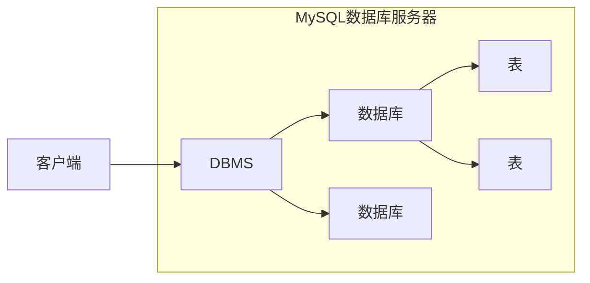

# MySQL

## 1. 数据库

### 1.1 数据库概念

**数据库(DataBase DB ):**

- 存储数据的仓库，数据是有组织的进行存储

**数据库管理系统(DataBase Management System (DBMS) )**

- 操纵和管理数据库的大型软件

**SQL ( Structured Query Language )**

- 操作关系型数据库的编程语言，定义了一套操作关系型数据库统一标准

### 1.2 MySQL 数据库

**关系型数据库（RDBMS)**

- 建立在关系模型基础上，由多张相互连接的二维表组成的数据库。
- 特点
  - 使用表存储数据,格式统一，便于维护
  - 使用SQL语言操作，标准统一，使用方便

**数据模型**



### 1.3 图形化客户端工具Navicat

Navicat for MySQL是管理和开发MySQL或 MariaDB的理想解决方案。

这套全面的前端工具为数据库管理、开发和维护提供了一款直观而强大的图形界面。

官网: http://www.navicat.com.cn

## 2. SQL

### 2.1 SQL语法

**SQL通用语法**

1. SQL语句可以单行或多行书写，以分号结尾。
2. SQL语句可以使用空格/缩进来增强语句的可读性。
3. MySQL数据库的SQL语句不区分大小写，关键字建议使用大写。
4. 注释:

  - 单行注释:
    - `--注释内容或#注释内容(MySQL特有)`
  - 多行注释:
    - `/*注释内容*/`

### 2.2 SQL语句分类

| 分类 | 全称                       | 说明                                                   |
| ---- | -------------------------- | ------------------------------------------------------ |
| DDL  | Data Definition Language   | 数据定义语言，用来定义数据库对象(数据库，表，字段)     |
| DML  | Data Manipulation Language | 数据操作语言，用来对数据库表中的数据进行增删改         |
| DQL  | Data Query Language        | 数据查询语言，用来查询数据库中表的记录                 |
| DCL  | Data Control Language      | 数据控制语言，用来创建数据库用户、控制数据库的访问权限 |

### 2.3 DDL

DDL

- 操作数据库，表，列等

#### 2.3.1 操作数据库

| 方法 | 描述                                                         |
| ---- | ------------------------------------------------------------ |
| 查询 | `SHOW DATABASES;`查询所有数据库<br />`SELECT RATABASE();`查询当前使用的数据库 |
| 创建 | `CREATE DATABASE [IF NOT EXISTS] 数据库名 [DEFAULT CHARSET字符集] [COLLATE 排序规则];` |
| 删除 | `DROP DATABASE [IF EXISTS]数据库名;`                         |
| 使用 | `USE数据库名;`                                               |

####  2.3.2 查询表

| 方法                 | 描述                     |
| -------------------- | ------------------------ |
| 查询当前数据库所有表 | `SHOW TABLES;`           |
| 查询表结构           | `DESC 表名;`             |
| 查询指定表的建表语句 | `SHOW CREATE TABLE表名;` |

#### 2.3.3 创建表

```sql
CRETA TABLE 表名(
    字段1 字段1类型[COMMENT 字段1注释],
    字段2 字段2类型[COMMENT 字段2注释],
    字段3 字段3类型[COMMENT 字段3注释],
    ......
)[COMMENT 表注释];
```

#### 2.3.4 表数据类型

**数值类型**

| 数据类型     | 大小    | 有符号(SIGNED)范围                                    | 无符号(UNSIGNED)范围                                    | 描述               |
| ------------ | ------- | ----------------------------------------------------- | ------------------------------------------------------- | ------------------ |
| TINYINT      | 1 byte  | (-128,127)                                            | (0,255)                                                 | 小整数值           |
| SMALLINT     | 2 bytes | (-32768,32767)                                        | (0,65535)                                               | 大整数值           |
| MEDIUMINT    | 3 bytes | (-8388608,8388607)                                    | (0,16777215)                                            | 大整数值           |
| INT或INTEGER | 4 bytes | (-2147483648，2147483647)                             | (0,4294967295)                                          | 大整数值           |
| BIGINT       | 8 bytes | (-2^63,2^63-1)                                        | (0,2~64-1)                                              | 极大整数值         |
| FLOAT        | 4 bytes | (-3.402823466 E+38，3.402823466351 E+38)              | 0和(1.175494351 E-38，3.402823466 E+38)                 | 单精度浮点数值     |
| DOUBLE       | 8 bytes | (-1.7976931348623157 E+308，1.7976931348623157 E+308) | 0和(2.2250738585072014 E-308，1.7976931348623157 E+308) | 双精度浮点数值     |
| DECIMAL      |         | 依赖于M(精度)和D(标度)的值                            | 依赖于M(精度)和D(标度)的值                              | 小数值(精确定点数) |

**字符串类型**

| 数据类型   | 大小                  | 描述                          |
| ---------- | --------------------- | ----------------------------- |
| CHAR       | 0-255 bytes           | 定长宁符串                    |
| VARCHAR    | 0-65535 bytes         | 变长字符串                    |
| TINYBLOB   | 0-255 bytes           | 不超过255个字符的二进制字符串 |
| TINYTEXT   | 0-255 bytes           | 短文本字符串                  |
| BLOB       | 0-65535 bytes         | 二进制形式的长文本数据        |
| TEXT       | 0-65535 bytes         | 长文本数据                    |
| MEDIUMBLOB | 0-16777 215 bytes     | 二进制形式的中等长度文本数据  |
| MEDIUMTEXT | 0-16777 215 bytes     | 中等长度文本数据              |
| LONGBLOB   | 0-4 294 967 295bytes  | 二进制形式的极大文本数据      |
| LONGTEXT   | 0-4 294 967 295 bytes | 极大文本数据                  |

#### 2.3.5 修改表

| 函数                                              | 描述               |
| ------------------------------------------------- | ------------------ |
| `ALTER TABLE 表名 RENAME TO 新的表名;`            | 修改表名           |
| `ALTER TABLE 表名 ADD 列名 数据类型;`             | 添加一列           |
| `ALTER TABLE 表名 MODIFY 列名 新数据类型;`        | 修改数据类型       |
| `ALTER TABLE 表名 CHANGE 列名 新列名 新数据类型;` | 修改列名和数据类型 |
| `ALTER TABLE 表名 DROP 列名;`                     | 删除列             |

### 2.4 DML

DML

- 对表中的数据进行增删改

常用操作

- 添加(insert)
- 修改(update)
- 删除(delete)

#### 2.4.1 添加数据

| 函数                                                         | 描述             |
| ------------------------------------------------------------ | ---------------- |
| `INSERT INTO 表名(列名1,列名2,.….) VALUES(值1,值2,...) ;`    | 给指定列添加数据 |
| `INSERT INTO 表名 VALUES(值1,值2,.…);`                       | 给全部列添加数据 |
| `INSERT INTO 表名(列名1,列名2,.….）) VALUES(值1,值2...),(值1,值2...),(值1,值2.… ...);`<br />`INSERT INTO 表名 VALUES(值1,值2,...),(值1,值2...),(值1,值2..)..;` | 批量添加数据     |

#### 2.4.2 修改数据

| 函数                                                  | 描述       |
| ----------------------------------------------------- | ---------- |
| `UPDATE 表名 SET 列名1=值1,列名2=值2,....[WHERE条件]` | 修改表数据 |

#### 2.4.3 删除数据

| 函数                            | 描述       |
| ------------------------------- | ---------- |
| `DELETE FROM 表名 [WHERE条件];` | 删除表数据 |

### 2.5 DQL

DQL

- 查询表中的数据

常用操作

- 条件查询(WHERE)
- 分组查询(GROUP BY)
- 排序查询(ORDER BY)
- 分页查询(LIMIT)

#### 2.5.1 基础查询

| 函数                                                         | 描述         |
| ------------------------------------------------------------ | ------------ |
| `SELECT 字段列表 FROM 表名;`<br />`SELECT * FROM 表名;` 不建议使用* | 查询多个字段 |
| `SELECT DISTINCT 字段列表 FROM 表名;`                        | 去除重复记录 |
| `AS: AS`可以省略<br />`SELECT name,math AS 数学成绩,english AS 英语成绩 from stu` | 起别名       |

#### 2.5.2 条件查询(WHERE)

语法

- `SELECT 字段列表 FROM 表名 WHERE 条件列表;`

条件

| 符号             | 功能                                 |
| ---------------- | ------------------------------------ |
| >                | 大于                                 |
| <                | 小于                                 |
| >=               | 大于等于                             |
| <=               | 小于等于                             |
| =                | 等于                                 |
| <> 或 !=         | 不等于                               |
| BETWEEN...AND... | 在某个范围之间(都包括)               |
| IN(...)          | 多选一                               |
| LIKE 占位符      | 模糊查询 _单个任意字符 %多个任意字符 |
| IS NULL          | 是NULL                               |
| IS NOT NULL      | 不是NULL                             |
| AND 或 &&        | 并且                                 |
| OR 或 \|\|       | 或者                                 |
| NOT 或 !         | 非,不是                              |

#### 2.5.3 排序查询(OEDER BY)

语法

- `SELECT 字段列表 FROM 表名 ORDER BY 排序字段名1 [排序方式1],排序字段名2 [排序方式2]...;`

排序方法

- ASC: 升序排列
- DESC: 降序排列

**注意:如果有多个排序条件，当前边的条件值一样时，才会根据第二条件进行排序**


#### 2.5.4 聚合函数

1. 概念

   将一列数据作为一个整体,进行纵向计算

2. 聚合函数分类

| 函数        | 功能     |
| ----------- | -------- |
| COUNT(列名) | 统计数量 |
| MAX(列名)   | 最大值   |
| MIN(列名)   | 最小值   |
| SUM(列名)   | 求和     |
| AVG(列名)   | 平均值   |

3. 语法

`SELECT 聚合函数名(列名) FROM 表;`

**注意: null值不参与所有聚合函数运算**


#### 2.5.5 分组查询(GROUP BY)

语法

- `SELECT 字段列表 FROM 表名[WHERE 分组前条件限定] GROUP BY 分组字段名[HAVING 分组后条件过滤];`

**注意:分组之后，查询的字段为聚合函数和分组字段，查询其他字段无任何意义**

where 和 having的区别

- 执行时机不一样: where是**分组之前**进行限定，不满足where条件，则不参与分组，而having是**分组之后**对结果进行过滤。
- 可判断的条件不一样: **where不能对聚合函数进行判断**，having可以。

**执行顺序**

- where > 聚合函数 > having


#### 2.5.6 分页查询(LIMIT)

语法

- `SELECT 字段列表 FROM 表名 LIMIT 起始索引,查询条目数;`

- 起始索引： 从0开始 **计算公式： 起始索引=(当前页码-1)*每页显示的条数**

tips:

- 分页查询limit是MySQL数据库的方言
- Oracle分页查询使用rownumber
- SQL Server分页查询使用top


#### 2.5.7 DQL执行顺序


### 2.6 DCL

DCL英文全称是Data ControlLanguage(数据控制语言)，用来管理数据库用户、控制数据库的访问权限。

#### 2.6.1 用户管理

| 函数                                                         | 功能                                 |
| ------------------------------------------------------------ | ------------------------------------ |
| `CREATE USER 'username'@'ipaddress' IDENTIFIED BY 'password';` | 创建用户，指定访问的主机ip和登录密码 |
| `ALTER USER 'username'@'ipaddress' IDENTIFIED WITH mysql_native_password BY 'password';` | 修改用户密码                         |
| `DROP USER 'username'@'ipaddress';`                          | 删除用户                             |


注意:

- 主机名可以使用`%`通配。
- 这类SQL开发人员操作的比较少，主要是DBA ( Database Administrator 数据库管理员）使用。

#### 2.6.2 权限管理

| 权限                  | 说明               |
| --------------------- | ------------------ |
| `ALL, ALL PRIVILEGES` | 所有权限           |
| `SELECT`              | 查询数据           |
| `INSERT`              | 插入数据           |
| `UPDATE`              | 修改数据           |
| `DELETE`              | 删除数据           |
| `ALTER`               | 修改表             |
| `DROP`                | 删除数据库/表/视图 |
| `CREATE`              | 创建数据库/表      |


| 函数                                                       | 说明     |
| ---------------------------------------------------------- | -------- |
| `SHOW GRANTS FOR 'username'@'ipaddress';`                  | 查询权限 |
| `GRANT 权限列表 ON 数据库名.表名 TO '用户名'@'主机名';`    | 授予权限 |
| `REVOKE 权限列表 ON 数据库名.表名 FROM '用户名'@'主机名';` | 撤销权限 |

## 3. 函数

### 3.1 字符串函数

常用的字符串函数

| 函数                       | 功能                                                      |
| -------------------------- | --------------------------------------------------------- |
| `CONCAT(S1,S2,...,Sn)`     | 字符串拼接                                                |
| `LOWER(str)`               | 将字符串str全部转为小写                                   |
| `UPPER(str)`               | 将字符串str全部转为大写                                   |
| `LPAD(str,n,pad)`          | 左填充，用字符串pad对str的左边进行填充，达到n个字符串长度 |
| `RPAD(str,n,pad)`          | 右填充，用字符串pad对str的右边进行填充，达到n个字符串长度 |
| `TRIM(str)`                | 去掉字符串头部和尾部的空格                                |
| `SUBSTRING(str,start,len)` | 返回从字符串str从start位置起的len个长度的字符串           |

### 3.2 数值函数

| 函数         | 功能                           |
| ------------ | ------------------------------ |
| `CEIL(x)`    | 向上取整                       |
| `FLOOR(X)`   | 向下取整                       |
| `MOD(x,y)`   | 返回x/y的模                    |
| `RAND()`     | 返回0~1内的随机数              |
| `ROUND(x,y)` | 求参数x的四舍五入的值，保留y位 |

### 3.3 日期函数

| 函数                                | 功能                                              |
| ----------------------------------- | ------------------------------------------------- |
| `CURDATE()`                         | 返回当前日期                                      |
| `CURTIME()`                         | 返回当前时间                                      |
| `NOW()`                             | 返回当前日期和时间                                |
| `YEAR(date)`                        | 获取指定date的年份                                |
| `MONTH(date)`                       | 获取指定date的月份                                |
| `DAY(date)`                         | 获取指定date的日期                                |
| `DATE_ADD(date,INTERVAL expr type)` | 返回一个日期/时间值加上一个时间间隔expr后的时间值 |
| `DATEDIFF(date1,date2)`             | 返回起始时间date1和结束时间date2之间的天数        |

### 3.4 流程控制函数

| 函数                                                        | 功能                                                    |
| ----------------------------------------------------------- | ------------------------------------------------------- |
| `IF(value,t,f)`                                             | 如果value为true，则返回t，否则返回f                     |
| `IFNULL(value1,value2)`                                     | 如果value1不为空，返回value1，否则返回value2            |
| `CASE WHEN [val1] THEN [res1]... ELSE [default]`            | 如果val1为true，返回res1，...否则返回default默认值      |
| `CASE [expr] WHEN [val1] THEN [res1] ... ELSE[default] END` | 如果expr的值等于vall，返回res1,...否则返回default默认值 |


## 4. 约束

约束的概念

- 约束是作用于表中列上的规则，用于限制加入表的数据
- 约束的存在保证了数据库中数据的正确性、有效性和完整性

约束的分类

| 约束名称 | 描述                                                         | 关键字        |
| -------- | ------------------------------------------------------------ | ------------- |
| 非空约束 | 保证列中所有数据不能有null值                                 | `NOT NULL`    |
| 唯一约束 | 保证列中所有数据各不相同                                     | `UNIQUE`      |
| 主键约束 | 主键是一行数据的唯一标识，要求非空且唯一                     | `PRIMARY KEY` |
| 检查约束 | 保证列中的值满足某—条件                                      | `CHECK`       |
| 默认约束 | 保存数据时，未指定值则采用默认值                             | `DEFAULT`     |
| 外键约束 | 外键用来让两个表的数据之间建立链接，保证数据的一致性和完整性 | `FOREIGN KEY` |

**注意MySQL不支持检查约束**

```mysql
CREATE TABLE emp(
	id INT PRIMARY KEY,		-- 员工id，主键且自增长
	ename VARCHAR(50) NOT NULL UNIQUE, -- 员工姓名，非空且唯一
	joindate DATE NOT NULL, -- 入职日期，非空
	salary DOUBLE(7,2)NOT NULL, -- 工资，非空
	bonus DOUBLE(7,2)DEFAULT 0 -- 奖金，如果没有默认为0
);
```

### 4.1 外键约束

概念

- 外键用来让两个表的数据之间建立链接，保证数据的一致性和完整性


语法

(1) 添加约束

```sql
-- 创建表时添加外键约束
CREATE TABLE 表名(
	列名 数据类型,
    ...
	[CONSTRAINT][外键名称] FOREIGN KEY(外键列名) REFERENCES主表(主表列名)
);
```

```sql	
-- 建完表后添加外键约束
ALTER TABLE 表名 ADD CONSTRAINT 外键名称 FOREIGN KEY（外键字段名称) REFERENCES 主表名称(主表列名称);
```

(2) 删除约束

```sql
ALTER TABLE 表名 DROP FOREIGN KEY 外键名称;
```

## 5. 数据库设计

1. 软件的研发步骤


2. 数据库设计概念

- 数据库设计就是根据业务系统的具体需求，结合我们所选用的DBMS，为这个业务系统构造出最优的数据存储模型。
- 建立数据库中的表结构以及表与表之间的关联关系的过程。
- 有哪些表?表里有哪些字段?表和表之间有什么关系?


3. 数据库设计的步骤

- 需求分析（数据是什么?数据具有哪些属性?数据与属性的特点是什么)
- 逻辑分析（通过ER图对数据库进行逻辑建模，不需要考虑我们所选用的数据库管理系统)
- 物理设计（根据数据库自身的特点把逻辑设计转换为物理设计)
- 维护设计（1.对新的需求进行建表; 2.表优化)

### 5.1 表关系

常见关系

- 一对一
- 一对多
- 多对多

### 5.2 表关系一对多

实现方式

- **在多的一方建立外键，指向一的一方的主键**


### 5.3 表关系多对多

实现方式

- **建立第三张中间表**
- **中间表至少包含两个外键，分别关联两方主键**


### 5.4 表关系一对一

实现方式

- **在任意一方加入外键，关联另一方主键，并且设置外键为唯一`(UNIQUE)`**


## 6. 多表查询

语法

```sql
SELECT * FROM emp, dept;
-- 产生笛卡尔积,有很多无效数据 (笛卡尔积; 取AB集合的所有情况)
-- 消除无效数据

-- 查询emp 和 dept 的数据, emp.dep_id = dept.did
SELECT * FROM emp, dept WHERE emp.dep_id = dept.did;
```

### 6.1 连接查询

连接查询

- 内连接
- 外连接
  - 左外连接: 相当于查询A表所有数据和交集部分数据
  - 右外连接: 相当于查询B表所有数据和交集部分数据


### 6.2 内连接

语法

```sql
-- 隐式内连接
SELECT 字段列表 FROM 表1,表2.. WHERE 条件;

-- 显示内连接
SELECT 字段列表 FROM 表1 [INNER] JOIN 表2 ON 条件;
```

**内连接相当于查询A B交集数据**

```sql
SELECT emp.name,emp.gender,dept.dname FROM emp,dept WHERE emp.dep_id = dept.did;
```

### 6.3 外连接

语法

```sql
-- 左外连接
SELECT 字段列表 FROM 表1 LEFT [OUTER] JOIN 表2 ON 条件;

-- 右外连接
SELECT 字段列表 FROM 表1 RIGHT [OUTER] JOIN 表2 ON 条件;
```

- 左外连接: 相当于查询A表所有数据和交集部分数据
- 右外连接: 相当于查询B表所有数据和交集部分数据

### 6.4 子查询

概念

- 查询中嵌套查询，称嵌套查询为子查询

子查询根据查询结果不同，作用不同

- 单行单列
- 多行单列
- 多行多列


单行单列 作为条件值，使用=!=><等进行条件判断

```sql
SELECT 字段列表 FROM 表 wHERE 字段名 = (子查询);
```

多行单列 作为条件值，使用in等关键字进行条件判断

```sql
SELECT 字段列表 FROM 表 wHERE 字段名 in (子查询);
```

多行多列 作为虚拟表

```sql
SELECT 字段列表 FROM (子查询) WHERE 条件;
```

## 7. 事务

概念

- 数据库的事务（Transaction)是一种机制、一个操作序列，包含了**一组数据库操作命令**
- 事务把所有的命令作为一个整体一起向系统提交或撤销操作请求，即这一组数据库命令**要么同时成功，要么同时失败**
- 事务是一个不可分割的工作逻辑单元

语法

```sql
-- 开启事务
START TRANSACTION;
或者 BEGIN;
-- 提交事务
COMMIT;
-- 回滚事务
ROLLBACK;
```

### 7.1 四大特征

- 原子性(Atomicity):事务是不可分割的最小操作单位，要么同时成功，要么同时失败
- 一致性(Consistency):事务完成时，必须使所有的数据都保持一致状态
- 隔离性(lsolation) :多个事务之间，操作的可见性
- 持久性(Durability):事务一旦提交或回滚，它对数据库中的数据的改变就是永久的

### 7.2 并发事务

| 问题       | 描述                                                         |
| ---------- | ------------------------------------------------------------ |
| 脏读       | 一个事务读到另外一个事务还没有提交的数据。                   |
| 不可重复读 | 一个事务先后读取同一条记录，但两次读取的数据不同，称之为不可重复读。 |
| 幻读       | 一个事务按照条件查询数据时，没有对应的数据行，但是在插入数据时，又发现这行数据已经存在，好像出现了"幻影”。 |

### 7.3 事务的隔离级别

| 隔离级别              | 赃读 | 不可重复读 | 幻读 |
| --------------------- | ---- | ---------- | ---- |
| Read uncommitted      | √    | √          | √    |
| Read committed        | x    | √          | √    |
| Repeatable Read(默认) | x    | x          | √    |
| Serializable          | x    | x          | x    |

```sql
--查看事务隔离级别
SELECT @@TRANSACTION_ISOLATION;

--设置事务隔离级别
SET[SESSION|GLOBAL] TRANSALCTION ISOLATON LEVEL {READ UNCOMMITED | READ COMMITED │ REPEATABLE READ| SERIALIZABLE}
```

## 8. 存储引擎

### 8.1 体系结构


### 8.2 存储引擎介绍

存储引擎就是存储数据、建立索引、更新/查询数据等技术的实现方式。存储引擎是基于表的，而不是基于库的，所以存储引擎也可被称为表类型。


### 8.3 存储引擎特点

#### 8.3.1 InnoDB

lnnoDB

- 介绍
  - InnoDB是一种兼顾高可靠性和高性能的通用存储引擎，在MySQL 5.5之后，InnoDB是默认的MySQL存储引擎。
- 特点
  - DML操作遵循ACID模型，支持事务;
  - 行级锁，提高并发访问性能;
  - 支持外键FOREIGN KEY约束，保证数据的完整性和正确性;

- 文件
  - xXx.ibd: xx代表的是表名，innoDB引擎的每张表都会对应这样一个表空间文件，存储该表的表结构(frm、sdi)、数据和索引。
    参数: innodb_file_per_table
- 逻辑存储结构


#### 8.3.2 MyISAM

MylSAM

- 介绍
  - MylSAM是MySQL早期的默认存储引擎。

- 特点
  - 不支持事务，不支持外键支持表锁，不支持行锁访问速度快
- 文件
  - xxx.sdi:存储表结构信息
  - xxx.MYD:存储数据
  - XXX.MYI:存储索引


#### 8.3.3 Memory

Memory

- 介绍
  - Memory引擎的表数据时存储在内存中的，由于受到硬件问题、或断电问题的影响，只能将这些表作为临时表或缓存使用。
- 特点
  - 内存存放
  - hash索引（默认）
- 文件
  - xxx.sdi:存储表结构信息


#### 8.3.4 区别

| 特点         | lnnoDB            | MyISAM | Memory |
| ------------ | ----------------- | ------ | ------ |
| 存储限制     | 64TB              | 有     | 有     |
| 事务安全     | 支持              | -      | -      |
| 锁机制       | 行锁              | 表锁   | 表锁   |
| B+tree索引   | 支持              | 支持   | 支持   |
| Hash索引     | -                 | -      | 支持   |
| 全文索引     | 支持(5.6版本之后) | 支持   | -      |
| 空间使用     | 高                | 低     | N/A    |
| 内存使用     | 高                | 低     | 中等   |
| 批量插入速度 | 低                | 高     | 高     |
| 支持外键     | 支持              | -      | -      |


### 8.4 存储引擎选择

InnoDB

- 是Mysql的默认存储引擎，支持事务、外键。如果应用对事务的完整性有比较高的要求，在并发条件下要求数据的一致性，数据操作除了插入和查询之外，还包含很多的更新、删除操作，那么InnoDB存储引擎是比较合适的选择。

MyISAM

- 如果应用是以读操作和插入操作为主，只有很少的更新和删除操作，并且对事务的完整性、并发性要求不是很高，那么选择这个存储引擎是非常合适的。

MEMORY

- 将所有数据保存在内存中，访问速度快，通常用于临时表及缓存。MEMORY的缺陷就是对表的大小有限制，太大的表无法缓存在内存中，而且无法保障数据的安全性。


## 9. 索引

索引(index)是帮助MySQL高效获取数据的数据结构(有序)。在数据之外，数据库系统还维护着满足特定查找算法的数据结构，这些数据结构以某种方式引用（指向）数据，这样就可以在这些数据结构上实现高级查找算法，这种数据结构就是索引。


### 9.1 索引结构

| 索引结构            | 描述                                                         |
| ------------------- | ------------------------------------------------------------ |
| B+Tree索引          | 最常见的索引类型，大部分引擎都支持B+树索引                   |
| Hash索引            | 底层数据结构是用哈希表实现的,只有精确匹配索引列的查询才有效不支持范围查询 |
| R-tree(空间索引)    | 空间索引是MylSAM引擎的一个特殊索引类型，主要用于地理空间数据类型，通常使用较少 |
| Full-text(全文索引) | 是一种通过建立倒排索引,快速匹配文档的方式。类似于Lucene,Solr,ES |


| 索引       | lnnoDB          | MylSAM | Memory |
| ---------- | --------------- | ------ | ------ |
| B+tree索引 | 支持            | 支持   | 支持   |
| Hash 索引  | 不支持          | 不支持 | 支持   |
| R-tree索引 | 不支持          | 支持   | 不支持 |
| Full-text  | 5.6版本之后支持 | 支持   | 不支持 |


#### 9.1.1 B tree索引

以一颗最大度数（max-degree）为5(5阶)的b-tree为例(每个节点最多存储4个key，5个指针):


#### 9.1.2 B+Tree

以一颗最大度数(max-degree)为4（4阶）的b+tree为例:


相对于B Tree区别:

1. 所有的数据都会出现在叶子节点

2. 叶子节点形成一个单向链表

MySQL中B+Tree的优化

- MySQL索引数据结构对经典的B+Tree进行了优化。在原B+Tree的基础上，增加一个指向相邻叶子节点的链表指针，就形成了带有顺序指针的B+Tree，提高区间访问的性能。


#### 9.1.3 Hash

哈希索引就是采用一定的hash算法，将键值换算成新的hash值，映射到对应的槽位上，然后存储在hash表中。

如果两个(或多个)键值，映射到一个相同的槽位上，他们就产生了hash冲突（也称为hash碰撞)，可以通过链表来解决。


Hash

- Hash索引特点

  1. Hash索引只能用于对等比较(=，in)，不支持范围查询(between，>，<，..)
  2. 无法利用索引完成排序操作
  3. 查询效率高，通常只需要一次检索就可以了，效率通常要高于B+tree索引

  

### 9.2 索引分类

  

| 分类     | 含义                                                 | 特点                    | 关键字   |
| -------- | ---------------------------------------------------- | ----------------------- | -------- |
| 主键索引 | 针对于表中主键创建的索引                             | 默认自动创建,只能有一个 | PRIMARY  |
| 唯一索引 | 避免同一个表中某数据列中的值重复                     | 可以有多个              | UNIQUE   |
| 常规索引 | 快速定位特定数据                                     | 可以有多个              |          |
| 全文索引 | 全文索引查找的是文本中的关键词，而不是比较索引中的值 | 可以有多个              | FULLTEXT |

在InnoDB存储引擎中，根据索引的存储形式，又可以分为以下两种:

| 分类                      | 含义                                                       | 特点                |
| ------------------------- | ---------------------------------------------------------- | ------------------- |
| 聚集索引(Clustered lndex) | 将数据存储与索引放到了一块，索引结构的叶子节点保存了行数据 | 必须有,而且只有一个 |
| 二级索引(Secondary Index) | 将数据与索引分开存储，索引结构的叶子节点关联的是对应的主键 | 可以存在多个        |

聚集索引选取规则:

- 如果存在主键，主键索引就是聚集索引。
- 如果不存在主键，将使用第一个唯一(UNIQUE）索引作为聚集索引。
- 如果表没有主键，或没有合适的唯一索引，则InnoDB会自动生成一个rowid作为隐藏的聚集索引。

生成索引


查询


### 9.3 索引语法

创建索引
```sql
create[ UNIQUE | FULLTEXT ] 
index index_name on table_name (index_col_name...)
```


查看索引
```sql
show index from table_name;
```

删除索引
```sql
drop index index_name on table_name;
```


### 9.4 SQL性能分析

查看SQL的运行频次

- MySQL客户端连接成功后，通过`show [session | global] status` 命令可以提供服务器状态信息。通过如下指令，可以查看当前数据库的`INSERT`、`UPDATE`、`DELETE`、`SELECT`的访问频次:

```sql
show [session | global] status like 'Com_______';
```

慢查询日志

```sql
# 查看是否开启慢查询日志
show variables like 'slow_query_log';
```

- 慢查询日志记录了所有执行时间超过指定参数(long_query_time，单位:秒，默认10秒）的所有SQL语句的日志。MySQL的慢查询日志默认没有开启，需要在MySQL的配置文件(/etc/my.cnf）中配置如下信息:

```sql
#开启MySQL慢日志查询开关
slow_query_log=1

#设置慢日志的时间为2秒，SQL语句执行时间超过2秒，就会视为慢查询记录慢查询日志
long_query_time=2
```

配置完毕之后，通过以下指令重新启动MySQL服务器进行测试，查看慢日志文件中记录的信息/var/lib/mysq/localhost-slow.og。

profile详情

- show profiles能够在做SQL优化时帮助我们了解时间都耗费到哪里去了。通过have_profiling参数，能够看到当前MySQL是否支持profile操作:

```sql
select @@hava_profiling;
```

默认profiling是关闭的，可以通过set语句在session/global级别开启profiling:

```sql
set profiling=1;
```

执行一系列的业务SQL的操作，然后通过如下指令查看指令的执行耗时

```sql
#查看每一条SQL的耗时基本情况
show profiles;

#查看指定query_id的SQL语句各个阶段的耗时情况
show profile for query query_id;

#查看指定query_id的SQL语句CPU的使用情况
show profile cpu for query query_id;
```


# MyBatis

## 1. JDBC


### 1.1 简介

JDBC

- 使用Java语言操作关系型数据库的一套API
- 全称:(Java DataBase Connectivity ) Java数据库连接

JDBC本质

- 官方(sun公司)定义的一套操作所有关系型数据库的规则，即接口
- 各个数据库厂商去实现这套接口，提供数据库驱动jar包
- 我们可以使用这套接口(JDBC)编程，真正执行的代码是驱动jar包中的实现类

JDBC好处

- 各数据库厂商使用相同的接口，Java代码不需要针对不同数据库分别开发
- 可随时替换底层数据库，访问数据库的Java代码基本不变


### 1.2 快速入门

步骤

1. 创建工程,导入驱动jar包
2. 注册驱动

```java
Class.forName("com.mysql.jdbc.Driver");
```

3. 获取链接

```java
Connection conn = DriverManager.getConnection(url,username,password);
```

4. 定义SQL语句

```java
String sql = "update..." ;
```

5. 获取执行SQL对象

```java
Statement stmt = conn.createStatement();
```

6. 执行SQL

```java
stmt.executeUpdate(sql);
```

7. 返回处理结果
8. 释放资源

```java
 // 1. 注册驱动
Class.forName("com.mysql.jdbc.Driver");
// 2. 获取连接
String url = "jdbc:mysql://localhost:3306/test?useSSL=false";
String user = "root";
String password = "123456";
Connection conn = DriverManager.getConnection(url, user, password);
// 3. 定义SQL语句
String sql = "UPDATE account SET money = 2000 WHERE id = 1;";
// 4. 获取执行SQL的对象
Statement stmt = conn.createStatement();
// 5. 执行SQL
int count = stmt.executeUpdate(sql);
// 6. 处理结果
System.out.println(count);
// 7. 释放资源
stmt.close();
conn.close();
```

## 2. JDBC API

### 2.1 DriverManager

DriverManager(驱动管理类)作用:

1. 注册驱动
2. 获取数据库连接


注册驱动

```java
Class.forName("com.mysql.jdbc.Driver");
```

提示

- MySQL 5之后的驱动包，可以省略注册驱动的步骤
- 自动加载jar包中的META-INF/services/java.sql.Driver文件中的驱动类


获取连接

```java
DriverManager.getConnection(url, user, password);
```

参数

- url:连接路径

  - 语法：`jdbc:mysql://ip地址(域名):端口号/数据库名称?参数键值对1&参数键值对2...`

  - 示例：`jdbc:mysql://127.0.0.1:3306/db1`

  - 细节:

    - 如果连接的是本机mysql服务器，并且mysql服务默认端口是3306，则url可以简写为:` jdbc:mysql:///数据库名称?参数键值对`

    - 配置`usesSL=false`参数，禁用安全连接方式，解决警告提示

- user: 用户名
- password:密码


### 2.2 Connection

Connection(数据库连接对象)作用:

1. 获取执行SQL的对象
2. 管理事务


获取执行SQL的对象

- 普通执行SQL对象

```java
Statement createStatement()
```

- 预编译SQL的执行SQL对象:防止SQL注入

```java
PreparedStatement prepareStatement(sql)
```

- 执行存储过程的对象

```java
CallableStatement  prepareCall(sql)
```


事务管理

- MySQL事务管理

```java
开启事务:BEGIN; /START TRANSACTION;
提交事务:COMMIT;
回滚事务:ROLLBACK;

MySQL默认自动提交事务
```

-  JDBC 事务管理:Connection接口中定义了3个对应的方法

```java
开启事务: setAutoCommit(boolean autoCommit): true为自动提交事务;false为手动提交事务，即为开启事务
提交事务: commit()
回滚事务: rollback()
```


发生异常回滚事务

```java
String sql1 = "UPDATE account SET money = 3000 WHERE id = 1;";
String sql2 = "UPDATE account SET money = 3000 WHERE id = 2;";
Statement stmt = conn.createStatement();
try{
  // 开启事务
  conn.setAutoCommit(false);
  // 执行SQL
  int count1 = stmt.executeUpdate(sql1);
  System.out.println(count1);
  int i = 3/0;  //发生异常
  int count2 = stmt.executeUpdate(sql2);
  System.out.println(count2);
  conn.commit();
}catch (Exception throwables){
  // 回滚事务
  conn.rollback();
}
```


### 2.3 Statement

Statement

- Statement作用:
  1. 执行SQL语句
- 执行SQL语句

```java
int executeUpdate(sql):执行DML、DDL语句
返回值: 
(1)DML语句影响的行数
(2)DDL语句执行后，执行成功也可能返回0
```

```java
ResultSet executeQuery(sql):执行DQL语句
返回值:ResultSet结果集对象
```


### 2.4 ResultSet

ResultSet

- ResultSet(结果集对象)作用:
  1. 封装了DQL查询语句的结果

```java
ResultSet stmt.executeQuery(sql);
//执行DQL语句，返回ResultSet对象
```

- 获取查询结果

```java
boolean next():
(1)将光标从当前位置向前移动一行
(2)判断当前行是否为有效行

返回值:
true:有效行，当前行有数据
false:无效行，当前行没有数据
```

```java
xxx getXxx(参数):获取数据
xxx:数据类型;如: int getlnt(参数); String getString(参数)
    
参数:
int:列的编号，从1开始
String:列的名称
```

- 使用步骤
  1. 游标向下移动一行，并判断该行否有数据: next()
  2. 获取数据:getXxx(参数)

```java
//循环判断游标是否是最后一行末尾
while(rs.next()){
    //获取数据
    rs.getXxx(参数);
}
```


### 2.5 PreparedStatement

PreparedStatement

- PreparedStatement作用
  1. 预编译SQL语句并执行:预防SQL注入问题

- SQL注入
  - SQL注入是通过操作输入来修改事先定义好的SQL语句，用以达到执行代码对服务器进行攻击的方法。


PreparedStatement作用

1. 预编译SQL语句并执行


获取Preparedstatement对象

```java
//SQL语句中的参数值，使用?占位符替代
String sql = "select * from user where username = ? and password = ?";

//通过Connection对象获取，并传入对应的sql语句
PreparedStatement pstmt = conn.prepareStatement(sql);
```


设置参数值

- PreparedStatement对象: setXxx(参数1，参数2):给?赋值
  - Xxx:数据类型; 如setlnt(参数1,参数2)
  - 参数:
    - 参数1: ?的位置编号，从1开始
    - 参数2: ?的值


执行SQL

```java
executeUpdate(); / executeQuery(); :不需要再传递sql
```


### 2.6 PreparedStatement原理

PreparedStatement好处

1. 预编译SQL，性能更高
2. 防止SQL注入:**将敏感字符进行转义**


PreparedStatement预编译功能开启: `useServerPrepStmts=true`


配置MySQL执行日志(重启mysql服务后生效)

```
log-output=FILE
general-log=1
general_log_file="D:\mysql.log"
slow-query-log=1
slow_query_log_file=“D: \mysql_slow.log"
long_query_time=2
```


PreparedStatement原理:

1. 在获取PreparedStatement对象时，将sql语句发送给mysql服务器
   进行检查，编译(这些步骤很耗时)
2. 执行时就不用再进行这些步骤了，速度更快
3. 如果sql模板一样，则只需要进行一次检查、编译


### 2.7 数据库连接池

#### 2.7.1 简介

- 数据库连接池是个容器，负责分配、管理数据库连接(Connection)
- 它允许应用程序重复使用一个现有的数据库连接，而不是再重新建立一个;
- 释放空闲时间超过最大空闲时间的数据库连接来避免因为没有释放数据库连接而引起的数据库连接遗漏
- 好处
  - 资源重用
  - 提升系统响应速度
  - 避免数据库连接遗漏


#### 2.7.2 实现

标准接口:DataSource

- 官方(SUN)提供的数据库连接池标准接口，由第三方组织实现此接口。
- 功能: 获取连接

```java
Connection getConnection()
```

常见的数据库连接池:

- DBCP
- C3P0
- Druid

Druid(德鲁伊)

- Druid连接池是阿里巴巴开源的数据库连接池项目
- 功能强大，性能优秀，是Java语言最好的数据库连接池之一


Druid 使用步骤

1. 导入jar包druid-1.1.12.jar

2. 定义配置文件
3. 加载配置文件
4. 获取数据库连接池对象
5. 获取连接

```java
// 1. 导入jar包
// 2. 定义配置文件
// 3. 加载配置文件
Properties prop = new Properties();
prop.load(new FileInputStream("src/druid.properties"));
// 4. 获取连接池对象
DataSource dataSource = DruidDataSourceFactory.createDataSource(prop);
// 5. 获取连接
Connection connection = dataSource.getConnection();
System.out.println(connection);
// 6. 释放资源
```

## 3. MyBatis

### 3.1 简介

什么是MyBatis

- MyBatis是一款优秀的持久层框架，用于简化JDBC开发
- MyBatis 本是 Apache的一个开源项目iBatis, 2010年这个项目由apache software foundation迁移到了google code，并且改名为MyBatis。2013年11月迁移到Github
- 官网: https://mybatis.org/mybatis-3/zh/index.html


持久层

- 负责将数据到保存到数据库的那一层代码
- JavaEE三层架构:表现层、业务层、持久层


框架

- 框架就是一个半成品软件，是一套可重用的、通用的、软件基础代码模型
- 在框架的基础之上构建软件编写更加高效、规范、通用、可扩展


### 3.2 JDBC的缺点

JDBC缺点

1. 硬编码
   - 注册驱动，获取连接
   - SQL语句
2. 操作繁琐
   - 手动设置参数
   - 手动封装结果集

**MyBatis免除了几乎所有的JDBC代码以及设置参数和获取结果集的工作**


MyBatis是目前的主流JDBC框架


### 3.3 安装Mybatis

在pom.xml下的`<dependencies>`下添加

```xml
<dependency>
  <groupId>org.mybatis</groupId>
  <artifactId>mybatis</artifactId>
  <version>3.5.11</version>
</dependency>
```

即可完成安装

### 3.4 Mapper代理开发

Mapper代理开发

- 解决原生方式中的硬编码
- 简化后期执行SQL


原始写法

```java
// 执行sql
List<User> users = sqlSession.selectList("test.selectAll");
System.out.println(users);
```

Mapper代理开发

```java
// 获取接口代理对象
UserMapper userMapper = sqlSession.getMapper(UserMapper.class);
// 执行方法，其实就是执行sql语句
List<User> users = userHapper.selectAll();
```


Mapper代理开发规则

1. 定义与SQL映射文件同名的Mapper接口，并且将Mapper接口和SQL映射文件放置在同一目录下
2. 设置SQL映射文件的namespace属性为Mapper接口全限定名
3. 在Mapper接口中定义方法，方法名就是SQL映射文件中sql语句的id，并保持参数类型和返回值类型一致
4. 编码
   1. 通过SqlSession的getMapper方法获取Mapper接口的代理对象
   2. 调用对应方法完成sql的执行

**细节:**

- **如果Mapper接口名称和SQL映射文件名称相同，并在同一目录下，则可以使用包扫描的方式简化SQL映射文件的加载**

```xml
<!--加载SQL映射文件-->
<mapper resource="com/test/mapper/UserMapper.xml"/>
<!--Mapper代理方式-->
<package name="com.test.mapper"/>
```


### 3.5 代理接口的实现

1. 创建接口


2. 在resources目录下创建对应的xml文件


3. 在mybatis-config.xml的mappers下添加

```xml
<package name="com.test.mapper"/>
```

 ```xml
<!--mybatis-config.xml-->
<?xml version="1.0" encoding="UTF-8" ?>
<!DOCTYPE configuration
        PUBLIC "-//mybatis.org//DTD Config 3.0//EN"
        "https://mybatis.org/dtd/mybatis-3-config.dtd">
<configuration>
    <environments default="development">
        <environment id="development">
            <transactionManager type="JDBC"/>
            <dataSource type="POOLED">
                <!--数据库连接信息-->
                <property name="driver" value="com.mysql.jdbc.Driver"/>
                <property name="url" value="jdbc:mysql:///test?useSSL=false"/>
                <property name="username" value="root"/>
                <property name="password" value="123456"/>
            </dataSource>
        </environment>
    </environments>
    <mappers>
        <!--加载SQL映射文件-->
<!--        <mapper resource="com/test/mapper/UserMapper.xml"/>-->
        <!--Mapper代理方式-->
        <package name="com.test.mapper"/>
    </mappers>
</configuration>
 ```

4. BrandMapper.xml下的配置

```xml
<?xml version="1.0" encoding="UTF-8" ?>
<!DOCTYPE mapper
        PUBLIC "-//mybatis.org//DTD Mapper 3.0//EN"
        "https://mybatis.org/dtd/mybatis-3-mapper.dtd">
<!--
    namespace: 名称空间
-->
<mapper namespace="com.test.mapper.BrandMapper">
    <select id="selectAll" resultType="com.test.pojo.Brand">
        select * from tb_brand;
    </select>
    <select id="selectById" parameterType="int" resultType="com.test.pojo.Brand">
        select * from ${tb_brand} where id = #{id};
    </select>
</mapper>
```

5. BrandMapper接口的配置

```java
package com.test.mapper;

import com.test.pojo.Brand;

import java.util.List;

public interface BrandMapper {
  List<Brand> selectAll();
  Brand selectById(Integer id);
}
```


### 3.6 Mapper与数据库字段名称不同的解决方案

数据库表的字段名称 和 实体类的属性名称 不一样, 则不能自动封装数据

解决方法

- 使用sql片段起别名
- 使用resultMap


#### 3.6.1 起别名/sql片段

起别名:

- 对不一样的列名起别名,让别名和实体类的属性名称一样

```sql
select id,brand_name as brandName, company_name as companyNamr, ordered, description, status from tb_brand;
```

缺点

- 每次查询都需要起别名

解决方法

- 使用sql片段

```xml
<!--sql片段-->
<sql id="brand_column">
	id,brand_name as brandName, company_name as companyName, ordered, description, status
</sql>
<!--使用sql片段-->
select
	<include refid="brand_column"></include>
from tb_brand;
```


#### 3.6.2 使用resultMap

id: 完成主键字段的映射

- column: 表的列名
- property: 实体类的属性名

result: 完成一般字段的映射

```xml
<!--定义resultMap-->
<resultMap id="brandResultMap" type="com.test.pojo.Brand">
    <result column="brand_name" property="brandName"></result>
    <result column="company_name" property="companyName"></result>
</resultMap>
<!--使用resultMap-->
<select id="selectAll" resultMap="brandResultMap">
    select * from tb_brand;
</select>
```


### 3.7 MyBatis参数的处理

#### 3.7.1 参数占位符

参数占位符

    1. `#{属性名称}`：会将其替换为?，为了防止SQL注入
    2. `${属性名称}`：会将其替换为属性值，存在SQL注入的风险
    3. 使用时机：
       - 参数传递的时候，`#{}`
       - 表名或者列名不固定的情况下，`${}`

```xml
<select id="selectById" parameterType="int" resultType="com.test.pojo.Brand">
    select * from ${tb_brand} where id = #{id};
</select>
```

#### 3.7.2 参数类型

参数类型 parameterType

- 指定参数类型，可以省略

```xml
<select id="selectById" parameterType="int" resultType="com.test.pojo.Brand">
```

#### 3.7.3 特殊字符处理

特殊字符处理

1. 转义字符
2. CDATA区


转义字符

| 特殊字符 | 描述         | 字符的代码 |
| -------- | ------------ | ---------- |
|          | 空格符       | `&nbsp;`   |
| &lt;     | 小于号       | `&lt;`     |
| &gt;     | 大于号       | `&gt;`     |
| &amp;    | 和号         | `&amp;`    |
| &yen;    | 人民币       | `&yen;`    |
| &copy;   | 版权         | `&copy;`   |
| &reg;    | 注册商标     | `&reg;`    |
| &deg;    | 摄氏度       | `&deg;`    |
| &plusmn; | 正负号       | `&plusmn;` |
| &times;  | 乘号         | `&times;`  |
| &divide; | 除号         | `&divide;` |
| &sup2;   | 平方2(上标2) | `&sup2;`   |
| &sup3;   | 立方3(上标3) | `&sup3;`   |


CDATA区

```xml
<![CDATA[内容]]>
```


#### 3.7.4 多个参数的设置

BrandMapper.xml的配置

```xml
<select id="selectByCondition" resultType="com.test.pojo.Brand">
    select *
    from tb_brand
    where status = #{status}
        and company_name like #{company_name}
        and brand_name like #{brand_name}
</select>
```

散装参数

- 使用`@Param("SQL中占位符名称") 类型 变量名`

```java
List<Brand> selectByCondition(@Param("status")int status, @Param("company_name") String company_name,@Param("brand_name") String brand_name);
```

实体类封装参数

- 只需要保证sQL中的参数名和实体类属性名对应上，即可设置成功

```java
List<Brand> selectByCondition(Brand brand);
```

Map集合

- 只需要保证sQL中的参数名和map集合的键的名称对应上，即可设置成功

```java
List<Brand> selectByCondition(Map map);
```


#### 3.7.5 动态SQL

SQL语句会随着用户的输入或外部条件的变化而变化，我们称为**动态SQL**

有以下常见的几种判断标签

- if
- choose(when,otherwise)
- trim(where,set)
- foreach


示例

```xml
<select id="selectByCondition" resultType="com.test.pojo.Brand">
    select *
    from tb_brand
    <where>
		<if test="status!=null">
    	    status = #{status}
    	</if>
    	<if test="company_name!=null and company_name!=''">
    	    and company_name like #{company_name}
    	</if>
    	<if test="brand_name!=null and brand_name!=''">
    	    and brand_name like #{brand_name}
    	</if>
    </where>
</select>
```


`<if>`标签(单条件查询)

- 用于判断参数是否有值，使用`test`属性进行条件判断
  - 存在的问题:第一个条件不需要逻辑运算符
  - 解决方案:
    - 使用恒等式让所有条件格式都一样
    - `<where>`标签替换`where`关键字


`<where>`标签(智能处理条件)

- 用于替代sql中的where关键字，实现动态SQL


`<choose(when,otherwise)>`标签 (多条件查询)

- **从多个条件中选择一个**
- 类似于Java中的switch语句

```xml
<select id="selectByCondition" resultType="com.test.pojo.Brand">
    select *
    from tb_brand
    <where>
        <choose>
            <when test="status != null">
                status = #{status}
            </when>
            <when test="company_name != null and company_name != '' ">
                and company_name like #{company_name}
            </when>
            <when test="brand_name != null and brand_name != '' ">
                and brand_name like #{brand_name}
            </when>
        </choose>
    </where>
</select>
```


`<set>`标签(智能处理输入数据)

- 用于替代SQL中的set关键字，实现动态SQL


`<foreach>`标签(遍历数组)

- 用于遍历传入数组，将其拼接为SQL语句，实现数组的动态SQL

```xml
<delete id="deleteByIds">
    delete from tb_brand where id in
    <foreach collection="ids" item="id" open="(" separator="," close=")">
        #{id}
    </foreach>
</delete>
```


#### 3.7.6 主键返回

返回添加数据的主键，主键将自动添加入对象中

```xml
<insert useGeneratedKeys="true" keyProperty="id">
```

在测试类中，打印传入对象的id成员即可获得主键

```java
System.out.println(brand.getId());
```


#### 3.7.7 数组传参

mybatis会将数组参数，封装为一个Map集合

- 默认：array = 数组，collection = "array"
- 使用@Param注解，改变map集合的默认key的名称，collection = "ids"

BrandMapper.java

```java
void deleteByIds(@Param("ids") int[] ids);
```

BrandMapper.xml

```xml
<foreach collection="ids" item="id" open="(" separator="," close=")">
    #{id}
</foreach>
```

不使用@Param注解

BrandMapper.xml

```xml
<foreach collection="array" item="id" open="(" separator="," close=")">
    #{id}
</foreach>
```


#### 3.7.8 单个参数封装

单个参数

1. POJO类型：直接使用，属性名 和 参数占位符名称一致
2. Map集合：直接使用，键名 和 参数占位符名称一致
3. Collection：封装成Map集合
   - map.put("argo",collection集合)
   - map.put("collection",collection集合)
4. List: 封装成Map集合
   - map.put("arg0",list集合)
   - map.put("collection",list集合)
   - map.put("list",list集合)
5. Array: 封装成Map集合
   - map.put("arg0",数组)
   - map.put("array",数组)
6. 其他类型：直接使用

**对于封装成Map集合的类型，可以使用@Param注解，替换Map集合中默认的arg键名**


### 3.8 注解开发

使用注解开发会比配置文件开发更加方便

```java
@Select("select * from tb_user where id = #{id}")
User selectById(int id);
```

基本的注解功能

- 查询 @Select
- 添加 @Insert
- 修改 @Update
- 删除 @Delete

**注意**

- **注解开发适用于简单功能**
- **配置文件完成复杂功能**