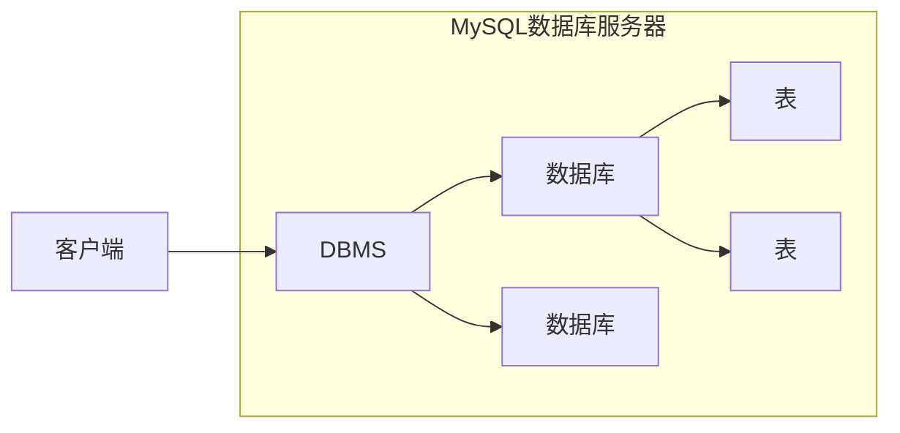

# MySQL

## 1. 数据库

### 1.1 数据库概念

**数据库(DataBase DB ):**

- 存储数据的仓库，数据是有组织的进行存储

**数据库管理系统(DataBase Management System (DBMS) )**

- 操纵和管理数据库的大型软件

**SQL ( Structured Query Language )**

- 操作关系型数据库的编程语言，定义了一套操作关系型数据库统一标准

### 1.2 MySQL 数据库

**关系型数据库（RDBMS)**

- 建立在关系模型基础上，由多张相互连接的二维表组成的数据库。
- 特点
  - 使用表存储数据,格式统一，便于维护
  - 使用SQL语言操作，标准统一，使用方便

**数据模型**



### 1.3 图形化客户端工具Navicat

Navicat for MySQL是管理和开发MySQL或 MariaDB的理想解决方案。

这套全面的前端工具为数据库管理、开发和维护提供了一款直观而强大的图形界面。

官网: http://www.navicat.com.cn

## 2. SQL

### 2.1 SQL语法

**SQL通用语法**

1. SQL语句可以单行或多行书写，以分号结尾。
2. SQL语句可以使用空格/缩进来增强语句的可读性。
3. MySQL数据库的SQL语句不区分大小写，关键字建议使用大写。
4. 注释:

  - 单行注释:
    - `--注释内容或#注释内容(MySQL特有)`
  - 多行注释:
    - `/*注释内容*/`

### 2.2 SQL语句分类

| 分类 | 全称                       | 说明                                                   |
| ---- | -------------------------- | ------------------------------------------------------ |
| DDL  | Data Definition Language   | 数据定义语言，用来定义数据库对象(数据库，表，字段)     |
| DML  | Data Manipulation Language | 数据操作语言，用来对数据库表中的数据进行增删改         |
| DQL  | Data Query Language        | 数据查询语言，用来查询数据库中表的记录                 |
| DCL  | Data Control Language      | 数据控制语言，用来创建数据库用户、控制数据库的访问权限 |

### 2.3 DDL

DDL

- 操作数据库，表，列等

#### 2.3.1 操作数据库

| 方法 | 描述                                                         |
| ---- | ------------------------------------------------------------ |
| 查询 | `SHOW DATABASES;`查询所有数据库<br />`SELECT RATABASE();`查询当前使用的数据库 |
| 创建 | `CREATE DATABASE [IF NOT EXISTS] 数据库名 [DEFAULT CHARSET字符集] [COLLATE 排序规则];` |
| 删除 | `DROP DATABASE [IF EXISTS]数据库名;`                         |
| 使用 | `USE数据库名;`                                               |

####  2.3.2 查询表

| 方法                 | 描述                     |
| -------------------- | ------------------------ |
| 查询当前数据库所有表 | `SHOW TABLES;`           |
| 查询表结构           | `DESC 表名;`             |
| 查询指定表的建表语句 | `SHOW CREATE TABLE表名;` |

#### 2.3.3 创建表

```sql
CRETA TABLE 表名(
    字段1 字段1类型[COMMENT 字段1注释],
    字段2 字段2类型[COMMENT 字段2注释],
    字段3 字段3类型[COMMENT 字段3注释],
    ......
)[COMENT 表注释];
```

#### 2.3.4 表数据类型

**数值类型**

| 数据类型     | 大小    | 有符号(SIGNED)范围                                    | 无符号(UNSIGNED)范围                                    | 描述               |
| ------------ | ------- | ----------------------------------------------------- | ------------------------------------------------------- | ------------------ |
| TINYINT      | 1 byte  | (-128,127)                                            | (0,255)                                                 | 小整数值           |
| SMALLINT     | 2 bytes | (-32768,32767)                                        | (0,65535)                                               | 大整数值           |
| MEDIUMINT    | 3 bytes | (-8388608,8388607)                                    | (0,16777215)                                            | 大整数值           |
| INT或INTEGER | 4 bytes | (-2147483648，2147483647)                             | (0,4294967295)                                          | 大整数值           |
| BIGINT       | 8 bytes | (-2^63,2^63-1)                                        | (0,2~64-1)                                              | 极大整数值         |
| FLOAT        | 4 bytes | (-3.402823466 E+38，3.402823466351 E+38)              | 0和(1.175494351 E-38，3.402823466 E+38)                 | 单精度浮点数值     |
| DOUBLE       | 8 bytes | (-1.7976931348623157 E+308，1.7976931348623157 E+308) | 0和(2.2250738585072014 E-308，1.7976931348623157 E+308) | 双精度浮点数值     |
| DECIMAL      |         | 依赖于M(精度)和D(标度)的值                            | 依赖于M(精度)和D(标度)的值                              | 小数值(精确定点数) |

**字符串类型**

| 数据类型   | 大小                  | 描述                          |
| ---------- | --------------------- | ----------------------------- |
| CHAR       | 0-255 bytes           | 定长宁符串                    |
| VARCHAR    | 0-65535 bytes         | 变长字符串                    |
| TINYBLOB   | 0-255 bytes           | 不超过255个字符的二进制字符串 |
| TINYTEXT   | 0-255 bytes           | 短文本字符串                  |
| BLOB       | 0-65535 bytes         | 二进制形式的长文本数据        |
| TEXT       | 0-65535 bytes         | 长文本数据                    |
| MEDIUMBLOB | 0-16777 215 bytes     | 二进制形式的中等长度文本数据  |
| MEDIUMTEXT | 0-16777 215 bytes     | 中等长度文本数据              |
| LONGBLOB   | 0-4 294 967 295bytes  | 二进制形式的极大文本数据      |
| LONGTEXT   | 0-4 294 967 295 bytes | 极大文本数据                  |

#### 2.3.5 修改表

| 函数                                              | 描述               |
| ------------------------------------------------- | ------------------ |
| `ALTER TABLE 表名 RENAME TO 新的表名;`            | 修改表名           |
| `ALTER TABLE 表名 ADD 列名 数据类型;`             | 添加一列           |
| `ALTER TABLE 表名 MODIFY 列名 新数据类型;`        | 修改数据类型       |
| `ALTER TABLE 表名 CHANGE 列名 新列名 新数据类型;` | 修改列名和数据类型 |
| `ALTER TABLE 表名 DROP 列名;`                     | 删除列             |

### 2.4 DML

DML

- 对表中的数据进行增删改

常用操作

- 添加(insert)
- 修改(update)
- 删除(delete)

#### 2.4.1 添加数据

| 函数                                                         | 描述             |
| ------------------------------------------------------------ | ---------------- |
| `INSERT INTO 表名(列名1,列名2,.….) VALUES(值1,值2,...) ;`    | 给指定列添加数据 |
| `INSERT INTO 表名 VALUES(值1,值2,.…);`                       | 给全部列添加数据 |
| `INSERT INTO 表名(列名1,列名2,.….）) VALUES(值1,值2...),(值1,值2...),(值1,值2.… ...);`<br />`INSERT INTO 表名 VALUES(值1,值2,...),(值1,值2...),(值1,值2..)..;` | 批量添加数据     |

#### 2.4.2 修改数据

| 函数                                                  | 描述       |
| ----------------------------------------------------- | ---------- |
| `UPDATE 表名 SET 列名1=值1,列名2=值2,....[WHERE条件]` | 修改表数据 |

#### 2.4.3 删除数据

| 函数                            | 描述       |
| ------------------------------- | ---------- |
| `DELETE FROM 表名 [WHERE条件];` | 删除表数据 |

### 2.5 DQL

DQL

- 查询表中的数据

常用操作

- 条件查询(WHERE)
- 分组查询(GROUP BY)
- 排序查询(ORDER BY)
- 分页查询(LIMIT)

#### 2.5.1 基础查询

| 函数                                                         | 描述         |
| ------------------------------------------------------------ | ------------ |
| `SELECT 字段列表 FROM 表名;`<br />`SELECT * FROM 表名;` 不建议使用* | 查询多个字段 |
| `SELECT DISTINCT 字段列表 FROM 表名;`                        | 去除重复记录 |
| `AS: AS`可以省略<br />`SELECT name,math AS 数学成绩,english AS 英语成绩 from stu` | 起别名       |

#### 2.5.2 条件查询(WHERE)

语法

- `SELECT 字段列表 FROM 表名 WHERE 条件列表;`

条件

| 符号             | 功能                                 |
| ---------------- | ------------------------------------ |
| >                | 大于                                 |
| <                | 小于                                 |
| >=               | 大于等于                             |
| <=               | 小于等于                             |
| =                | 等于                                 |
| <> 或 !=         | 不等于                               |
| BETWEEN...AND... | 在某个范围之间(都包括)               |
| IN(...)          | 多选一                               |
| LIKE 占位符      | 模糊查询 _单个任意字符 %多个任意字符 |
| IS NULL          | 是NULL                               |
| IS NOT NULL      | 不是NULL                             |
| AND 或 &&        | 并且                                 |
| OR 或 \|\|       | 或者                                 |
| NOT 或 !         | 非,不是                              |

#### 2.5.3 排序查询(OEDER BY)

语法

- `SELECT 字段列表 FROM 表名 ORDER BY 排序字段名1 [排序方式1],排序字段名2 [排序方式2]...;`

排序方法

- ASC: 升序排列
- DESC: 降序排列

**注意:如果有多个排序条件，当前边的条件值一样时，才会根据第二条件进行排序**


#### 2.5.4 聚合函数

1. 概念

   将一列数据作为一个整体,进行纵向计算

2. 聚合函数分类

| 函数        | 功能     |
| ----------- | -------- |
| COUNT(列名) | 统计数量 |
| MAX(列名)   | 最大值   |
| MIN(列名)   | 最小值   |
| SUM(列名)   | 求和     |
| AVG(列名)   | 平均值   |

3. 语法

`SELECT 聚合函数名(列名) FROM 表;`

**注意: null值不参与所有聚合函数运算**


#### 2.5.5 分组查询(GROUP BY)

语法

- `SELECT 字段列表 FROM 表名[WHERE 分组前条件限定] GROUP BY 分组字段名[HAVING 分组后条件过滤];`

**注意:分组之后，查询的字段为聚合函数和分组字段，查询其他字段无任何意义**

where 和 having的区别

- 执行时机不一样: where是**分组之前**进行限定，不满足where条件，则不参与分组，而having是**分组之后**对结果进行过滤。
- 可判断的条件不一样: **where不能对聚合函数进行判断**，having可以。

**执行顺序**

- where > 聚合函数 > having


#### 2.5.6 分页查询(LIMIT)

语法

- `SELECT 字段列表 FROM 表名 LIMIT 起始索引,查询条目数;`

- 起始索引： 从0开始 **计算公式： 起始索引=(当前页码-1)*每页显示的条数**

tips:

- 分页查询limit是MySQL数据库的方言
- Oracle分页查询使用rownumber
- SQL Server分页查询使用top

## 3. 约束

约束的概念

- 约束是作用于表中列上的规则，用于限制加入表的数据
- 约束的存在保证了数据库中数据的正确性、有效性和完整性

约束的分类

| 约束名称 | 描述                                                         | 关键字      |
| -------- | ------------------------------------------------------------ | ----------- |
| 非空约束 | 保证列中所有数据不能有null值                                 | NOT NULL    |
| 唯一约束 | 保证列中所有数据各不相同                                     | UNIQUE      |
| 主键约束 | 主键是一行数据的唯一标识，要求非空且唯一                     | PRIMARY KEY |
| 检查约束 | 保证列中的值满足某—条件                                      | CHECK       |
| 默认约束 | 保存数据时，未指定值则采用默认值                             | DEFAULT     |
| 外键约束 | 外键用来让两个表的数据之间建立链接，保证数据的一致性和完整性 | FOREIGN KEY |

**注意MySQL不支持检查约束**

```mysql
CREATE TABLE emp(
	id INT PRIMARY KEY,		-- 员工id，主键且自增长
	ename VARCHAR(50) NOT NULL UNIQUE, -- 员工姓名，非空且唯一
	joindate DATE NOT NULL, -- 入职日期，非空
	salary DOUBLE(7,2)NOT NULL, -- 工资，非空
	bonus DOUBLE(7,2)DEFAULT 0 -- 奖金，如果没有默认为0
);
```

### 3.1 外键约束

概念

- 外键用来让两个表的数据之间建立链接，保证数据的一致性和完整性


语法

(1) 添加约束

```sql
-- 创建表时添加外键约束
CREATE TABLE 表名(
	列名 数据类型,
    ...
	[CONSTRAINT][外键名称] FOREIGN KEY(外键列名) REFERENCES主表(主表列名)
);
```

```sql	
-- 建完表后添加外键约束
ALTER TABLE 表名 ADD CONSTRAINT 外键名称 FOREIGN KEY（外键字段名称) REFERENCES 主表名称(主表列名称);
```

(2) 删除约束

```sql
ALTER TABLE 表名 DROP FOREIGN KEY 外键名称;
```

## 4. 数据库设计

1. 软件的研发步骤


2. 数据库设计概念

- 数据库设计就是根据业务系统的具体需求，结合我们所选用的DBMS，为这个业务系统构造出最优的数据存储模型。
- 建立数据库中的表结构以及表与表之间的关联关系的过程。
- 有哪些表?表里有哪些字段?表和表之间有什么关系?


3. 数据库设计的步骤

- 需求分析（数据是什么?数据具有哪些属性?数据与属性的特点是什么)
- 逻辑分析（通过ER图对数据库进行逻辑建模，不需要考虑我们所选用的数据库管理系统)
- 物理设计（根据数据库自身的特点把逻辑设计转换为物理设计)
- 维护设计（1.对新的需求进行建表; 2.表优化)

### 4.1 表关系

常见关系

- 一对一
- 一对多
- 多对多

### 4.2 表关系一对多

实现方式

- **在多的一方建立外键，指向一的一方的主键**


### 4.3 表关系多对多

实现方式

- **建立第三张中间表**
- **中间表至少包含两个外键，分别关联两方主键**


### 4.4 表关系一对一

实现方式

- **在任意一方加入外键，关联另一方主键，并且设置外键为唯一`(UNIQUE)`**


## 5. 多表查询

语法

```sql
SELECT * FROM emp, dept;
-- 产生笛卡尔积,有很多无效数据 (笛卡尔积; 取AB集合的所有情况)
-- 消除无效数据

-- 查询emp 和 dept 的数据, emp.dep_id = dept.did
SELECT * FROM emp, dept WHERE emp.dep_id = dept.did;
```

### 5.1 连接查询

连接查询

- 内连接
- 外连接
  - 左外连接: 相当于查询A表所有数据和交集部分数据
  - 右外连接: 相当于查询B表所有数据和交集部分数据


### 5.2 内连接

语法

```sql
-- 隐式内连接
SELECT 字段列表 FROM 表1,表2.. WHERE 条件;

-- 显示内连接
SELECT 字段列表 FROM 表1 [INNER] JOIN 表2 ON 条件;
```

**内连接相当于查询A B交集数据**

```sql
SELECT emp.name,emp.gender,dept.dname FROM emp,dept WHERE emp.dep_id = dept.did;
```

### 5.3 外连接

语法

```sql
-- 左外连接
SELECT 字段列表 FROM 表1 LEFT [OUTER] JOIN 表2 ON 条件;

-- 右外连接
SELECT 字段列表 FROM 表1 RIGHT [OUTER] JOIN 表2 ON 条件;
```

- 左外连接: 相当于查询A表所有数据和交集部分数据
- 右外连接: 相当于查询B表所有数据和交集部分数据

### 5.4 子查询

概念

- 查询中嵌套查询，称嵌套查询为子查询

子查询根据查询结果不同，作用不同

- 单行单列
- 多行单列
- 多行多列


单行单列 作为条件值，使用=!=><等进行条件判断

```sql
SELECT 字段列表 FROM 表 wHERE 字段名 = (子查询);
```

多行单列 作为条件值，使用in等关键字进行条件判断

```sql
SELECT 字段列表 FROM 表 wHERE 字段名 in (子查询);
```

多行多列 作为虚拟表

```sql
SELECT 字段列表 FROM (子查询) WHERE 条件;
```

## 6. 事务

概念

- 数据库的事务（Transaction)是一种机制、一个操作序列，包含了**一组数据库操作命令**
- 事务把所有的命令作为一个整体一起向系统提交或撤销操作请求，即这一组数据库命令**要么同时成功，要么同时失败**
- 事务是一个不可分割的工作逻辑单元

语法

```sql
-- 开启事务
START TRANSACTION;
或者 BEGIN;
-- 提交事务
COMMIT;
-- 回滚事务
ROLLBACK;
```

四大特征

- 原子性(Atomicity):事务是不可分割的最小操作单位，要么同时成功，要么同时失败
- 一致性(Consistency):事务完成时，必须使所有的数据都保持一致状态
- 隔离性(lsolation) :多个事务之间，操作的可见性
- 持久性(Durability):事务一旦提交或回滚，它对数据库中的数据的改变就是永久的


# MyBatis

## 1. JDBC


### 1.1 简介

JDBC

- 使用Java语言操作关系型数据库的一套API
- 全称:(Java DataBase Connectivity ) Java数据库连接

JDBC本质

- 官方(sun公司)定义的一套操作所有关系型数据库的规则，即接口
- 各个数据库厂商去实现这套接口，提供数据库驱动jar包
- 我们可以使用这套接口(JDBC)编程，真正执行的代码是驱动jar包中的实现类

JDBC好处

- 各数据库厂商使用相同的接口，Java代码不需要针对不同数据库分别开发
- 可随时替换底层数据库，访问数据库的Java代码基本不变


### 1.2 快速入门

步骤

1. 创建工程,导入驱动jar包
2. 注册驱动

```java
Class.forName("com.mysql.jdbc.Driver");
```

3. 获取链接

```java
Connection conn = DriverManager.getConnection(url,username,password);
```

4. 定义SQL语句

```java
String sql = "update..." ;
```

5. 获取执行SQL对象

```java
Statement stmt = conn.createStatement();
```

6. 执行SQL

```java
stmt.executeUpdate(sql);
```

7. 返回处理结果
8. 释放资源

```java
 // 1. 注册驱动
Class.forName("com.mysql.jdbc.Driver");
// 2. 获取连接
String url = "jdbc:mysql://localhost:3306/test?useSSL=false";
String user = "root";
String password = "123456";
Connection conn = DriverManager.getConnection(url, user, password);
// 3. 定义SQL语句
String sql = "UPDATE account SET money = 2000 WHERE id = 1;";
// 4. 获取执行SQL的对象
Statement stmt = conn.createStatement();
// 5. 执行SQL
int count = stmt.executeUpdate(sql);
// 6. 处理结果
System.out.println(count);
// 7. 释放资源
stmt.close();
conn.close();
```

## 2. JDBC API

### 2.1 DriverManager

DriverManager(驱动管理类)作用:

1. 注册驱动
2. 获取数据库连接


注册驱动

```java
Class.forName("com.mysql.jdbc.Driver");
```

提示

- MySQL 5之后的驱动包，可以省略注册驱动的步骤
- 自动加载jar包中的META-INF/services/java.sql.Driver文件中的驱动类


获取连接

```java
DriverManager.getConnection(url, user, password);
```

参数

- url:连接路径

  - 语法：`jdbc:mysql://ip地址(域名):端口号/数据库名称?参数键值对1&参数键值对2...`

  - 示例：`jdbc:mysql://127.0.0.1:3306/db1`

  - 细节:

    - 如果连接的是本机mysql服务器，并且mysql服务默认端口是3306，则url可以简写为:` jdbc:mysql:///数据库名称?参数键值对`

    - 配置`usesSL=false`参数，禁用安全连接方式，解决警告提示

- user: 用户名
- password:密码


### 2.2 Connection

Connection(数据库连接对象)作用:

1. 获取执行SQL的对象
2. 管理事务


获取执行SQL的对象

- 普通执行SQL对象

```java
Statement createStatement()
```

- 预编译SQL的执行SQL对象:防止SQL注入

```java
PreparedStatement prepareStatement(sql)
```

- 执行存储过程的对象

```java
CallableStatement  prepareCall(sql)
```


事务管理

- MySQL事务管理

```java
开启事务:BEGIN; /START TRANSACTION;
提交事务:COMMIT;
回滚事务:ROLLBACK;

MySQL默认自动提交事务
```

-  JDBC 事务管理:Connection接口中定义了3个对应的方法

```java
开启事务: setAutoCommit(boolean autoCommit): true为自动提交事务;false为手动提交事务，即为开启事务
提交事务: commit()
回滚事务: rollback()
```


发生异常回滚事务

```java
String sql1 = "UPDATE account SET money = 3000 WHERE id = 1;";
String sql2 = "UPDATE account SET money = 3000 WHERE id = 2;";
Statement stmt = conn.createStatement();
try{
  // 开启事务
  conn.setAutoCommit(false);
  // 执行SQL
  int count1 = stmt.executeUpdate(sql1);
  System.out.println(count1);
  int i = 3/0;  //发生异常
  int count2 = stmt.executeUpdate(sql2);
  System.out.println(count2);
  conn.commit();
}catch (Exception throwables){
  // 回滚事务
  conn.rollback();
}
```


### 2.3 Statement

Statement

- Statement作用:
  1. 执行SQL语句
- 执行SQL语句

```java
int executeUpdate(sql):执行DML、DDL语句
返回值: 
(1)DML语句影响的行数
(2)DDL语句执行后，执行成功也可能返回0
```

```java
ResultSet executeQuery(sql):执行DQL语句
返回值:ResultSet结果集对象
```


### 2.4 ResultSet

ResultSet

- ResultSet(结果集对象)作用:
  1. 封装了DQL查询语句的结果

```java
ResultSet stmt.executeQuery(sql);
//执行DQL语句，返回ResultSet对象
```

- 获取查询结果

```java
boolean next():
(1)将光标从当前位置向前移动一行
(2)判断当前行是否为有效行

返回值:
true:有效行，当前行有数据
false:无效行，当前行没有数据
```

```java
xxx getXxx(参数):获取数据
xxx:数据类型;如: int getlnt(参数); String getString(参数)
    
参数:
int:列的编号，从1开始
String:列的名称
```

- 使用步骤
  1. 游标向下移动一行，并判断该行否有数据: next()
  2. 获取数据:getXxx(参数)

```java
//循环判断游标是否是最后一行末尾
while(rs.next()){
    //获取数据
    rs.getXxx(参数);
}
```


### 2.5 PreparedStatement

PreparedStatement

- PreparedStatement作用
  1. 预编译SQL语句并执行:预防SQL注入问题

- SQL注入
  - SQL注入是通过操作输入来修改事先定义好的SQL语句，用以达到执行代码对服务器进行攻击的方法。


PreparedStatement作用

1. 预编译SQL语句并执行


获取Preparedstatement对象

```java
//SQL语句中的参数值，使用?占位符替代
String sql = "select * from user where username = ? and password = ?";

//通过Connection对象获取，并传入对应的sql语句
PreparedStatement pstmt = conn.prepareStatement(sql);
```


设置参数值

- PreparedStatement对象: setXxx(参数1，参数2):给?赋值
  - Xxx:数据类型; 如setlnt(参数1,参数2)
  - 参数:
    - 参数1: ?的位置编号，从1开始
    - 参数2: ?的值


执行SQL

```java
executeUpdate(); / executeQuery(); :不需要再传递sql
```


### 2.6 PreparedStatement原理

PreparedStatement好处

1. 预编译SQL，性能更高
2. 防止SQL注入:**将敏感字符进行转义**


PreparedStatement预编译功能开启: `useServerPrepStmts=true`


配置MySQL执行日志(重启mysql服务后生效)

```
log-output=FILE
general-log=1
general_log_file="D:\mysql.log"
slow-query-log=1
slow_query_log_file=“D: \mysql_slow.log"
long_query_time=2
```


PreparedStatement原理:

1. 在获取PreparedStatement对象时，将sql语句发送给mysql服务器
   进行检查，编译(这些步骤很耗时)
2. 执行时就不用再进行这些步骤了，速度更快
3. 如果sql模板一样，则只需要进行一次检查、编译


### 2.7 数据库连接池

#### 2.7.1 简介

- 数据库连接池是个容器，负责分配、管理数据库连接(Connection)
- 它允许应用程序重复使用一个现有的数据库连接，而不是再重新建立一个;
- 释放空闲时间超过最大空闲时间的数据库连接来避免因为没有释放数据库连接而引起的数据库连接遗漏
- 好处
  - 资源重用
  - 提升系统响应速度
  - 避免数据库连接遗漏


#### 2.7.2 实现

标准接口:DataSource

- 官方(SUN)提供的数据库连接池标准接口，由第三方组织实现此接口。
- 功能: 获取连接

```java
Connection getConnection()
```

常见的数据库连接池:

- DBCP
- C3P0
- Druid

Druid(德鲁伊)

- Druid连接池是阿里巴巴开源的数据库连接池项目
- 功能强大，性能优秀，是Java语言最好的数据库连接池之一


Druid 使用步骤

1. 导入jar包druid-1.1.12.jar

2. 定义配置文件
3. 加载配置文件
4. 获取数据库连接池对象
5. 获取连接

```java
// 1. 导入jar包
// 2. 定义配置文件
// 3. 加载配置文件
Properties prop = new Properties();
prop.load(new FileInputStream("src/druid.properties"));
// 4. 获取连接池对象
DataSource dataSource = DruidDataSourceFactory.createDataSource(prop);
// 5. 获取连接
Connection connection = dataSource.getConnection();
System.out.println(connection);
// 6. 释放资源
```

## 3. MyBatis

### 3.1 简介

什么是MyBatis

- MyBatis是一款优秀的持久层框架，用于简化JDBC开发
- MyBatis 本是 Apache的一个开源项目iBatis, 2010年这个项目由apache software foundation迁移到了google code，并且改名为MyBatis。2013年11月迁移到Github
- 官网: https://mybatis.org/mybatis-3/zh/index.html


持久层

- 负责将数据到保存到数据库的那一层代码
- JavaEE三层架构:表现层、业务层、持久层


框架

- 框架就是一个半成品软件，是一套可重用的、通用的、软件基础代码模型
- 在框架的基础之上构建软件编写更加高效、规范、通用、可扩展


### 3.2 JDBC的缺点

JDBC缺点

1. 硬编码
   - 注册驱动，获取连接
   - SQL语句
2. 操作繁琐
   - 手动设置参数
   - 手动封装结果集

**MyBatis免除了几乎所有的JDBC代码以及设置参数和获取结果集的工作**


MyBatis是目前的主流JDBC框架


### 3.3 安装Mybatis

在pom.xml下的`<dependencies>`下添加

```xml
<dependency>
  <groupId>org.mybatis</groupId>
  <artifactId>mybatis</artifactId>
  <version>3.5.11</version>
</dependency>
```

即可完成安装

### 3.4 Mapper代理开发

Mapper代理开发

- 解决原生方式中的硬编码
- 简化后期执行SQL


原始写法

```java
// 执行sql
List<User> users = sqlSession.selectList("test.selectAll");
System.out.println(users);
```

Mapper代理开发

```java
// 获取接口代理对象
UserMapper userMapper = sqlSession.getMapper(UserMapper.class);
// 执行方法，其实就是执行sql语句
List<User> users = userHapper.selectAll();
```


Mapper代理开发规则

1. 定义与SQL映射文件同名的Mapper接口，并且将Mapper接口和SQL映射文件放置在同一目录下
2. 设置SQL映射文件的namespace属性为Mapper接口全限定名
3. 在Mapper接口中定义方法，方法名就是SQL映射文件中sql语句的id，并保持参数类型和返回值类型一致
4. 编码
   1. 通过SqlSession的getMapper方法获取Mapper接口的代理对象
   2. 调用对应方法完成sql的执行

**细节:**

- **如果Mapper接口名称和SQL映射文件名称相同，并在同一目录下，则可以使用包扫描的方式简化SQL映射文件的加载**

```xml
<!--加载SQL映射文件-->
<mapper resource="com/test/mapper/UserMapper.xml"/>
<!--Mapper代理方式-->
<package name="com.test.mapper"/>
```


### 3.5 代理接口的实现

1. 创建接口


2. 在resources目录下创建对应的xml文件


3. 在mybatis-config.xml的mappers下添加

```xml
<package name="com.test.mapper"/>
```

 ```xml
<!--mybatis-config.xml-->
<?xml version="1.0" encoding="UTF-8" ?>
<!DOCTYPE configuration
        PUBLIC "-//mybatis.org//DTD Config 3.0//EN"
        "https://mybatis.org/dtd/mybatis-3-config.dtd">
<configuration>
    <environments default="development">
        <environment id="development">
            <transactionManager type="JDBC"/>
            <dataSource type="POOLED">
                <!--数据库连接信息-->
                <property name="driver" value="com.mysql.jdbc.Driver"/>
                <property name="url" value="jdbc:mysql:///test?useSSL=false"/>
                <property name="username" value="root"/>
                <property name="password" value="123456"/>
            </dataSource>
        </environment>
    </environments>
    <mappers>
        <!--加载SQL映射文件-->
<!--        <mapper resource="com/test/mapper/UserMapper.xml"/>-->
        <!--Mapper代理方式-->
        <package name="com.test.mapper"/>
    </mappers>
</configuration>
 ```

4. BrandMapper.xml下的配置

```xml
<?xml version="1.0" encoding="UTF-8" ?>
<!DOCTYPE mapper
        PUBLIC "-//mybatis.org//DTD Mapper 3.0//EN"
        "https://mybatis.org/dtd/mybatis-3-mapper.dtd">
<!--
    namespace: 名称空间
-->
<mapper namespace="com.test.mapper.BrandMapper">
    <select id="selectAll" resultType="com.test.pojo.Brand">
        select * from tb_brand;
    </select>
    <select id="selectById" parameterType="int" resultType="com.test.pojo.Brand">
        select * from ${tb_brand} where id = #{id};
    </select>
</mapper>
```

5. BrandMapper接口的配置

```java
package com.test.mapper;

import com.test.pojo.Brand;

import java.util.List;

public interface BrandMapper {
  List<Brand> selectAll();
  Brand selectById(Integer id);
}
```


### 3.6 Mapper与数据库字段名称不同的解决方案

数据库表的字段名称 和 实体类的属性名称 不一样, 则不能自动封装数据

解决方法

- 使用sql片段起别名
- 使用resultMap


#### 3.6.1 起别名/sql片段

起别名:

- 对不一样的列名起别名,让别名和实体类的属性名称一样

```sql
select id,brand_name as brandName, company_name as companyNamr, ordered, description, status from tb_brand;
```

缺点

- 每次查询都需要起别名

解决方法

- 使用sql片段

```xml
<!--sql片段-->
<sql id="brand_column">
	id,brand_name as brandName, company_name as companyName, ordered, description, status
</sql>
<!--使用sql片段-->
select
	<include refid="brand_column"></include>
from tb_brand;
```


#### 3.6.2 使用resultMap

id: 完成主键字段的映射

- column: 表的列名
- property: 实体类的属性名

result: 完成一般字段的映射

```xml
<!--定义resultMap-->
<resultMap id="brandResultMap" type="com.test.pojo.Brand">
    <result column="brand_name" property="brandName"></result>
    <result column="company_name" property="companyName"></result>
</resultMap>
<!--使用resultMap-->
<select id="selectAll" resultMap="brandResultMap">
    select * from tb_brand;
</select>
```


### 3.7 MyBatis参数的处理

#### 3.7.1 参数占位符

参数占位符

    1. `#{属性名称}`：会将其替换为?，为了防止SQL注入
    2. `${属性名称}`：会将其替换为属性值，存在SQL注入的风险
    3. 使用时机：
       - 参数传递的时候，`#{}`
       - 表名或者列名不固定的情况下，`${}`

```xml
<select id="selectById" parameterType="int" resultType="com.test.pojo.Brand">
    select * from ${tb_brand} where id = #{id};
</select>
```

#### 3.7.2 参数类型

参数类型 parameterType

- 指定参数类型，可以省略

```xml
<select id="selectById" parameterType="int" resultType="com.test.pojo.Brand">
```

#### 3.7.3 特殊字符处理

特殊字符处理

1. 转义字符
2. CDATA区


转义字符

| 特殊字符 | 描述         | 字符的代码 |
| -------- | ------------ | ---------- |
|          | 空格符       | `&nbsp;`   |
| &lt;     | 小于号       | `&lt;`     |
| &gt;     | 大于号       | `&gt;`     |
| &amp;    | 和号         | `&amp;`    |
| &yen;    | 人民币       | `&yen;`    |
| &copy;   | 版权         | `&copy;`   |
| &reg;    | 注册商标     | `&reg;`    |
| &deg;    | 摄氏度       | `&deg;`    |
| &plusmn; | 正负号       | `&plusmn;` |
| &times;  | 乘号         | `&times;`  |
| &divide; | 除号         | `&divide;` |
| &sup2;   | 平方2(上标2) | `&sup2;`   |
| &sup3;   | 立方3(上标3) | `&sup3;`   |


CDATA区

```xml
<![CDATA[内容]]>
```


#### 3.7.4 多个参数的设置

BrandMapper.xml的配置

```xml
<select id="selectByCondition" resultType="com.test.pojo.Brand">
    select *
    from tb_brand
    where status = #{status}
        and company_name like #{company_name}
        and brand_name like #{brand_name}
</select>
```

散装参数

- 使用`@Param("SQL中占位符名称") 类型 变量名`

```java
List<Brand> selectByCondition(@Param("status")int status, @Param("company_name") String company_name,@Param("brand_name") String brand_name);
```

实体类封装参数

- 只需要保证sQL中的参数名和实体类属性名对应上，即可设置成功

```java
List<Brand> selectByCondition(Brand brand);
```

Map集合

- 只需要保证sQL中的参数名和map集合的键的名称对应上，即可设置成功

```java
List<Brand> selectByCondition(Map map);
```


#### 3.7.5 动态SQL

SQL语句会随着用户的输入或外部条件的变化而变化，我们称为**动态SQL**

有以下常见的几种判断标签

- if
- choose(when,otherwise)
- trim(where,set)
- foreach


示例

```xml
<select id="selectByCondition" resultType="com.test.pojo.Brand">
    select *
    from tb_brand
    <where>
		<if test="status!=null">
    	    status = #{status}
    	</if>
    	<if test="company_name!=null and company_name!=''">
    	    and company_name like #{company_name}
    	</if>
    	<if test="brand_name!=null and brand_name!=''">
    	    and brand_name like #{brand_name}
    	</if>
    </where>
</select>
```


`<if>`标签(单条件查询)

- 用于判断参数是否有值，使用`test`属性进行条件判断
  - 存在的问题:第一个条件不需要逻辑运算符
  - 解决方案:
    - 使用恒等式让所有条件格式都一样
    - `<where>`标签替换`where`关键字


`<where>`标签(智能处理条件)

- 用于替代sql中的where关键字，实现动态SQL


`<choose(when,otherwise)>`标签 (多条件查询)

- **从多个条件中选择一个**
- 类似于Java中的switch语句

```xml
<select id="selectByCondition" resultType="com.test.pojo.Brand">
    select *
    from tb_brand
    <where>
        <choose>
            <when test="status != null">
                status = #{status}
            </when>
            <when test="company_name != null and company_name != '' ">
                and company_name like #{company_name}
            </when>
            <when test="brand_name != null and brand_name != '' ">
                and brand_name like #{brand_name}
            </when>
        </choose>
    </where>
</select>
```


`<set>`标签(智能处理输入数据)

- 用于替代SQL中的set关键字，实现动态SQL


`<foreach>`标签(遍历数组)

- 用于遍历传入数组，将其拼接为SQL语句，实现数组的动态SQL

```xml
<delete id="deleteByIds">
    delete from tb_brand where id in
    <foreach collection="ids" item="id" open="(" separator="," close=")">
        #{id}
    </foreach>
</delete>
```


#### 3.7.6 主键返回

返回添加数据的主键，主键将自动添加入对象中

```xml
<insert useGeneratedKeys="true" keyProperty="id">
```

在测试类中，打印传入对象的id成员即可获得主键

```java
System.out.println(brand.getId());
```


#### 3.7.7 数组传参

mybatis会将数组参数，封装为一个Map集合

- 默认：array = 数组，collection = "array"
- 使用@Param注解，改变map集合的默认key的名称，collection = "ids"

BrandMapper.java

```java
void deleteByIds(@Param("ids") int[] ids);
```

BrandMapper.xml

```xml
<foreach collection="ids" item="id" open="(" separator="," close=")">
    #{id}
</foreach>
```

不使用@Param注解

BrandMapper.xml

```xml
<foreach collection="array" item="id" open="(" separator="," close=")">
    #{id}
</foreach>
```


#### 3.7.8 单个参数封装

单个参数

1. POJO类型：直接使用，属性名 和 参数占位符名称一致
2. Map集合：直接使用，键名 和 参数占位符名称一致
3. Collection：封装成Map集合
   - map.put("argo",collection集合)
   - map.put("collection",collection集合)
4. List: 封装成Map集合
   - map.put("arg0",list集合)
   - map.put("collection",list集合)
   - map.put("list",list集合)
5. Array: 封装成Map集合
   - map.put("arg0",数组)
   - map.put("array",数组)
6. 其他类型：直接使用

**对于封装成Map集合的类型，可以使用@Param注解，替换Map集合中默认的arg键名**


### 3.8 注解开发

使用注解开发会比配置文件开发更加方便

```java
@Select("select * from tb_user where id = #{id}")
User selectById(int id);
```

基本的注解功能

- 查询 @Select
- 添加 @Insert
- 修改 @Update
- 删除 @Delete

**注意**

- **注解开发适用于简单功能**
- **配置文件完成复杂功能**

# JavaWeb

JavaWeb

- 是用Java技术来解决相关web互联网领域的技术栈

## 1. JavaWeb技术栈

B/S架构(Browser/Server)

- 浏览器/服务器架构模式，它的特点是，客户端只需要浏览器，应用程序的逻辑和数据都存储在服务器端。浏览器只需要请求服务器，获取Web资源，服务器把Web资源发送给浏览器即可

静态资源

- HTML、CSS、JavaScript、图片等。负责页面展现

动态资源

- Servlet、JSP等。负责逻辑处理

数据库

- 负责存储数据

HTTP协议

- 定义通信规则

Web服务器

- 负责解析HTTP协议，解析请求数据，并发送响应数据


## 2. HTTP

### 2.1 概念

HTTP

- 概念:HyperText Transfer Protocol，超文本传输协议，规定了浏览器和服务器之间数据传输的规贝

- HTTP协议特点:
  - 基于TCP协议:面向连接，安全
  - 基于请求-响应模型的:一次请求对应一次响应
  - HTTP协议是无状态的协议:对于事务处理没有记忆能力。每次请求-响应都是独立的。
    - 缺点:多次请求间不能共享数据。Java中使用会话技术(Cookie、Session)来解决这个问题
    - 优点:速度快

### 2.2 请求数据格式

请求数据分为3部分:

1. 请求行:请求数据的第一行。其中GET表示请求方式，/
   表示请求资源路径，HTTP/1.1表示协议版本
2. 请求头:第二行开始，格式为key: value形式。
3. 请求体:POST请求的最后一部分，存放请求参数


常见的HTTP请求头

- Host:表示请求的主机名
- User-Agent:浏览器版本，例如Chrome浏览器的标识类似Mozilla/5.0 ...Chrome/79，IE浏览器的标识类似Mozilla/5.o (Windows NT ...) like Gecko;
- Accept:表示浏览器能接收的资源类型，如`text/*`，`image/*`或者`*/*`表示所有;
- Accept-Language:表示浏览器偏好的语言，服务器可以据此返回不同语言的网页;
- Accept-Encoding:表示浏览器可以支持的压缩类型，例如gzip, deflate等。

GET请求和POST请求区别

- GET请求请求参数在请求行中，没有请求体。POST请求请求参数在请求体中
- GET请求请求参数大小有限制，POST没有


### 2.3 响应数据格式

响应数据分为3部分:

1. 响应行:响应数据的第一行。其中HTTP/1.1表示协议版
   本，200表示响应状态码，OK表示状态码描述
2. 响应头:第二行开始，格式为key: value形式
3. 响应体:最后一部分。存放响应数据


常见的HTTP响应头

- Content-Type:表示该响应内容的类型，例如text/html,image/jpeg;
- Content-Length:表示该响应内容的长度（字节数);
- Content-Encoding:表示该响应压缩算法，例如gzip;
- Cache-Control:指示客户端应如何缓存，例如max-age=300表示可以最多缓存300秒

状态码分类

| 状态码分类 | 说明                                                         |
| ---------- | ------------------------------------------------------------ |
| 1xx        | **响应中**---临时状态码，表示请求已经接受，告诉客户端应该继续请求或者如果它已经完成则忽略它 |
| 2xx        | **成功**---表示请求已经被成功接收，处理已完成                |
| 3xx        | **重定向**----重定向到其它地方:它让客户端再发起一个请求以完成整个处理。 |
| 4xx        | **客户端错误**----处理发生错误，责任在客户端，如:客户端的请求一个不存在的资源，客户端未被授权，禁止访问等 |
| 5xx        | **服务器错误**----处理发生错误，责任在服务端，如:服务端抛出异常，路由出错，HTTP版本不支持等 |


## 3. Tomcat

Web服务器

- 是一个应该程序（软件)，对HTTP协议的操作进行封装，使得程序员不必直接对协议进行操作，让web开发更加便捷。主要功能是“提供网上信息浏览服务”

### 3.1 基本使用

配置

1. 修改启动端口号：confg/server.xml


注意：HTTP协议默认端口号为80，如果将Tomcat端口号改为80，则将来访问Tomcat时，将不用输入端口号


启动时可能出现的问题

1. 端口号冲突:找到对应程序，将其关闭掉
2. 启动窗口一闪而过:检查JAVA_HOME环境变量是否正确配置


Tomcat部署项目

- 将项目放置到webapps目录下，即部署完成
- 一般JavaWeb项目会被打成war包，然后将war包放到webapps目录下，Tomcat会自动解压缩war文件

### 3.2 在IDEA中使用Tomcat

**使用Tomcat Maven插件**

1. 在pom.xml添加Tomcat插件


2. 在Maven-->插件中运行命令


**直接配置Tomcat调试**

1. 编辑配置


2. 添加配置


3. 选择Tomcat本地服务器


4. 相关配置


## 4. Servlet

Servlet

- 是Java提供的一门动态web资源开发技术
- Servlet是JavaEE规范之一，其实就是一个接口，需要定义Servlet类实现Servlet接口，并由web服务器运行Servlet

### 4.1 创建项目

1. 打开IDEA新建Jakarta EE项目，选择web模板，选择Tomcat服务器，构建系统选择Maven


2. 选择Java EE8 JDK，规范选择servlet和server faces


3. 得到如下项目结构


4. 编辑配置，选择Tomcat 8.5，新版本会有莫名其妙的BUG


5. 找到Tomcat/conf下的logging.properties，打开文件


6. 找到`java.util.logging.ConsoleHandler.encoding = UTF-8`将其修改为`java.util.logging.ConsoleHandler.encoding = GBK`，解决控制台中文乱码问题


7. Tomcat正常


8. servlet正常


### 4.2 快速入门

1. 创建web项目，导入Servlet依赖坐标

```xml
<dependency>
  <groupId>javax.servlet</groupId>
  <artifactId>javax.servlet-api</artifactId>
  <version>4.0.1</version>
  <scope>provided</scope>
</dependency>
```

2. 创建：定义一个类，实现Servlet接口，并重写接口中所有方法，并在service方法中输入一句话

```java
public class ServletDemo implements Servlet{
    public void service(){}
}
```

3.  配置：在类上使用@WebServlet注解，配置盖Servlet的访问路径

```java
@WebServlet("/demo1")
public class ServletDemo implements Servlet{
    
}
```

4.  访问：启动Tomcat，浏览器输入URL访问该Servlet

**注意：**

- 如果出现WebServlet注解无效的情况，可以查看web.xml中web-app的版本是否大于3.0，并且metadata-compleete = false


### 4.3 Servlet执行流程

Servlet由谁创建? Servlet方法由谁调用?

- servlet由web服务器创建，Servlet方法由web服务器调用。

服务器怎么知道servlet中一定有service方法?

- 因为我们自定义的Servlet，必须实现Servlet接口并复写其方法，而Servlet接口中有service方法

Servlet生命周期

- 对象的生命周期指一个对象从被创建到被销毁的整个过程

Servlet运行在servlet容器(web服务器)中，其生命周期由容器来管理，分为4个阶段:

1. **加载和实例化**:默认情况下，当Servlet第一次被访问时，由容器创建servlet对象
2. **初始化**:在Servlet实例化之后，容器将调用servlet的`init()`方法初始化这个对象，完成一些如加载配置文件、创建连接等初始化的工作。**该方法只调用一次**
3. **请求处理**:每次请求servlet时，Servlet容器都会调用Servlet的`service()`方法对请求进行处理。
4. **服务终止**:当需要释放内存或者容器关闭时，容器就会调用servlet实例的`destroy()`方法完成资源的释放。在`destroy()`方法调用之后，容器会释放这个Servlet实例，该实例随后会被Java的垃圾收集器所回收


### 4.4 Servlet方法介绍

初始化方法，在Servlet被创建时执行，只执行一次

```java
void init(ServletConfig config)
```

提供服务方法，每次Servlet被访问，都会调用该方法

```java
void service(ServletRequest req, ServletResponse res)
```

销毁方法，当Servlet被销毁时，调用该方法。在内存释放或服务器关闭时销毁servlet

```java
void destroy()
```

获取ServletConfig对象

```java
ServletConfig getServletConfig()
```

获取Servlet信息

```java
String getServletlnfo()
```


### 4.5 Servlet体系结构


开发B/S架构的web项目，都是针对HTTP协议，所以自定义Servlet，会继承HttpServlet

#### 4.5.1 HttpServlet使用步骤

HttpServlet使用步骤

1. 继承HttpServlet
2. 重写doGet和doPost方法

#### 4.5.2 快速生成doGet和doPost方法模板

1. 右键文件夹，新建，选择servlet项目


2. 默认的servlet模板


#### 4.5.3 HttpServlet原理

HttpServlet原理

- 获取请求方式，并根据不同的请求方式，调用不同的doXxx方法


### 4.6 Servlet urlPattern配置

Servlet要想被访问，必须配置其访问路径(urlPattern)

1. 一个Servlet，可以配置多个urlPattern

```java
@WebServlet(urlPatterns = {"/demo1" , "/demo2"})
```

2. urlPattern配置规则
   ① 精确匹配
   ② 目录匹配
   ③ 扩展名匹配
   ④ 任意匹配


**① 精确匹配**

- 配置路径


- 访问路径


**② 目录匹配**

- 配置路径


- 访问路径


**③ 扩展名匹配**

- 配置路径


- 访问路径


**④ 任意匹配**

- 配置路径


- 访问路径


- `/`和`/*`区别:
  - 当我们的项目中的Servlet配置了“`/`”，会覆盖掉tomcat中的DefaultServlet，当其他的url-pattern都匹配不上时都会走这个Servlet
  - 当我们的项目中配置了“`/*`”，意味着匹配任意访问路径

**优先级**

- 精确路径>目录路径>扩展名路径>`/*`>`/`


### 4.7 XML配置方式编写Servlet

Servlet 从3.0版本后开始支持使用注解配置，3.0版本前只支持XML配置文件的配置方式


步骤

1. 编写Servlet类
2. 在web.xml中配置该Servlet

```xml
<!--  全类名-->
<servlet>
  <servlet-name>demo</servlet-name>
  <servlet-class>com.test.SeervletDemo</servlet-class>
</servlet>
<!--  访问路径-->
<servlet-mapping>
  <servlet-name>demo</servlet-name>
  <url-pattern>/demo</url-pattern>
</servlet-mapping>
```


### 4.8 Requst 和 Response

Request

- 获取请求数据

Response

- 设置响应数据


### 4.9 Requst

Request

- 使用request对象来获取请求数据

#### 4.9.1 Request 继承体系


1. Tomcat需要解析请求数据，封装为request对象,并且创建request对象传递到service方法中
2. 使用request对象，查阅JavaEE API文档的HttpServletRequest接口


#### 4.9.2 Request获取请求数据

请求数据分为3部分


- 请求行

```
GET /request-demo/req1?username=zhangsan HTTP/1.1
```

- 
  - `String getMethod()`:获取请求方式:GET
  - `String getContextPath()`:获取虚拟目录(项目访问路径): /request-demo
  - `StringBuffer getRequestURL()`:获取URL(统一资源定位符): http:/localhost:8080/request-demo/req1
  - `String getRequestURI()`:获取URI(统一资源标识符): /request-demo/req1
  - `String getQueryString():`获取请求参数（GET方式) : username=zhangsan&password=123


- 请求头

```
User-Agent: Mozilla/5.0 Chrome/91.0.4472.106
```

- 
  - `String getHeader(String name)`:根据请求头名称，获取值

- 请求体

```
username=superbaby&password=123
```

- 
  - `ServletlnputStream getInputStream()`:获取字节输入流
  - `BufferedReader getReader()`:获取字符输入流


请求参数获取方式

- GET方式

```java
String getQueryString()
```

- POST方式

```java
BufferedReader getReader()
```


#### 4.9.3 通用方式获取请求参数

`Map<String, String[] >getParameterMap()`

- 获取所有参数Map集合String[ ] 

`getParameterValues(String name)`

- 根据名称获取参数值（数组)String 

`getParameter(String name)`

- 根据名称获取参数值（单个值)


`Map<String, String[] >getParameterMap()`演示

 ```java
 @Override
 protected void doGet(HttpServletRequest req, HttpServletResponse resp) throws ServletException, IOException {
   Map<String, String[]> map = req.getParameterMap();
   for(String key : map.keySet()){
     System.out.print(key+":");
     for(String value : map.get(key)){
       System.out.print(value);
     }
     System.out.println();
   }
 }
 ```


#### 4.9.4 Request请求参数中文乱码处理

请求参数如果存在中文数据，则会乱码


解决方案

- POST:设置输入流的编码

```java
req.setCharacterEncoding("UTF-8");
```

- GET:将读入的字符串转换为UTF-8编码，(Tomccat 8之后默认编码为UTF-8，已不存在中文乱码问题)

```java
username = new String(username.getBytes(StandardCharsets.IS0_8859_1),StandardCharsets.UTF_8);
```


URL编码

1. 将字符串按照编码方式转为二进制
2. 每个字节转为2个16进制数并在前边加上%

URL编解码方法

1. 编码

```java
URLEncoder.encode(str, "utf-8");
```

2. 解码

```java
URLDecoder.decode(str, "ISO-8859-1");
```


#### 4.9.5 Request请求转发

请求转发(forward)

- 一种在服务器内部的资源跳转方式


实现方法

```java
req.getRequestDispatcher("资源B路径").forward(req,resp);
```

请求转发资源间共享数据: 使用Request对象

- `void setAttribute(String name, Object o)`:存储数据到request域中
- `Object getAttribute(String name)`:根据key，获取值
- `void removeAttribute(String name)`:根据key，删除该键值对

请求转发特点:

- 浏览器地址栏路径不发生变化
- 只能转发到当前服务器的内部资源
- —次请求，可以在转发的资源间使用request共享数据


### 4.10 Response

Response

- 使用response对象来设置响应数据

#### 4.10.1 Response设置响应数据

响应数据分为3部分

- 响应行

```
HTTP/1.1 200 OK
```


- 

  - `void setStatus(int sc)`:设置响应状态码


- 响应头

```
Content-Type: text/html
```


- 

  - `void setHeader(String name, String value)`∶设置响应头键值对


- 响应体

```
<html><head>head><body></body></html>
```

- 
  - `PrintWriter getWriter()`:获取字符输出流
  - `ServletOutputStream getOutputStream()`:获取字节输出流

#### 4.10.2 Response完成重定向

重定向(Redirect)

- 一种资源跳转方式


实现方法

```java
resp.setStatus(302);
resp.setHeader("location","资源B的路径");
```

或者

```java
resp.sendRedirect("资源B的路径");
```

资源路径为`虚拟路径 + WebServlet注解路径`


重定向特点:

- 浏览器地址栏路径发生变化
- 可以重定向到任意位置的资源(服务器内部、外部均可)
- 两次请求，不能在多个资源使用request共享数据

#### 4.10.3 路径问题

明确路径谁使用?

- 浏览器使用:需要加虚拟目录(项目访问路径)
- 服务端使用:不需要加虚拟目录


示例

- `<a href='路径'>`加虚拟目录
- `<form action='路径' >`加虚拟目录
- `req.getRequestDispatcher(“路径")`不加虚拟目录
- `resp.sendRedirect(“路径”)`加虚拟目录


动态获取虚拟路径

```java
String contextPath = request.getContextPath();
response.sendRedirect(contextPath+"/资源路径");
```


#### 4.10.4 Response响应字符数据

使用

1. 通过Response对象获取字符输出流

```java
PrintWriter writer = resp.getWriter();
```

2. 写数据

```java
writer.write("aaa");
```

3. 设置写文本类型和编码(识别HTML标签，防止中文乱码)

```java
response.setContentType("text/html; charset=utf-8");
```

4. 字符输出流不需要关闭


读入图片

```java
// 1. 读取文件
FileInputStream fis = new FileInputStream("/WEB-INF/classes/1.png");
// 2. 获取response输出字节流
ServletOutputStream os = response.getOutputStream();
// 3. 完成流的copy
IOUtils.copy(fis, os);
```

使用IOUtils工具类进行copy

1. 导入坐标

```xml
<dependency>
    <groupId>commons-io</groupId>
    <artifactId>commons-io</artifactId>
    <version>2.11.0</version>
</dependency>
```

2. 使用

```xml
IOUtils.copy(输入流, 输出流);
```

## 5. 案例-用户登录

### 5.1 准备工作

1. 登录界面代码，放入webapp文件夹中


2. 创建数据库


3. 创建User类


4. 导入MyBatis，Mysql坐标


5. 创建mybatis-config.xml核心配置文件


```xml
<?xml version="1.0" encoding="UTF-8" ?>
<!DOCTYPE configuration
        PUBLIC "-//mybatis.org//DTD Config 3.0//EN"
        "https://mybatis.org/dtd/mybatis-3-config.dtd">
<configuration>
    <environments default="development">
        <environment id="development">
            <transactionManager type="JDBC"/>
            <dataSource type="POOLED">
                <property name="driver" value="com.mysql.jdbc.Driver"/>
                <property name="url" value="jdbc:mysql:///db1?useSSL=false&amp;useServerPrepStmts=true"/>
                <property name="username" value="root"/>
                <property name="password" value="123456"/>
            </dataSource>
        </environment>
    </environments>
    <mappers>
        <package name="com.test.mapper"/> <!-- 注意package和mapper-->
    </mappers>
</configuration>
```

6. 创建UserMapper接口


7. 创建UserMapper.xml映射文件

在resources下创建目录


创建UserMapper.xml


```xml
<?xml version="1.0" encoding="UTF-8" ?>
<!DOCTYPE mapper
        PUBLIC "-//mybatis.org//DTD Mapper 3.0//EN"
        "https://mybatis.org/dtd/mybatis-3-mapper.dtd">
<mapper namespace="com.test.mapper.UserMapper">
    <select id="selectBlog" resultType="com.test.pojo.User">
    </select>
</mapper>
```


### 5.2 登录流程

流程说明

1. 用户填写用户名密码，提交到LoginServlet
2. 在LoginServlet中使用MyBatis查询数据库，验证用户名密码是否正确
3. 如果正确，响应“登录成功”，如果错误，响应“登录失败”


**代码实现**

1. 在UserMapper类中添加select方法

```java
@Select("select * from tb_user where username=#{username} and password=#{password}")
User select(@Param("username") String username, @Param("password") String password);
```

2. 创建com.test.web.response.LoginServlet  servlet类


编写代码

```java
// 1. 获取用户名密码
String username = request.getParameter("username");
String password = request.getParameter("password");

// 2. 调用MyBatis完成查询
// 2.1 获取sqlSessionFactory对象
String resource = "mybatis-config.xml";
InputStream inputStream = Resources.getResourceAsStream(resource);
SqlSessionFactory sqlSessionFactory = new SqlSessionFactoryBuilder().build(inputStream);
// 2.2 获取sqlSession对象
SqlSession sqlSession = sqlSessionFactory.openSession();
// 2.3 获取mapper接口的代理对象
UserMapper mapper = sqlSession.getMapper(UserMapper.class);
// 2.4 执行查询方法
User user = mapper.select(username, password);
// 2.5 释放资源
sqlSession.close();

// 获取对应的字符输出流，设置响应内容类型
response.setContentType("text/html;charset=utf-8");
PrintWriter writer = response.getWriter();
// 3. 判断user是否为空
if(user != null){
  // 登录成功
  writer.write("登录成功，欢迎您，" + user.getUsername());
}else{
  // 登录失败
  writer.write("登录失败，用户名或密码错误");
}
```

3. 运行项目，servlet正常


### 5.3 用户注册

流程说明:

1. 用户填写用户名、密码等信息，点击注册按钮，提交到RegisterServlet

2. 在RegisterServlet中使用MyBatis 保存数据
3. 保存前，需要判断用户名是否已经存在:根据用户名查询数据库

 

**代码实现**

1. 在UserMapper类中添加selectByUsername和add方法

```java
@Select("select * from tb_user where username=#{username}")
User selectByUsername(@Param("username")  String username);

@Insert("insert into tb_user values(null, #{username}, #{password})")
void add(User user);
```

2. 创建com.test.web.response.RegisterServlet  servlet类


编写代码

```java
// 1. 接受用户数据
String username = request.getParameter("username");
String password = request.getParameter("password");
// 封装用户对象
User user = new User(null, username, password);

// 2. 调用mapper 根据用户名查询用户
String resource = "mybatis-config.xml";
InputStream inputStream = Resources.getResourceAsStream(resource);
SqlSessionFactory sqlSessionFactory = new SqlSessionFactoryBuilder().build(inputStream);
SqlSession sqlSession = sqlSessionFactory.openSession();
UserMapper mapper = sqlSession.getMapper(UserMapper.class);
User u = mapper.selectByUsername(username);

// 3. 判断用户是否存在
if (u == null) {
  // 用户不存在，可以添加用户
  mapper.add(user);
  // 提交事务
  sqlSession.commit();
  // 释放资源
  sqlSession.close();
} else {
  // 用户已存在，不可以添加用户
  response.setContentType("text/html;charset=utf-8");
  response.getWriter().write("用户名已存在");
}
```


### 5.4 代码优化

创建SqlSessionFactory代码优化

```java
String resource = "mybatis-config.xml";
InputStream inputStream = Resources.getResourceAsStream(resource);
SqlSessionFactory sqlSessionFactory = new SqlSessionFactoryBuilder().build(inputStream);
```

问题:

1. 代码重复，应使用工具类

2. SqlSessionFactory 重复创建，浪费资源

解决方案

- 创建SqlSessionFactory工具类


编写代码

```java
public static SqlSessionFactory sqlSessionFactory;
static {
  // 静态代码块会随着类的加载而执行，只会执行一次
  try {
    String resource = "mybatis-config.xml";
    InputStream inputStream = Resources.getResourceAsStream(resource);
    sqlSessionFactory = new SqlSessionFactoryBuilder().build(inputStream);
  } catch (IOException e) {
    throw new RuntimeException(e);
  }
}

public static SqlSessionFactory getSqlSessionFactory() {
  return sqlSessionFactory;
}
```

替换之前的代码

```java
SqlSessionFactory sqlSessionFactory = sqlSessionFactoryUtil.getSqlSessionFactory();
```

## 6. JSP

概念:

- Java Server Pages，Java服务端页面
- 一种动态的网页技术，其中既可以定义HTML、JS、CSS等静态内容，还可以定义Java代码的动态内容
- JSP = HTML + Java
- JSP的作用:简化开发，避免了在Servlet中直接输出HTML标签

### 6.1 快速入门

1. 导入坐标

```xml
<dependency>
    <groupId>javax.servlet.jsp</groupId>
    <artifactId>jsp-api</artifactId>
    <version>2.2</version>
</dependency>
```

2. 创建jsp文件，编写代码

### 6.2 JSP原理

JSP原理

- JSP本质上是一个servlet
- JSP在被访问时，由JSP容器(Tomcat)将其转换为Java文件(Servlet)，在由JSP容器(Tomcat)将其编译，最终对外提供服务的其实就是这个字节码文件


### 6.3 JSP脚本

JSP脚本

- JSP脚本用于在JSP页面内定义Java代码

- JSP脚本分类     
  - <%...%>∶内容会直接放到jspService(方法之中
  - <%=...%>∶内容会放到out.print()中，作为out.print()的参数
  - <%!...%>:内容会放到jspService()方法之外，被类直接包含

### 6.4 EL表达式

EL表达式

- Expression Language表达式语言，用于简化JSP页面内的Java代码
- 主要功能:获取数据
- 语法:` ${expression}`

JavaWeb中的四大域对象

1. page:当前页面有效
2. request:当前请求有效
3. session:当前会话有效
4. application:当前应用有效

**el表达式获取数据，会依次从这4个域中寻找，直到找到为止**

### 6.5 JSTL标签

JSP标准标签库(Jsp Standarded Tag Library)，使用标签取代JSP页面上的Java代码


###  6.6 JSP的缺点

由于JSP页面内，既可以定义HTML标签，又可以定义Java代码，造成了以下问题:

1. 书写麻烦:特别是复杂的页面
2. 阅读麻烦
3. 复杂度高:运行需要依赖于各种环境，JRE，JSP容器，JavaEE...
4. 占内存和磁盘:JSP会自动生成.java和.class文件占磁盘，运行的是.class文件占内存
5. 调试困难:出错后，需要找到自动生成的.java文件进行调试
6. 不利于团队协作:前端人员不会Java，后端人员不精HTML
7. 维护性差
8. ...

**现在主流是使用HTML+JS框架+AJAX实现前后端分离**

## 7. MVC模式

MVC是一种分层开发的模式，其中

- M: Model，业务模型，处理业务
- V: View，视图，界面展示
- C: Controller，控制器，处理请求，调用模型和视图

MVC好处

- 职责单一，互不影响
- 有利于分工协作
- 有利于组件重用


### 7.1 三层架构(SSM)


数据访问层

- 对数据库的CRUD基本操作

业务逻辑层

- 对业务逻辑进行封装，组合数据访问层层中基本功能，形成复杂的业务逻辑功能

表现层

- 接收请求，封装数据，调用业务逻辑层，响应数据

## 8. 会话跟踪技术

会话

- 用户打开浏览器，访问web服务器的资源，会话建立，直到有一方断开连接，会话结束。在一次会话中可以包含**多次请求和响应**

会话跟踪

- 一种维护浏览器状态的方法，服务器需要识别多次请求是否来自于同一浏览器，以便在同一次会话的多次请求间**共享数据**

- HTTP协议是**无状态**的，每次浏览器向服务器请求时，**服务器都会将该请求视为新的请求**，因此我们需要会话跟踪技术来实现会话内数据共享请求

实现方式

- 客户端会话跟踪技术:**Cookie**
- 服务端会话跟踪技术:**Session**

Cookie和Session都是来完成一次会话内多次请求间数据共享的


### 8.1 Cookie的基本使用

Cookie

- 客户端会话技术，将数据保存到客户端，以后每次请求都携带Cookie数据进行访问

Cookie的基本使用

- 发送Cookie
  1. 创建Cookie对象，设置数据

```java
Cookie cookie = new Cookie("key","value");
```

- 
  2. 发送Cookie到客户端:使用response对象

```java
response.addCookie(cookie);
```

- 获取Cookie
  1. 获取客户端携带的所有Cookie，使用request对象

```java
Cookie[]cookies = request.getCookies();
```

- 
  2.  遍历数组，获取每一个Cookie对象
  3. 使用Cookie对象方法获取数据

```java
cookie.getName();
cookie.getValue();
```


### 8.2 Cookie原理

Cookie的实现是基于HTTP协议的

- 响应头: set-cookie
- 请求头: cookie

### 8.3 Cookie存活时间

Cookie存活时间

- **默认情况下**，Cookie存储在浏览器内存中，**当浏览器关闭，内存释放，则Cookie被销毁**

- `setMaxAge(int seconds)`:设置Cookie存活时间
  1. 正数:将Cookie写入浏览器所在电脑的硬盘，持久化存储。到时间自动删除
  2. 负数:默认值，Cookie在当前浏览器内存中，当浏览器关闭，则Cookie被销毁
  3. 零:删除对应Cookie

### 8.4 Cookie存储中文

Cookie存储中文

- Cookie不能直接存储中文

解决方法

- 使用URL编码

### 8.5 Session的基本使用

Session

- 服务端会话跟踪技术:将数据保存到服务端

- JavaEE提供 HttpSession接口，来实现一次会话的多次请求间数据共享功能

- 使用

  1. 获取Session对象`HttpSession session = request.getSession();`

  2. Session对象功能:
     - `void setAttribute(String name, Object o)`:存储数据到session域中
     - `Object getAttribute(String name)`:根据key，获取值
     - `void removeAttribute(String name)`:根据key，删除该键值对

### 8.6 Session原理

Session原理

- Session是基于Cookie实现的


### 8.7 Session的钝化、活化

Session的钝化、活化

- **钝化**:在服务器正常关闭后，Tomcat会自动将Session数据写入硬盘的文件中
- **活化**:再次启动服务器后，从文件中加载数据到Session中

### 8.8 Session销毁

Session销毁

- 默认情况下，无操作，30分钟自动销毁

```xml
<!-- Web.xml中的配置-->
<session-config>
	<session-timeout>30</ session-timeout>
</session-config>
```

- 调用Session对象的`invalidate()`方法

## 9. Filter

Filter

- 概念: Filter表示过滤器，是JavaWeb三大组件(Servlet、Filter、Listener)之一。
- 过滤器可以把对资源的请求拦截下来，从而实现一些特殊的功能。
- 过滤器一般完成一些通用的操作，比如:权限控制、统一编码处理、敏感字符处理等等..

### 9.1 快速入门

1. 定义类，实现Filter接口，并重写其所有方法

```java
public class FilterDemo implements Filter{
	public void init(FilterConfig filterConfig);
    public void doFilter(servletRequest request
    public void destroy();
}
```

2. 配置Filter拦截资源的路径:在类上定义@WebFilter注解

```java
@WebFilter("/*")
public class FilterDemo implements Filter {
```

3. 在doFilter方法中输出一句话，并放行

```java
public void doFilter(ServletRequest request, ser
    // 注意使用javax.servlet-api的版本要3.1
	system.out.println("filter被执行了...");
    //放行
	filterCh ain .doFilter(request , response);
}
```

### 9.2 Filter执行流程


### 9.3 Filter 拦截路径配置

Filter可以根据需求，配置不同的拦截资源路径

- 拦截具体的资源:/index.jsp:只有访问index.jsp时才会被拦截。
- 目录拦截:/user*:访问/user下的所有资源，都会被拦截
- 后缀名拦截: *.jsp:访问后缀名为jsp的资源，都会被拦截
- 拦截所有:/*:访问所有资源，都会被拦截

### 9.4 过滤器链

过滤器链

- 一个Web应用，可以配置多个过滤器，这多个过滤器称为过滤器链


- 注解配置的Filter，优先级按照过滤器类名(字符串)的自然排序

## 10. Listener

Listener

- 概念:Listener表示监听器，是JavaWeb 三大组件(Servlet、Filter、Listener)之一。
- 监听器可以监听就是在application,session,request三个对象创建、销毁或者往其中添加修改删除属性时自动执行代码的功能组件
- Listener分类: JavaWeb中提供了8个监听器

| 监听器分类         | 监听器名称                      | 作用                                         |
| ------------------ | ------------------------------- | -------------------------------------------- |
| ServletContext监听 | servletContextListener          | 用于对ServletContext对象进行监听(创建、销毁) |
|                    | servletContextAttributeListener | 对ServletContext对象中属性的监听(增删改属性) |
| Session监听        | HttpSessionListener             | 对Session对象的整体状态的监听(创建、销毁)    |
|                    | HttpSessionAttributeListener    | 对Session对象中的属性监听(增删改属性)        |
|                    | HttpSessionBindingListener      | 监听对象于Session的绑定和解除                |
|                    | HttpsessionActivationListener   | 对Session数据的钝化和活化的监听              |
| Request监听        | servletRequestListener          | 对Request对象进行监听(创建、销毁)            |
|                    | servletRequestAttributeListener | 对Request对象中属性的监听(增删改属性)        |

## 11. AJAX

AJAX

- 概念:AJAX(Asynchronous JavaScript And XML):异步的JavaScript和XML

- AJAX作用:
  1. 与服务器进行数据交换:通过AJAX可以给服务器发送请求，并获取服务器响应的数据
     - 使用了AJAX和服务器进行通信，就可以使用HTML+AJAX来替换JSP页面了
  2. 异步交互:可以在**不重新加载整个页面**的情况下，与服务器交换数据并**更新部分网页**的技术，如:搜索联想、用户名是否可用校验，等等.


同步和异步


### 11.1 快速入门

1. 编写AjaxServlet，并使用response输出字符串
2. 创建XMLHttpRequest对象:用于和服务器交换数据

```js
var xmlhttp;
if (window.XMLHttpRequest){
	// code for IE7+, Firefox, Chrome, Opera,Safari
    xmlhttp = new XMLHttpRequest();
}else {
	// code for IE6,IE5
	xmlhttp = new ActiveXObject("Microsoft.XMLHTTP");
}
```

3. 向服务器发送请求

```js
xmlhttp.open("GET","url");
xmlhttp.send();//发送请求
```

4. 获取服务器响应数据

```js
xmlhttp.onreadystatechange = function (){
	if (xmlhttp.readyState == 4 && xmlhttp.status == 200){
        alert(xmlhttp.responseText);
	}
}
```

### 11.2 Axios异步框架

Axios异步框架

- Axios 对原生的AJAX进行封装，简化书写
- 官网: https://www.axios-http.cn

#### 11.2.1 快速入门

1. 引入axios的js文件

```html
<script src="js/axios-0.18.0.js"></script>
```

2. 使用axios 发送请求，并获取响应结果

```js
axios({
	method:"get",
	url:"http:ilocalhost:8080/ajax-demo1/aJAXDemo1?username=zhangsan"
}).then(function (resp){
	alert(resp.data);
});
```

```js
axios({
	method:"post",
	url:"http:ilocalhost:8080/ajax-demo1/aJAXDemo1",
    data:"username=zhangsan”
}).then(function (resp){
	alert(resp.data);
});
```

