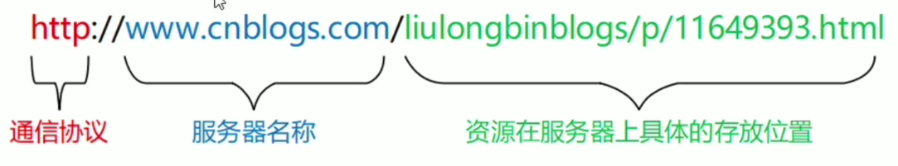
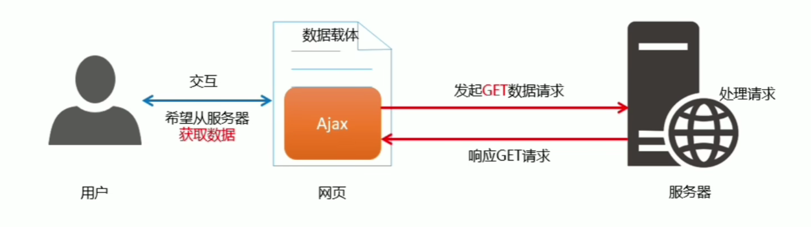
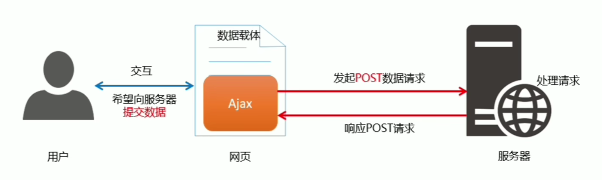
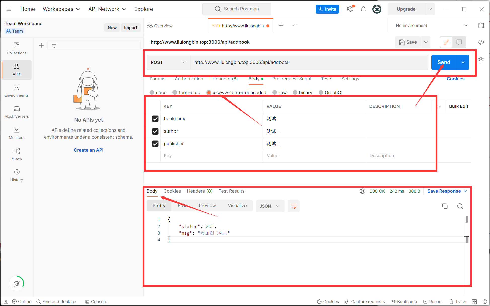

[TOC]


学习时间:2022年10月26日-~

# 1. 客户端与服务器

服务器:略

客户端:略

# 2. URL

## 2.1 URL的组成

**组成:**

- 客户端与服务器之间的**通信协议**
- 存有该资源的**服务器名称**
- 资源在服务器上**具体的存放位置**



# 3. 网页请求数据

## 3.1 如何请求数据

- 数据,也是服务器对外提供的一种资源.只要是资源,必然要通过**请求-处理–响应**的方式进行获取.


- 如果要在网页中请求服务器上的数据资源，则需要用到`XMLHttpRequest`对象.
- `XMLHttpReques`(简称`xhr`)是浏览器提供的`js`成员，通过它，可以请求服务器上的数据资源.

**语法:**

- `var xhrObj = new XMLHttpRequest()`

## 3.2 资源请求的方式

客户端请求服务器时,请求的方式有很多种,**最常见的两种请求方式**分别为`get`和 `post`请求.

- `get` 请求通常用于**获取服务端资源**(向服务器要资源)

- `post`请求通常用于**向服务器提交数据**(往服务器发送资源)

# 4. Ajax简介

`Ajax`的全称是`Asynchronous Javascript And XML`(异步`JavaScript`和`XML`).
通俗的理解:在网页中利用`XMLHttpRequest`对象和**服务器进行数据交互**的方式,就是`Ajax`.

## 4.1 jQuery中的Ajax

浏览器中提供的`XMLHttpRequest`用法比较复杂，所以`jQuery`对`XMLHttpRequest`进行了封装，提供了系列`Ajax`相关的函数，极大地降低了`Ajax`的使用难度.

`jQuery`中发起`Ajax`请求的三个方式:

- `$.get()`
- `$.post()`
- `$.ajax()`

### 4.1.1 $.get函数

`jQuery `中`$.get()`函数的功能单一,专门用来发起`get`请求,从而将服务器上的资源请求到客户端来进行使用.

**语法:**

- `$.get(url,[data],[callback])`

| 参数名   | 参数类型 | 是否必选 | 说明                     |
| -------- | -------- | -------- | ------------------------ |
| url      | string   | 是       | 要请求的资源地址         |
| data     | object   | 否       | 请求资源期间要携带的参数 |
| callback | function | 否       | 请求成功时的回调函数     |

**代码演示:**

```javascript
$.get('http://www.liulongbin.top:3006/api/getbooks',function(ret)){
    console.log(ret);
})
```

### 4.1.2 $.post函数

`jQuery`中 `$.post()`函数的功能单一，专门用来发起`post`请求，从而向服务器提交数据.

**语法:**

- `$.post(url,[data],[callback])`

**参数:**

| 参数名   | 参数类型 | 是否必选 | 说明                     |
| -------- | -------- | -------- | ------------------------ |
| url      | string   | 是       | 提交数据的地址           |
| data     | object   | 否       | 要提交的数据             |
| callback | function | 否       | 数据提交成功时的回调函数 |

**代码演示:**

```javascript
$(function () {
    var data={bookname:'b1',author:'a1',publisher:'p1'};
    $('#btn').on('click', function () {
        $.post('http://www.liulongbin.top:3006/api/addbook',data,function(err){
            if(err)return console.log('发送失败：'+err.msg);
            else console.log('发送成功');
        })
    })
})

```

### 4.1.3 $.ajax函数

相比于`$.get()`和`$.post()`函数，`jQuery `中提供的`$.ajax()`函数,是一个功能比较综合的函数,它允许我们对`Ajax`请求进行更详细的配置.

**语法:**

- `$.ajax({type:'',url:'',data:{},success:function(res){}})`

**参数:**

- **type:** 请求的方式，例如`GET`或`POST`
- **url:** 请求的`URL`地址
- **data:**这次请求要携带的数据
- **success:** 请求成功之后的回调函数

**代码演示:**

```javascript
$(function () {
    $('#btn').on('click',function(){
        $.ajax({
            type:'GET',
            url:'http://www.liulongbin.top:3006/api/getbooks',
            data:{id:1},
            success:function(res){
                console.log(res.msg);
            }
        })
    })
})
```

# 5. 接口

## 5.1 概念

使用`Ajax`请求数据时,被**请求的`URL`地址**,就叫做**数据接口**(简称接口).同时,每个接口必须有**请求方式**.

## 5.2 接口请求过程

### 5.2.1 通过GET方式请求

 

### 5.2.2 通过POST方式请求



### 5.2.3 接口测试工具

为了验证接口能否被正常被访问,我们常常需要使用接口测试工具,来对数据接口进行检测.

**好处:**

- 接口测试工具能让我们在不写任何代码的情况下,对接口进行**调用**和**测试**.

**工具:**

- **PostMan:**[https://www.postman.com/]:

### 5.2.4 使用PostMan测试GET接口



### 5.2.5 接口文档

**接口文档**

- 顾名思义就是**接口的说明文档，它是我们调用接口的依据**.好的接口文档包含了对**接口URL**，**参数**以及**输出内容**的说明，我们参照接口文档就能方便的知道接口的作用，以及接口如何进行调用.

**组成部分:**

- 接口文档可以包含很多信息，也可以按需进行精简，不过，一个合格的接口文档，应该包含**以下6项内容**，从而为接口的调用提供依据:

1. **接口名称:**用来标识各个接口的简单说明，如登录接口，获取图书列表接口等.
2. **接口URL:**接口的调用地址.
3. **调用方式:**接口的调用方式，如`GET`或`POST.`

4. **参数格式:**接口需要传递的参数，每个参数必须包含**参数名称**、**参数类型**、**是否必选**、**参数说明**这4项内容。
5. **响应格式:**接口的返回值的详细描述，一般包含**数据名称**、**数据类型**、**说明**3项内容.
6. 返回示例(可选)︰通过对象的形式，例举服务器返回数据的结构.

# 6. form 表单

## 6.1 概念

**表单:**

- 在网页中主要负责**数据采集功能**.`HTML`中的`<form>`标签，就是用于采集用户输入的信息，并通过`<form>`标签的提交操作，把采集到的信息提交到服务器端进行处理.

## 6.2 组成部分

**表单由三个基本部分组成:**

- 表单标签
- 表单域
- 表单按钮

**表单域:**

- 包含了文本框、密码框、隐藏域、多行文本框、复选框、单选框、下拉选择框和文件上传框等.

## 6.3 标签属性

`<form>标签用来采集数据，<form>标签的属性则是用来规定如何把采集到的数据发送到服务器.`

| 属性    | 值                                       | 描述                                     |
| ------- | ---------------------------------------- | ---------------------------------------- |
| action  | URL地址                                  | 规定当提交表单时，向何处发送表单数据     |
| method  | get或post                                | 现定以何种方式把表单数据提交到action URL |
| enctype | application/x-www-form-urlencoded        | 规定在发送表单数据之前如何对其进行编码   |
| target  | _blankself , _parent , _top , _framename | 规定在何处打开action URL                 |


#### 6.3.1 action

- `action`属性用来规定当提交表单时，**向何处发送表单数据**.

- `action`属性的值应该是后端提供的一个`URL`地址，这个`URL`地址专门负责接收表单提交过来的数据.

- 当`<form>`表单在未指定`action`属性值的情况下，`action`的**默认值**为当前页面的`URL`地址.

**注意:**

- 当提交表单后，页面会立即跳转到`action`属性指定的`URL`地址.

#### 6.3.2 target

`target`属性用来规定在何处打开`action URL`.

它的可选值有5个.

**默认情况下**，`target`的值是`_self`，表示在相同的框架中打开`action URL`.

| 值        | 描述                         |
| --------- | ---------------------------- |
| _blank    | 在新窗口中打开。             |
| _self     | 默认。在相同的框架打开。     |
| _parent   | 在父框架集中打开。(很少用)   |
| _top      | 在整个窗口中打开。(很少用)   |
| framename | 在指定的框架中打开。(很少用) |


#### 6.3.3 method

`method`属性用来规定**以何种方式**把表单数据提交到`action URL`.

它的可选值有两个，分别是`get`和`post`.

**默认情况下**，`method`的值为`get`，表示通过`URL`地址的形式，把表单数据提交到`action URL`.

**注意:**

- `get`方式适合用来提交少量的、简单的数据.

- `post`方式适合用来提交**大量的**、**复杂的**、或包含**文件上传**的数据.

- 在实际开发中，`<form>`表单的`post `提交方式用的最多，很少用`get`.例如登录、注册、添加数据等表单操作，都需要使用`post`方式来提交表单.

#### 6.3.4 enctype

`enctype`属性用来规定在**发送表单数据之前如何对数据进行编码**.

它的可选值有三个

**默认情况下**，`enctype`的值为 `application/x-www-form-urlencoded`，表示在发送前编码所有的字符.

| 值                                | 描述                                                         |
| --------------------------------- | ------------------------------------------------------------ |
| application/x-www-form-urlencoded | 在发送前编码所有字符(默认)                                   |
| multipart/form-data               | 不对字符编码。在使用包含文件上传控件的表单时，必须使用该值。 |
| text/plain                        | 空格转换为“+”加号，但不对特殊字符编码。(很少用)              |

**注意:**

- 在涉及到`文件上传`的操作时，必须将`enctype`的值设置为`multipart/form-data`
- 如果表单的提交不涉及到文件上传操作，则直接将`enctype`的值设置为`application/x-www-form-urlencoded`即可!

### 6.4 表单的同步提交

#### 6.4.1 概念

通过点击`submit`按钮，触发表单提交的操作，从而使页面跳转到`action URL`的行为，叫做**表单的同步提交**.

#### 6.4.2 缺点和解决方案

1. `<form>`表单同步提交后，整个页面会发生跳转，跳转到`action URL`所指向的地址，用户体验很差.

2. `<form>`表单同步提交后，页面之前的状态和数据会丢失.

**解决方案:**

- 表单只负责采集数据，`Ajax`负责将数据提交到服务器.

### 6.5 通过Ajax提交表单数据

#### 6.5.1 监听表单提交事件

**代码演示:**

```javascript
//方法1
$('#form1').submit (function (e) {
	alert ('监听到了表单的提交事件')
})
//方法2
$ ('#form1').on ('submit',function (e) {
	alert('监听到了表单的提交事件')
})
```

#### 6.5.2 阻止表单默认提交行为

**代码演示:**

```javascript
//方法1
$( '#form1').submit(function(e){
	//阻止表单的提交和页面的跳转
    e.preventDefault();
})
//方法2
$ ('#form1').on('submit',function(e){
	//阻止表单的提交和页面的跳转
	e.preventDefault();
})
```

#### 6.5.3 快速获得表单中的数据

##### 6.5.3.1 serialize函数

**语法:**

- `$(selector).serialize()`

**好处:**

- 可以一次性获取表单所有数据

**代码演示:**

```html
<form id="form1">
    <input type="text" name="username"/>
    <input type="text" name="password"/>
    <button type="submit">提交</button>
</form>
<script>
    $(function(){
        $('button').on('click',function(){
            console.log($('#form1').serialize());
        })
    })
</script>
```

**注意:**

- 在使用`serialize()`函数快速获取表单数据时，**必须为每个表单元素添加`name` 属性!**

# 7. 模板引擎

## 7.1 概念

**模板引擎:**

- 顾名思义,它可以根据程序员指定的**模板结构**和**数据**,自动生成一个完整的HTML页面.

**好处:**

1. 减少了字符串的拼接操作
2. 使代码结构更清晰
3. 使代码更易于阅读与维护

## 7.2 art-template模板引擎

`art-template`是一个简约、超快的模板引擎.

**中文官网:**

- [http://aui.github.io/art-template/zh-cn/index.html]:

### 7.2.1 使用步骤

1. 导入`art-template`
2. 定义数据
3. 定义模板
4. 调用`template`函数

**代码演示:**

```html
<div class="container"></div>
<script type=text/html id="tpl-user">
    <h1>{{name}}</h1>
    <h2>{{age}}</h2>
</script>
<script>
    var data = {
        name:'zs',
        age:18,
    };
    var htmlstr = template('tpl-user',data);
    console.log(htmlstr);
    document.querySelector('.container').innerHTML = htmlstr;
</script>
```

### 7.2.2 标准语法

- `art-template`提供了`{{}}`这种语法格式，这种`{{}}`语法在`art-template`中被称为**标准语法**.

- 在`{{}}`语法中，可以进行**变量的输出**、**对象属性的输出**、**三元表达式输出**、**逻辑或输出**、**加减乘除等表达式**输出。

#### 7.2.2.1 原文输出

**语法:**

- `{{@ value}}`

- 如果要输出的`value`值中，包含了`HTML`标签结构，则需要使用原文输出语法，才能保证`HTML`标签被正常渲染.

#### 7.2.2.2 条件输出

**语法:**

```
{{if value}}按需输出的内容{{/if}}
{if v1}}按需输出的内容{{else if v2}}按需输出的内容{{/if}}
```

- 如果要实现条件输出，则可以在`{{}}`中使用`if ... else if ... /if`的方式，进行按需输出.

#### 7.2.2.3 循环输出

**语法:**

```
{{each arr}}
	{{$index}}{{$value}}
{{/each}}
```

- 如果要实现循环输出，则可以在`{{}}`内，通过`each`语法循环数组，当前循环的索引使用`$index`进行访问，当前的循环项使用`$value`进行访问.

#### 7.2.2.4 过滤器

**语法:**

- `{{value | filterName}}`

过滤器语法类似**管道操作符**，它的上一个输出作为下一个输入.

**定义语法:**

- `template.defaults.imports.filterName = function(value) { /*return处理的结果*/}`

## 7.3. 正则表达式

### 7.3.1 正则与字符串操作

`exec()`函数用于检索宁符串中的正则表达式的匹配

如果字符串中有匹配的值，**则返回该匹配值**，否则返回`null`

**语法:**

- `RegExpobject.exec (string)`


# 8. XMLHttpRequest

## 8.1 概念

`XMLHttpRequest(简称xhr)`是浏览器提供的`Javascript`对象，通过它，可以请求服务器上的数据资源.

## 8.2 使用

**代码演示:**

```javascript
var xhr = new XMLHttpRequest();
xhr.open('GET','http://www.liulongbin.top:3006/api/getbooks');
xhr.send();
xhr.onreadystatechange = function(){
    //readyState 表示当前请求状态，其中4表示DONE，表示请求已完成。
    //state 属性表示请求码，200表示请求成功
    if(xhr.readyState === 4 && xhr.status === 200){
        console.log(xhr.responseText);
    }
}
```

## 8.3 xhr对象的readyState属性

`XMLHttpRequest`对象的`readyState`属性，用来表示**当前`Ajax`请求所处的状态**。每个 `Ajax`请求必然处于以下状态中的一个:

| 值   | 状态             | 描述                                               |
| ---- | ---------------- | -------------------------------------------------- |
| 0    | UNSENT           | XMLHttpRequest对象已被创建，但尚未调用open方法。   |
| 1    | OPENED           | open()方法已经被调用。                             |
| 2    | HEADERS_RECEIVED | send()方法已经被调用，响应头也已经被接收。         |
| 3    | LOADING          | 数据接收中，此时response属性中已经包含部分数据。   |
| 4    | DONE             | Ajax请求完成，这意味着数据传输已经彻底完成或失败。 |

## 8.4 使用xhr发起带参数的GET请求

使用`xhr`对象发起带参数的`GET`请求时，只需在调用`xhr.open`期间，为`URL`地址指定参数即可;

- `xhr.open('GET','http://www.liulongbin.top:3006/api/getbooks?id=1 ')`

这种在URL地址后面拼接的参数，叫做**查询字符串**.

## 8.5 查询字符串

### 8.5.1 概念

**定义:**

- 查询字符串(`UR`L参数）是指在`URL`的末尾加上用于向服务器发送信息的字符串(变量).

**格式:**

- 将英文的`?`放在URL的末尾，然后再加上**参数=值**，想加上多个参数的话，使用`&`符号进行分隔。以这个形式，可以将想要发送给服务器的数据添加到`URL`中.

**代码演示:**

```javascript
//不带参数的URL地址
http://www.liulongbin.top:3006/api/getbooks
//带一个参数的URL地址
http://www.liulongbin.top:3006/api/getbooks?id=1
//带两个参数的URL地址
http://www.liulongbin.top:3006/api/getbooks?id=1&bookname=西游记
```

## 8.6 URL编码和解码

### 8.6.1 概念

URL地址中，只允许出现英文相关的字母、标点符号、数字，因此，在URL地址中不允许出现中文字符.

如果URL中需要包含中文这样的字符，则必须对中文字符进行**编码(转义)**.

**URL编码的原则:**使用安全的字符（没有特殊用途或者特殊意义的可打印字符）去表示那些不安全的字符

URL编码原则的通俗理解:**使用英文字符去表示非英文字符**.

**代码演示:**

```javascript
http://www.liulongbin.top:3006/api/getbooks?id=1&bookname=西游记

//经过URL编码之后，URL地址变成了如下格式:

http://ww.liulongbin.top:3006/api/getbooks?id=1&bookname=%E8%A5%BF%B6%B8%B8%E8%AE%B0
```

### 8.6.2 如何对URL进行编码和解码

浏览器提供了`URL`编码与解码的`API`，分别是:

- `encodeURI()编码的函数`
- `decodeURI()解码的函数`

## 8.7 使用xhr发起POST请求

**步骤:**

1. 创建`xhr`对象
2. 调用`xhr.open()`函数
3. 设置`Content-Type`属性(固定写法)
4. 调用`xhr.send()`函数，同时指定要发送的数据
5. 监听`xhr.onreadystatechange` 事件

**代码演示:**

```javascript
// 1．创建xhr对象
var xhr = new XMLHttpRequest()

//2．调用open函数
xhr.open('POST','http://www.liulongbin.top:3006/api/addbook")

//3．设置Content-Type属性
xhr.setRequestHeader('content-Type','application/x-www-form-urlencoded')

//4调用send函数
xhr.send('bookname=水浒传&author=施耐庵&publisher=上海图书出版社')

//5监听事件
xhr. onreadystatechange = function(){
	if (xhr.readystate == 4 88 xhr.status === 200){
   		 console.log(xhr.responseText)
}
```

# 9. 数据交换格式

## 9.1 概念

数据交换格式，就是**服务器端**与**客户端**之间进行**数据传输与交换的格式**.

前端领域,经常提及的两种数据交换格式分别是`XML`和`JSON`.

## 9.2 XML

`XML`的英文全称是`EXtensible Markup Language`，即可扩展标记语言.因此，`XML`和`HTML`类似，也是一种标记语言.

### 9.2.1 XML的缺点

1. XML格式臃肿，和数据无关的代码多，体积大，传输效率低

2. 在Javascript中解析XML比较麻烦

## 9.3 JSON

### 9.3.1 概念

`JSON` 的英文全称是`JavaScript Object Notation`，即`JavaScript`对象表示法.简单来讲，**`JSON`就是`Javascript`对象和数组的字符串表示法**，它使用文本表示一个`JS`对象或数组的信息.

**JSON的本质是字符串.**

**作用:**

`JSON`是一种**轻量级的文本数据交换格式**，在作用上类似于`XML`，专门用于存储和传输数据，但是`JSON`比`XML`更小、更快、更易解析.

**现状:**

JSON是在2001年开始被推广和使用的数据格式，到现今为止，**JSON已经成为了主流的数据交换格式.**

### 9.3.2 结构

`JSON`就是用字符串来表示`Javascript`的对象和数组。所以，`JSON` 中包含**对象**和**数组**两种结构，通过这两种结构的相互嵌套，可以表示各种复杂的数据结构.

**对象结构:**

- 对象结构在`JSON` 中表示为`{}`括起来的内容.数据结构为`{key: value, key: value, .... }`的键值对结构。其中，`key`必须是使用**英文的双引号包裹的字符串**，`value` 的数据类型可以是`数字、字符串、布尔值、null、数组、对象`6种类型.

**数组结构:**

- 数组结构在`JSON` 中表示为`[]`括起来的内容。数据结构为`["java" , "javascript" ,30, true ... ] `.数组中数据的类型可以是`数字、宁符串、布尔值、null、数组、对象`6种类型.

**注意:**

1. 属性名必须使用双引号包裹
2. 字符串类型的值必须使用双引号包裹
3. `JSON`中不允许使用单引号表示字符串
4. `JSON`中不能写注释
5. `JSON`的最外层必须是对象或数组格式
6. 不能使用`undefined` 或函数作为`JSON`的值

### 9.3.3 JSON和JS对象的互换

**JSON向JS对象转换:**

- 要实现从`JSON`字符串转换为`JS`对象，使用`JSON.parse()`方法:

```javascript
var obj = JSON.parse ('{"a" : "Hello","b":"world"}')

//结果是{a: 'Hello', b: 'world' }
```

**JS对象向JSON转换:**

- 要实现从`JS`对象转换为`JSON`字符串，使用`JSON.stringify()`方法:

```javascript
var json = JsON.stringify({a: 'Hello'，b: 'world' })

//结果是'{ "a" : "Hello"，"b": "world" } '
```

### 9.3.4 序列化和反序列化

把**数据对象转换为字符串**的过程，叫做**序列化**，例如:调用`JSON.stringify()`函数的操作，叫做**JSON序列化**.

把**字符串转换为数据对象**的过程，叫做**反序列化**，例如:调用`JSON.parse()`函数的操作，叫做**JSON反序列化**.

# 10. 封装Ajax函数

## 10.1 定义options参数选项

`_ajax()`函数是我们自定义的`Ajax`函数，它接收一个配置对象作为参数，配置对象中可以配置如下属性:

- **method**请求的类型
- **url**请求的URL地址
- **data**请求携带的数据
- **success**请求成功之后的回调函数

## 10.2 处理data参数

需要把`data`对象，转化成查询字符串的格式，从而提交给服务器，因此提前定义`resolveData`函数如下:

```javascript
╱**
*处理data参数
*@param {data}需要发送到服务器的数据
*@returns{string}返回拼接好的查询字符串name=zs&age=10
*/
function resolveData (data){
    var arr = []
	for (let k in data) {
		arr.push (k + '=' + data[k])
    }
	return arr.join ('&')
}
```

## 10.3 定义_ajax函数

在`_ajax()`函数中，需要创建`xhr`对象，并监听`onreadystatechange`事件:

```javascript
function _ajax (options) {
	var xhr = new xMLHttpRequest ()
    //拼接查询字符串
	var qs = resolveData (options.data)
	//监听请求状态改变的事件
	xhr.onreadystatechange = function(){
		if (xhr.readystate === 4 && xhr.status ===200){
		var result = JSON . parse(xhr.responseText)
		options.success(result)
        }
    }
}
```

## 10.4 判断请求的类型

不同的请求类型，对应xhr对象的不同操作，因此需要对请求类型进行`if ... else ...`的判断:

```javascript
if(options.method.toUpperCase() ==='GET' ){
	//发起GET请求
	xhr.open(options.method,options.url + '?' + qs)
    xhr.send ()
} else if (options.method.toUpperCase() ==='POST'){
    //发起POST请求
	xhr.open(options.method,options.url)
	xhr.setRequestHeader ('Content-Type ','application/x-www-form-urlencoded')
    xhr.send(qs)
}
```

# 11. XMLHttpRequest Level2

## 11.1 旧版XMLHttpRequest的缺点

1. 只支持文本数据的传输，无法用来读取和上传文件
2. 传送和接收数据时，没有进度信息，只能提示有没有完成

## 11.2 XMLHttpRequest Level2的新功能

1. 可以设置`HTTP`请求的时限
2. 可以使用`FormData`对象管理表单数据
3. 可以上传文件
4. 可以获得数据传输的进度信息

## 11.3 设置HTTP请求时限

新版本的`XMLHttpRequest`对象，增加了`timeout`属性，可以设置`HTTP`请求的时限:

- `xhr.timeout = 3000`

上面的语句，将最长等待时间设为3000毫秒。过了这个时限，就自动停止`HTTP`请求.与之配套的还有一个`timeout`事件，用来指定回调函数:

```javascript
xhr.ontimeout = function(event){
	alert('请求超时!')
)
```

## 11.4 FormData对象管理表单数据

`Ajax`操作往往用来提交表单数据。为了方便表单处理，`HTML5`新增了一个`FormData`对象，可以模拟表单操作:

```javascript
// 1.新建FormData对象
var fd = new FormData()
//2.为FormData漆加表单项
fd.append('uname','zs')
fd.append ('upwd', '123456')
//3．创建XHR对象
var xhr = new XMLHttpRequest ()
//4．指定请求类型与URL地址
xhr.open('PoST','http:// www.liulongbin.top:3006/api/formdata')
//5.直接提交FormData对象，这与提交网页表单的效果，完全一样
xhr.send(fd)
```


