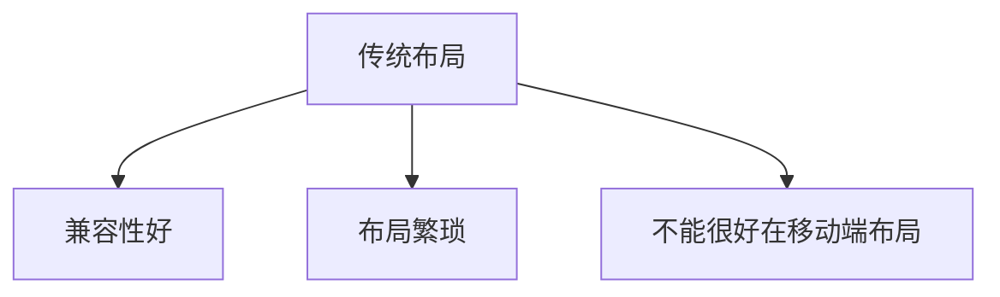
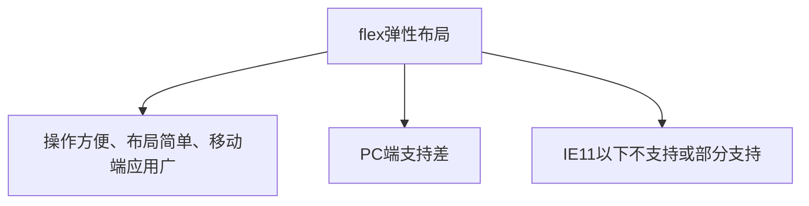
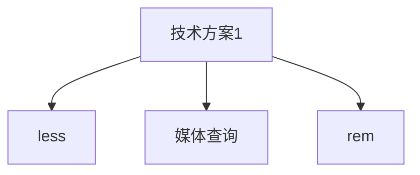
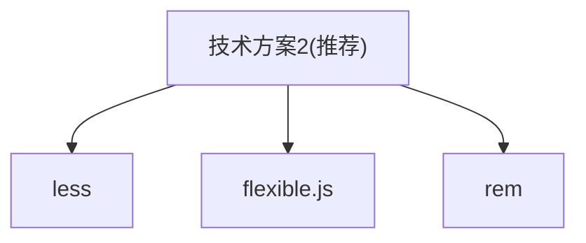

[TOC]

# 一. CSS

## 1. 简介

- CSS是**层叠样式表**`(Cascading Style Sheets )`的简称.
  有时我们也会称之为**CSS样式表**或**级联样式表**。

- CSS是也是一种**标记语言**

- CSS主要用于设置HTML页面中的**文本内容**（字体、大小、对齐方式等)、**图片的外形**(宽高、边框样式边距等）以及**版面的布局和外观显示样式**。

### 1.1 语法规范

CSS 规则由两个主要的部分构成

- 选择器
- 一条或多条声明

```css
h1{
    color:red;
    font-size: 24px;
}
```

1. **选择器**是用于指定CSS样式的HTML标签，花括号内是对该对象设置的具体样式
2. 属性和属性值以“**键值对**”的形式出现
3. 属性是对指定的对象设置的样式属性，例如字体大小、文本颜色等
4. 属性和属性值之间用英文`:`分开
5. 多个“**键值对**”之间用英文`;`进行区分

### 1.2 代码风格

1. 样式格式书写
2. 样式大小写风格
3. 样式空格风格

#### 1.2.1 样式格式风格

1. 紧凑格式

```css
h3{ color: deeppink; font-size: 20px; }
```

2. 展开格式

```css
h3 {
    color: pink;
    fontsize: 20px;
}
```

**推荐展开式风格**

#### 1.2.2 样式大小写风格

```css
h3 {
    color: pink;
}
```

```css
H3 {
    COLOR: PINK;
}
```

**推荐使用小写字母**，特殊情况除外。

#### 1.2.3 样式空格风格

```css
h3 {
    color: pink;
}
```

1. 属性值前面，冒号后面，保留一个空格
2. 选择器（标签)和大括号中间保留空格

#### 1.2.4 CSS属性书写顺序

**建议遵循以下顺序:**

1. 布局定位属性: display / position / float / clear / visibility / overflow(建议display第一个写，毕竟关系到模式)
2. 自身属性: width / height / margin / padding / border / background
3. 文本属性: color / font / text-decoration / text-align / vertical-align / white-space / break-word
4. 其他属性(CSS3) : content / cursor / border-radius / box-shadow/ text-shadow / background:linear-gradcient..

```css
.jdc {
    display: block;
    position : relative;
    float: left;
    width: 100px;
    height : 100px;
    margin: 0 10px;
    padding: 20px 0;
    font-family: Arial,'Helvetica Neue',Helvetica,sans-serif;
    color: #333;
    background: rgba (0,0,0,.5);
    border-radius: 10px;
}
```

### 1.3 CSS引入方式

按照CSS样式书写的位置（或者引入的方式)，CSS样式表可以分为三大类:

1. 行内样式表(行内式)
2. 内部样式表(嵌入式)
3. 外部样式表(链接式)

#### 1.3.1 内部样式表

- `<style>`标签理论上可以放在HTML文档的任何地方，但一般会放在文档的`<head>`标签中
- 通过此种方式，可以方便控制当前整个页面中的元素样式设置
- 代码结构清晰，但是并没有实现结构与样式完全分离
- 使用内部样式表设定CSS，通常也被称为**嵌入式引入**

#### 1.3.2 行内样式表

行内样式表（内联样式表）是在**元素标签内部的style属性中设定CSS样式**。适合于修改简单样式.

```xml
<div style="color: red; font-size: 12px;">青春不常在，抓紧谈恋爱</div>
```

- style其实就是标签的属性
- 在双引号中间，写法要符合CSS规范
- 可以控制当前的标签设置样式
- 只有对当前元素添加简单样式的时候，可以考虑使用

#### 1.3.3 外部样式表

样式单独写到CSS文件中，之后把CSS文件引入到HTML页面中使用.

1. 新建一个后缀名为`.css`的样式文件，把所有CSS代码都放入此文件中

2. 在HTML页面中，使用`<link>`标签引入这个文件。

```css
<link rel="stylesheet" href="css文件路径">
```

| 属性   | 作用                                                       |
| ---- | -------------------------------------------------------- |
| rel  | 定义当前文档与被链接文档之间的关系，在这里需要指定为"stylesheet"，表示被链接的文档是一个样式表文件。 |
| href | 定义所链接外部样式表文件的URL，可以是相对路径，也可以是绝对路径。                       |

使用外部样式表设定CSS，通常也被称为**外链式**或**链接式引入**，这种方式是开发中常用的方式


## 2. 选择器

**选择器分类:**

- 基础选择器
- 复合选择器

**基础选择器式由单个选择器组成的,包括以下选择器:**

- 标签选择器
- 类选择器
- id选择器
- 通配符选择器

### 2.1 基础选择器

#### 2.1.1 标签选择器

**标签选择器**（元素选择器）是指用**HTML标签名称**作为选择器，按标签名称分类，为页面中某一类标签指定统一的CSS样式。

```css
h1{
    color: red;
    font-size: 24px;
}
```

#### 2.1.2 类选择器

如果想要差异化选择不同的标签，单独选一个或者某几个标签，可以使用**类选择器**。

**在标签中使用`class`属性标注标签**

```xml
<div class="box"></div>
```

**在css样式表中使用类选择器语法单独选择类标签**

```css
.类名{
    属性1: 属性值1;
}
```

##### 2.1.2.1 多类名

我们可以给一个标签指定**多个类名**，从而达到更多的选择目的。这些类名都可以选出这个标签.

**多个类名中间使用空格分开**

1. 多类名使用方式

```xml
<div class="red font20"></div>
```

#### 2.1.3 id选择器

HTML元素以**id属性**来设置id选择器，CSS中id选择器以“#"来定义。

```css
#id名{
    属性1: 属性值1;
}
```

**注意:id属性只能在每个HTML文档中出现一次**

#### 2.1.4 类选择器和id选择器的区别

类选择器可重复使用,id选择器只能在HTML中出现一次

#### 2.1.5 通配符选择器

在CSS中，通配符选择器使用`*`定义，它表示**选取页面中所有元素**（标签)。

```css
*{
    属性1: 属性值1;
}
```

### 2.2 复合选择器

#### 2.2.1 后代选择器

**后代选择器**又称为**包含选择器**

**语法**:

```css
父元素1 子元素2{样式声明}
```

#### 2.2.2 子元素选择器

**子元素选择器（子选择器）**只能选择作为**某元素的最近一级子元素**

**语法:**

```css
父元素1>子元素2{样式声明}
```

上述语法表示**选择元素1里面的所有直接后代(子元素)元素2**

#### 2.2.3 并集选择器

**并集选择器可以选择多组标签,同时为他们定义相同的样式**,通常用于集体声明.

**并集选择器**是各选择器通过**英文逗号(`,`)连接而成**，任何形式的选择器都可以作为并集选择器的一部分

```css
元素1,
元素2{
    color: red;
}
```

#### 2.2.4 伪类选择器

**伪类选择器**用于向某些选择器添加特殊的效果，比如给链接添加特殊效果，或选择第1个，第n个元素

伪类选择器使用冒号(`:`)表示，比如:`hover 、:first-child`

**链接伪类选择器**

```css
a : link    /*选择所有未被访问的链接*/
a : visited    /*选择所有已被访问的链接*/
a : hover    /*选择鼠标指针位于其上的链接*/
a : active    /*选择活动链接（鼠标按下未弹起的链接）*/
```

**注意**

1. 为了确保生效，请按照**LVHA**的循顺序声明:`link - :visited - :hover - :active`

**:focus伪类选择器**

:focus伪类选择器用于**选取获得焦点的表单元素**

```css
input:fucus{
    background-color: red;
}
```

## 3. 字体

`CSS Fonts`(字体)属性用于定义字体系列、大小、粗细、和文字样式(如斜体)。

### 3.1 字体系列

`CSS`使用`font-family`属性定义文本的字体系列。

```css
p { font-family:"微软雅黑"; }
div {font-family: Arial, "Microsoft rahei"，"微软雅黑";}
```

- 各种字体之间必须使用英文状态下的逗号隔开
- 般情况下,如果有空格隔开的多个单词组成的字体,加引号.
- 尽量使用系统默认自带字体，保证在任何用户的浏览器中都能正确显示
- 最常见的几个字体: `body {font-family. 'Microsoft YaHei',tahoma,arial,'Hiragino Sans GB';}`

### 3.2 字体大小

CSS使用`font-size`属性定义字体大小。

```css
p {
    font-size: 20px;
}
```

- px(像素)大小是我们网页的最常用的单位
- 谷歌浏览器默认的文字大小为16px
- 不同浏览器可能默认显示的字号大小不一致，我们尽量给一个明确值大小，不要默认大小
- 可以给`body`指定整个页面文字的大小

### 3.3 字体粗细

CSS使用`font-weight`属性设置文本字体的粗细。

```css
p{
    font-size: bold;
}
```

| 属性值     | 描述                                   |
| ------- | ------------------------------------ |
| normal  | 默认值(不加粗的)                            |
| bold    | 定义粗体(加粗的)                            |
| 100~900 | 400等同于normal，而700等同于bold注意这个数字后面不跟单位 |

### 3.4 文字样式

CSS使用`font-style`属性设置文本的风格。

```css
p{
    font-style: normal;
}
```

| 属性值    | 作用                                    |
| ------ | ------------------------------------- |
| normal | 默认值，浏览器会显示标准的字体样式 font-style: normal; |
| italic | 浏览器会显示斜体的字体样式。                        |

### 3.5 字体复合属性

使用`font`属性把文字属性综合写,**节约代码**

```css
body{
    font:font-style font-weight font-size/line-height font-family;
}
```

- 使用`font`属性时，必须按上面语法格式中的顺序书写，不能更换顺序，并且各个属性间以空格隔开
- 不需要设置的属性可以省略（取默认值)，但**必须保留`font-size`和`font-family`属性，否则font属性将不起作用**

## 4. 文本属性

### 4.1 文本颜色

`color`属性用于定义文本的颜色

```css
div{
    color: red;
}
```

| 表示方式    | 属性值                          |
| ------- | ---------------------------- |
| 预定义的颜色值 | red, green，blue              |
| 十六进制    | #FF0000，#FF6600，#29D794      |
| RGB代码   | rgb(255,0,0)或rgb(100%,0%,0%) |

### 4.2 对齐文本

` text-align`属性用于设置元素内文本内容的水平对齐方式

```css
div{
    text-align: center;
}
```

| 属性值    | 解释       |
| ------ | -------- |
| left   | 左对齐（默认值) |
| right  | 右对齐      |
| center | 居中对齐     |

### 4.3 装饰文本

`text-decoration`属性规定添加到文本的修饰。可以给文本添加下划线、删除线、上划线等。

| 属性值          | 描述               |
| ------------ | ---------------- |
| none         | 默认。没有装饰线(最常用)    |
| underline    | 下划线。链接a自带下划线（常用) |
| overline     | 上划线。(几乎不用)       |
| line-through | 删除线。(不常用)        |

### 4.4 文本缩进

`text-indent`属性用来指定文本的第一行的缩进，通常是将**段落的首行缩进**

```css
div{
    text-indent: 10px;
}
```

通过设置该属性，所有元素的第一行都可以缩进一个给定的长度，甚至该长度可以是负值

```css
p {
    text-indent : 2em;
}
```

**em是一个相对单位**，就是当前元素( font-size)**1个文字的大小**,**如果当前元素没有设置大小，则会按照父元素的1个文字大小**。

### 4.5 行间距

`line-height`属性用于设置行间的距离(行高)。可以控制文字行与行之间的距离.

```css
p{
    line-height: 26px;
}
```

## 5. Emmet 语法

`Emmet`语法的前身是Zencoding,**它使用缩写,来提高html/css的编写速度**, Vscode内部已经集成该语法.

1. 快速生成HTML结构语法
2. 快速生成CSS样式语法

### 5.1 快速生成HTML结构语法

1. 生成标签直接输入标签名按tab键即可比如`div`然后tab键，就可以生成`<div></div>`
2. 如果想要生成多个相同标签加上`*`就可以了比如`div*3`就可以快速生成3个div
3. 如果有父子级关系的标签，可以用>比如`ul > li`就可以了
4. 如果有兄弟关系的标签，用`＋`就可以了比如`div+p`
5. 如果生成带有类名或者`id`名字的，直接写`.demo`或者`#two` tab键就可以了
6. 如果生成的`div`类名是有顺序的，可以用自增符号`$`
7. 如果想要在生成的标签内部写内容可以用`{}`表示

### 5.2 快速生成CSS样式

CSS**基本采取简写形式**即可.

1. 比如`w200`按tab 可以生成`width: 200px;`
2. 比如`lh26`按tab 可以生成`line-height: 26px;`

### 5.3 快速格式化代码

`Vscode`快速格式化代码:`shift+alt+f`

## 6. 元素显示模式

- 元素显示模式就是**元素（标签)以什么方式进行显示**，比如`<div>`自己占一行，比如一行可以放多个`<span>`。
- HTML元素一般分为**块元素**和**行内元素**两种类型。

### 6.1 块元素

常见的块元素有`<h1>~<h6>、<p>、<div>、<ul>、<ol>、<li>`等，其中`<div>`标签是**最典型的块元素**

**特点:**

- 自己独占一行
- 高度，宽度、外边距以及内边距都可以控制
- 宽度默认是容器(父级宽度)的100%
- 是一个容器及盒子，里面可以放行内或者块级元素。

**注意:**

- 文字类的元素内不能使用块级元素
- `<p>`标签主要用于存放文字，因此`<p>`里面不能放块级元素，特别是不能放`<div>`
- 同理，`<h1>~<h6>`等都是文字类块级标签，里面也不能放其他块级元素

### 6.2 行内元素

常见的行内元素有`<a>、<strong>、<b>、<em>、ci>、<del>、<s>、<ins>、<u>、<span>`等，其中`<span>`标签是**最典型的行内元素**。有的地方也将行内元素称为**内联元素**

**特点:**

- 相邻行内元素在一行上，一行可以显示多个
- 高、宽直接设置是无效的
- 默认宽度就是它本身内容的宽度
- 行内元素只能容纳文本或其他行内元素

**注意:**

- 链接里面不能再放链接
- 特殊情况链接`<a>`里面可以放块级元素，但是给`<a>`转换一下块级模式最安全

### 6.3 行内块元素

在行内元素中有几个特殊的标签——`、<input />、<td>`，它们同时**具有块元素和行内元素的特点**。有些资料称它们为**行内块元素**。

**特点:**

- 和相邻行内元素(行内块)在一行上，但是他们之间会有空白缝隙。一行可以显示多个(行内元素特点)。
- 默认宽度就是它本身内容的宽度(行内元素特点)。
- 高度，行高、外边距以及内边距都可以控制(块级元素特点)。

### 6.4 元素显示模式的转换

- 转换为块元素：`display :block`
- 转换为行内元素:`display: inline`
- 转换为行内块元素:`display: inline-block`

### 6.5 单行文字垂直居中方法

让文字的**行高等于盒子的高度**就可以让文字在当前盒子内垂直居中

## 7. 背景

通过CSS背景属性，可以给页面元素添加背景样式。
背景属性可以设置**背景颜色**、**背景图片**、**背景平铺**、**背景图片位置**、**背景图像固定**等。

### 7.1 背景颜色

`background-color`属性定义了元素的背景颜色

```
background-color: 颜色值;
```

般情况下元素背景颜色默认值是`transparent`(透明），我们也可以手动指定背景颜色为透明色。

### 7.2 背景图片

```
background-image: none|url(url);
```

| 参数值  | 作用              |
| ---- | --------------- |
| none | 无背景图(默认的)       |
| url  | 使用绝对或相对地址指定背景图像 |

### 7.3 背景平铺

如果需要在HTML页面上对背景图像进行平铺，可以使用`background-repeat`属性。

```
background-repeat: repeat|no-repeat|repeat-x|repeat-y;
```

| 参数值       | 作用                 |
| --------- | ------------------ |
| repeat    | 背景图像在纵向和横向上平铺(默认的) |
| no-repeat | 背景图像不平铺            |
| repeat-x  | 背景图像在横向平铺          |
| repeat-y  | 背景图像在纵向平铺          |

### 7.4 背景图片位置

利用`background-position`属性可以改变图片在背景中的位置。

```
background-position : x y;
```

参数代表的意思是:x坐标和y坐标。可以使用**方位名词**或者**精确单位**

| 参数值      | 说明                                                         |
| -------- | ---------------------------------------------------------- |
| length   | 百分数│由浮点数字和单位标识符组成的长度值                                      |
| position | top \| center \| bottom  \|\|  left \| center \| right方位名词 |

#### 7.4.1 参数是方位名词

- 如果指定的两个值都是方位名词，则两个值前后顺序无关，比如`left top和top left`效果一致
- 如果只指定了一个方位名词，另一个值省略，则第二个值默认居中对齐

#### 7.4.2 参数是精确单位

- 如果参数值是精确坐标，那么第一个肯定是x坐标，第二个一定是y坐标
- 如果只指定一个数值，那该数值一定是x坐标，另一个默认垂直居中

#### 7.4.3 参数是混合单位

- 如果指定的两个值是精确单位和方位名词混合使用，则第一个值是x坐标，第二个值是y坐标

### 7.5 背景图像固定(背景附着)

`background-attachment`属性设置背景图像是否固定或者随着页面的其余部分滚动。

```
background-attachment : scroll | fixed;
```

| 参数     | 作用           |
| ------ | ------------ |
| scroll | 背景图像是随对象内容滚动 |
| fixed  | 背景图像固定       |

### 7.6 背景复合写法

为了简化背景属性的代码，我们可以将这些属性合并简写在同一个属性`background`中。从而节约代码量

**当使用简写属性时，没有特定的书写顺序,一般习惯约定顺序为:**

```
background: 背景颜色 背景图片地址 背景平铺 背景图像滚动 背景图片位置;
```

### 7.7 背景色半透明

```
background: rgba(0,0,0,0.3);
```

- 最后一个参数是alpha透明度，取值范围在0~1之间
- 我们习惯把0.3的0省略掉，写为`background:rgba(0,0,0,.3);`
- **注意:**背景半透明是指盒子背景半透明，盒子里面的内容不受影响
- **CSS3新增属性**，是IE9＋版本浏览器才支持的

### 7.8 背景缩放

`background-size`属性规定背景图像的尺寸

```css
background-size: 背景图片宽度 背景图片高度;
```

- **单位:** 长度|百分比| `cover`|`contain`;
- `cover`把背景图像扩展至足够大，以使背景图像完全**覆盖背景区域**
- `contain`把图像图像扩展至最大尺寸，以使其宽度和高度完全**适应内容区域**

### 7.9 背景渐变

#### 7.9.1 线性渐变`linear-gradient`

**语法:**

```css
div{
     background: linear-gradient(to right,
                    rgb(255, 255, 255) 0%,
                    rgb(255, 255, 255) 50%,
                    rgb(31, 176, 169) 50%,
                    rgb(31, 176, 169) 100%);
}
```

### 7.10 插入图片/视频的背景缩放和对齐方式

`object-fit`属性指定可替换元素(例如`或<video>`的内容应该如何适应到其使用高度和宽度确定的框)

```css
object-fit: contain;
object-fit: cover;
object-fit: fill;
object-fit: none;
object-fit: scale-down;
```

`object-position`规定了可替换元素的内容,在其内容框中的位置。

```css
object-position: center top;
object-position: 100px 50px;
```

## 8. CSS三大特性

CSS有三个非常重要的三个特性∶**层叠性**、**继承性**、**优先级**。

### 8.1 层叠性

**相同选择器给设置相同的样式**，此时一个样式就会**覆盖(层叠)**另一个冲突的样式。层叠性主要解决样式冲突的问题

**层叠性原则:**

- 样式冲突，遵循的原则是就近原则，哪个样式离结构近，就执行哪个样式
- 样式不冲突，不会层叠

### 8.2 继承性

CSS中的继承:**子标签会继承父标签的某些样式**，如文本颜色和字号。

- 子元素可以继承父元素的样式( `text-,font-,line-`这些元素开头的可以继承，以及color属性)

#### 8.2.1 行高的继承

```css
body{
    color: red;
    font: 12px/1.5 'Microsoft YaHei';
    /*子元素继承了父元素行高的1.5*/
    /*这个1.5是当前元素文字大小font-size的1.5倍*/
}
```

- 行高可以跟单位也可以不跟单位
- 如果子元素没有设置行高，则会继承父元素的行高为1.5
- 此时子元素的行高是:当前子元素的文字大小*1.5
- body行高1.5这样写法最大的优势就是里面子元素可以根据自己文字大小自动调整行高

### 8.3 优先级

- 选择器相同，则执行层叠性
- 选择器不同，则根据选择器权重执行

| 选择器           | 选择器权重   |
| ------------- | ------- |
| 继承或者*         | 0,0,0,0 |
| 元素选择器         | 0,0,0,1 |
| 类选择器，伪类选择器    | 0,0,1,0 |
| ID选择器         | 0,1,0,0 |
| 行内样式 style="" | 1,0,0,0 |
| !important重要的 | 无穷大     |

#### 8.3.1 优先级注意

1. 权重是有4组数字组成,但是不会有进位。
2. 可以理解为类选择器永远大于元素选择器, id选择器永远大于类选择器,以此类推..
3. 等级判断从左向右，如果某一位数值相同，则判断下一位数值。
4. 可以简单记忆法:通配符和继承权重为0,标签选择器为1,类(伪类)选择器为10, id选择器100,行内样式表为1000, !important无穷大.
5. **继承的权重是0**，如果该元素没有直接选中，不管父元素权重多高，子元素得到的权重都是0。

#### 8.3.2 权重叠加

**权重叠加∶**如果是复合选择器，则会有权重叠加，需要计算权重。

- div ul li     ------>  0.0,0,3
- .nav ul li   ------>  0,0,1,2
- a:hover    ---—>  0,0,1,1
- .nav a       ------>  0,0,1,1

## 9. CSS盒子模型

### 9.1 组成

CSS盒子模型本质上是一个盒子，封装周围的HTML元素，它包括:**边框(border)**、**外边距(margin)**、**内边距(padding)**、和**实际内容(content)**

### 9.2 边框(`border`)

border可以设置元素的边框。边框有三部分组成:边框宽度(粗细)边框样式边框颜色

```css
border: border-width || border-style || border-color;
```

| 属性           | 作用           |
| ------------ | ------------ |
| border-width | 定义边框粗细，单位是px |
| border-style | 边框的样式        |
| border-color | 边框颜色         |

**边框样式:**

| 属性值    | 描述                                   |
| ------ | ------------------------------------ |
| dotted | 定义点线边框                               |
| dashed | 定义虚线边框                               |
| solid  | 定义实线边框                               |
| double | 定义双边框                                |
| groove | 定义 3D 坡口边框。效果取决于 border-color 值      |
| ridge  | 定义 3D 脊线边框。效果取决于 border-color 值      |
| inset  | 定义 3D inset 边框。效果取决于 border-color 值  |
| outset | 定义 3D outset 边框。效果取决于 border-color 值 |
| none   | 定义无边框                                |
| hidden | hidden                               |

**简写:**

```css
borer: 1px solid red; 没有顺序
```

**边框分开写:**

```
border-top: 1px solid red; 上边框
```

**表格的细线边框:**

`border-collapse`属性控制浏览器绘制表格边框的方式。它控制相邻单元格的边框。

```css
border-collapse: collapse;
```

- collapse单词是合并的意思
- border-collapse:  collapse;表示相邻边框合并在一起

**注意:边框会额外增加盒子的实际大小**

### 9.3 内边距(`padding`)

`padding`属性用于设置内边距，即边框与内容之间的距离。

| 属性             | 作用   |
| -------------- | ---- |
| padding-left   | 左内边距 |
| padding-right  | 右内边距 |
| padding-top    | 上内边距 |
| padding-bottom | 下内边距 |

**简写:**

| 值的个数                         | 表达意思                            |
| ---------------------------- | ------------------------------- |
| padding: 5px;                | 1个值，代表上下左右都有5像素内边距;             |
| padding: 5px 10px;           | 2个值，代表上下内边距是5像素左右内边距是10像素;      |
| padding: 5px 10px 20px;      | 3个值，代表上内边距5像素左右内边距10像素下内边距20像素; |
| padding: 5px 10px 20px 30px; | 4个值，上是5像素右10像素下20像素左是30像素，顺时针   |

**注意:内边距也会影响盒子大小,当未指定盒子宽度时,内边距不会影响盒子大小**

### 9.4 外边距(`margin`)

`margin`属性用于设置外边距，即控制盒子和盒子之间的距离。

**设置方式与padding 相同**

### 9.5 外边距经典应用

外边距可以让块级盒子**水平居中**，但是必须满足两个条件:

1. 盒子必须指定了宽度( width )
2. 盒子左右的外边距都设置为auto 

```css
.header{ width: 960px; margin: 0 auto; }
```

**注意**:以上方法是让块级元素水平居中，**行内元素或者行内块元素水平居中给其父元素添加**`text-align:cente`r即可。

### 9.6 外边距合并

使用margin定义块元素的**垂直外边距**时，可能会出现外边距的合并。

#### 9.6.1 相邻块元素垂直外边距的合并

当上下相邻的两个块元素(兄弟关系）相遇时，如果上面的元素有下外边距margin-bottom，下面的元素有上外边距margin-top，则他们之间的垂直间距不是margin-bottom与margin-top之和。**取两个值中的较大者这种现象被称为相邻块元素垂直外边距的合并**。

**解决方案:**

尽量只给一个盒子添加margin值

#### 9.6.2 嵌套块元素垂直外边距的塌陷

对于两个嵌套关系(父子关系)的块元素，父元素有上外边距同时子元素也有上外边距，此时父元素会塌陷较大的外边距值。

**解决方案:**

1. 可以为父元素定义上边框
2. 可以为父元素定义上内边距
3. **可以为父元素添加`overflow: hidden`(推荐)**

### 9.7 清除内外边距

```css
*{
    margin: 0;
    padding: 0;
}
```

**注意∶行内元素为了照顾兼容性，尽量只设置左右内外边距，不要设置上下内外边距。但是转换为块级和行内块元素就可以了**

### 9.8 圆角边框

`border-radius`属性用于设置元素的外边框圆角(CSS3新特性)

```css
border-radius: length;
```

`radius`半径(圆的半径)原理:(椭)圆与边框的交集形成圆角效果

- **简写:**属性值 左上,右上,右下,左下**(顺时针)**

### 9.9 盒子阴影

`box-shadow`属性为盒子添加阴影(CSS3新特性)

```css
box-shadow: h-shadow v-shadow blur spread color inset;
```

| 值        | 描述                      |
| -------- | ----------------------- |
| h-shadow | 必需。水平阴影的位置。允许负值。        |
| v-shadow | 必需。垂直阴影的位置。允许负值。        |
| blur     | 可选。模糊距离。                |
| spread   | 可选。阴影的尺寸。               |
| color    | 可选。阴影的颜色。请参阅CSS颜色值。     |
| inset    | 可选。将外部阴影(outset)改为内部阴影。 |

**注意:**

1. 默认的是外阴影(outset),但是不可以写这个单词,否则导致阴影无效
2. 盒子阴影不占用空间，不会影响其他盒子排列

### 9.10 文字阴影

`text-shadow`属性将阴影应用于文本(CSS3新特性)

```css
text-shadow : h-shadow v-shadow blur color;
```

| 值        | 描述               |
| -------- | ---------------- |
| h-shadow | 必需。水平阴影的位置。允许负值。 |
| v-shadow | 必需。垂直阴影的位置。允许负值。 |
| blur     | 可选。模糊的距离。        |
| color    | 可选。阴影的颜色。        |

## 10. 浮动

CSS提供了三种传统布局方式：

- 普通流(标准流)
- 浮动
- 定位

### 10.1 简介

`float`属性用于创建浮动框，将其移动到一边，直到左边缘或右边缘触及包含块或另一个浮动框的边缘。

```css
选择器{ float:属性值;}
```

| 属性值   | 描述         |
| ----- | ---------- |
| none  | 元素不浮动(默认值) |
| left  | 元素向左浮动     |
| right | 元素向右浮动     |

### 10.2 浮动特性

1. 浮动元素会脱离标准流(脱标)
2. 浮动的元素会一行内显示并且元素顶部对齐
3. 浮动的元素会具有行内块元素的特性

**浮动元素会脱离标准流**

- 浮动的盒子**不再保留原先的位置**

**浮动的元素会一行内显示并且元素顶部对齐**

- 浮动的元素是互相贴靠在一起的(不会有缝隙),如果父级宽度装不下这些浮动的盒子，多出的盒子会另起一行对齐。

**浮动的元素会具有行内块元素的特性**

- 任何元素都可以浮动。不管原先是什么模式的元素，添加浮动之后具有**行内块元素**相似的特性。
- 如果块级盒子没有设置宽度，默认宽度和父级一样宽，但是添加浮动后，它的大小根据内容来决定
- 浮动的盒子中间是没有缝隙的，是紧挨着一起的
- 行内元素同理

### 10.3 浮动元素和标准流父级搭配使用

为了约束浮动元素位置,我们网页布局一般采取的策略是:

- **先用标准流的父元素排列上下位置,之后内部子元素采取浮动排列左右位置.符合网页布局第一准侧.**

### 10.4 清除浮动

- 清除浮动的本质是清除浮动元素造成的影响
- 如果父盒子本身有高度，则不需要清除浮动
- **清除浮动之后，父级就会根据浮动的子盒子自动检测高度。父级有了高度，就不会影响下面的标准流了**

```css
选择器{clear: 属性值;}
```

| 属性值   | 描述                    |
| ----- | --------------------- |
| left  | 不允许左侧有浮动元素（清除左侧浮动的影响) |
| right | 不允许右侧有浮动元素（清除右侧浮动的影响) |
| both  | 同时清除左右两侧浮动的影响         |

**清除浮动的策略是:闭合浮动.**

### 10.5  清除浮动的方法

1. **额外标签法**也称为隔墙法，是W3C推荐的做法

2. 父级添加overflow属性

3. 父级添加after伪元素

4. 父级添加双伪元素

#### 10.5.1 额外标签法

**额外标签法**也称为**隔墙法**，是W3C推荐的做法
额外标签法会在浮动元素末尾添加一个空的标签。例如`<div style=" clear:both”></div>`，或者其他标签（如`<br />`等）。

- 优点:通俗易懂，书写方便
- 缺点:添加许多无意义的标签，结构化较差

**注意:**这个新标签必须是块级元素

#### 10.5.2 父级添加`overflow`属性

可以给父级添加`overflow`属性，将其属性值设置为`hidden`、`auto`或 `scroll `

- 优点:代码简洁
- 缺点:无法显示溢出的部分

#### 10.5.3 父级添加after伪元素

`:after`方式是额外标签法的升级版。也是给父元素添加

```css
.clearfix: after {
    content : "";
    display: block;
    height: 0;
    clear: both;
    visibility: hiddsn;
}
.clearfix {/* IE6、7专有*/
    *zoom: 1;
}
```

- 优点:没有增加标签，结构更简单
- 缺点:不照顾低版本浏览器

#### 10.5.4 父级添加双伪元素

```css
.clearfix:before,.clearfix: after {
    content : "";
    display:table;
}
.clearfix:after {
    clear :both;
}
.clearfix {
    *zoom: 1;
}
```

- 优点:代码更简洁
- 缺点:不照顾低版本浏览器

## 11. 定位

### 11.1 组成

**定位:**将盒子定在某一个位置，所以**定位也是在摆放盒子，按照定位的方式移动盒子**。

- 定位=定位模式＋边偏移。
- **定位模式**用于指定一个元素在文档中的定位方式。**边偏移**则决定了该元素的最终位置。

#### 11.1.1 定位模式

定位模式决定元素的定位方式，它通过CSS的`position`属性来设置，其值可以分为四个:

| 值        | 语义   |
| -------- | ---- |
| static   | 静态定位 |
| relative | 相对定位 |
| absolute | 绝对定位 |
| fixed    | 固定定位 |

#### 11.1.2 边偏移

边偏移就是定位的盒子移动到最终位置。有`top`、`bottom`、`left`和`right` 4个属性。

| 边偏移属性  | 示例           | 描述                               |
| ------ | ------------ | -------------------------------- |
| top    | top: 80px    | **顶端**偏移量，定义元素相对于其父元素**上边线的距离**。 |
| bottom | bottom: 80px | **底部**偏移量，定义元素相对于其父元素**下边线的距离**。 |
| left   | left: 80px   | **左侧**偏移量，定义元素相对于其父元素**左边线的距离**。 |
| right  | right: 80px  | **右侧**偏移量，定义元素相对于其父元素**右边线的距离**  |

### 11.2 静态定位`static`

**静态定位**是元素的**默认定位方式，无定位的意思**。

```css
选择器{position: static;}
```

- 静态定位按照标准流特性罢放位置，它没有边偏移
- 静态定位在布局时很少用到

### 11.3 相对定位`relative`

**相对定位**是元素在移动位置的时候，是相对于它**原来的位置**来说的

```css
选择器{position: relative;}
```

**特点:**

1. 它是相对于自己原来的位置来移动的(**移动位置的时候参照点是自己原来的位置)**。
2. **原来在标准流的位置继续占有**，后面的盒子仍然以标准流的方式对待它。**(不脱标，继续保留原来位置)**

### 11.4 绝对定位`absolute`

**绝对定位**是元素在移动位置的时候，是相对于它**祖先元素**来说的

```css
选择器{ position: absolute; }
```

**特点:**

1. 如果**没有祖先元素**或者**祖先元素没有定位**，则以浏览器为准定位(Document文档)。

2. 如果祖先元素有定位（相对、绝对、固定定位），则以**最近一级的有定位祖先元素为参考点**移动位置。

3. 绝对定位**不再占有原先的位置。(脱标)**

### 11.5 子绝父相

**子绝父相**是"子级是绝对定位的话,父级要用相对定位"

- **子级绝对定位**，不会占有位置，可以放到父盒子里面的任何一个地方，不会影响其他的兄弟盒子
- 父盒子需要加定位限制子盒子在父盒子内显示
- 父盒字布局时，需要占有位置，因此**父亲只能是相对定位**

所以**相对定位经常用来作为绝对定位的父级**
总结︰**因为父级需要占有位置，因此是相对定位，子盒子不需要占有位置，则是绝对定位**

### 11.6 固定定位`fixed`

**固定定位**是元素**固定于浏览器可视区的位置**。主要使用场景∶可以在浏览器页面滚动时元素的位置不会改变。

```css
选择器{position: fiexd;}
```

**特点:**

1. 以浏览器的可视窗口为参照点移动元素
   1. 和父元素没关系
   2. 不随滚动条的滚动而滚动
2. 固定定位**不占用原先位置**

**固定定位也是脱标的，其实固定定位可以看做是一种特殊的绝对定位**

**技巧:**让固定定位跟随内容版面变化

**步骤:**

1. 让固定定位的盒子`left: 50%`.走到浏览器可视区（也可以看做版心）的一半位置。
2. 让固定定位的盒子`margin-left:版心宽度的一半距离`。多走版心宽度的一半位置

### 11.7 粘性定位 `stickty`

**粘性定位**可以被认为是**相对定位**和**固定定位**的混合

```css
选择器{ position: sticky; top: 10px; }
```

**特点:**

1. 以浏览器的可视窗口为参照点移动元素（固定定位特点)
2. 粘性定位**占有原先的位置**(相对定位特点)
3. 必须添加`top` ,`left`、`right`、`bottom`其中一个才有效

### 11.8 定位的叠放顺序`z-index`

在使用定位布局时，可能会出现盒子重叠的情况。此时，可以使用`z-index`来控制盒子的前后次序(z轴)

```css
选择器{ z-index: 1; }
```

- 数值可以是正整数、负整数或`0`,默认是`auto`，数值越大，盒子越靠上
- 如果属性值相同，则按照书写顺序，**后来居上**
- **只有定位的盒子才有`z-index`属性**

### 11.9 定位的拓展

#### 11.9.1 绝对定位的居中算法

- 加了绝对定位的盒子不能通过`margin:0 auto;`水平居中

**解决方法:**

1. `left: 50%;`让盒子的左侧移动到父级元素的水平中心位置
2. `maigin-left: -100px;`让盒子向做移动自身宽度的一半

#### 11.9.2 定位特殊特性

**绝对定位和固定定位也和浮动类似**

1. 行内元素添加绝对或者固定定位，可以直接设置高度和宽度
2. 块级元素添加绝对或者固定定位，如果不给宽度或者高度，默认大小是内容的大小

#### 11.9.3  脱标的盒子不会触发外边距塌陷

- **浮动元素**、**绝对定位**(固定定位)元素的都**不会触发外边距合并**的问题。

#### 11.9.4 绝对定位(固定定位)会完全压住盒子

- **浮动元素**不同，只会压住它下面标准流的盒子，但是**不会压住下面标准流盒子里面的文字(图片)**

- **绝对定位(固定定位）**会**压住下面标准流所有的内容**

**注意:**

- 浮动之所以不会压住文字，因为浮动产生的目的最初是为了做文字环绕效果的。文字会围绕浮动元素

## 12. 元素的显示和隐藏

### 12.1 `display` 属性

`display`属性用于设置一个属性应该如何显示

| 属性值          | 描述             |
| ------------ | -------------- |
| none         | 隐藏元素           |
| block        | 转换为块级元素,并显示出来  |
| inline       | 转换为行级元素,并显示出来  |
| inline-block | 转换为行内块元素,并显示出来 |

**注意:**

- `display`隐藏后,**不再占用原来的位置**

### 12.2 `visibility` 可见性

`visibility`属性用于指定一个元素应可见还是隐藏

| 属性值     | 描述    |
| ------- | ----- |
| visible | 元素可见  |
| hidden  | 元素不可见 |

**注意:**

- `visibility`隐藏后,继续**占有原来的位置**

### 12.3 `overflow` 溢出

`overflow`属性指定了如果内容溢出一个元素的框（超过其指定高度及宽度）时会如何处理

| 属性值     | 描述                    |
| ------- | --------------------- |
| visible | 不剪切内容也不添加滚动条          |
| hidden  | 不显示超过对象尺寸的内容，超出的部分隐藏掉 |
| scroll  | 不管超出内容否，总是显示滚动条       |
| auto    | 超出自动显示滚动条，不超出不显示滚动条   |

一般情况下，我们都不想让溢出的内容显示出来，因为溢出的部分会影响布局
但是如果有定位的盒子，请慎用`overflow: hidden`因为它会隐藏多余的部分

## 13. CSS自定义属性(变量)

**自定义属性**（有时候也被称作**CSS 变量**或者**级联变量**）是由 CSS 作者定义的，它包含的值可以在整个文档中重复使用。

### 13.1 基本用法

#### 13.1.1 定义自定义属性(变量)

声明一个自定义属性，属性名需要以两个减号（`--`）开始，属性值则可以是任何有效的 CSS 值。

和其他属性一样，自定义属性也是写在规则集之内的

```css
element {
  --main-bg-color: brown;
}
```

**注意**

- 规则集所指定的选择器定义了自定义属性的可见作用域。通常的最佳实践是定义在根伪类 [`:root`](https://developer.mozilla.org/zh-CN/docs/Web/CSS/:root) 下，这样就可以在 HTML 文档的任何地方访问到它了

```css
:root {
  --main-bg-color: brown;
}
```

#### 13.1.2 使用自定义属性(变量)

使用一个局部变量时用 [`var()`](https://developer.mozilla.org/zh-CN/docs/Web/CSS/var) 函数包裹以表示一个合法的属性值

```css
element {
  background-color: var(--main-bg-color);
}
```

### 13.2 自定义属性的继承性

自定义属性会继承。

这意味着如果在一个给定的元素上，**没有为这个自定义属性设置值，在其父元素上的值会被使用。**

### 13.3 自定义属性的备用值

用 [`var()`](https://developer.mozilla.org/zh-CN/docs/Web/CSS/var) 函数可以定义多个**备用值**(fallback value)，当给定值未定义时将会用备用值替换。

```css
.two {
  color: var(--my-var, red); /* Red if --my-var is not defined */
}

.three {
  background-color: var(--my-var, var(--my-background, pink)); /* pink if --my-var and --my-background are not defined */
}

.three {
  background-color: var(--my-var, --my-background, pink); /* Invalid: "--my-background, pink" */
}
```

## 14. 元素定位和页面平滑滑动

### 14.1 html元素定位

html元素使用id属性时，a标签使用href属性可以快速定位到html元素

```html
<div id="tag">TAG</div>
<a href="#tag">backtoTop</a>
```

**但此时的页面滑动是不平滑的**

### 14.2 页面平滑滑动

页面使用`scroll-behavior: smooth;`属性可以使定位时的滑动更加平滑

```css
html{
    scroll-behavior: smooth;
}
```

## 15. 属性的继承

### 15.1 可继承属性

CSS属性的继承就是给父级设定了属性，这个父级和它的子级都具有这个属性

**字体系列:**

| 属性             | 描述                                                         |
| ---------------- | ------------------------------------------------------------ |
| font             | 组合字体                                                     |
| font-family      | 规定元素的字体系列                                           |
| font-weight      | 设置字体的粗细                                               |
| font-size        | 设置字体的尺寸                                               |
| font-style       | 定义字体的风格                                               |
| font-variant     | 设置小型大写字母的字体显示文本，这意味着所有的小写字母均会被转换为大写，但是所有使用小型大写字体的字母与其余文本相比，其字体尺寸更小。 |
| font-stretch     | 对当前的 font-family 进行伸缩变形。所有主流浏览器都不支持。  |
| font-size-adjust | 为某个元素规定一个 aspect 值，这样就可以保持首选字体的 x-height。 |

**文本系列:**

| 属性           | 描述                               |
| -------------- | ---------------------------------- |
| text-indent    | 文本缩进                           |
| text-align     | 文本水平对齐                       |
| line-height    | 行高                               |
| word-spacing   | 增加或减少单词间的空白（即字间隔） |
| letter-spacing | 增加或减少字符间的空白（字符间距） |
| text-transform | 控制文本大小写                     |
| direction      | 规定文本的书写方向                 |
| color          | 文本颜色                           |

**不常用的:**

| 属性                                                         | 描述         |
| ------------------------------------------------------------ | ------------ |
| visibility                                                   | 元素可见性   |
| caption-side、border-collapse、border-spacing、empty-cells、table-layout | 表格布局属性 |
| list-style-type、list-style-image、list-style-position、list-style | 列表布局属性 |
| quotes                                                       | 生成内容属性 |
| cursor                                                       | 光标属性     |
| page、page-break-inside、windows、orphans                    | 页面样式属性 |
| speak、speak-punctuation、speak-numeral、speak-header、speech-rate、volume、voice-family、pitch、pitch-range、stress、richness、、azimuth、elevation | 声音样式属性 |

### 15.2 不可继承属性

除了可继承属性外就是不可继承属性

# 二. CSS高级技巧

## 1. 精灵图

一个网页中往往会应用很多小的背景图像作为修饰，当网页中的图像过多时，服务器就会频繁地接收和发送请求图片，造成服务器请求压力过大，这将大大降低页面的加载速度

因此，**为了有效地减少服务器接收和发送请求的次数，提高页面的加载速度**，出现了**CSS精灵技术**（也称CSS Sprites、CSS雪碧）


**核心原理:    将网页中的一些小背景图像整合到一张大图中**，这样服务器只需要一次请求就可以了。

### 1.1 精灵图的使用

**使用步骤:**

1. 在图片处理软件中选出精灵出单个图片的大小,和相对左上角的位移
2. 设置接收图片的元素大小为单个图片大小
3. 使用`background-position`移动图片,一般移动单位为负值

### 1.2 精灵图的缺点

1. 图片文件还是比较大的
2. 图片本身放大和缩小会失真
3. —旦图片制作完毕想要更换非常复杂

## 2. 字体图标

**字体图标**可以为前端工程师提供一种方便高效的图标使用方式，展**示的是图标，本质属于字体**

**优点:**

- 轻量级︰一个图标字体要比一系列的图像要小。一旦字体加载了，图标就会马上渲染出来，减少了服务器请求
- 灵活性:本质其实是文字，可以很随意的改变颜色、产生阴影、透明效果、旋转等
- 兼容性:几乎支持所有的浏览器，请放心使用

### 2.1 字体图标库

- icomoon字库[http://icomoon.io]

lcoMoon成立于2011年，推出了第一个自定义图标字体生成器，它允许用户选择所需要的图标，使它们成一字型。

- 阿里iconfont字库[http://www.iconfont.cn/]

阿里巴巴M2UX的一个iconfont字体图标字库，包含了淘宝图标库和阿里巴巴图标库。可以使用AI制作图标上传生成。

### 2.2 字体图标的引入

在CSS样式中全局声明字体

```css
@font-face {
    font-family : 'icomoon ' ;
    src: url ( ' fonts/icomoon.eot?7kkyc2 ' ) ;
    src: url ( ' fonts/icomoon.eot?7kkyc2#iefix ') format ( 'embedded-opentype ' ),
        url (' fonts/icomoon.ttf? 7kkyc2 ' ) format ( 'truetype ' ) ,
        url ( ' fonts/ icomoon.woff?7kkyc2' ) format ( ' woff ' ),
        url ( ' fonts/icomoon.svg?7kkyc2#icomoon ' ) format ( 'svg ' ) ;
    font-weight : normal;
    font-style: normal;
}
```

## 3. CSS三角形的制作

```css
.box{
        position: relative;
        width: 0;
        height: 0;
        border: 50px solid transparent;
        border-top-color: aqua;
        margin-top: 100px;
}
```

## 4. 界面样式

**界面样式**，就是更改一些用户操作样式，以便提高更好的用户体验

- 更改用户的鼠标样式
- 表单轮廓
- 防止表单域拖拽

### 4.1 鼠标样式 `cursor`

```css
li{cursor: pointer;}
```

设置或检索在对象上移动的鼠标指针采用何种系统预定义的光标形状

| 属性值         | 描述   |
| ----------- | ---- |
| default     | 默认   |
| pointer     | 指针   |
| move        | 十字指针 |
| text        | 文本   |
| not-allowed | 禁止   |

### 4.2 轮廓线 `outline`

```css
input{outline: none;}
```

### 4.3 防止拖拽文本域 `resize`

```css
textarea{resize: none;}
```

## 5. `vertical-align` 属性

CSS的`vertical-align`属性用于设置一个元素的垂直对齐方式，但是它只针对于**行内元素**或者**行内块元素**有效。

```css
vertical-align: baseline | top | middle | bottom;
```

| 值        | 描述                   |
| -------- | -------------------- |
| baseline | 默认。元素放置在父元素的基线上。     |
| top      | 把元素的顶端与行中最高元素的顶端对齐   |
| middle   | 把此元素放置在父元素的中部。       |
| bottom   | 把元素的顶端与行中最低的元素的顶端对齐。 |

### 5.1 图片,表单和文字对齐

图片、表单都属于行内块元素，默认的`vertical-align`是基线对齐

此时可以给图片、表单这些行内块元素的`vertical-align`属性设置为`middle`就可以让文字和图片垂直居中对齐了

### 5.2 解决图片底部默认空白缝隙问题

图片底侧会有一个空白缝隙，原因是行内块元素会和文字的基线对齐。主要解决方法有两种:

1. 给图片添加`vertical-align: middle | top | bottom`等。（提倡使用的)
2. 把图片转换为块级元素`display: block;`

## 6. 溢出的文字省略号显示

### 6.1 单行文本溢出显示省略号

```css
/*1．先强制一行内显示文本*/
white-space: nowrap;(默认normal自动换行)
/*2．超出的部分隐藏*/
overflow: hidden;
/*3．文字用省略号替代超出的部分*/
text-overflow: ellipsis;
```

### 6.2 多行文本溢出显示省略号

多行文本溢出显示省略号，有较大兼容性问题，适合于`webKit`浏览器或移动端（移动端大部分是`webkit`内核)

```css
overflow : hidden;
text-overflow: ellipsis;
/* 弹性伸缩盒子模型显示*/
display: -webkit-box;
/*限制在一个块元素显示的文本的行数*/
-webkit-line-clamp: 2;
/* 设置或检索伸缩盒对象的子元素的排列方式*/
-webkit-box-orient : vertical;
```

## 7. 常见的布局技巧

### 7.1 margin 负值运用

1. 让每个盒子margin 往左侧移动`-1px`正好压住相邻盒子边框
2. 鼠标经过某个盒子的时候，**提高当前盒子的层级**即可(如果没有有定位，则加相对定位（保留位置），如果有定位，则加`z-index` )

### 7.2 文字围绕浮动元素的运用

- **利用浮动属性实现文字围绕效果**

```html
<style>
        * {
            padding: 0;
            margin: 0;
        }
        .box {
            width: 230px;
            height: 70px;
            margin: 50% auto;
            border: 1px solid #000;
        }

        img {
            display: block;
            float: left;
            width: 100px;
            height: 70px;
            background: aqua;
        }
</style>
<body>
    <div class="box">
        <div class="pic">
            
        </div>
        <p>测试文本测试文本测试文本测试文本测试文本测试文本</p>
    </div>
</body>
```

### 7.3 行内块巧妙运用

```html
<style>
        .box{
            text-align: center;
        }
        .box a{
            display: inline-block;
            width: 30px;
            height: 30px;
            margin-left: 5px;
            background: #f7f7f7;
            border: 1px solid #ccc;
            text-align: center;
            line-height: 30px;
            text-decoration: none;
            color: #333;
        }
        .box .prev,
        .box .next{
            width: 85px;
        }
</style>
<body>
    <div class="box">
        <a href="" class="prev"><<上一页</a>
        <a href="">1</a>
        <a href="">2</a>
        <a href="">3</a>
        <a href="">4</a>
        <a href="">5</a>
        <a href="">6</a>
        <a href="">7</a>
        <a href="">8</a>
        <a href="" class="next">>>下一页</a>
    </div>
</body>
```

### 7.4 CSS三角强化

```css
width: 0;
height: 0;
border-color: transparent red transparent transparent;
border-style: solid;
border-width: 88px 32px 0 0;
```

## 8. 浏览器CSS初始化

不同浏览器对有些标签的默认值是不同的，为了消除不同浏览器对HTML文本呈现的差异，照顾浏览器的兼容，我们需要对CSS初始化

简单理解: CSS初始化是指**重设浏览器的样式**。(也称为`CSS reset `)

**每个网页都必须首先进行CSS初始化**

**Unicode编码字体:**
把中文字体的名称用相应的`Unicode`编码来代替，这样就可以有效的避免浏览器解释CSS代码时候出现乱码的问题。
**比如:**

- 黑体\9ED1\4F53
- 宋体\5B8B\4F53
- 微软雅黑\5FAE\8F6F\96C5\9ED1

## 9. 检查元素溢出

打开浏览器检查功能(dev tools)

输入

```js
[].forEach.call($$("*"),function(a){
a.style.outline="1px solid #"+(~~(Math.random()*(1<<24))).toString(16)
})
```

将所有元素圈出，可以查看元素溢出情况

# 三. CSS3

## 1. 新增选择器

1. 属性选择器
2. 结构伪类选择器
3. 伪元素选择器

### 1.1 属性选择器

**属性选择器**可以根据元素特定属性的来选择元素。这样就可以不用借助于类或者id选择器。

| 选择符             | 简介                      |
| --------------- | ----------------------- |
| `E[att]`        | 选泽具有att属性的E元素           |
| `E[att="val"]`  | 选择具有att属性且属性值等于val 的E元素 |
| `E[att^="val"]` | 匹配具有att属性且值以val开头的E元素   |
| `E[att$="val"]` | 匹配具有att属性且值以val结尾的E元素   |
| `E[att*="val"]` | 匹配具有att属性且值中含有val的E元素   |

### 1.2 结构伪类选择器

结构伪类选择器主要根据**文档结构**来选择器元素，常用于根据父级选择器里面的子元素

| 选择符                | 简介             |
| ------------------ | -------------- |
| `E:first-child`    | 匹配父元素中的第一个子元素E |
| `E:last-child`     | 匹配父元素中最后一个E元素  |
| `E:nth-child(n)`   | 匹配父元素中的第n个子元素E |
| `E:first-of-type`  | 指定类型E的第一个      |
| `E:last-of-type`   | 指定类型E的最后一个     |
| `E:nth-of-type(n)` | 指定类型E的第n个      |

1. `nth-child(n)`选择某个父元素的一个或多个特定的子元素
- **n可以是数字，关键字和公式**
  
  - n如果是数字，就是选择第n个子元素，里面数字从1开始...
  - n可以是关键字:`even`偶数，`odd`奇数
  - 如果是单独一个n,那么将会从0自增到结束,运用到其他基本公式
  
  | 公式   | 取值               |
  | ---- | ---------------- |
  | 2n   | 偶数               |
  | 2n+1 | 奇数               |
  | 5n   | 5 10 15...       |
  | n+5  | 从第5个开始(包含第五个)到最后 |
  | -n+5 | 前5个(包含第5个)...    |
2. `nth-of-type(n)`选择父元素指定类型的一个或多个特定的子元素

**两者的区别：**

1. `nth-child`对父元素里面所有子元素排序选择,步骤是先找子元素,再看是否匹配类型
2. `nth-of-type`对父元素里面指定类型的子元素排序选择,步骤是先看类型是否匹配,再看子元素

### 1.3 伪元素选择器

伪元素选择器可以帮助我们利用CSS创建新标签元素,而不需要HTML标签,从而简化HTML结构

| 选择符         | 简介                                                      |
| -------------- | --------------------------------------------------------- |
| ::first-letter | 表示第一个字母                                            |
| ::first-line   | 表示第一行                                                |
| ::selection    | 选中的内容                                                |
| ::before       | 在元素内部的前面插入内容                                  |
| ::after        | 在元素内部的后面插入内容                                  |
| ::placeholder  | 匹配每个表单输入框（例如` <input>`）的 `placeholder` 属性 |

**注意：**

- `before`和`after`创建一个元素，但是属于行内元素
- 新创建的这个元素**在文档树中是找不到**，所以我们称为**伪元素**
- 语法: `element::before{}`
- `before`和`after`必须有`content`属性
- `before`在父元素内容的前面创建元素，`after`在父元素内容的后面插入元素
- 伪元素选择器和标签选择器一样，**权重为1**
- 伪元素默认为**行内元素**,不可设置高度,需要使用**定位**或者转换为**块元素**

#### 1.3.1 伪元素清除浮动

使用伪元素清除浮动,即**添加额外标签法**,新标签必须是**块级元素**

 ```css
  #box::before{
        content: '';
        display: block;
        height: 0;
        clear: both;
        visibility: hidden;
 }
 ```

## 2. CSS3盒子模型

CSS3中可以通过` box-sizing`来指定盒模型，有2个值:即可指定为`content-box、border-box`，这样我们计算盒子大小的方式就发生了改变。

**两种情况:**

1. `box-sizing:content-box`盒子大小为`width` + `padding` + `border` (以前默认的)
2. `box-sizing: border-box`盒子大小为`width`

如果盒子模型我们改为了`box-sizing: border-box`，那`padding`和`border`就不会撑大盒子了(**前提`padding`和`border`不会超过`width`宽度**)

## 3. CSS3的其他特性

### 3.1 模糊图片

**CSS3滤镜filter:**
`filter` `CSS`属性将模糊或颜色偏移等图形效果应用于元素

```css
filter: 函数();	//filter: blur(5px);blur模糊处理,数值越大越模糊
```

### 3.2 计算盒子宽度函数

`calc()`此CSS函数让你在声明CSS属性值时执行一些计算

```css
width: calc(100%-80px);
```

### 3.3 CSS3过渡

过渡(` transition`)是CSS3中具有颠覆性的特征之一，我们可以在不使用Flash 动画或`JavaScript`的情况下，当元素从一种样式变换为另一种样式时为元素添加效果。

```css
transition: 要过渡的属性 花费时间 运动曲线 何时开始;
```

1. **属性**:想要变化的css属性，宽度高度背景颜色内外边距都可以。如果想要所有的属性都变化过渡,写一个`all`
2. **花费时间**:单位是秒(必须写单位）比如0.5s
3. **运动曲线**:默认是`ease`(可以省略)
4. **何时开始**:单位是秒(必须写单位）可以设置延迟触发时间默认是0s(可以省略)

### 3.4 2D转换

**转换**(`transform` )是CSS3中具有颠覆性的特征之一，可以实现元素的位移、旋转、缩放等效果

- 移动: `translate`
- 旋转: `rotate`
- 缩放: `scale`

#### 3.4.1 移动

**语法**

```
transform: translate(x,y);
transform: translateX(n);
transform: translateY(n);
```

**注意:**

- 定义2D转换中的移动，沿着X和Y轴移动
- 元素`translate`最大的优点∶不会影响到其他元素的位置
- `translate`中的百分比单位是相对于自身元素的`translate:(50%,50%);`
- 对行内标签没有效果

**应用:**

- CSS3动画效果
- 使用`translate`让元素居中

#### 3.4.2 旋转

**语法:**

```
transform: rotate;(deg)
```

**注意:**

- rotate里面跟度数，单位是deg 比如rotate(45deg)
- 角度为正时，顺时针，负时，为逆时针
- 默认旋转的中心点是元素的中心点

**应用:**

- CSS3动画效果
- ....

#### 3.4.3 设置中心点

**语法:**

```
transform-origin: x,y;
```

**注意:**

- 注意后面的参数x和y用空格隔开
- x y默认转换的中心点是元素的中心点(50%50%)
- 还可以给x y设置像素或者方位名词( `top` `bottom` ` left ` `right`  `center` )

#### 3.4.4 缩放

**语法:**

```
tranform: scale(x,y);
```

**注意:**

- 注意其中的x和y用逗号分隔
- `transform:scale(1,1)`:宽和高都放大一倍，相对于没有放大
- `transform:scale(2,2`:宽和高都放大了2倍
- `transform:scale(2)`:只写一个参数，第二个参数则和第一个参数一样，相当于scale(2,2)
- `transform:scale(0.5,0.5)`:缩小
- `scale`缩放最大的优势∶可以设置转换中心点缩放，默认以中心点缩放的，而且不影响其他盒子

#### 3.4.5 2D转换综合写法

**语法:**

```
transform: translate(x,y),rotate(a,b),scale(w,s);
```

- 其顺序会影转换的效果。(先旋转会改变坐标轴方向)
- 当我们同时有位移和其他属性的时候，要将**位移放到最前**

### 3.5 动画

动画( `animation` )是CSS3中具有颠覆性的特征之一，可通过设置多个节点来精确控制一个或一组动画，常用来实现复杂的动画效果。
相比较过渡，动画可以实现更多变化，更多控制，连续自动播放等效果。

#### 3.5.1 使用

**步骤**

1. 定义动画
2. 调用动画

1.使用`keyframes`定义动画

```css
@keyframes 动画名称{
    0%{
        
    }
    50%{
        
    }
    100%{
        
    }
}
/*或者*/
@keyframs 动画名称{
    from{
        
    }
    to{
        
    }
}
```

2.使用动画

```css
div{
    animation-name: 动画名称;
    animation-duration: 持续时间;
}
/*或者*/
div{
    animation: 动画名称 持续时间;
}
```

#### 3.5.2 动画常用属性

| 属性                        | 描述                                                         |
| --------------------------- | ------------------------------------------------------------ |
| `keyframes`                 | 规定动画                                                     |
| `animation`                 | 所有动画属性的简写属性，除了`animation-play-state`属性。     |
| `animation-name`            | 规定`@keyframes`动画的名称。（必须的)                        |
| `animation-duration`        | 规定动画完成一个周期所花费的秒或毫秒，默认是0。（必须的)     |
| `animation-timing-function` | 规定动画的速度曲线，默认是“`ease`”。                         |
| `animation-delay`           | 规定动画何时开始，默认是0。                                  |
| `animation-iteration-count` | 规定动画被播放的次数，默认是1，还有`infinite`                |
| `animation-direction`       | 规定动画是否在下一周期逆向播放，默认是“`normal`",`alternate`逆播放 |
| `animation-play-state`      | 规定动画是否正在运行或暂停。默认是"`running`",还有"`pause`"。 |
| `animation-fill-mode`       | 规定动画结束后状态，保持`forwards` , 回到起始`backwards`     |

#### 3.5.3 动画曲线步长

`animation-timing-function `:规定动画的速度曲线，默认是“`ease`"

| 值            | 描述                                         |
| ------------- | -------------------------------------------- |
| `linear`      | 动画从头到尾的速度是相同的。匀速             |
| `ease`        | 默认。动画以低速开始，然后加快，在结束前变慢 |
| `ease-in`     | 动画以低速开始                               |
| `ease-out`    | 动画以低速结束                               |
| `ease-in-out` | 动画以低速开始和结束                         |
| `steps()`     | 指定了时间函数中的间隔数量（步长)            |

### 3.6 3D转换

3D移动在2D移动的基础上多加了一个可以移动的方向，就是z轴方向

- `translform:translateX(100px)`:仅仅是在x轴上移动
- `translform:translateY(100px)`:仅仅是在Y轴上移动
- `translform:translateZ(100px)`:仅仅是在Z轴上移动（注意:`translateZ`一般用px单位)
- `transform:translate3d(y,z)`:其中x、y、z分别指要移动的轴的方向的距离

#### 3.6.1 透视 `perspective`

在2D平面产生近大远小视觉立体，但是只是效果二维的

- 如果想要在网页产生3D效果需要透视(理解成3D物体投影在2D平面内)
- 模拟人类的视觉位置，可认为安排一只眼睛去看
- 透视我们也称为视距︰视距就是人的眼睛到屏幕的距离距离视觉点越近的在电脑平面成像越大，越远成像越小
- 透视的单位是像素

**透视写在被观察元素的父盒子上**
`d`:就是视距，视距就是一个距离人的眼睛到屏幕的距离。
`z`:就是z轴，物体距离屏幕的距离，z轴越大(正值）我们看到的物体就越大。

#### 3.6.2 `translateZ`

`transIform:translateZ(100px)`:仅是在Z轴上移动

**父元素有了透视**，就能看到`translateZ`引起的变化了

#### 3.6.3` rotate3d`

3D旋转指可以让元素在三维平面内沿着x轴，y轴，z轴或者自定义轴进行旋转

**语法:**

- `transform:rotateX(45deg)`:沿着x轴正方向旋转45度
- `transform:rotateY(45deg)`:沿着y轴正方向旋转45度
- `transform:rotateZ(45deg)`:沿着Z轴正方向旋转45度
- `transform:rotate3d(x,y,z,deg)`:沿着自定义轴旋转deg为角度

**坐标轴方向:**

- X轴为水平于屏幕的轴
- Y轴为垂直于屏幕的轴
- Z轴为由屏幕向外的轴

#### 3.6.4 3D呈现 `transform-style`

`transform-style`控制子元素是否开启三维立体环境

- `transform-style:flat;`子元素不开启3d立体空间默认的
- `transform-style: preserve-3d;`子元素开启立体空间
- 代码写给父级，但是影响的是子盒子

#### 3.6.5 案例1(3D旋转导航栏)

**代码:**

```html
 <style>
        #box{
            position: relative;
            width: 50px;
            height: 50px;
            margin: 50% 0;
            left: 20%;
            float: left;
            /* perspective: 200px; */
            transform-style: preserve-3d;
            transition: all 0.35s;
            cursor: pointer;
        }
        #box:hover{
            transform: rotateX(90deg);
        }
        .front,
        .buttom{
            position: absolute;
            color: #fff;
            width: 100%;
            height: 100%;
        }
        .front{
            background: red;
            transform: translateZ(25px);
        }
        .buttom{
            background: blue;
            transform: translateY(25px) rotateX(-90deg);
        }
</style>
<body>
    <div id="box">
        <div class="front">前方</div>
        <div class="buttom">底部</div>
    </div>
    <div id="box">
        <div class="front">前方</div>
        <div class="buttom">底部</div>
    </div>
    <div id="box">
        <div class="front">前方</div>
        <div class="buttom">底部</div>
    </div>
    <div id="box">
        <div class="front">前方</div>
        <div class="buttom">底部</div>
    </div>
    <div id="box">
        <div class="front">前方</div>
        <div class="buttom">底部</div>
    </div>
</body>
```

#### 3.6.6 案例2(3D旋转木马轮播图)

**代码:**

```html
<style>
        body {

            perspective: 1000px;
        }

        #box {
            position: relative;
            width: 300px;
            height: 200px;
            margin: 100px auto;
            transform-style: preserve-3d;
            animation: animation 10s infinite linear;
        }
        #box:hover{
            animation-play-state: paused;
        }
        @keyframes animation{
            from{
                transform: rotateY(0);
            }
            to{
                transform: rotateY(360deg);
            }
        }

        #box .page {
            position: absolute;
            top: 0;
            width: 100%;
            height: 100%;
            color: #fff;
            background: #000;
            transition: all .35s;
        }

        #box .page:hover{
            transform: scale(1.1);
        }

        #box .page:nth-child(1) {
            transform: translateZ(400px);
        }

        #box .page:nth-child(2) {
            transform:   rotateY(60deg) translateZ(400px);
        }
        #box .page:nth-child(3) {
            transform:   rotateY(120deg) translateZ(400px);
        }
        #box .page:nth-child(4) {
            transform:  rotateY(180deg)  translateZ(400px);
        }
        #box .page:nth-child(5) {
            transform:   rotateY(240deg) translateZ(400px);
        }
        #box .page:nth-child(6) {
            transform:   rotateY(300deg) translateZ(400px);
        }
</style>
<body>
    <div id="box">
        <div class="page">1</div>
        <div class="page">2</div>
        <div class="page">3</div>
        <div class="page">4</div>
        <div class="page">5</div>
        <div class="page">6</div>
    </div>
</body>
```

### 3.7 浏览器私有前缀

- `-moz-`∶代表`firefox`浏览器私有属性
- `-ms-`:代表`ie`浏览器私有属性
- `-webkit-`:代表`safari`、`chrome`私有属性
- `-o-`︰代表`Opera`私有属性

# 四. 移动端

## 1. 视口

**视口**(`viewport`）就是浏览器显示页面内容的屏幕区域。视口可以分为**布局视口**、**视觉视口**和**理想视口**

### 1.1 视口布局 `layout viewport`

- 一般移动设备的浏览器都默认设置了一个布局视口，用于解决早期的PC端页面在手机上显示的问题
- iOS Android基本都将这个视口分辨率设置为980px，所以PC上的网页大多都能在手机上呈现，只不过元素看上去很小，一般默认可以通过手动缩放网页。

### 1.2 视觉视口 `visual viewport`

- 它是用户正在看到的网站的区域。注意∶是网站的区域。
- 我们可以通过缩放去操作视觉视口，但不会影响布局视口，布局视口仍保持原来的宽度。

### 1.3 理想视口 `ideal viewport`

- 为了使网站在移动端有最理想的浏览和阅读宽度而设定
- 理想视口，对设备来讲，是最理想的视口尺寸
- 需要手动添写`meta`视口标签通知浏览器操作
- `meta`视口标签的主要目的:布局视口的宽度应该与理想视口的宽度一致，简单理解就是设备有多宽，我们布局的视口就多宽

### 1.4 `meta`视口标签

```xml
<meta name="viewport" content="width=device-width,user-scalable=no,initial-scale=1.0,maximum-scale=1.0,minimum-scale=1.0">
```

| 属性            | 解释说明                                                 |
| --------------- | -------------------------------------------------------- |
| `width`         | 宽度设置的是`viewport`宽度，可以设置`device-width`特殊值 |
| `initial-scale` | 初始缩放比，大于0的数字                                  |
| `maximum-scale` | 最大缩放比，大于0的数字                                  |
| `minimum-scale` | 最小缩放比，大于0的数字                                  |
| `user-scalable` | 用户是否可以缩放，yes或no ( 1或0)                        |

### 1.5 标准的`viewport`设置

- 视口宽度和设备保持一致
- 视口的默认缩放比例1.0
- 不允许用户自行缩放
- 最大允许的缩放比例1.0
- 最小允许的缩放比例1.0

## 2. 二倍图

### 2.1 物理像素和物理像素比

**物理像素点**指的是屏幕显示的最小颗粒，是物理真实存在的
一个px的能显示的物理像素点的个数，称为**物理像素比**或**屏幕像素比**

- 开发时候的1px不是—定等于1个物理像素的
- PC端页面，1个px等于1个物理像素的，但是移动端就不尽相同

### 2.2 多倍图

- 对于一张50px*50px的图片,在手机Retina(视网膜)屏中打开，按照刚才的物理像素比会放大倍数，这样会造成图片模糊
- 在标准的`viewport`设置中，使用倍图来提高图片质量，解决在高清设备中的模糊问题
- **实际为使用分辨率更高的图片缩小为原来的图片大小**

### 2.3 背景缩放

`background-size`属性规定背景图像的尺寸

```css
background-size: 背景图片宽度 背景图片高度;
```

- **单位:** 长度|百分比| `cover`|`contain`;
- `cover`把背景图像扩展至足够大，以使背景图像完全**覆盖背景区域**
- `contain`把图像图像扩展至最大尺寸，以使其宽度和高度完全**适应内容区域**

## 3. 移动端开发方案

### 3.1 方案

**1.单独制作移动端页面(主流)**

- 流式布局(百分比布局)
- flex弹性布局(强烈推荐)
- less+rem+媒体查询布局
- 混合布局

**2.响应式页面兼容移动端**

- 媒体查询
- bootstarp

### 3.2 单独制作移动端页面

通常情况下，网址域名前面加`m(mobile)`可以打开移动端。通过判断设备，如果是移动设备打开，则跳到**移动端页面**

### 3.3 响应式兼容移动端

通过判断屏幕宽度来改变样式，以适应不同终端

**缺点:**

- 制作麻烦

## 4. 移动端开发技术

移动端浏览器基本以`webkit`内核为主，因此我们就考虑`webkit`兼容性问题
同时我们浏览器的私有前缀我们只需要考虑添加`webkit`即可

### 4.1 CSS初始化

移动端CSS初始化推荐使用	`normalize.css`

**官方网址:**	[http://necolas.github.io/normalize.css/]:

### 4.2 CSS3盒子模型

- 传统模式宽度计算:	盒子的宽度=CSS中设置的`width + border + padding`
- CSS3盒子模型:     盒子的宽度=CSS中设置的宽度`width`里面包含了`border`和`padding`也就是说，我们的CSS3中的盒子模型，`padding`和`border`不会撑大盒子了

```css
/*css3盒子模型*/
box-sizing : border-box;
/*传统盒子模型*/
box-sizing : content-box;
```

### 4.3 特殊样式

```css
/*CSs3盒子模型*/
box-sizing: border-box;
-webkit-box-sizing: border-box;
/*点击高亮我们需要清除清除︰设置为transparent完成透明*/
-webkit-tap-highlight-color: transparent;
/*在移动端浏览器默认的外观在ios上加上这个属性才能给按钮和输入框自定义样式*/
-webkit-appearance: none;
/*禁用长按页面时的弹出菜单*/
img, a { -webkit-touch-callout: none; }
```

## 5. 移动端常见布局

### 5.1 流式布局

**流式布局**,就是**百分比布局**，也称**非固定像素布局**

- 通过盒子的宽度设置成百分比来根据屏幕的宽度来进行伸缩，不受固定像素的限制，内容向两侧填充
- 流式布局方式是移动web开发使用的比较常见的布局方式

**固定最大最小宽度:**

- `max-width`最大宽度
- `min-width`最小宽度

### 5.2 `flex`布局





#### 5.2.1 使用

```html
<style>
        #box {
            position: relative;
            display: flex;
            width: 80%px;
            height: 50px;
            background: antiquewhite;
            justify-content: space-around;
        }

        .page {
            position: relative;
            width: 50px;
            height: 50px;
            background: aqua;
        }
</style>
<body>
    <div id="box">
        <div class="page">1</div>
        <div class="page">2</div>
        <div class="page">3</div>
        <div class="page">4</div>
        <div class="page">5</div>
        <div class="page">6</div>
    </div>
</body>
```

#### 5.2.2 布局原理

`flex`是`flexible Box`的缩写，意为"弹性布局”，用来为盒状模型提供最大的灵活性，任何一个容器都可以指定为`flex`布局

- 当我们为父盒子设为`flex`布局以后，子元素的`float`、`clear`和`vertical-align`属性将失效
- 名称: 伸缩布局 = 弹性布局 = 伸缩盒布局 = 弹性盒布局 = flex布局

采用`flex`布局的元素，称为`flex`容器(` flex container` )，简称"**容器**"。它的所有子元素自动成为**容器成员**，称为`flex`项目( `flex item `) ，简称"**项目**"。

- 子容器可以**横向排列**也可以**纵向排列**

#### 5.2.3 父项常见属性

**对父元素设置的属性**

| 名称               | 描述                                                    |
| ------------------ | ------------------------------------------------------- |
| `flex-direction`   | 设置主轴的方向                                          |
| `justify-content ` | 设置主轴上的子元素排列方式                              |
| `flex-wrap`        | 设置子元素是否换行                                      |
| `align-content `   | 设置侧轴上的子元素的排列方式(多行)                      |
| `align-items `     | 设置侧轴上的子元素排列方式(单行)                        |
| `flex-flow `       | 复合属性，相当于同时设置了`flex-direction`和`flex-wrap` |

##### 5.2.3.1 `flex-direction`设置主轴方向

在`flex`布局中，是分为**主轴**和**侧轴**两个方向，同样的叫法有∶行和列、x轴和y轴
`flex-direction`定义了主轴的方向

- 默认主轴方向就是x轴方向，水平向右
- 默认侧轴方向就是y轴方向，水平向下

**属性值:**

| 属性值           | 说明           |
| ---------------- | -------------- |
| `row`            | 默认值从左到右 |
| `row-reverse`    | 从右到左       |
| `column`         | 从上到下       |
| `column-reverse` | 从下到上       |

##### 5.2.3.2 `justify-content `设置主轴上的子元素排列方式

`justify-content`属性定义了项目在主轴上的对齐方式

**注意:在使用这个属性前要确定好那个是主轴**

| 属性值          | 说明                                      |
| --------------- | ----------------------------------------- |
| `flex-start`    | 默认值从头部开始如果主轴是x轴，则从左到右 |
| `flex-end`      | 从尾部开始排列                            |
| `center`        | 在主轴居中对齐(如果主轴是x轴则水平居中)   |
| `space-around`  | 平分剩余空间                              |
| `space-between` | 先两边贴边再平分剩余空间(重要)            |

##### 5.2.3.3 `flex-wrap`设置子元素是否换行

`flex-wrap`属性定义了子元素是否自动换行

| 属性值   | 说明           |
| -------- | -------------- |
| `nowrap` | 默认值，不换行 |
| `wrap`   | 换行           |

##### 5.2.3.4 `align-items `设置侧轴上的子元素排列方式(单行)

`align-items`属性定义了子项在侧轴上的排列方式

| 属性值       | 说明                    |
| ------------ | ----------------------- |
| `flex-start` | 从上到下                |
| `flex-end`   | 从下到上                |
| `center`     | 挤在一起居中（垂直居中) |
| `stretch`    | 拉伸（(默认值)          |

##### 5.2.3.5 `align-content `设置侧轴上的子元素的排列方式(多行)

`align-content `属性定义了子项在侧轴上的排列方式,**并且只能用于子项出现换行的情况,在单行下没有效果**

| 属性值          | 说明                                   |
| --------------- | -------------------------------------- |
| `flex-start`    | 默认值在侧轴的头部开始排列             |
| `flex-end`      | 在侧轴的尾部开始排列                   |
| `center`        | 在侧轴中间显示                         |
| `space-around`  | 子项在侧轴平分剩余空间                 |
| `space-between` | 子项在侧轴先分布在两头，再平分剩余空间 |
| `stretch`       | 设置子项元素高度平分父元素高度         |

##### 5.2.3.6 `flex-flow`复合属性

`flex-flow`是复合属性，相当于同时设置了`flex-direction`和`flex-wrap`

#### 5.2.4 子项常见属性

| 属性          | 描述                                               |
| ------------- | -------------------------------------------------- |
| `flex-grow`   | 子项目相对于其余 flex 项目将增长多少               |
| `flex-shrink` | 子项目相对于其余 flex 项目将收缩多少               |
| `flex-basis`  | 子项目的初始长度                                   |
| `flex`        | `flex-grow`、`flex-shrink`、`flex-basis`的复合属性 |
| `align-self`  | 控制子项自己在侧轴的排列方式                       |
| `order`       | 属性定义子项的排列顺序(前后顺序)                   |

##### 5.2.4.1 `flex-grow`属性

`flex-grow` 属性规定某个 flex 项目相对于其余 flex 项目将增长多少

```html
<div class="flex-container">
  <div style="flex-grow: 1">1</div>
  <div style="flex-grow: 1">2</div>
  <div style="flex-grow: 8">3</div> 
</div>
```

##### 5.2.4.2 `flex-shrink`属性

`flex-shrink` 属性规定某个 flex 项目相对于其余 flex 项目将收缩多少

```html
<div class="flex-container">
  <div>1</div>
  <div>2</div>
  <div style="flex-shrink: 0">3</div>
  <div>4</div>
  <div>5</div>
  <div>6</div>
  <div>7</div>
  <div>8</div>
  <div>9</div>
  <div>10</div>
</div>
```

##### 5.2.4.3 `flex-basis`属性

`flex-basis` 属性规定 flex 项目的初始长度

```html
<div class="flex-container">
  <div>1</div>
  <div>2</div>
  <div style="flex-basis: 200px">3</div>
  <div>4</div>
</div>
```

##### 5.2.4.1 `flex`属性

`flex` 属性是 `flex-grow`、`flex-shrink` 和` flex-basis` 属性的简写属性

```html
<!-- 使第三个弹性项目不可增长（0），不可收缩（0），且初始长度为 200 像素 -->
<div class="flex-container">
  <div>1</div>
  <div>2</div>
  <div style="flex: 0 0 200px">3</div>
  <div>4</div>
</div>
```

##### 5.2.4.2 `align-self`控制子项自己在侧轴的排列方式

`align-self`属性允许**单个项目有与其他项目不一样的对齐方式**，可覆盖`align-items`属性
默认值为`auto`，表示继承父元素的`align-items`属性，如果没有父元素，则等同于`stretch`

##### 5.2.4.2 `order`属性定义子项的排列顺序(前后顺序)

**数值越小，排列越靠前**，默认为0

### 5.3 grid布局

通过在元素上声明 `display：grid` 或 `display：inline-grid` 来创建一个网格容器。一旦我们这样做，这个元素的所有直系子元素将成为网格元素。

#### 5.3.1 使用grid属性

```html
<div class="wrapper">
    <div>grid</div>
    <div>grid</div>
    <div>grid</div>
    <div>grid</div>
    <div>grid</div>
</div>
```

```css
.wrapper{
    display:grid;
}
```

#### 5.3.2 网格轨道

一个网格轨道就是网格中任意两条线之间的空间。

| 属性                    | 描述                   |
| ----------------------- | ---------------------- |
| `grid-template-columns` | 定义网格中的行的分布。 |
| `grid-template-rows`    | 定义网格中的列的分布。 |


```html
<div class="wrapper">
   <div>One</div>
   <div>Two</div>
   <div>Three</div>
   <div>Four</div>
   <div>Five</div>
</div>
```

```css
.wrapper {
  display: grid;
  grid-template-columns: 200px 200px 200px;
}
```

**注意:**

- 轨道可以使用任何长度单位进行定义。

##### 5.3.2.1 fr单位

网格还引入了一个另外的长度单位来帮助我们创建灵活的网格轨道。

新的`fr`单位代表网格容器中可用空间的一等份。

```css
.wrapper {
  display: grid;
  grid-template-columns: 1fr 1fr 1fr;
}
```

##### 5.3.2.2 在轨道清单中使用`repeat()`

| 方法       | 描述                           |
| ---------- | ------------------------------ |
| `repeat()` | 标记来重复部分或整个轨道列表。 |

```css
.wrapper {
  display: grid;
  grid-template-columns: 1fr 1fr 1fr;
}
```

可以替换为

```css
.wrapper {
  display: grid;
  grid-template-columns: repeat(3, 1fr);
}
```

**Repeat 语句还可以这样用**

在下面的例子中我创建了一个网格：它起始轨道为 20 像素，接着重复了 6 个`1fr`的轨道，最后再添加了一个 20 像素的轨道

```css
.wrapper {
  display: grid;
  grid-template-columns: 20px repeat(6, 1fr) 20px;
}
```

在下一个例子中，网格将有共计 10 个轨道，为 1 个`1fr`轨道后面跟着 1 个`2fr`轨道，该模式重复 5 次。

```css
.wrapper {
  display: grid;
  grid-template-columns: repeat(5, 1fr 2fr);
}
```

#### 5.3.3 隐式和显式网格

如果你在网格定义之外又放了一些东西，或者因为内容的数量而需要的更多网格轨道的时候，网格将会在隐式网格中创建行和列。

按照默认，这些轨道将**自动定义尺寸**，所以会根据它里面的内容改变尺寸。

你也可以在隐式网格中用 `grid-auto-rows` 和 `grid-auto-columns` 属性来定义一个设置大小尺寸的轨道。

| 属性                | 描述                 |
| ------------------- | -------------------- |
| `grid-auto-rows`    | 定义隐式网格列的大小 |
| `grid-auto-columns` | 定义隐式网格行的大小 |

```html
<div class="wrapper">
   <div>One</div>
   <div>Two</div>
   <div>Three</div>
   <div>Four</div>
   <div>Five</div>
</div>
```

```css
.wrapper {
  display: grid;
  grid-template-columns: repeat(3, 1fr);
  grid-auto-rows: 200px;	/*此处设置了隐式网格的大小*/
}
```

#### 5.3.4 轨道大小和`minmax()`

在设置一个显式的网格或者定义自动创建的行和列的大小的时候，我们也许想给网格一个最小的尺寸，确保他们能扩大到容纳他里面添加的内容。

网格用` minmax()` 函数来解决这个问题。

```html
<div class="wrapper">
  <div>One</div>
  <div>Two
    <p>I have some more content in.</p>
    <p>This makes me taller than 100 pixels.</p>
  </div>
  <div>Three</div>
  <div>Four</div>
  <div>Five</div>
</div>
```

```css
.wrapper {
  display: grid;
  grid-template-columns: repeat(3, 1fr);
  grid-auto-rows: minmax(100px, auto);
}
```

#### 5.3.5 网格线

Grid 会为我们创建编号的网格线来让我们来定位每一个网格元素。


网格线的编号顺序取决于文章的书写模式。在从左至右书写的语言中，编号为 1 的网格线位于最左边。在从右至左书写的语言中，编号为 1 的网格线位于最右边

##### 5.3.5.1 跨轨道放置网格元素

| 属性                | 描述                 |
| ------------------- | -------------------- |
| `grid-column-start` | 网格元素的横向起始点 |
| `grid-column-end`   | 网格元素的横向终止点 |
| `grid-row-start`    | 网格元素的竖向起始点 |
| `grid-row-end`      | 网格元素的竖向终止点 |

```html
<div class="wrapper">
   <div class="box1">One</div>
   <div class="box2">Two</div>
   <div class="box3">Three</div>
   <div class="box4">Four</div>
   <div class="box5">Five</div>
</div>
```

```css
.wrapper {
    display: grid;
    grid-template-columns: repeat(3, 1fr);
    grid-auto-rows: 100px;
}
.box1 {
    grid-column-start: 1;
    grid-column-end: 4;
    grid-row-start: 1;
    grid-row-end: 3;
}
.box2 {
    grid-column-start: 1;
    grid-row-start: 3;
    grid-row-end: 5;
}
```

##### 5.3.5.2 网格线定位的缩写

| 属性          | 描述                                         |
| ------------- | -------------------------------------------- |
| `grid-column` | `grid-column-start`和`grid-column-end`和缩写 |
| `grid-row`    | `grid-row-start`和`grid-row-end`的缩写       |

```css
/*书写格式*/
.box {
   grid-column: 1 / 2;
   grid-row: 1 / 4;
}
```

##### 5.3.5.3 `grid-area`属性

| 属性        | 描述                                                         |
| ----------- | ------------------------------------------------------------ |
| `grid-area` | `grid-column-start`、`grid-column-end`、`grid-row-start`和`grid-row-end`的缩写 |

值的顺序如下

- grid-row-start
- grid-column-start
- grid-row-end
- grid-column-end

#### 5.3.6 网格间距

在两个网格单元之间的 **网格横向间距** 或 **网格纵向间距**可使用

| 属性              | 描述         |
| ----------------- | ------------ |
| `grid-column-gap` | 网格横向间距 |
| `grid-row-gap`    | 网格纵向间距 |
| `grid-gap`        | 缩写形式     |

**注意:**

- 对于现在的浏览器，应该使用`column-gap`、`row-gap`和`gap`替代

```html
<div class="wrapper">
   <div>One</div>
   <div>Two</div>
   <div>Three</div>
   <div>Four</div>
   <div>Five</div>
</div>
```

```css
.wrapper {
   display: grid;
   grid-template-columns: repeat(3, 1fr);
   grid-column-gap: 10px;
   grid-row-gap: 1em;
}
```

#### 5.3.7 网格模板区域

##### 5.3.7.1 使用网格模板区域

我们可以先给一个区域命名，然后在 [`grid-template-areas`](https://developer.mozilla.org/zh-CN/docs/Web/CSS/grid-template-areas) 属性值中指定这个区域的位置。

你可以随意为区域命名

```html
<div class="wrapper">
    <div class="header">Header</div>
    <div class="sidebar">Sidebar</div>
    <div class="content">Content</div>
    <div class="footer">Footer</div>
</div>
```

```css
/*网格元素*/
.header {
    grid-area: hd;
}
.footer {
    grid-area: ft;
}
.content {
    grid-area: main;
}
.sidebar {
    grid-area: sd;
}
```

```css
/*网格容器*/
.wrapper {
    display: grid;
    grid-template-columns: repeat(9, 1fr);
    grid-auto-rows: minmax(100px, auto);
    grid-template-areas:
      "hd hd hd hd   hd   hd   hd   hd   hd"
      "sd sd sd main main main main main main"
      "ft ft ft ft   ft   ft   ft   ft   ft";
}
```

##### 5.3.7.2 留出空白的网格单元

留出空单元的方法是使用句点符，“`.`”。

```css
.wrapper {
    display: grid;
    grid-template-columns: repeat(9, 1fr);
    grid-auto-rows: minmax(100px, auto);
    grid-template-areas:
      "hd hd hd hd   hd   hd   hd   hd   hd"
      "sd sd sd main main main main main main"
      ".  .  .  ft   ft   ft   ft   ft   ft";	/*此处使用三个 . 留出三个空白*/
}
```

##### 5.3.7.3 `grid-template`

[`grid-template`](https://developer.mozilla.org/zh-CN/docs/Web/CSS/grid-template) 属性可同时设置以下属性：

- [`grid-template-rows`](https://developer.mozilla.org/zh-CN/docs/Web/CSS/grid-template-rows)
- [`grid-template-columns`](https://developer.mozilla.org/zh-CN/docs/Web/CSS/grid-template-columns)
- `grid-template-areas`

**此处创建了一个布局，和之前的布局一样**

```css
.wrapper {
    display: grid;
    grid-template:
      "hd hd hd hd   hd   hd   hd   hd   hd" minmax(100px, auto)
      "sd sd sd main main main main main main" minmax(100px, auto)
      "ft ft ft ft   ft   ft   ft   ft   ft" minmax(100px, auto)
             / 1fr 1fr 1fr 1fr 1fr 1fr 1fr 1fr 1fr ;
}
```

- 第一个值是 `grid-template-areas` 的值，并且在每一行的末尾声明了行的大小，也就是 `minmax(100px, auto)` 的作用。

- 在 `grid-template-areas` 之后用一个左斜杠分隔，再之后是一个详细的列轨道清单。

##### 5.3.7.4 `grid`

[`grid`](https://developer.mozilla.org/zh-CN/docs/Web/CSS/grid) 简写方式更进一步，它包含了与隐式网格相关的属性，所以通过它可以同时设置以下属性：

- [`grid-template-rows`](https://developer.mozilla.org/zh-CN/docs/Web/CSS/grid-template-rows)
- [`grid-template-columns`](https://developer.mozilla.org/zh-CN/docs/Web/CSS/grid-template-columns)
- [`grid-template-areas`](https://developer.mozilla.org/zh-CN/docs/Web/CSS/grid-template-areas)
- [`grid-auto-rows`](https://developer.mozilla.org/zh-CN/docs/Web/CSS/grid-auto-rows)
- [`grid-auto-columns`](https://developer.mozilla.org/zh-CN/docs/Web/CSS/grid-auto-columns)
- `grid-auto-flow`

```css
.wrapper {
    display: grid;
    grid: "hd hd hd hd   hd   hd   hd   hd   hd" minmax(100px, auto)
    "sd sd sd main main main main main main" minmax(100px, auto)
    "ft ft ft ft   ft   ft   ft   ft   ft" minmax(100px, auto)
    / 1fr 1fr 1fr 1fr 1fr 1fr 1fr 1fr 1fr ;
}
```


#### 5.3.7 嵌套网格

一个网格元素可以也成为一个网格容器。

网格元素设置`dispaly:grid`就可以实现网格布局

#### 5.3.8 使用`z-index`控制层级

使用`z-idnex`可以控制网格元素的重叠层级


## 6. 动态布局

### 6.1 rem单位

`rem` (`root em`)是一个**相对单位**，类似于`em` ,`em`是父元素字体大小。不同的是`rem`的基准是**相对于`html`元素的字体大小**
比如，根元素(`html`)设置`font-size=12px;`非根元素设置`width:2rem;`则换成`px`表示就是24px

### 6.2 媒体查询

**媒体查询**(`Media Query`)是CSS3新语法

- 使用`@media`查询，可以针对不同的媒体类型定义不同的样式
- `@media`可以针对不同的屏幕尺寸设置不同的样式
- 当你重置浏览器大小的过程中，页面也会根据浏览器的宽度和高度重新渲染页面

**语法:**

```css
@media mediatype and|not|only(media feature){
    CSS-Code;
}
```

- `mediatype` 媒体类型
- 关键字`and` ` not` ` only`
- `media feature`媒体特性必须有小括号包含

**注意：**

- 媒体查询的权重和不同样式表相同，所有必须将媒体查询写在最下面

#### 6.2.1 mediatype查询类型

将不同的终端设备划分成不同的类型，称为**媒体类型**

| 值       | 解释说明                           |
| -------- | ---------------------------------- |
| `all`    | 用于所有设备                       |
| `print`  | 用于打印机和打印预览               |
| `screen` | 用于电脑屏幕，平板电脑，智能手机等 |

#### 6.2.2 关键字

**关键字**将媒体类型或多个媒体特性连接到一起做为媒体查询的条件

| 关键字 | 描述                                           |
| ------ | ---------------------------------------------- |
| `and`  | 可以将多个媒体特性连接到一起，相当于“目”的意思 |
| `not`  | 排除某个媒体类型，相当于“非”的意思，可以省略   |
| `only` | 指定某个特定的媒体类型，可以省略               |

#### 6.2.3 媒体特性

每种媒体类型都具体各自不同的特性，**根据不同媒体类型的媒体特性设置不同的展示风格**

| 值          | 解释说明                           |
| ----------- | ---------------------------------- |
| `width`     | 定义输出设备中页面可见区域的宽度   |
| `min-width` | 定义输出设备中页面最小可见区域宽度 |
| `max-width` | 定义输出设备中页面最大可见区域宽度 |

### 6.3 媒体查询+`rem`实现元素动态大小变化

**媒体查询+`rem`**就可以实现不同设备宽度，实现**页面元素大小的动态变化**

### 6.4 引入资源

当样式比较繁多的时候，我们可以**针对不同的媒体使用不同`stylesheets`**
原理，就是直接在`link`中**判断设备的尺寸，引用不同的css文件**

**语法:**

```css
<link rel="stylesheet" media="mediatype and|not|only (media feature)" href="stylesheet.css">
```

**注意:**

- **媒体查询的方法最好是从小到大**

### 6.5 less基础

#### 6.5.1 CSS的弊端

`CSS`是一门非程序式语言，没有变量、函数、SCOPE(作用域）等概念

- CSS需要书写大量看似没有逻辑的代码，CSS**冗余度是比较高的**
- **不方便维护发扩展，不利于复用**
- CSS**没有很好的计算能力**

#### 6.5.2 less介绍

Less ( Leaner Style Sheets的缩写）是一门CSS扩展语言，也称为**CSS预处理器**
做为CSS的一种形式的扩展，它并没有减少CSS的功能，而是在现有的CSS语法上，为CSS加入**程序式语言的特性**
它在CSS的语法基础之上，引入了**变量**，**Mixin(混入)**，**运算**以及**函数**等功能，大大简化了CSS的编写，并且降低了CSS的维护成本，就像它的名称所说的那样，Less可以让我们用更少的代码做更多的事情
Less中文网址: [http://lesscss.cn/]:
**常见的CSS预处理器**: Sass、Less、Stylus

#### 6.5.3 使用

新建`.less`文件,在此之中编写`less`语句

`less`**包含:**

- less变量
- less编译
- less嵌套
- less运算

#### 6.5.4 变量

**语法:**

```less
@变量名: 值;
```

**规范:**

- 必须有@为前缀
- 不能包含特殊字符
- 不能以数字开头
- 大小写敏感

#### 6.5.5 编译

使用`VSCode`插件`Easy less`编译为`CSS`文件

#### 6.5.6 嵌套

- 内层选择器的前面**没有`&`**符号，则它被解析为**父选择器的后代**
- 如果**有`&`**符号，它就被解析为**父元素自身**或**父元素的伪类**

**语法:**

```less
father{
    less-code;
    son{
        less-code;
        :hover{
            less-code;
        }
    }
}
```

#### 6.5.7 运算

任何数字、颜色或者变量都可以参与运算
Less提供了加(+)、减(-)、乘(*)、除(/)算术运算

**注意:**

- **运算符中间左右有个空格隔开**`1px + 5`
- 对于两个不同的单位的值之间的运算，运算结果的值取第一个值的单位
- 如果两个值之间只有一个值有单位，则运算结果就取该单位

### 6.6 rem适配方案

让一些不能等比自适应的元素，达到当设备尺寸发生改变
的时候，等**比例适配当前设备**

1. 使用**媒体查询根据不同设备按比例设置html的字体大小**
2. 然后**页面元素使用rem做尺寸单位**，当html字体大小变化
   元素尺寸也会发生变化，从而达到**等比缩放的适配**

#### 6.6.1 技术方案1



#### 6.6.2 设计稿常见尺寸

**略**

#### 6.6.3 动态设置`html`标签`font-size`大小

**步骤:**

1. 假设设计稿是750px
2. 假设我们把整个屏幕划分为15等份(划分标准不一可以是20份也可以是10等份)
3. 每一份作为html字体大小，这里就是50px
4. 那么在320px设备的时候，字体大小为320/15就是21.33px
5. 用我们页面元素的大小除以不同的 html字体大小会发现他付比例还是相同的
6. 比如我们以750为标准设计稿
7. 一个100*100像素的页面元素在750屏幕下，就是100/50转换为rem是2rem * 2 rem 比例是1比1
8. 320屏幕下，html字体大小为21.33则2rem = 42.66px此时宽和高都是42.66但是宽和高的比例还是1比1
9. 但是已经能实现不同屏幕下页面元素盒子等比例缩放的效果

#### 6.6.4 技术方案2



`flexible.js`是手机淘宝团队出的简洁高效移动端适配库

**它的原理是把当前设备划分为10等份，但是不同设备下，比例还是一致的**

- 我们要做的，就是**确定好我们当前设备的html文字大小**就可以了
- 比如当前设计稿是750px，那么我们只需要把html文字大小设置为75px(750px/10)就可以
- 里面页面元素`rem`值:页面元素的px值/75
- 剩余的，让`flexible.js`来去算

## 7. 响应式布局

### 7.1 原理

使用**媒体查询**针对不同宽度的设备进行布局和样式的设置，从而适配不同设备的目的

| 设备划分               | 尺寸区间           |
| ---------------------- | ------------------ |
| 超小屏幕(手机)         | <768px             |
| 小屏设备(平板)         | >= 768px ~ <992px  |
| 中等屏幕(桌面显示器）  | >= 992px ~ <1200px |
| 宽屏设备(大桌面显示器) | >= 1200px          |

#### 7.1.1 实现代码

```html
<style>
  * {
    margin: 0;
    padding: 0;
  }
  .container {
    width: 750px;
    /* background: #000; */
    border: 1px red solid;
    margin: 0 auto;
    padding: 3px;
    overflow: auto;
  }
  .container ul li {
    float: left;
    width: 93.75px;
    height: 30px;
    list-style: none;
    background: green;
    transition: all 1s;
  }
  /* 超小屏幕下 小于 768 布局容器宽度设置为100% */
  @media screen and (max-width: 768px) {
    .container {
      width: 100%;
    }
    .container ul li {
      width: 33.33%;
    }
  }
  /* 小屏幕下 大于等于768 布局容器宽度改为750px */
  @media screen and (min-width: 768px) {
    .container {
      width: 750px;
    }
  }
  /* 中等屏幕下 大于等于992 布局容器宽度改为970px */
  @media screen and (min-width: 992px) {
    .container {
      width: 970px;
    }
  }
  /* 大屏幕下 大于等于1200px 布局容器宽度改为1170px */
  @media screen and (min-width: 1200px) {
    .container {
      width: 1170px;
    }
  }
</style>
<body>
  <div class="container">
    <ul>
      <li>导航栏</li>
      <li>导航栏</li>
      <li>导航栏</li>
      <li>导航栏</li>
      <li>导航栏</li>
      <li>导航栏</li>
      <li>导航栏</li>
      <li>导航栏</li>
    </ul>
  </div>
</body>
```

### 7.2 响应式布局容器

响应式需要一个**父级**做为**布局容器**，来配合**子级元素**来实现变化效果

原理就是在不同屏幕下，通过媒体查询来**改变这个布局容器的大小**，再改变里面子元素的排列方式和大小，从而实现不同屏幕下，看到不同的页面布局和样式变化

**响应式尺寸划分:**

- 超小屏幕(手机，小于768px):	设置宽度为100%
- 小屏幕(平板，大于等于768px):    设置宽度为750px
- 中等屏幕(桌面显示器，大于等于992px):   宽度设置为970px
- 大屏幕(大桌面显示器，大于等于1200px):   宽度设置为1170px

**代码:**

```css
.container {
    height: 150px;
    background: #000;
    margin: 0 auto;
  }
  /* 超小屏幕下 小于 768 布局容器宽度设置为100% */
  @media screen and (max-width: 767px) {
    .container {
      width: 100%;
    }
  }
  /* 小屏幕下 大于等于768 布局容器宽度改为750px */
  @media screen and (min-width: 768px) {
    .container {
      width: 750px;
    }
  }
  /* 中等屏幕下 大于等于992 布局容器宽度改为970px */
  @media screen and (min-width: 992px) {
    .container {
      width: 970px;
    }
  }
  /* 大屏幕下 大于等于1200px 布局容器宽度改为1170px */
  @media screen and (min-width: 1200px) {
    .container {
      width: 1170px;
    }
} 
```

## 8. Bootstrap框架

`Bootstrap`来自Twitter (推特），是目前最受欢迎的前端框架

`Bootstrap`是基于`HTML`、`CSS`和`Javascript`的，它简洁灵活，使得Web开发更加快捷

**官网:**[https://www.bootcss.com/]:

### 8.1 使用

Bootstrap使用四步曲:

1. 创建文件夹结构
2. 创建html骨架结构
3. 引入相关样式文件
4. 编写代码

### 8.2 创建html骨架结构

```html
<!―-要求当前网页使用lIE浏览器最高版本的内核来渲染-->
<meta http-equiv="X-UA-compatible" dontent="IE=edge" />
<!--视口的设置︰视口的宽度和设备一致，默认的缩放比例和PC端一致，用户不能自行缩放-->
<meta name="viewport" content="width=device-width,initial-scale=1,user-scalable=0"/>
<!-- [if lt IE 9]>
<!--解决ie9以下浏览器对html5新增标签的不识别，并导致CSS不起作用的问题-->
<script src="https://oss.maxcdn.com/html5shiv/3.7.2/html5shiv.min.js"></script>
<!--解决ie9以下浏览器对css3 Media Query的不识别-->
<script src="https://oss.maxcdn.com/respond/1.4.2/respond.min.js"></script>
<! [ endif]-->
```

### 8.3 引入相关样式文件

```html
<!-- Bootstrap核心样式-->
<link rel="stylesheet" href="bootstrap/css/bootstrap.min.css">
```

### 8.4 编写代码

**使用bootstrap内置的类名使用样式**

**参考文档:**[https://www.bootcss.com/]:

### 8.5 布局容器

`Bootstrap`需要为页面内容和栅格系统包裹一个`.container`容器
`Bootstarp`预先定义好了这个类，叫`.container`它提供了**两个作此用处的类**

1. `container`类
   - 响应式布局的容器固定宽度
   - 大屏( >=1200px)宽度定为1170px
   - 中屏( >=992px)宽度定为970px
   - 小屏(>=768px)宽度定为750px
   - 超小屏(100%)

2. `container-fluid`类
   - 流式布局容器百分百宽度
   - 占据全部视口( `viewport` )的容器
   - 适合于单独做移动端开发

### 8.6 栅格系统

**栅格系统**英文为“`grid systems`”,也有人翻译为“**网格系统**”，它是指将页面布局划分为等宽的列，然后通过列数的定义来模块化页面布局。

- `Bootstrap`提供了一套响应式、移动设备优先的**流式栅格系统**，随着屏幕或视口( `viewport` )尺寸的增加，系统会自动分为**最多12列**
- `Bootstrap`里面`container`宽度是固定的，但是不同屏幕下，`container`的宽度不同，我们再把`container`划分为12等份

#### 8.6.1 栅格选项参数

栅格系统用于通过一系列的**行( `row `)**与**列( `column`)**的组合来**创建页面布局**，你的内容就可以放入这些创建好的布局中

|                    | 超小屏幕(手机)<768px | 小屏设备(平板)>=768px | 中等屏幕(桌面显示器)>=992px | 宽屏设备(大桌面显示器)>=1200px |
| ------------------ | -------------------- | --------------------- | --------------------------- | ------------------------------ |
| `.container`最大宽度 | 自动(100%)           | 750px                 | 970px                       | 1170px                         |
| 类前缀             | `.col-xs-`           | `.col-sm-`            | `.col-md-`                  | `.col-lg-`                     |
| 列( `column`)数        |12                  |12|12|12|

- 行( `row `)必须放到`container`布局容器里面
- 我们实现列的平均划分需要给列添加**类前缀**
- `xs-extra small`:超小; `sm-small` :小; `md-medium` : 中等;`lg-large` :大;
- 列( `column` )大于12，多余的“列( `column` )”所在的元素将被作为一个整体另起一行排列
- 每一列默认有左右15像素的`padding`
- 可以同时为一列指定多个设备的类名，以便划分不同份数例如`class="col-md-4 col-sm-6"`

#### 8.6.2 列嵌套

**栅格系统内置的栅格系统将内容再次嵌套**

- 简单理解就是一个列内再分成若干份小列。我们可以通过添加一个新的`.row`元素和一系列`.col-sm-*`元素到已经存在的`.col-sm-*`元素内。

#### 8.6.3 列偏移

使用`.col-md-offset-*`类可以将列向右侧偏移。这些类实际是通过使用`*`选择器为当前元素增加了左侧的边距( `margin` )

#### 8.6.4 列排序

通过使用`.col-md-push-*`和`.col-md-pull-*`类就可以很容易的改变列( `column `)的顺序

#### 8.6.5 响应式工具

为了加快对移动设备友好的页面开发工作，**利用媒体查询功能，并使用这些工具类可以方便的针对不同设备展示或隐藏页面内容**

| 类名         | 超小屏 | 小屏 | 中屏 | 大屏 |
| ------------ | ------ | ---- | ---- | ---- |
| `.hidden-xs` | 隐藏   | 可见 | 可见 | 可见 |
| `.hidden-sm` | 可见   | 隐藏 | 可见 | 可见 |
| `.hidden-md` | 可见   | 可见 | 隐藏 | 可见 |
| `.hidden-lg` | 可见   | 可见 | 可见 | 隐藏 |

**与之相反的，是`visible-xs` ` visible-sm` ` visible-md` ` visible-lg`是显示某个页面内容**

## 9. vw和vh

### 9.1 vw/vh介绍

- `vw/vh`是一个相对单位(类似em和rem相对单位)
  `vw`是: `viewport width`视口宽度单位
  `vh`是: `viewport height`视口高度单位
- 相对视口的尺寸计算结果
  `1vw`=1/100视口宽度
  `1vh` = 1/100视口高度

**注意:**

- 百分比是相对于父元素来说的，而vw和vh总是**针对于当前视口**来说的

## 10. 兼容性

### 10.1 兼容性检测

**兼容性检测网站:**[https://caniuse.com/]:

