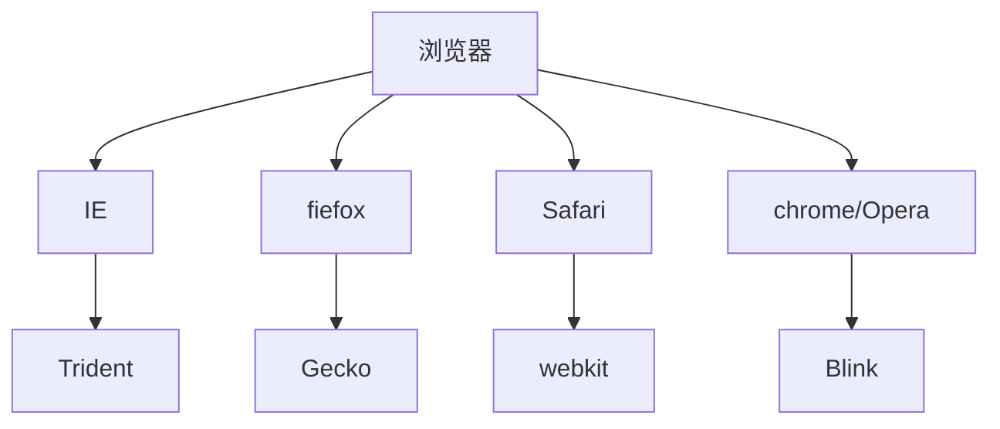
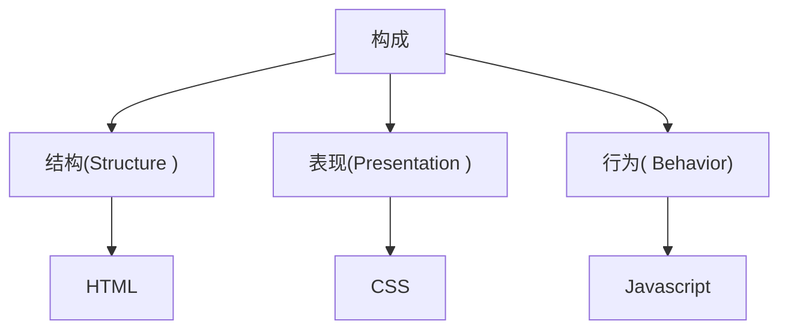

[TOC]

# 一. HTML

## 1. 简介

`HTML`指的是**超文本标记语言**`(HyperText MarkupLanguage)`，它是用来描述网页的一种语言。

`HTML`不是一种编程语言，而是一种标记语言`(markup language)`。

标记语言是一套标记标签`(markup tag)`。

## 2. 浏览器内核

| 浏览器       | 内核    | 备注                                                |
| ------------ | ------- | --------------------------------------------------- |
| IE           | Trident | IE、猎豹安全、360极速浏览器、百度浏览器             |
| firefox      | Gecko   | 火狐浏览器内核                                      |
| Safari       | webkit  | 苹果浏览器内核                                      |
| chrome/Opera | Blink   | chrome / opera浏览器内核。Blink其实是WebKit的分支。 |



## 3. Web标准

`Web`标准是由`W3C`组织和其他标准化组织制定的一系列标准的集合。`W3C`(万维网联盟）是国际最著名的标准化组织

### 3.1 构成

主要包括**结构(Structure )**、**表现(Presentation )**和**行为( Behavior)**三个方面。

| 标准 | 说明                                                         |
| ---- | ------------------------------------------------------------ |
| 结构 | 结构用于对网页元素进行整理和分类，主要是HTML。               |
| 表现 | 表现用于设置网页元素的版式、颜色、大小等外观样式,主要指的是CSS |
| 行为 | 行为是指网页模型的定义及交互的编写，主要是Javascript         |



Web标准提出的最佳体验方案:**结构、样式、行为相分离。**

简单理解︰**结构写到HTML文件中，表现写到CSS文件中，行为写到JavaScript文件中。**

## 4. HTML标签

### 4.1 基本语法

1. HTML标签是由**尖括号包围的关键词**，例如

- `<html>`。

2. HTML标签**通常是成对出现的**，例如`<html>`和`</html>`，我们称为**双标签**。标签对中的第一个标签是开始标签，第 个标签是结束标签。

3. 有些特殊的标签必须是**单个标签**（极少情况），例`<br/>`我们称为**单标签**。

### 4.2 标签关系

双标签关系可以分为两类:

- **包含关系**

- **并列关系**。

### 4.3 网页结构

| 标签名             | 定义       | 说明                                                   |
| ------------------ | ---------- | ------------------------------------------------------ |
| `<html></html>`    | HTML标签   | 页面中最大的标签，我们称为根标签                       |
| `<head></head>`    | 文档的头部 | 注意在head标签中我们必须要设置的标签是title            |
| `<titile></title>` | 文档的标题 | 让页面拥有一个属于自己的网页标题                       |
| `<body></body>`    | 文档的主体 | 元素包含文档的所有内容，页面内容基本都是放到body里面的 |

### 4.4 网页开发工具

#### 4.4.1 文档类型声明标签

`<!DOCTYPE>`**文档类型声明**，作用就是告诉浏览器使用哪种HTML版本来显示网页。

`<!DOCTYPE>`表示采取HTML5版本来显示网页

#### 4.4.2 lang 语言类型

`lang`用来定义当前文档显示的语言。

1. en定义语言为英语

2. zh-CN定义语言为中文

#### 4.4.3 字符集

**字符集(Character set)**是多个字符的集合。以便计算机能够识别和存储各种文字。

在`<head>`标签内，可以通过`<meta>`标签的`charset`属性来规定HTML文档应该使用哪种**字符编码**。

`<meta charset="UTF-8"/>`

`charset`常用的值有:`GB2312、BlG5、GBK和UTF-8`，其中`UTF-8`也被称为**万国码**，基本包含了全世界所有国家需要用到的字符.

**注意:上面语法是必须要写的代码，否则可能引起乱码的情况。一般情况下，统一使用“UTF-8”编码，尽量统一写成标准的"UTF-8”，不要写成"utf8"或"UTF8"。**

## 5. 常用标签

### 5.1 语义标签

#### 5.1.1 标题标签(h1~h6)

为了使网页更具有语义化，我们经常会在页面中用到标题标签。HTML提供了6个等级的网页标题，即`<h1> ~ <h6>`。

#### 5.1.2 段落和换行标签

在HTML标签中，`<p>`**标签用于定义段落**，它可以将整个网页分为若干个段落。

在HTML中，如果**希望某段文本强制换行显示**，就需要使用换行标签`<br/>`

### 5.2 文本格式化标签

| 语义   | 标签                             | 说明                                   |
| ------ | -------------------------------- | -------------------------------------- |
| 加粗   | `<strong></strong>`或者`<b></b>` | 更推荐使用`<strong>`标签加粗语义更强烈 |
| 倾斜   | `<em><lem> `或者`<i></i>`        | 更推荐使用`<em>`标签加粗语义更强烈     |
| 删除线 | `<del></del>`或者`<s></s>`       | 更推荐使用`<del>`标签加粗语义更强烈    |
| 下划线 | `<ins></ins>`或者`<u></u>`       | 更推荐使用`<ins>`标签加粗语义更强烈    |

### 5.3 `<div>`和`<span>`标签

`<div>`和`<span>`是没有语义的，它们就是一个盒子，用来装内容的。

**特点∶**
1.`<div>`标签用来布局，但是现在一行只能放一个`<div>`。大盒子

2.`<span>`标签用来布局，一行上可以多个`<span>`。小盒子

### 5.4 图像标签和路径

#### 5.4.1 图像标签

在HTML标签中，``标签用于定义HTML页面中的图像。

```xml

```

**图像标签的其他属性∶**

| 属性   | 属性值   | 说明                                 |
| ------ | -------- | ------------------------------------ |
| src    | 图片路径 | 必须属性                             |
| alt    | 文本     | 替换文本。图像不能显示的文字         |
| title  | 文本     | 提示文本。鼠标放到图像上，显示的文字 |
| width  | 像素     | 设置图像的宽度                       |
| height | 像素     | 设置图像的高度                       |
| border | 像素     | 设置图像的边框粗细                   |

#### 5.4.2 路径

**路径分为:**

- 相对路径
- 绝对路径

**相对路径∶**以引用文件所在位置为参考基础，而建立出的目录路径。

| 相对路径分类 | 符号  | 说明                                                         |
| ------------ | ----- | ------------------------------------------------------------ |
| 同一级路径   |       | 图像文件位于HTML文件同一级如``         |
| 下一级路径   | `/`   | 图像文件位于HTML文件下一级如`` |
| 上一级路径   | `../` | 图像文件位于HTML文件上一级﹐如``   |

**绝对路径∶**是指目录下的绝对位置，直接到达目标位置，通常是从盘符开始的路径。

例如`C:/Windows/system32/explorer.exe`

### 5.5 超链接标签

在HTML标签中，`<a>`标签用于定义超链接，作用是从一个页面链接到另一个页面。

**语法**:

```xml
<a href="跳转目标" target="目标窗口的弹出方式">文本或图像</a>
```

| 属性   | 作用                                                         |
| ------ | ------------------------------------------------------------ |
| href   | 用于指定链接目标的url地址，(必须属性)当为标签应用`href`属性时，它就具有了超链接的功能 |
| target | 用于指定链接页面的打开方式，其中`_self`为默认值，`_blank`为在新窗口中打开方式。 |

**链接分类:**

1. 外部链接，例如`<a href="http:// www.baidu.com ">百度</a >`

2. 内部链接:网站内部页面之间的相互链接.直接链接内部页面名称即可，例如`<a href=" index.html">首页</a>`。

3. 空链接:如果当时没有确定链接目标时，`<a href="#">首页</a>`。

4. 下载链接:如果`href`里面地址是一个文件或者压缩包，会下载这个文件。

5. 网页元素链接:在网页中的各种网页元素，如文本、图像、表格、音频、视频等都可以添加超链接.

6. 锚点链接:点我们点击链接,可以快速定位到页面中的某个位置.

   - 在链接文本的href属性中，设置属性值为`#名字`的形式，如`<a href="#two">第2集</a>`
   - 找到目标位置标签，里面添加一个id属性=刚才的名字，如:`<h3 id="two">第2集介绍<h3>`

## 6. 注释标签和特殊标签

### 6.1 注释

HTML中的注释以“`<!--”开头，以“-->`”结束。

### 6.2 特殊字符

| 特殊字符 | 描述         | 字符的代码 |
| -------- | ------------ | ---------- |
|          | 空格符       | `&nbsp;`   |
| &lt;     | 小于号       | `&lt;`     |
| &gt;     | 大于号       | `&gt;`     |
| &amp;    | 和号         | `&amp;`    |
| &yen;    | 人民币       | `&yen;`    |
| &copy;   | 版权         | `&copy;`   |
| &reg;    | 注册商标     | `&reg;`    |
| &deg;    | 摄氏度       | `&deg;`    |
| &plusmn; | 正负号       | `&plusmn;` |
| &times;  | 乘号         | `&times;`  |
| &divide; | 除号         | `&divide;` |
| &sup2;   | 平方2(上标2) | `&sup2;`   |
| &sup3;   | 立方3(上标3) | `&sup3;`   |

## 7. 表格标签

### 7.1 基本语法

3. ```xml
   <table>
        ...
        <tr>
            <td>表格内的文字</td>
        </tr>
        ...
   </table>
   ```

4. `<table> </table>`是用于定义表格的标签。

5. `<tr> </tr>`标签用于定义表格中的行，必须嵌套在`<table> </table>`标签中。

6. `<td> </td>`用于定义表格中的单元格，必须嵌套在`<tr></tr>`标签中。

### 7.2 表头单元格标签

一般表头单元格位于表格的第一行或第一列，表头单元格里面的文本内容**加粗居中显示**.

`<th>`标签表示HTML表格的表头部分(table head的缩写)

```xml
<table>
        ...
        <tr>
            <th>表格内的文字</th>
        </tr>
        ...
</table>
```

### 7.3 表格属性

| 属性名      | 属性值               | 描述                                             |
| ----------- | -------------------- | ------------------------------------------------ |
| align       | left . center、right | 规定表格相对周围元素的对齐方式。                 |
| border      | 1或""                | 规定表格单元是否拥有边框，默认为""，表示没有边框 |
| cellpadding | 像素值               | 规定单元边沿与其内容之间的空白，默认1像素。      |
| cellspacing | 像素值               | 规定单元格之间的空白，默认2像素。                |
| width       | 像素值或百分比       | 规定表格的宽度。                                 |

### 7.4 表格结构标签

1. `<thead></thead>`:用于定义表格的头部。`<thead>`内部必须拥有`<tr>`标签。一般是位于第一行。
2. `<tbody> </tbody>` :用于定义表格的主体，主要用于放数据本体。

### 7.5 合并单元格

**合并方式**

1. **跨行合并**:rowspan="合并单元格的个数"
2. **跨列合并**: colspan="合并单元格的个数"

## 8. 列表标签

**列表可以分为三大类**:

- 无序列表
- 有序列表
- 自定义列表

### 8.1 无序列表

```xml
<ul>
     <li>列表项1</li>
     <li>列表项2</li>
     <li>列表项3</li>
     <li>列表项4</li>
</ul>
```

### 8.2 有序列表

在HTML标签中，`<ol>`标签用于定义有序列表，**列表排序以数字来显示**，并且使用`<li>`标签来定义列表项。

```xml
<ol>
     <li>列表项1</li>
     <li>列表项2</li>
     <li>列表项3</li>
     <li>列表项4</li>
</ol>
```

### 8.3 自定义列表

在HTML标签中，`<dl>`标签用于定义描述列表(或定义列表)，该标签会与`<dt>`(定义项目/名字)和`<dd>`(描述每一个项目/名字)一起使用。

```xml
<dl>
    <dt>列表</dt>
     <dd>列表项1</dd>
     <dd>列表项2</dd>
     <dd>列表项3</dd>
     <dd>列表项4</dd>
</dl>
```

## 9. 表单

### 9.1 组成

在HTML中，一个完整的表单通常由**表单域**、**表单控件**（也称为表单元素)和**提示信息**3个部分构成。

### 9.2 表单域

**表单域**是一个**包含表单元素的区域**。
在HTML标签中，`<form>`标签用于定义表单域，以实现用户信息的收集和传递。

`<form>`会把它范围内的表单元素信息提交给服务器.

| 属性   | 属性值   | 作用                                                 |
| ------ | -------- | ---------------------------------------------------- |
| action | url地址  | 用于指定接收并处理表单数据的服务器程序的url地址。    |
| method | get/post | 用于设置表单数据的提交方式，其取值为get或post。      |
| name   | 名称     | 用于指定表单的名称，以区分同一个页面中的多个表单域。 |

### 9.3表单控件

1. input输入表单元素
2. select下拉表单元素
3. textarea文本域元素

#### 9.3.1 `input`输入表单元素

在`<input>`标签中，包含一个`type`属性，根据不同的`type`属性值，输入字段拥有很多种形式 (可以是文本字段、复选框、掩码后的文本控件、单选按钮、按钮等)。

```xml
<input type="属性值"/>
```

**type属性值**:

| 属性值   | 描述                                                         |
| -------- | ------------------------------------------------------------ |
| button   | 定义可点击按钮(多数情况下，用于通过JavaScript启动脚本)。     |
| checkbox | 定义复选框。                                                 |
| file     | 定义输入字段和"浏览"按钮，供文件上传。                       |
| hidden   | 定义隐藏的输入字段。                                         |
| image    | 定义图像形式的提交按钮。                                     |
| password | 定义密码字段。该字段中的字符被掩码。                         |
| radio    | 定义单选按钮。                                               |
| reset    | 定义重置按钮。重置按钮会清除表单中的所有数据。               |
| submit   | 定义提交按钮。提交按钮会把表单数据发送到服务器。             |
| text     | 定义单行的输入字段，用户可在其中输入文本。默认宽度为20个字符。 |

**其他属性**:

| 属性      | 属性值       | 描述                                   |
| --------- | ------------ | -------------------------------------- |
| name      | 由用户自定义 | 定义input元素的名称。                  |
| value     | 由用户自定义 | 规定input元素的值。                    |
| checked   | checked      | 规定此 input元素首次加载时应当被选中。 |
| maxlength | 正整数       | 规定输入字段中的字符的最大长度。       |

#### 9.3.2 `label`标签

`<label>`标签用于绑定一个表单元素当点击`<label>`标签内的文本时，浏览器就会自动将焦点(光标)转到或者选择对应的表单元素上,用来增加用户体验.

```xml
<label for="sex">男</ label>
<input type="radio" name="sex"id="sex"/>
```

**注意:** `<label>`标签的**for属性**应当与相关元素的**id属性**相同.

#### 9.3.3 `select`下拉表单元素

```xml
 <select name="" id="">
        <option value="">北京</option>
        <option value="">天津</option>
        <option value="">上海</option>
        <option value="">广州</option>
</select>
```

**注意:**

1. `<select>`中至少包含一对`<option>`。
2. 在`<option>`中定义`selected = " selected "`时，当前项即为默认选中项。

#### 9.3.4 `textarea`文本域元素

在表单元素中，`<textarea>`标签是用于定义多行文本输入的控件。

```xml
<textarea rows="3" cols="20">
文本内容
</textarea>
```

1. 通过`<textarea>`标签可以轻松地创建多行文本输入框。
2. `cols=“每行中的字符数”，rowS=“显示的行数”`，我们在实际开发中不会使用，都是用CSS来改变大小。

# 二. HTML5

`HTML5`的新增特性主要是针对于以前的不足，增加了一些**新的标签**、**新的表单**和**新的表单属性**等。
这些新特性都有兼容性问题，基本是IE9+以上版本的浏览器才支持，如果不考虑兼容性问题，可以大量使用这些新特性。

## 1. 语义化标签

- `<header>` :头部标签
- `<nav> `:导航标签
- `<article>` :内容标签
- `<section>`:定义文档某个区域
- `<aside>` :侧边栏标签
- `<footer>` :尾部标签

**注意:**

- 这种语义化标准主要是针对搜索引擎的
- 这些新标签页面中可以使用多次
- 在IE9中，需要把这些元素转换为块级元素

## 2. 多媒体标签

- 音频:`<audio>`
- 视频:`<video>`

### 2.1 视频`<video>`

使用浏览器原生的播放器播放

| 属性     | 值                                    | 描述                                            |
| -------- | ------------------------------------- | ----------------------------------------------- |
| autoplay | autoplay                              | 视频就绪自动播放（谷歌浏览器需要添加muted来解   |
| controls | controls                              | 向用户显示播放控件                              |
| width    | pixels(像素)                          | 设置播放器宽度                                  |
| height   | pixels(像素)                          | 设置播放器高度                                  |
| loop     | loop                                  | 播放完是否继续播放该视频，循环播放              |
| preload  | auto (预先加载视频)none(不应加载视频) | 规定是否预加载视频(如果有了autoplay就忽略该属性 |
| src      | url                                   | 视频url地址                                     |
| poster   | lmgurl                                | 加载等待的画面图片                              |
| muted    | muted                                 | 静音播放                                        |

| 方法    | 描述 |
| ------- | ---- |
| play()  | 播放 |
| pause() | 暂停 |
|         |      |

| 事件           | 描述                           |
| -------------- | ------------------------------ |
| canplay        | 视频可以播放                   |
| canplaythrough | 视频可以播放并且可以缓冲到结束 |
| loadstart      | 视频开始加载                   |
| loadeddata     | 视频加载数据                   |
| progress       | 视频加载进度                   |
| timeupdate     | 视频播放时间改变               |
| play           | 视频播放                       |
| pause          | 视频暂停                       |
| ended          | 视频播放结束                   |
| error          | 视频播放错误                   |
| volumechange   | 视频音量改变                   |


### 2.2 音频:`<audio>`

使用浏览器原生的播放器播放

| 属性     | 值       | 描述                                             |
| -------- | -------- | ------------------------------------------------ |
| autoplay | autoplay | 如果出现该属性，则音频在就绪后马上播放。         |
| controls | controls | 如果出现该属性，则向用户显示控件，比如播放按钮。 |
| loop     | loop     | 如果出现该属性，则每当音频结束时重新开始播放。   |
| src      | url      | 要播放的音频的URL。                              |

## 3. 新增input类型

| 属性值          | 说明                        |
| --------------- | --------------------------- |
| `type="email"`  | 限制用户输入必须为Email类型 |
| `type="url"`    | 限制用户输入必须为URL类型   |
| `type="date"`   | 限制用户输入必须为日期类型  |
| `type="time"`   | 限制用户输入必须为时间类型  |
| `type="month"`  | 限制用户输入必须为月类型    |
| `type="week"`   | 限制用户输入必须为周类型    |
| `type="number"` | 限制用户输入必须为数字类型  |
| `type="tel"`    | 手机号码                    |
| `type="search"` | 搜索框                      |
| `type="color"`  | 生成一个颜色选择表单        |

## 4. 新增的表单属性

| 属性            | 值        | 说明                                                         |
| --------------- | --------- | ------------------------------------------------------------ |
| required        | required  | 表单拥有该属性表示其内容不能为空，必填                       |
| **placeholder** | 提示文本  | 表单的提示信息，存在默认值将不显示                           |
| autofocus       | autofocus | 自动聚焦属性，页面加载完成自动聚焦到指定表单                 |
| autocomplete    | off / on  | 当用户在字段开始键入时，浏览器基于之前键入过的值，应该显示出在字段中填写的选项。默认已经打开，如`autocomplete="on“，关闭autocomplete ="off"`需要放在表单内，同时加上name属性，同时成功提交 |
| **multiple**    | multiple  | 可以多选文件提交                                             |

**通过以下方式修改`placeholder`字体颜色**

```css
input::placeholder{
    color: pink;
}
```

