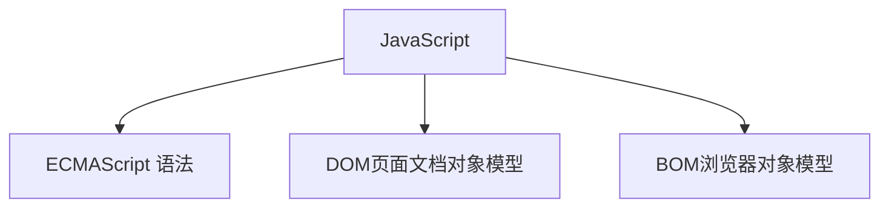
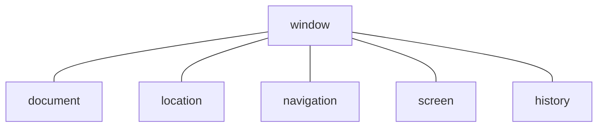

[TOC]

# 前言 JavaScript简介

## 1. JavaScript是什么

`JavaScript`是世界上最流行的语言之一,是一种运行在客户端的脚本语言.

**脚本语言:**

不需要编译,运行过程中由`js解释器(js引擎)`逐行来进行解释并执行,现在也可以基于`Node.js`技术进行服务器端编程.

## 2. 浏览器简介

**浏览器分成两部分:**

**渲染引擎**和**JS引擎**.

**渲染引擎:**

- 用来解析`HTML`与`CSS,`俗称内核,比如`chrome`浏览器的blink,老版本的webkit.

**JS引擎:**

- 也称为JS解释器.用来读取网页中的`JavaScript`代码,对其处理后运行,比如`chrome`浏览器的V8.

**注意:**

浏览器本身并不会执行JS代码,而是通过内置`JavaScript`引擎(解释器)来执行JS代码.JS引擎执行代码时逐行解释每一句源码（转换为机器语言）,然后由计算机去执行,所以`JavaScript`语言归为脚本语言,会逐行解释执行.

## 3. JavaScript的组成





### 3.1 ECMAScript—JS基本语法

ECMAScript是由ECMA国际(原欧洲计算机制造商协会)进行标准化的一门编程语言，这种语言在万维网上应用广泛，它往往被称为JavaScript或JScript，但实际上后两者是ECMAScript语言的实现和扩展.

**注意:**

ECMAScript规定了JS的编程语法和基础核心知识，是所有浏览器厂商共同遵守的一套JS语法工业标准.

### 3.2. DOM—文档对象模型

文档对象模型( Document Object Model,简称DOM),是W3C组织推荐的处理可扩展标记语言的标准编程接口.通过DOM提供的接口可以对页面上的各种元素进行操作(大小、位置、颜色等).

### 3.3 BOM—浏览器对象模型

BOM(Browser ObjectModel，简称BOM)是指浏览器对象模型，它提供了独立于内容的、可以与浏览器窗口进行互动的对象结构。通过BOM可以操作浏览器窗口，比如弹出框、控制浏览器跳转、获取分辨率等.

# 第一部分 JavaScript基础

## 1. 基本用法

### 1.1 在HTML中添加JavaScript

#### 1.1.1 行内式的JS

**代码演示:**

```javascript
<input type="button" value="按钮" onclick="alert("信息!")">
```

#### 1.1.2 内嵌式的JS

**代码演示:**

```javascript
<script>
    alert("信息!");
</script>
```

#### 1.1.3 外部的JS

**代码演示:**

```javascript
//HTML
<script src="外部JS.js"></script>

//外部JS.js
alert("信息!")
```

### 1.2 JavaScript注释

```javascript
// 1.单行注释  ctrl + /
/*
   2.多行注释  shift + alt + a
*/
```

## 2. 数据类型与变量

### 2.1 声明变量

**语法:**`var age;`javascript中变量声明为自动变量,无需指定变量类型.

`var age = 10,name = 'YS';`声明多个变量.

### 2.2 数据类型

- `Number` 数字型,包含**整型值**和**浮点型值**,如21,0.21
- `Boolean` 布尔值类型,如`true `,`false`,等价于1和0
- `String` 字符串类型,如"张三”注意咱们js里面,字符串都带引号
- `Undefined`声明了变量a但是没有给值,`var a;`此时:`a = undefined`
- `Null` 声明了变量a为空值`var = null;`

#### 2.2.1数字型Number

##### 2.2.1.1.数字型进制

**代码演示:**

```javascript
var num1 = 07; //八进制
var num2 = 7;  //十进制
var num3 = 0x7;//十六进制
```

**注意:**

**在JS中八进制前面加0,十六进制前面加0x**

##### 2.2.1.2数字型最大值最小值

**最大值:**`Number.MAX_VALUE`

**最小值:**`Number.MIN_VALUE`

##### 2.2.1.3 数字型三个特殊值

- `lnfinity` ,代表无穷大,大于任何数值.

- `-Infinity `,代表无穷小,小于任何数值.

- `NaN `,Not a number,代表一个非数值.

`isNaN()`这个方法用来判断非数字―并且返回一个值如果是数字返回的是 `false` 如果不是数字返回的是`true`.

#### 2.2.2 字符串型string

- 字符串型可以是引号中的任意文本,其语法为双引号" "和单引号' '.

- 因为HTML标签里面的属性使用的是双引号,**Javascript更推荐使用单引号**.

##### 2.2.2.1 字符串引号嵌套

- JS可以用**单引号嵌套双引号**,或者用**双引号嵌套单引号(外双内单，外单内双)**.

**代码演示:**

```javascript
var s = '这是一个"字符串"!!!'; //外单内双
var s = "这是一个'字符串'!!!"; //外双内单
```

##### 2.2.2.2 字符串转义符

- 类似HTML里面的特殊字符,字符串中也有特殊字符,我们称之为转义符.

转义符都是\开头的,常用的转义符及其说明如下:

| 转义符 | 解释说明                 |
| ------ | ------------------------ |
| \n     | 换行符，n是newline的意思 |
| \ \    | 斜杠\                    |
| \\'    | '单引号                  |
| \\"    | ”双引号                  |
| \t     | tab缩进                  |
| \b     | 空格，b是blank 的意思    |

##### 2.2.2.3 字符串长度

- 字符串是由若干字符组成的,这些字符的数量就是字符串的长度.通过字符串的`length属性`可以获取整个字符串的长度.

##### 2.2.2.4 字符串拼接

- 多个字符串之间可以使用`＋`进行拼接，其拼接方式为`字符串+任何类型=拼接之后的新字符串`

**字符串与变量相加:**

```javascript
var num = 12;
console.log('字符串'+num+'字符串');
```

```
输出结果:
字符串12字符串
```


#### 2.2.3 布尔型Boolean

- 布尔类型有两个值: `true`和`false` ,其中 `true`表示真(对),而`false`表示假(错).

#### 2.2.4 Undefined和Null

````javascript
//与字符串类型结合
//undefined
var variable = undefined;
var s1 = variable + '类型'; //s1 = undefined类型
var num1 = variable + 1;	//num1 = NaN
console.log(s1);
console.log(num1);
//null
var space = null;
var s2 = space + '类型';	//s2 = null类型
var num2 = space + 1;	  //num2 = 1;
console.log(s2);
console.log(num2);
````

```
输出结果:
undefined类型
NaN
null类型
1
```

#### 2.2.5 typeof

**代码演示:**

```javascript
var num = 10;
console.log(typeof num);
var str = '字符串';
console.log(typeof str);
var flag = true;
console.log(typeof flag);
var nul = null;
console.log(typeof nul);
var vari = undefined;
console.log(typeof vari);
```

```
输出结果:
number
string
boolean
object
undefined
```

### 2.3 字面量

**即常量**.

### 2.4 数据类型转换

**常见的3种转换方式:**

- 转换为字符串型
- 转换为数字型
- 转换为布尔型

#### 2.4.1 转换为字符串

**代码演示:**

```javascript
//使用toString()
var num = 10;
console.log(typeof num);
console.log(typeof num.toString());
```

```
输出结果:
number
string
```

```javascript
//使用String()
var num = 10;
console.log(typeof num);
console.log(typeof String(num));
```

```
输出结果:
number
string
```

```javascript
//使用 + 空字符串转换成字符串型 隐式转换
var num = 10;
console.log(typeof num);
console.log(typeof (num+''));
```

```
输出结果:
number
string
```

#### 2.4.2 转换为数字型

- 使用`parseInt()`转换为整数型, 对小数取整,**对带单位数自动去单位**

- 使用`parseFloat()`转换为浮点型,**对带单位数自动去单位**

- 使用`Number()`转换为数字型.
- 使用算数运算转换为数字型,即隐式转换.

####  2.4.3 转换为布尔型

- 使用`Boolean()`转换
- - `false`:`' '`  ,  `0 `  , ` NaN`  , `null`  ,  `undefined` 
  - `true`: `'字符串'`  ,  `123`  

## 3. 运算符

### 3.1 算数运算符

- 加,减,乘,除,取模,`+`,`-`,`*`,`/`,`%`

**代码演示:**

```javascript
console.log(2-1);
console.log(2*1);
console.log(2/1);
console.log(4%3);
```
```
输出结果:
1
2
2
1
```
- **JS中浮点数的精度远不如整数,在运算中会出现溢出问题**.

**代码演示:**

```javascript
console.log(0.1+0.2);
console.log(0.07*100);
```

```
输出结果:
0.30000000000000004
7.000000000000001
```

### 3.2 递增(递减)运算符

- `++`递增运算符
- `--`递减运算符
- `++a;`前置递增运算符,`--a`前置递减运算符
- `a++`后置递增运算符,`a--`后置递减运算符
- 前置运算符:**先递增(递减),再返回值**
- 后置运算符:**先返回值,再递增(递减)**

### 3.3 关系运算符

- 大于`>`,小于`<`,大于等于`>=`,小于等于`<=`,等于`==`,不等`!=`,全(不)等(数据类型和值都相等)`=== ,!==`

### 3.4 逻辑运算符

- 逻辑与`&&`,逻辑或`||`,逻辑非`!`

### 3.5 短路运算(逻辑中断)

**短路运算的原理:**

- 当有多个表达式(值)时,**左边的表达式值可以确定结果时,就不再继续运算右边的表达式的值**;

#### 3.5.1 逻辑与短路运算

**语法:**`如果表达式1为真 则返回表达式2;如果表达式1为假 则返回表达式1`

**代码演示:**

```javascript
console.log(100 && 200);
console.log(0 && 100);
console.log(0 && 21*312 +92130); //运算中断
```

```
输出结果:
200
0
0
```

#### 3.5.2 逻辑或短路运算

**语法:**`如果表达式1为真 则返回表达式1;如果表达式1为假 则返回表达式2`

```javascript
console.log(100 || 200);
console.log(0 || 100);
console.log(0 || 21*312 +92130); 
console.log(0 || 21*312 +92130 || 9*13); //逻辑中断
```

```
输出结果:
100
100
98682
98682
```

### 3.6 赋值运算符

- 赋值`=`,加上`+=`,减去`-=`,乘上`*=`,除去`/=`,取模`%=`.

### 3.7 运算符优先级

| 优先级 | 运算符     | 顺序        |
| ------ | ---------- | ----------- |
| 1      | 小括号     | ( )         |
| 2      | 一元运算符 | ++-- !      |
| 3      | 算数运算符 | 先*/%后+-   |
| 4      | 关系运算符 | >>= <<=     |
| 5      | 相等运算符 | == !====!== |
| 6      | 逻辑运算符 | 先&&后ll    |
| 7      | 赋值运算符 | =           |
| 8      | 逗号运算符 | ,           |


## 4. 流程控制

**流程控制主要有:**

- **顺序结构**

- **分支结构**

- **循环结构**


### 4.1 顺序结构

### 4.2 分支结构

#### 4.2.1 if语句

**语法:**

```javascript
//单分支结构
if(条件表达式)	//条件表达式为真,执行代码块,为假,不执行
{
    //代码块
}

//双分支结构
if(条件表达式)	//条件表达式为真,执行代码块1,为假,执行代码块2
{
    //代码块1
}
else
{
    //代码块2
}

//多分支,不写了...
```

#### 4.2.2 switch语句

**语法:**

```javascript
switch(表达式)
{
    case 值1:
        执行语句1;
        break;
     case 值2:
        执行语句2;
        break;
    ...
    default:
        最后的语句;
}
```

**注意:**

- 表达式中的值应该与 `case `内的值**全等** (即**"==="**);

#### 4.2.3 三元运算符

**语法:**`条件表达式 ? 表达式1 : 表达式2`

### 4.3 循环结构

#### 4.3.1 for循环

**语法:**

```javascript
for(初始化变量;条件表达式;操作表达式)
{
    //循环体
}
```

#### 4.3.2 while循环

**语法:**

```javascript
while(条件表达式)
{
    //循环体
}
```

#### 4.3.3 do while循环

**语法**:

```javascript
do
{
    //循环体
}while(条件表达式)
```

#### 4.3.4 continue break

##### 4.3.4.1 continue

**功能描述:**

- `continue`关键字用于**立即跳出本次循环,继续下一次循环**.

**语法:**

```javascript
for(var i=0;i<5;i++)
{
    if(i == 3)
     {
         continue
     }
    console.log(i);
}
```

```
输出结果:
0
1
2
4
```

##### 4.3.4.2 break

**功能描述:**

- `break`关键字用于**立即跳出整个循环**.

**语法:**

```javascript
for(var i=0;i<5;i++)
{
    if(i == 3)
     {
         break;
     }
    console.log(i);
}
```

```
输出结果:
0
1
2
```

### 5.数组

#### 5.1 概念

- **数组(array)**是指一组数据的集合,其中的每个数据被称作元素,在数组中可以存放**任意类型**的元素.

#### 5.2 创建数组

##### 5.2.1 使用new关键字创建

**语法:**

```javascript
var arr = new Array(); 		//创建了一个空数组
```

##### 5.2.2 使用数组字面量创建

**语法:**

```javascript
var arr1 = [];		   		//创建了一个空数组
var arr2 = [1,'字符串',true] //创建并初始化数组
```

#### 5.3 访问数组

##### 5.3.1 使用数组的索引

- **索引(下标)**是指用来访问数组元素的序号(数组下标从0开始).

#### 5.4 遍历数组

- 使用`数组名.length`可以得到数组元素的数量.

**语法:**

```javascript
var arr = [1,4,23,43,'字符串',321,true];
for(var i=0;i<arr.length;i++)
{
    console.log(arr[i]);
}
```

```
输出结果:
1
4
23
43
字符串
321
true
```

#### 5.5 新增数组

- 通过修改`length`增加数组长度

**代码演示:**

```javascript
var arr = [1,4,23,43,'字符串',321,true];
for(var i=0;i<arr.length;i++)
{
    console.log(arr[i]);
}
arr.length = 9;
arr[7] = 1;
arr[8] = false;
console.log('--------------修改后----------------')
for(var i=0;i<arr.length;i++)
{
    console.log(arr[i]);
}
```

```
输出结果:
1
4
23
43
字符串
321
true
--------------修改后----------------
1
4
23
43
字符串
321
true
1
false
```

### 6.函数

#### 6.1 概念

**函数:**就是封装了一段可被重复调用执行的代码块.通过此代码块可以实现大量代码的重复使用.

##### 6.1.1 声明函数

###### 6.1.1.1 直接声明

**语法:**

```javascript
function 函数名(形参1,形参2,...)
{
    /*
    **代码块**
    */
}
```

###### 6.1.1.2 函数表达式

**语法:**`var func = function(){}`

**调用:**`函数名(参数1,参数2,...);`

**注意:**

- `func`是变量名,不是函数名.

- `func`中储存了函数的代码

##### 6.1.2 调用函数

**语法:**

```javascript
函数名(参数1,参数2,...);
```

##### 6.1.3 立即执行函数(匿名函数)

**语法:**`(function(形参1,形参2,...){})(实参1,实参2,...);`

**语法:**`(function(形参1,形参2,...){}(实参1,实参2,...));`

#### 6.2 参数

##### 6.2.1 形参

`function 函数名(形参1,形参2,...){}`在声明函数的小括号里面是 形参.

##### 6.2.2 实参

`函数名(实参1,实参2,...);`在函数调用的小括号里面是 实参.

#####  6.2.3 实参与形参不匹配

- 实参个数多于形参个数, 会取到形参个数,多余实参不取.
- 实参个数少于形参个数, 另一个形参是undefined.

##### 6.2.4 可变参数(arguments)

**arguments:**

- 当我们不确定有多少个参数传递的时候,可以用`arguments`来获取.在`JavaScript`中,`arguments`实际上它是当前函数的一个**内置对象**.所有函数都内置了一个`arguments`对象,arguments对象中存储了传递的所有实参.

**使用arguments:**

```javascript
function func()
{
    console.log(arguments);
}
func(1,2,3);
```

```
输出结果:
Arguments(3) [1, 2, 3, callee: ƒ, Symbol(Symbol.iterator): ƒ]
```

**注意:**`argument`为伪数组.具有数组的:

- `length`属性
- 按照**索引存储**

没有数组的一些方法如:`pop()`,`push()`等.

#### 6.3 return语句

##### 6.3.1 函数返回值

**语法:**

```javascript
function 函数名()
{
    return 返回值;
}
```

**注意:**

- `return`只能返回一个值.可以用数组传递多个值.
- 函数如果没有`return`,则返回`undefined`.

##### 6.3.2 终止函数

**语法:**

```javascript
function func()
{
    for(var i=0;i<=10;i++)
    {
        console.log(i);
        if(i==4)return;
	}
}
func();
```

```
输出结果:
0
1
2
3
4
```

### 7. 作用域

`javascript`中作用域分为:

- 全局作用域
- 局部作用域(函数作用域)

#### 7.1 全局作用域

**概念:**

- 整个`script`标签,或者是一个单独的`js`文件.

#### 7.2 局部作用域(函数定义域)

**概念:**

- 在函数内部就是局部作用域,**其中的定义的变量只在函数内部生效**.

#### 7.3 全局变量

**概念:**

- 在全局作用域下的的变量

#### 7.4 局部变量

**概念:**

- 在局部作用域(函数作用域)下的变量

#### 7.5 块级作用域

- JS中无块级作用域,**在es6时新增了块级作用域**

**块级作用域:**`{}`

#### 7.6 作用域链

**概念:**

- 在函数作用域内又定义了一个新函数,在内部函数中访问外部变量,采用**链式查找访问(就近原则)**,

### 8. 预解析

`JavaScript`代码是由浏览器中的`JavaScript`解析器来执行的.`JavaScript`解析器在运行`JavaScript`代码的时候分为两步:

- 预解析

- 代码执行

**预解析:**`js`引擎会把`js`里面所有的变量和函数提升到当前作用域的最前面.

**代码执行:**从上往下执行.

#### 8.1 变量预解析(变量提升)

**变量预解析(变量提升)**就是把所有的变量声明提升到当前的作用域最前面而**不进行赋值操作**.

**代码演示:**

```javascript
function func()
{
    console.log(num);
}
var num = 11;
//在js引擎解析后相当于
var num;
function func()
{
    console.log(num);
}
num = 11;
//所以输出值应该为undefined


func();
var func = function()
{
    console.log(1);
}
//在js引擎解析后相当于
var func();
func();
func = function()
{
    console.log(1);
}
//此时出现函数未定义的错误
```

#### 8.2 函数预解析(函数提升)

**函数预解析(函数提升)**就是把所有的函数声明提升到当前作用域的最前面**不调用函数**

**代码演示:**

```javascript
func();
function func()
{
    console.log(1);
}
//在js引擎解析后相当于
function func()
{
    console.log(1);
}
func();
```

### 9. 对象

**概念:**对象是由**属性**和**方法**组成的.

- 属性:事物的特征,在对象中用属性来表示(常用名词)
- 方法:事物的行为,在对象中用方法来表示(常用动词)

`JavaScript`中的对象分为3种:

- 自定义对象

- 内置对象

- 浏览器对象

前面两种对象是JS基础内容,属于`ECMAScript`;第三个浏览器对象属于`JS`独有.

#### 9.1 创建对象

在`JavaScript`中,现阶段我们可以采用**三种方式**创建对象(object):

- 利用**字面量**创建对象
- 利用**new Object**创建对象
- 利用**构造函数**创建对象

##### 9.1.1 使用字面量创建对象

**对象字面量:**在花括号`{}`里面包含了表达这个对象的属性和方法.

- 里面的**属性**或者**方法**我们采取**键值对**的形式 `键 属性名: 值 属性值`
- 多个属性或者方法中间用**逗号隔开**的
- 方法冒号后面跟的是一个**匿名函数**

**语法:**

```javascript
var obj = {
    name : '张三',
    age : 18,
    sex : '男',
    func: function()
    {
        console.log(obj.name);
        console.log(obj.age);
        console.log(obj.sex);
	}
}
//调用对象成员函数
obj.func();
```

```
输出结果:
张三
18
男
```

##### 9.1.2 使用new object创建对象

**语法:**

```javascript
var obj = new Object();
obj.name = '张三';
obj.age  = 18;
obj.sex = '男';
obj.func = function()
{
    console.log(obj.name);
    console.log(obj.age);
    console.log(obj.sex);
}
obj.func();
```

```
输出结果:
张三
18
男
```

##### 9.1.3 使用构造函数创建对象

**语法:**

```javascript
function 构造函数名(值1,值2,...)
{
    this.属性1 = 值1;
    this.属性2 = 值2;
    ...
    this.方法 = function()
    {
        
    }
}
var obj = new 构造函数名(值1,值2,...);
```

**注意:**

- 构造函数名首字母要大写

##### 9.1.4 new关键字的执行过程

- 在内存中创建一个新的空对象.
- 让this指向这个新的对象.
- 执行构造函数里面的代码,给这个新对象添加属性和方法.
- 返回这个新对象.

#### 9.2 调用对象的属性

**语法:**

- 方法一:`对象名.属性名`
- 方法二:`对象名['属性名']`,此方法**不可调用对象成员函数**

#### 9.3 遍历对象

使用`for..in`语句遍历对象

**语法:**

```javascript
for(var k in obj)
{
    console.log(k);	//k 变量输出的是 属性名
    console.log(obj[k]);//obj[k]得到的是属性名
}
```

`for..in`变量习惯使用`k`或者`key`

#### 9.4. 内置对象

**概念:内置对象**就是指JS语言自带的一些对象,这些对象供开发者使用,并提供了一些常用的或是**最基本而必要的功能(属性和方法)**

##### 9.4.1 数组(Array)对象

- 见`MDN`文档[](https://developer.mozilla.org/zh-CN/docs/Web/JavaScript/Reference/Global_Objects/Array)

**常见用法:**

1. **创建方法:**

**语法:**

```javascript
//使用数组字面量创建
var arr = [1,2,3]
console.log(arr);
```

```javascript
//使用new Array()
var arr1 = new Array(2); //指定数组长度为2
var arr2 = new Array(1,2,3)//等价于[1,2,3]
```

2. **添加/删除数组元素**

| 方法名            | 说明                                                  | 返回值               |
| ----------------- | ----------------------------------------------------- | -------------------- |
| push(参数1...)    | 末尾添加一个或多个元素，注意修改原数组                | 并返回新的长度       |
| pop()             | 删除数组最后一个元素，把数组长度减1无参数、修改原数组 | 返回它删除的元素的值 |
| unshift(参数1...) | 向数组的开头添加一个或更多元素，注意修改原数组        | 并返回新的长度       |
| shift()           | 删除数组的第一个元素，数组长度减1无参数、修改原数组   | 并返回第一个元素的值 |

3. **数组索引方法**

| 方法名        | 说明                           | 返回值                                   |
| ------------- | ------------------------------ | ---------------------------------------- |
| indexOf()     | 数组中查找给定元素的第一个索引 | 如果存在返回索引号如果不存在，则返回-1。 |
| lastIndexOf() | 在数组中的最后一个的索引       | 如果存在返回索引号如果不存在，则返回-1。 |

4. **数组转化为字符串**

| 方法名         | 说明                                         | 返回值         |
| -------------- | -------------------------------------------- | -------------- |
| toString()     | 把数组转换成字符串，逗号分隔每一项           | 返回一个字符串 |
| join('分隔符') | 方法用于把数组中的所有元素转换为一个字符串。 | 返回一个字符串 |

##### 9.4.2 数学(Math)对象

- 见`MDN`文档[](https://developer.mozilla.org/zh-CN/docs/Web/JavaScript/Reference/Global_Objects/Math)

使用Math对象可以直接使用匿名对象

###### 9.4.2.1 绝对值

**`Math.abs(x)`** 函数返回一个数字的绝对值

###### 9.4.2.2 取整

**`Math.ceil()`** 函数总是四舍五入并返回大于等于给定数字的最小整数。

**`Math.floor()`** 函数总是返回小于等于一个给定数字的最大整数。

**`Math.round()`** 函数返回一个数字四舍五入后最接近的整数。

**`Math.trunc()`** 方法会将数字的小数部分去掉，只保留整数部分。

###### 9.4.2.3 返回最大最小值

**`Math.max()`** 函数返回作为输入参数的最大数字，如果没有参数，则返回 -[`Infinity`](https://developer.mozilla.org/zh-CN/docs/Web/JavaScript/Reference/Global_Objects/Infinity)。

**`Math.min()`** 函数返回作为输入参数的数字中最小的一个，如果没有参数，则返回 [`Infinity`](https://developer.mozilla.org/zh-CN/docs/Web/JavaScript/Reference/Global_Objects/Infinity)。

###### 9.4.2.4 求指数次幂和平方根

**`Math.pow()`** 函数返回基数（`base`）的指数（`exponent`）次幂，即 `base^exponent`。

**`Math.sqrt()`** 函数返回一个数的平方根

###### 9.4.2.5 随机数

**`Math.random()`** 函数返回一个浮点数，伪随机数在范围从**0 到**小于**1**，也就是说，从 0（包括 0）往上，但是不包括 1（排除 1），然后您可以缩放到所需的范围。实现将初始种子选择到随机数生成算法;它不能被用户选择或重置。

##### 9.4.3 日期(Date)对象

- 见`MDN`文档[](https://developer.mozilla.org/zh-CN/docs/Web/JavaScript/Reference/Global_Objects/Date)

###### 9.4.3.1 实例化Date对象

```js
let timer = new Date()
```

###### 9.4.3.2 获取年份

```js
timer.getFullYear()  //getFullYear() 方法根据本地时间返回指定日期的年份。
```

###### 9.4.3.3 获取月份

```js
timer.getMonth()  //根据本地时间，返回一个指定的日期对象的月份，为基于 0 的值（0 表示一年中的第一月）。
```

###### 9.4.3.4 获取天数

```js
timer.getDate() //根据本地时间，返回一个指定的日期对象为一个月中的哪一日（从 1--31）。
```

```js
timer.getDay() //getDay() 方法根据本地时间，返回一个具体日期中一周的第几天，0 表示星期天。
```

###### 9.4.3.5 获取小时

```js
timer.getHours()	//getHours() 方法根据本地时间，返回一个指定的日期对象的小时。返回一个 0 到 23 之间的整数值。
```

###### 9.4.3.6 获取分钟

```js
timer.getMinutes()	//getMinutes() 方法根据本地时间，返回一个指定的日期对象的分钟数。返回一个 0 到 59 的整数值。
```

###### 9.4.3.7 获取秒数

```js
timer.getSeconds() //getSeconds() 方法根据本地时间，返回一个指定的日期对象的秒数。该方法返回一个 0 到 59 的整数值。
```

###### 9.4.3.8 获取毫秒数

```js
timer.getMiliseconds() //getMilliseconds() 方法，根据本地时间，返回一个指定的日期对象的毫秒数。 0 到 999 的整数。
```

##### 9.4.4 字符串对象(string)对象

- 见`MDN`文档[](https://developer.mozilla.org/zh-CN/docs/Web/JavaScript/Reference/Global_Objects/string)

**常见方法:**

1. **创建方法**

**语法:**

```javascript
var str = 'test';//此处发生了基本数据类型的包装
```

2. **根据字符串返回位置**,与数组`indexof()`方法相同

**注意:**

- 字符串初始化后就不可变,修改字符串将新开一块内存,大量修改将造成内存泄漏.
3. **字符串操作方法**

| 方法名                    | 说明                                                         |
| ------------------------- | ------------------------------------------------------------ |
| concat(str1,str2,str3...) | concat()方法用于连接两个或多个字符串。拼接字符串，等效于+，+更常用 |
| substr(start,length)      | 从start位置开始（索引号), length 取的个数                    |
| slice(start, end)         | 从start位置开始，截取到end位置，end取不到(他们俩都是索引号)  |
| substring(start, end)     | 从start位置开始，截取到end位置，end取不到基本和slice相同但是不接受负值 |

4. **替换字符串**

**语法:**`replace('被替换字符','替换成的字符')`,它只替换第一个字符

- 替换所有字符使用遍历的方法

5. **字符转换为数组**

**语法:**`split('分隔符')`将字符串转化为数组

6. **转换为大小写**

**语法:**`toUpperCase()`转化为大写 ; `toLowerCase()`转换为小写

##### 9.4.5 基本包装类型

**概念:**

- 把简单数据类型包装为复杂数据类型,这样基本数据类型就有了属性和方法

**过程:**

```javascript
// 1. 创建一个临时string类型变量
var temp = new String('test');
// 2. 将临时变量赋值给str
str = temp;
// 3. 销毁这个临时变量
temp = null;
```

##### 9.4.6 对象的检测方法(instanceof)

**语法:**

```java
var arr = [];
console.log(arr instanceof Array)
```

```
输出结果:
true
```

### 10. 简单类型和复杂类型

#### 10.1 简单类型

**简单类型**又叫做**基本数据类型**或者**值类型**

**值类型:**

- 简单数据类型/基本数据类型,在存储时变量中存储的是值本身,因此叫做值类型.(`string `, `number` ,` boolean` , `null`)
- `null`是`Object`类型,是一个空对象.

#### 10.2 复杂类型

**复杂类型**又叫做**引用类型**

**引用类型**:

- 复杂数据类型,在存储时变量中**存储的仅仅是地址(引用)**,因此叫做引用数据类型.
- 通过`new`关键字创建的对象(系统对象、自定义对象),如`Object`、`Array`、`Date`等.

#### 10.3 堆和栈

**栈:**

- 由**操作系统自动分配释放**存放函数的参数值、局部变量的值等.其操作方式类似于数据结构中的栈;**简单数据类型存放到栈里面**.

**堆:**

- 存储复杂类型(对象),**一般由程序员分配释放**,若程序员不释放,由垃圾回收机制回收.**复杂数据类型存放到堆里面**.

**注意:**`JavaScript`中**没有堆栈的概念**,操作系统在`javascript`中的概念即浏览器的`javascript解释器`

#### 10.4 简单类型传参

- 当我们把一个**简单类型变量**作为参数传给函数的形参时,其实是把变量在栈空间复制了一份给形参.
- 在函数内部对形参如何修改都不会影响外部的实参.

#### 10.5 复杂类型传参

- 当我们把一个复杂类型变量作为参数传给函数时的形参时,其实是把变量的地址传递给了函数.
- 在函数内部对形参修改i也会影响到外部的实参.

# 第二部分 Web APIs

**API概念:**

- APl ( Application Programming Interface,应用程序编程接口)是一些预先定义的函数,目的是提供应用程序与开发人员基于某软件或硬件得以访问一组例程的能力,而又无需访问源码,或理解内部工作机制的细节.

**即对程序员提供的一些功能,使其能轻松的完成工作**

**Web API概念:**

- Web API是浏览器提供的一套操作浏览器功能和页面元素的API(BOM和DOM).

## 1. DOM简介

### 1.1DOM概念

**概念:**

- **文档对象模型**(Document Object Model,简称DOM),是W3C组织推荐的处理可扩展标记语言(HTML或者XML )的标准编程接口.

- **W3C**已经定义了一系列的DOM接口,通过这些DOM接口可以**改变网页的内容、结构和样式.**

### 1.2 DOM树


**文档:**

- **一个页面就是一个文档**,DOM中使用`document`表示

**元素:**

- 页面中的**所有标签都是元素**，DOM中使用`element`表示

**节点:**

- 网页中的**所有内容都是节点**(标签、属性、文本、注释等),DOM中使用`node`表示.

**DOM把文档,元素,节点都看作对象.**

### 1.2 获取元素

**获取元素的几种方法:**

- 根据ID获取
- 根据标签名获取
- 通过HTML5新增的方法获取
- 特殊元素获取

#### 1.2.1 通过ID获取

**语法:**

- 使用`getElementByld()`方法可以获取带有`ID`的元素对象。

**返回值:**

- 返回元素对象

#### 1.2.2 通过标签名获取

**语法:**

- 使用`getElementsByTagName()`方法可以返回指定标签名的对象的集合.

**返回值:**

- 返回对象的集合

#### 1.2.3 H5新增获取元素方式

##### 1.2.3.1 通过类名获取

- `document.getElementsByClassName( '类名');`//根据类名返回元素对象集合

**返回值:**

- 返回元素对象集合

##### 1.2.3.2 通过选择器获取

| 方法                                   | 描述                             |
| -------------------------------------- | -------------------------------- |
| `document.querySelector('选择器');`    | 根据指定选择器返回第一个元素对象 |
| `document.querySelector('.类名');`     | 根据指定选择器返回第一个元素对象 |
| `document.querySelector('#id');`       | 根据指定选择器返回第一个元素对象 |
| `document.querySelectorAll('选择器');` | 根据指定选择器返回所有元素对象.  |

#### 1.2.4 获取特殊元素对象

##### 1.2.4.1 获取body标签

**语法:**

- `document.body`

**返回值:**

- `body`元素

##### 1.2.4.2 获取html标签

**语法:**

- `document.documentElement`

**返回值:**

- `html`元素

### 1.3事件处理

- `JavaScript`使我们有能力创建动态页面,而事件是可以被`JavaScript`侦测到的行为.

**触发响应的机制**

#### 1.3.1 事件组成

**概念:**

- 事件由三部分组成:
- 事件源
- 事件类型
- 事件处理程序

**也叫事件三要素.**

**代码演示:**

```javascript
//1.事件源
var btn = document.getElementById('btn');
//2.事件类型
//点击,经过,按键按下.....
//3.事件处理程序
btn.onclick = function()
{
    alert('信息');
}
```

#### 1.3.2 常见的鼠标事件

| 鼠标事件      | 触发条件         |
| ------------- | ---------------- |
| `onclick`     | 鼠标点击左键触发 |
| `onmouseover` | 鼠标经过触发     |
| `onmouseout`  | 鼠标离开触发     |
| `onfocus`     | 获得鼠标焦点触发 |
| `onblur`      | 失去鼠标焦点触发 |
| `onmousemove` | 鼠标移动触发     |
| `onmouseup`   | 鼠标弹起触发     |
| `onmousedown` | 鼠标按下触发     |

### 1.4.改变元素属性

`JavaScript`的`DOM`操作可以改变网页内容、结构和样式,我们可以利用`DOM`操作元素来改变元素里面的内容、属性等.

#### 1.4.1 改变元素内容

1. `element.innerText`

- 从起始位置到终止位置的内容,但它**去除html标签,同时空格和换行也会去掉**.

2. `element.innerHTML`

- 起始位置到终止位置的全部内容,**包括html标签,同时保留空格和换行**.

#### 1.4.2 常用元素的属性操作

- `innerText`和`innerHTML`   标签内容
- `src`和`href`                          文件源
- `id`,`alt`,`tiltle`                   选择器,提示文本,标题

#### 1.4.3 表单元素的操作

**使用DOM来操作下面元素的属性:**

- `type、value、checked、selected、disabled`

##### 1.4.3.1 表单元素的文字修改

- 表单里面的值,文字内容是通过`value`来修改的.

##### 1.4.3.2 表单元素的禁用

- 表单元素禁用,使用`disabled`.

##### 1.4.3.3 表单事件

- `onfocus`     	  获得焦点
- `obbulr`             失去焦点

#### 1.4.4 元素样式属性操作

- `element.style`			行内样式操作

- `element.className`    类名样式操作

##### 1.4.4.1 通过style修改元素样式属性

**代码演示:**

```javascript
//样式名采取驼峰命名法
element.style.backgrouudColor = red;
//行内样式,权重高
```

##### 1.4.4.2 通过className修改元素样式属性

**代码演示:**

```html
<style>
.change
{
    background-color = rgb(23,42,23);
    border: 0;
}
</style>
<div>demo</div>
<script>
    var p = document.querySelector('div');
	p.onclick = function()
    {
        this.className = 'change';
        // 此处修改div类名
    }
</script>
```

**注意:**

使用`className`会直接覆盖原先的元素类名, 要想保留原先类名可以使用**多类名选择器.**

**代码演示:**

```html
<div class="first">demo</div>
<script>
    var p = document.querySelector('div');
	p.className = 'first change';//此处为多类名选择器
</script>
```

#### 1.4.5 排他思想

使用遍历相同元素的方法,在`jQuery`库中可以使用`siblings`

**代码演示:**

```html
<style>
        button
        {
           background-color: aqua;
           border: 0;
         }
</style>
<div>
        <button>按钮</button>
        <button>按钮</button>
        <button>按钮</button>
        <button>按钮</button>
</div>
<script>
      var btns = document.getElementsByTagName("button");
      for(var i = 0;i<btns.length;i++){
           btns[i].onclick = function(){
             for(var j=0;j<btns.length;j++){
              //将其他按钮背景颜色清空
              btns[j].style.backgroundColor='';
              }
              //设置按钮背景颜色
              this.style.backgroundColor='red';
            }
        }
</script>
```

#### 1.4.6 自定义属性的操作

##### 1.4.6.1 获取自定义属性值

**语法:**

- `element.属性`  获取属性值

- `element.getAttribute('属性')`获取自定义属性值

**区别:**

- `element.属性`获取**内置属性值**(元素本身自带的属性)
- `element.getAttribute('属性');`主要获得**自定义的属性**(标准)我们程序员自定义的属性.

##### 1.4.6.2 修改/移除自定义属性值

**语法:**

- `element.属性 = '值'`     设置内置属性值
- `element.setAttribute('属性','值')`设置自定义属性值

- `element.removeAttribute('属性')`移除自定义属性值

#### 1.4.7 属性操作案例(tab栏切换)

**代码演示:**

```html
<style>
       .tab
       {
           position: absolute;
           top: 100px;
           left: 100px;
           height: 170px;
           width: 500px;
           padding: 20px;
           border: 1px rgb(21, 31, 21) solid;
       }
       li
       {
           background-color: aqua;
           list-style: none;
       }
       .current
       {
           background-color: red;
       }
      .item
      {
        display: none;
      }
</style>
<body>
    <div class="tab">
        <div class="tab_list">
            <ul>
                <li class="current">商品介绍</li>
                <li>规格和包装</li>
                <li>售后与保障</li>
                <li>商品评价</li>
                <li>手机社区</li>
            </ul>
        </div>
        <div class="tab_on">
            <div class="item" style="display: block;">
                商品介绍模块
            </div>
            <div class="item">
                规格和包装模块
            </div>
            <div class="item">
                售后与保障模块
            </div>
            <div class="item">
                商品评价模块
            </div>
            <div class="item">
                手机社区模块
            </div>
        </div>
    </div>
    <script>    
            var li = document.querySelectorAll('li');
            var item = document.querySelectorAll('.item');
            for(var i =0;i<li.length;i++)
            {
                li[i].setAttribute('index',i);
                li[i].onclick = function()
                {
                    for(var j=0;j<li.length;j++)
                    {
                        li[j].className = '';
                    }
                    this.className = 'current';
                    var index = this.getAttribute('index');
                    for(var x = 0;x<item.length;x++)
                    {
                        item[x].style.display = 'none';
                    }
                    item[index].style.display = 'block';
                }
                
            }
    </script>
</body>
```

#### 1.4.8 H5自定义属性

**自定义属性:**

- 是为了保存并使用数据.有些数据可以保存到页面中而不用保存到数据库中.
- 自定义属性获取是通过`getAttribute(属性)`获取.
- 但是有些自定义属性很容易引起歧义,不容易判断是元素的内置属性还是自定义属性.H5给我们新增了自定义属性.

##### 1.4.8.1 设置H5自定义属性

  H5规定自定义属性`data-`开头做为属性名并且赋值.

- `比如<div data-index= “1" ></div>`

**兼容性**获取自定义属性方法:

- `element.getAttribute('data-index');`

**H5新增(ie11以上支持)**获取自定义属性方法:

- `element.dataset.index`或者`element.dataset[ 'index’]`

**代码演示:**

```html
<div data-index="1">demo</div>
<script>
    var d = document.querySelector('div');
    console.log(d.getAttribute('data-index'));
    console.log(d.dataset.index);
    console.log(d.dataset['index']);
</script>
```

### 1.5 获取、修改元素的类名

#### 1.5.1 className

`className` 获取或设置指定元素的 `class` 属性的值。

```js
let box = document.querySelector(".box");
console.log(box.className);
```

#### 1.5.2 classList

**`Element.classList`** 是一个只读属性，返回一个元素 `class` 属性的动态 `DOMTokenList`集合。这可以用于操作 class 集合。

**与className的区别:**

- 相比将 `element.className` 作为以空格分隔的字符串来使用，`classList` 是一种更方便的访问元素的类列表的方法。

**成员方法:**

| 方法                         | 描述                                                         |
| ---------------------------- | ------------------------------------------------------------ |
| `add(Token,...)`             | 将给定的标记添加到列表中。                                   |
| `remove(Token,....)`         | 从 `DOMTokenList` 中移除指定标记                             |
| `replace(oldToken,newToken)` | 可以将列表中一个已存在的 token 替换为一个新 token。如果第一个参数 token 在列表中不存在， `replace()` 立刻返回`false` ，而不会将新 token 字符串添加到列表中。 |
| `toggle(Token)`              | 从列表中删除一个给定的标记并返回 `false`。如果标记不存在，则添加并且函数返回 `true`。 |
| `contains(Token)`            | 传入的参数 `token` 包含在列表中时则返回`true`，否则返回 `false`。 |

### 1.6 节点

**概念:**

- 网页中的所有内容都是节点(标签、属性、文本、注释等),在DOM中，节点使用`node`来表示.
- `HTML` DOM树中的所有节点均可通过`JavaScript`进行访问,所有`HTML`元素(节点)均可被修改,也可以创建或删除.
- 一般地,节点至少拥有`nodeType`(节点类型)、`nodeName `(节点名称）和`nodeValue`(节点值)这三个基本属性.

#### 1.6.1 节点层级

**概念:**

- 利用DOM树可以把节点划分为不同的层级关系,常见的是**父子兄层级关系**.

##### 1.6.1.1 父级节点

**语法:**

```html
<div class = "box">
    <span class = "erweima"></span>
</div>
<script>
    var erweima = document.querySelector('.erweima');
    console.log(erweima.parentNode);//即document.querySelector('.box');
</script>
```

##### 1.6.1.2 子节点

###### 1.6.1.2.1 获取子节点

**语法:**

- `element.childNodes`**(标准)**

**返回值:**

- 所有子节点,包括元素节点,文本节点

**语法:**

- `element.children`**(非标准,广泛支持)**

**返回值:**

- 所有子节点

###### 1.6.1.2.2 获取第一/最后一个子节点

**语法:**

- `element.firstChild`
- `element.firstElementChild`

**返回值:**

- 第一个子节点,包括元素节点,文本节点

**语法:**

- `element.lastChild`
- `element.lastElementChild`

**返回值:**

- 最后一个子节点

**注意:**

- `element.firstElementChild`和`element.lastElementChild`在IE9以上才支持.
- **2022年6月15日,微软停止支持IE浏览器.**

##### 1.6.1.3 兄弟节点

**语法:**

- `element.nextSibling` 返回当前元素的下一个兄弟节点,找不到则返回`null`.同样，也是包含所有的节点.

- `element.previousSibling`返回当前元素的上一个兄弟节点,找不到则返回`null`.同样，也是包含所有的节点.

- `element.nextElementSibling` 返回当前元素的下一个兄弟节点,找不到则返回`null`.
- `element.previousElementSibling`回当前元素的上一个兄弟节点,找不到则返回`null`.

#### 1.6.2 创建/添加/删除节点

##### 1.6.2.1 创建节点

**语法:**

- `document.createElement('li');`创建元素节点

##### 1.6.2.2 添加节点

**语法:**

- `node.appendChild(child)`添加元素节点,追加节点

- `node.insertBefore(child,指定元素)`在指定元素前插入元素

##### 1.6.2.3 删除节点

**语法:**

- `node.removeChild(node.children[0]);`删除元素节点

**代码演示:**

```html
<style>
        li{
            list-style: none;
            background-color: azure;
            width: 170px;
            border: 1px rgb(21, 32, 12) solid;
            border-radius: 2px;
        }
        li a{
            float: right;
        }
</style>
<body>
        <textarea name="" id="" cols="30" rows="10"></textarea>
        <button class="post">发布</button>
        <ul>

        </ul>
        <script>
            var btn = document.querySelector('.post');
            var text = document.querySelector('textarea');
            var ul = document.querySelector('ul');
            btn.onclick = function()
            {
                if(text.value == '');
                else 
                {
                    var li = document.createElement('li');
                    li.innerHTML = text.value+"<a class='delete' href='javascript:;'>删除</a>";
                    ul.insertBefore(li,ul.children[0]);
                    var as = document.querySelectorAll('.delete');
                    for(var i =0;i<as.length;i++)
                    {
                        as[i].onclick = function()
                        {
                            this.parentNode.remove();
                        }
                    }
                }
            }
    </script>
</body>
```

##### 1.6.2.4 复制节点

**语法:**

- `node.cloneNode()`方法返回调用该方法的节点的一个副本.也称为**克隆节点/拷贝节点**.

**注意:**

- 如果括号参数为空或者为`false`,则是**浅拷贝**,即**只克隆复制节点本身,不克隆里面的子节点**.

####  1.6.3 节点案例(动态生成表格)

**代码演示:**

```html
<style>
       table {
            width: 500px;
            margin: 100px auto;
            border-collapse: collapse;
            text-align: center;
        }
        
        td,th {
            border: 1px solid #333;
        }

        thead tr {
            height: 40px;
            background-color: #ccc;
        }

</style>
<body>
    <table cellspacing="0">
        <thead>
            <tr>
                <th>姓名</th>
                <th>科目</th>
                <th>成绩</th>
                <th>操作</th>
            </tr>
        </thead>
        <tbody>
            
        </tbody>
    </table>
    <script>
        //准备数据
        var datas = [{
                name: '魏璎珞',
                subject: 'JavaScript',
                score: 100
            }, {
                name: '弘历',
                subject: 'JavaScript',
                score: 98
            }, {
                name: '傅恒',
                subject: 'JavaScript',
                score: 99
            }, {
                name: '明玉',
                subject: 'JavaScript',
                score: 88
            }, {
                name: '大猪蹄子',
                subject: 'JavaScript',
                score: 0
            }];
        //获取表体
        var tbody = document.querySelector('tbody');
        //双层嵌套循环添加表格
        for(var i in datas)
        {
            //添加表行
            var tr = document.createElement('tr');
            tbody.appendChild(tr);
            //添加表格(遍历datas变量)
            for(var k in datas[i])
            {
                var td = document.createElement('td');
                td.innerHTML = datas[i][k];
                tr.appendChild(td);
            }
            //追加删除标签
            var td = document.createElement('td');
            td.innerHTML = "<a class='delete' href='javascript:;'>删除</a>";
            tr.appendChild(td);
        }
        //获取所有删除标签
        var as = document.querySelectorAll('.delete');
        for(var i =0 ;i<as.length;i++)
        {
            as[i].onclick = function()
            {
                //此处获取删除标签的行表格(tr),即parentNode.parentNode.
                tbody.removeChild(this.parentNode.parentNode);
            }
        }
    </script>
</body>
```

#### 1.6.4 三种动态创建元素的区别

##### 1.6.4.1 document.write()

**document.write()**

- 是直接将内容写入页面的内容流,但是文档流执行完毕,则它会导致页面全部重绘.

##### 1.6.4.2 element .innerHTML和document.createElement()

**element .innerHTML**

- 是将内容写入某个DOM节点，不会导致页面全部重绘
- 创建多个元素效率更高(不要拼接字符串,采取数组形式拼接),结构稍微复杂

**document.createElement()**

- 创建多个元素效率稍低一点点,但是结构更清晰.

**面试问题:使用`innerHTML`和`createElement`谁的效率高?**

- 使用`innerHTML`采取数据拼接的方法,会比`createElement`效率高

**代码演示:**

```javascript
var array = [];
for(var i = 0;i<1000;i++)
{
    array.push('<divstyle="width:100px; height:2px; border:1px solid blue;></div>');
}
//在页面中添加
document.body.innerHTML = array.join('');//join()分割数组
```

## 2. 事件高级

### 2.1 注册事件

- 给元素添加事件,称为**注册事件**或者**绑定事件**

**注册事件有两种方式:**

- 传统方式
- 方法监听注册方式

**传统注册方式:**

- 利用`on`开头的事件`onclick`

- `<button onclick= "alert('hi~')" ></button>`
- `btn.onclick = function(){}`
- 特点:**注册事件的唯一性**
- 同一个元素同一个事件**只能设置一个处理函数**,**最后注册的处理函数将会覆盖前面注册的处理函数**

**方法监听注册方式:**

- w3c标准推荐方式
- `addEventListener()`它是一个方法
- IE9之前的IE不支接此方法，可使用`attachEvent()`代替
- 特点:**同一个元素同一个事件可以注册多个监听器**
- **按注册顺序依次执行**

#### 2.1.1 addEventListener 事件监听方式

**语法:**

- `eventTarget.addEventListener(type,listener[, useCapture])`

**使用:**

- `eventTarget.addEventListener()`方法将指定的监听器注册到`eventTarget`(目标对象)上,当该对象触发指定的事件时,就会执行事件处理函数.

**该方法接收三个参数:**

- **type:**事件类型字符串,比如`click`、`mouseover.`
- **listener:**事件处理函数,事件发生时,会调用该监听函数.
- **useCapture:**可选参数,是一个布尔值,默认是false.

#### 2.1.2 attachEvent 事件监听方式

**语法:**

- `eventTarget.attachEvent(eventNameWithOn,callback)`

**用法:**

- `eventTarget.attachEvent ()`方法将指定的监听器注册到`eventTarget`(目标对象）上,当该对象触发指定的事件时,指定的回调函数就会被执行.

**该方法接收两个参数:**

- **eventNameWithOn:**事件类型字符串,比如`onclick`、`onmouseover` ,这里要带on.
- **callback:**事件处理函数,当目标触发事件时回调函数被调用

**注意:**

- IE9以前不支持`attachEvent`

#### 2.1.3 注册事件兼容性解决方案

**代码演示:**

```javascript
function addEventListener (element,eventName,fn)
{
	//判断当前浏览器是否支持addEventListener方法
    if (element.addEventListener)
    {
		element.addEventListener(eventName,fn); //第三个参数默认是false
    } 
    else if (element.attachEvent)
    {
		element.attachEvent ( 'on' + eventName, fn);
	}
    else
    {
		//相当于element.onclick = fn;
        element [ 'on' + eventName] = fn;
    }
}
```

**兼容性处理的原则:**

- 首先照顾大多数浏览器,再处理特殊浏览器

### 2.2 删除事件(解绑事件)

#### 2.2.1 删除事件方式

##### 2.2.1.1 传统删除(解绑)方式

**语法:**

- `eventTarget.onclick = null;`

**代码演示:**

```html
<div>1</div>
<script>
    var div = document.querySelector('div');
    div.onclick = function()
    {
        alert(1);
        div.onclick = null;
    }
</script>
```

##### 2.2.1.2 addEventListener 事件解绑

**语法:**

- `eventTarget.removeEventListener(type,listener[,useCapture]);`

**代码演示:**

```html
<div>1</div>
<script>
    var div = document.querySelector('div');
    div.addEventListener('click',fn);
    function fn()
    {
        alert(1);
        div.removeEventListener('click',fn);
    }
</script>
```

##### 2.2.1.3 attachEvent 事件解绑

 **语法:**

- `eventTarget.detachEvent(eventNamewithon,callback);`

#### 2.2.2 删除事件兼容性解决方案

**代码演示:**

```javascript
function removeEventListener(element,eventName,fn)
{
	//判断当前浏览器是否支持removeEventListener方法
    if (element.removeEventListener)
    {
		element.removeEventListener (eventName,fn);//第三个参数默认是false
    }
    else if (element.detachEvent)
    {
		element.detachEvent'on' + eventName,fn);
    }
    else
    {    
		element ['on' + eventName] = null;
    }
}
```

### 2.3 DOM事件流

- **事件流**描述的是从页面中接收事件的顺序.
- 事件发生时会在元素节点之间**按照特定的顺序传播**,这个传播过程即**DOM事件流.**

**DOM事件流分为3个阶段:**

1. 捕获阶段
2. 当前目标阶段
3. 冒泡阶段


**事件冒泡:**

- IE最早提出,事件开始时由最具体的元素接收,然后逐级向上传播到到DOM最顶层节点的过程.

**事件捕获:**

- 网景最早提出,由DOM最顶层节点开始,然后逐级向下传播到到最具体的元素接收的过程.


**注意:**

1. Js 代码中只能执行捕获或者冒泡其中的一个阶段.
2. `onclick`和`attachEvent`只能得到冒泡阶段。

3.  `addEventListener(type,listener[,useCapture])`第三个参数如果是`true`,**表示在事件捕获阶段调用事件处理程序**;如果是false (不写默认就是`false`),**表示在事件冒泡阶段调用事件处理程序**.
4. **实际开发中我们很少使用事件捕获，我们更关注事件冒泡.**
5. **有些事件是没有冒泡的，比如`onblur`、`onfocus`、`onmouseenter`、`onmouseleave`**

  **代码演示:**

```html
```

### 2.4 事件对象

#### 2.4.1 事件对象概念

**官方解释:**

- `event`对象代表事件的状态,比如键盘按键的状态、鼠标的位置、鼠标按钮的状态.

**简单理解:**

- 事件发生后,跟事件相关的一系列信息数据的集合都放到这个对象里面,这个对象就是事件对象`event,`它有很多属性和方法.

**代码演示:**

```javascript
eventTarget.onclick = function(event){}
eventTarget.addEventListener('click',function(event){})
//event是事件对象,在此作为形参
```

#### 2.4.2 事件对象常用属性和方法

| 事件对象属性方法      | 说明                                                         |
| --------------------- | ------------------------------------------------------------ |
| `e.target`            | 返回触发事件的对象，标准                                     |
| `e.srcElement`        | 返回触发事件的对象，非标准 ie6-8使用                         |
| `e.type`              | 返回事件的类型比如click mouseover不带on                      |
| `e.cancelBubble`      | 该属性阻止冒泡非标准ie6-8使用                                |
| `e.returnValue`       | 该属性阻止默认事件（默认行为)非标准 ie6-8使用比如不让链接跳转 |
| `e.preventDefault()`  | 该方法阻止默认事件(默认行为)标准比如不让链接跳转             |
| `e.stopPropagation()` | 阻止冒泡标准                                                 |

### 2.5 事件委托

**事件委托:**

- 事件委托也称为事件代理,在`jQuery`里面称为事件委派.

**事件委托的原理:**

- **不是每个子节点单独设置事件监听器,而是事件监听器设置在其父节点上,然后利用冒泡原理影响设置每个子节点.**

**事件委托的作用:**

- 我们只操作了一次DOM,提高了程序的性能.

**代码演示:**

```html
<body>
    <ul>
        <li>demo1</li>
        <li>demo2</li>
        <li>demo3</li>
        <li>demo4</li>
        <li>demo5</li>
    </ul>
    <script>
        //事件委托原理,给父节点添加侦听器,利用事件冒泡影响每一个子节点
        var ul = document.querySelector('ul');
        var i = 0;
        ul.addEventListener('click',function(e)
        {
            console.log(i);
            //排他思想
            for(var x = 0;x<ul.children.length;x++)
            {
                this.children[x].style.backgroundColor = '';
            }
            //事件对象
            e.target.style.backgroundColor = 'red';
            i++;
        })
	</script>
</body>
```

### 2.6 常用的鼠标事件

| 鼠标事件      | 触发条件         |
| ------------- | ---------------- |
| `onclick`     | 鼠标点击左键触发 |
| `onmouseover` | 鼠标经过触发     |
| `onmouseout`  | 鼠标离开触发     |
| `onfocus`     | 获得鼠标焦点触发 |
| `onblur`      | 失去鼠标焦点触发 |
| `onmousemove` | 鼠标移动触发     |
| `onmouseup`   | 鼠标弹起触发     |
| `onmousedown` | 鼠标按下触发     |


1. **禁止鼠标右键菜单**

`contextmenu`主要控制应该何时显示上下文菜单,主要用于程序员取消默认的上下文菜单.

```javascript
document.addEventListener('contextmenu',function(e)
{
    e.preventDefault();
})
```

2. **禁止鼠标选中**

`selectstart`开始选中.

```javascript
document.addEventListener('selectstart',function (e)
{
    e. preventDefault();
})
```

#### 2.6.1 鼠标事件对象

`event`对象代表事件的状态,跟事件相关的一系列信息的集合.

**主要有:**

- 鼠标事件对象`MouseEvent`
- 键盘事件对象`KeyboardEvent`

| 鼠标事件对象 | 说明                                  |
| ------------ | ------------------------------------- |
| `e.clientX`  | 返回鼠标相对于浏览器窗口可视区的X坐标 |
| `e.clientY`  | 返回鼠标相对于浏览器窗口可视区的Y坐标 |
| `e.pageX`    | 返回鼠标相对于文档页面的X坐标IE9+支持 |
| `e.pageY`    | 返回鼠标相对于文档页面的Y坐标IE9+支持 |
| `e.screenX`  | 返回鼠标相对于电脑屏幕的×坐标         |
| `e.screenY`  | 返回鼠标相对于电脑屏幕的Y坐标         |

#### 2.6.2 鼠标事件案例(鼠标跟踪方块)

**代码演示:**

```html
<style>
     div{
         position: absolute;
         top : 2px;
         left: 2px;
         width: 100px;
         height: 100px;
         background-color: aqua;
     }
</style>
<body>
     <div></div>
     <script>
            var div = document.querySelector('div');
           document.addEventListener('mousemove',function(e)
           {
                // div.style.height 无效?
                div.style.left = e.pageX - div.offsetWidth/2 + 'px';
                div.style.top = e.pageY -div.offsetHeight/2 + 'px';
           })
    </script>
</body>
```

#### 2.6.3 mouseenter和mouseover的区别

当鼠标移动到元素上时就会触发`mouseenter`事件,类似`mouseover`,它们两者之间的差别是:

- `mouseover`鼠标经过自身盒子会触发,经过子盒子还会触发.

- **`mouseenter`只会经过自身盒子触发.**
- 之所以这样,就是因为**`mouseenter`不会冒泡**
- 跟`mouseenter`搭配鼠标离开`mouseleave`同样不会冒泡

### 2.7 常用的键盘事件

| 键盘事件     | 触发条件                                                     |
| ------------ | ------------------------------------------------------------ |
| `onkeyup`    | 某个键盘按键被松开时触发                                     |
| `onkeydown`  | 某个键盘按键被按下时触发                                     |
| `onkeypress` | 某个键盘按键被按下时触发  但是它不识别功能键比如ctrl shift箭头等 |

**三个事件的执行顺序是:**`keydown` -> `keypress` ->` keyup`

#### 2.7.1 获取键盘按下的键

**语法:**

- `event.key`获取按下的键

#### 2.7.2 键盘事件案例(文字输入悬浮提示框)

**代码演示:**

```html
<style>
        .t
        {
            display:none;
            position: absolute;
            top: 40px;
            width: 171px;
            border: 1px solid rgba(0, 0, 0, .2);
            box-shadow: 0 2px 4px rgba(0, 0, 0, .2);
            padding: 5px 0;
            font-size: 18px;
            line-height: 20px;
            color: #333;
        }
</style>
<body>
     <div>
         <div class="t">123</div>
         <input type="text" placeholder="输入">
     </div>
     <script>
            var inp = document.querySelector('input');
            var fdiv = document.querySelector('.t');
            inp.addEventListener('keyup',function()
            {
                if(this.value == ''){
                    fdiv.style.display = 'none';
                }
                else{
                    fdiv.style.display = 'block';
                    fdiv.innerHTML = this.value;
                }
            })
            inp.addEventListener('blur',function()
            {
                fdiv.style.display = 'none';
            })
            inp.addEventListener('focus',function()
            {
                if(this.value!='')fdiv.style.display = 'block';
            })
    </script>
</body>
```

## 3. BOM

- BOM( Browser ObjectModel )即**浏览器对象模型**,它提供了独立于内容而与**浏览器窗口进行交互的对象**,其核心对象是`window`.
- BOM由一系列相关的对象构成,并且每个对象都提供了很多方法与属性.
- **BOM缺乏标准**,`JavaScript`语法的标准化组织是ECMA,DOM的标准化组织是W3C,BOM最初是Netscape浏览器标准的一部分.

**BOM比 DOM更大,它包含DOM.**




**`window`对象是浏览器的顶级对象,它具有双重角色.**

1. 它是`JS`访问浏览器窗口的一个接口.

2. 它是一个全局对象.**定义在全局作用域中的变量、函数都会变成`window`对象的属性和方法**.

3. 在调用的时候可以省略`window`,前面学习的对话框都属于`window`对象方法，如`alert()`、`prompt()`等.

**注意:**

- `window`下的一个特殊属性`window.name`.

### 3.1 窗口加载事件

```javascript
window.onload = function (){}			//或者
window.addEventListener("load",function(){});
```

`window.onload`是窗口(页面）加载事件,**当文档内容完全加载完成会触发该事件(包括图像、脚本文件、CSS文件等),**就调用的处理函数.


**注意:**

- 有了`window.onload`就可以把JS代码写到页面元素的上方，因为`onload`是等页面内容全部加载完毕,再去执行处理函数.

- `window.onload`传统注册事件方式只能写一次,如果有多个,会以最后一个`window.onload`为准.

- 如果使用`addEventListener`则没有限制.


```javascript
document.addEventListener('DOMContentLoaded',function(){})
```

- `DOMContentLoaded`事件触发时,**仅当DOM加载完成,不包括样式表,图片,flash等等**.(ie9以上才支持)

### 3.2 调整窗口大小事件

```javascript
window.onresize = function (){}
window.addEventListener("resize",function(){});
```

`window. onresize`是调整窗口大小加载事件，当触发时就调用的处理函数.

**注意:**

- 只要窗口大小发生像素变化，就会触发这个事件.
- 利用这个事件完成响应式布局.`window.innerWidth`当前屏幕的宽度

### 3.3 定时器

**`window`对象方法-定时器:**

- `setTimeout()`
- `setInterval()`

#### 3.3.1 setTimeout

**`setTimeout()`方法用于设置一个定时器,该定时器在定时器到期后执行调用函数.**

**语法:**`var timer = window.setTimeout(调用函数,延时时间);`

**清除定时器:**

**语法:**`window.clearTimeout(timer)`

#### 3.3.2 setInterval

**`setlnterval()`方法重复调用一个函数,每隔这个时间,就去调用一次回调函数.**

- `var timer = window .setInterval(回调函数,[间隔的毫秒数]);`

**清除定时器:**

**语法:**`window.clearInterval(timer)`

#### 3.3.3 this指针的指向

- `this`的指向在函数定义的时候是确定不了的,只有函数执行的时候才能确定`this`到底指向谁,**一般情况下`this`的最终指向的是那个调用它的对象**.

- 全局作用域或者普通函数中`this`指向全局对象`window`(注意定时器里面的`this`指向`window`)

### 3.4 JS执行队列

#### 3.4.1 JS是单线程

`JavaScript`语言的一大特点就是**单线程**,也就是说,同一个时间只能做一件事.这是因为`Javascript`这门脚本语言诞生的使命所致——`JavaScript`是为处理页面中用户的交互,以及操作DOM而诞生的.

- 比如:我们对某个DOM元素进行添加和删除操作,不能同时进行.应该先进行添加,之后再删除.

#### 3.4.2 同步和异步

为了解决这个问题,利用多核CPU的计算能力,`HTML5`提出 `Web Worker`标准，允许`JavaScript`脚本创建多个线程.于是,JS中出现了同步和异步.

**同步(即单线程)**

- 前一个任务结束后再执行后一个任务,程序的执行顺序与任务的排列顺序是一致的、同步的.

**异步(即多线程)**

- 你在做一件事情时,因为这仗事情会花费很长时间,在做这件事的同时,你还可以去处理其他事情.

**同步任务**

- 同步任务都在主线程上执行,形成一个**执行栈**.

**异步任务**

- `JS`的异步是通过**回调函数**实现的.

**一般而言,异步任务有以下三种类型:**

- 普通事件,如`click`、`resize`等

- 资源加载,如`load`、`error`等
- 定时器,包括`setInterval`、`setTimeout`等
  

**异步任务相关回调函数添加到任务队列中(任务队列也称为消息队列).**

#### 3.4.3 JS执行机制


由于主线程不断的重复获得任务、执行任务、再获取任务、再执行,所以这种机制被称为**事件循环(event loop).**

### 3.5 location对象

`window`对象给我们提供了一个**`location`属性**用于**获取或设置窗体的`URL`**,并且可以用于**解析`URL`**.因为这个属性返回的是一个对象,所限我们将这个属性也称为**`location`对象.**

#### 3.5.1 URL

**统一资源定位符(Uniform Resource Locator, URL)**是互联网上标准资源的地址.互联网上的每个文件都有一个唯一的URL,它包含的信息指出文件的位置以及浏览器应该怎么处理它.

**语法:**

```
protocol://host[:port]/path/[?query]#fragment
```

| 组成       | 说明                                                         |
| ---------- | ------------------------------------------------------------ |
| `protocol` | 通信协议常用的http,ftp,maito等                               |
| `host`     | 主机(域名)www.badu.com                                       |
| `port`     | 端口号可选，省略时使用方案的默认端口如http的默认端口为80     |
| `path`     | 路径由零或多个符号隔开的字符串，一般用来表示主机上的一个目录或文件地址 |
| `query`    | 参数以键值对的形式,通过&符号分隔开来                         |
| `fragment` | 片段#后面内容常见于链接锚点                                  |


#### 3.5.2 location 对象属性

| location对象属性    | 返回值                           |
| ------------------- | -------------------------------- |
| `location.href`     | 获取或者设置整个URL              |
| `location.host`     | 返回主机(域名)www.baidu.com      |
| `location.port`     | 返回端口号如果未写返回空字符串   |
| `location.pathname` | 返回路径                         |
| `location.search`   | 返回参数                         |
| `location.hash`     | 返回片段 #后面内容常见于链接锚点 |


#### 3.5.3 获取URL参数案例

**代码演示:**

```html
<!--1.html-->
<body>
    <div>
        //输入用户名表单
        <form action="index.html">
            用户名:    <input type="text" name="uname">
            <input type="submit" value="登陆">
        </form>
    </div>
</body>


<!--index.html-->
<body>
    <div></div>
    <script>
            //获取用户名
            var uname = location.search.substr(1).split('=');
            var div = document.querySelector('div');
            div.innerHTML = uname[1];
    </script>
</body>
```

#### 3.5.4 location对象方法

| location对象方法     | 返回值                                                       |
| -------------------- | ------------------------------------------------------------ |
| `location.assign()`  | 跟href一样，可以跳转页面（也称为重定向页面)                  |
| `location.replace()` | 替换当前页面，因为不记录历史，所以不能后退页面               |
| `location.reload()`  | 重新加载页面，相当于刷新按钮或者f5如果参数为true强制刷新ctrl+f5 |


### 3.6 navigator 对象

`navigator`对象包含有关浏览器的信息,它有很多属性,我们最常用的是`userAgent`,该属性可以返回由客户机发送服务器的`user-agent`头部的值.

### 3.7 history 对象

`window`对象给我们提供了一个`history`对象,与浏览器历史记录进行交互.该对象包含用户(在浏览器窗口中)访问过的URL.

| history对象方法 | 作用                                                  |
| --------------- | ----------------------------------------------------- |
| `back()`        | 可以后退功能                                          |
| `forward()`     | 前进功能                                              |
| `go(参数)`      | 前进后退功能参数如果是1前进1个页面如果是-1后退1个页面 |

## 4. 网页特效

### 4.1 元素偏移量offset属性

`offset`翻译过来就是偏移量,我们使用`offset` 系列相关属性可以**动态**的得到该元素的位置（偏移)、大小等.

- 获得元素距离带有定位父元素的位置

- 获得元素自身的大小(宽度高度)

**注意:**

- 返回的数值都不带单位
- `offset`不可用于修改元素的属性
- `offset`可以得到`style`得不到的内嵌样式表属性

**offset常用属性:**

| offset系列属性         | 作用                                                         |
| ---------------------- | ------------------------------------------------------------ |
| `element.offsetParent` | 返回作为该元素带有定位的父级元素如果父级都没有定位则返回body |
| `element.offsetTop`    | 返回元素相对带有定位父元素上方的偏移                         |
| `element.offsetLeft`   | 返回元素相对带有定位父元素左边框的偏移                       |
| `element.offsetWidth`  | 返回自身包括padding 、边框、内容区的宽度，返回数值不带单位   |
| `element.offsetHeight` | 返回自身包括padding、边框、内容区的高度，返回数值不带单位    |


#### 4.1.1 鼠标事件案例1(获取鼠标在盒子中的坐标)

**代码演示:**

```html
<body>
     <div class="w"></div>
     <script>
            var w = document.querySelector('.w');
            w.addEventListener('click',function(e)
            {
                console.log('X轴:',e.pageX-w.offsetLeft,'Y轴:',e.pageY-w.offsetTop);
            })
    </script>
</body>
```

#### 4.1.2 鼠标事件案例2(拖动的模态框)

**代码演示:**

```html
<style>
       .w
       {
            display: none;
            position: absolute;
            height: 200px;
            width: 200px;
            top: 50%;
            left: 50%;
            border: #ebebeb solid 1px;
            box-shadow: 0px 0px 20px #ddd;
            z-index: 9999;
            background: #dddddd;
            transform: translate(-50%, -50%);
            cursor: move;
       }
       .mask
       {
            display: none;
            background-color: rgba(0, 0, 0, 0.7);
            width: 100%;
            height: 100%;
            position: fixed;
            top: 0px;
            left: 0px;
       }
</style>
<body>
        <div class="mask"></div>
        <button type="submit">登陆</button>
        <div class="w"></div>
        <script>
            //获取网页元素
            var w = document.querySelector('.w');
            var mask = document.querySelector('.mask');
            var btn = document.querySelector('button');
			//添加按钮点击事件,显示遮罩和模态框
            btn.addEventListener('click',function()
            {
                w.style.display = 'block';
                mask.style.display = 'block';
            })
            //添加模态框鼠标拖动事件
            w.addEventListener('mousedown',function(e)
            {
                var x = e.pageX - w.offsetLeft;
                var y = e.pageY - w.offsetTop;
                document.addEventListener('mousemove',move);
                
                document.addEventListener('mouseup',function()
                {
                    document.removeEventListener('mousemove',move);
                })
					
                function move(e)
                {
                    w.style.left = e.pageX - x +'px';
                    w.style.top = e.pageY - y + 'px';
                }
            })
        </script>
</body>
```

### 4.2 元素可视区client属性

使用`client`系列的相关属性来获取元素可视区的相关信息.通过`client`系列的相关属性可以**动态的得到该元素的边框大小、元素大小等.**

| client系列属性         | 作用                                                         |
| ---------------------- | ------------------------------------------------------------ |
| `element.clientTop`    | 返回元素上边框的大小                                         |
| `element.clientLeft`   | 返回元素左边框的大小                                         |
| `element.clientWidth`  | 返回自身包括padding 、内容区的宽度，不含边框，返回数值不带单位 |
| `element.clientHeight` | 返回自身包括padding、内容区的高度，不含边框，返回数值不带单位 |

### 4.3 元素滚动scroll属性

使用`scroll`系列的相关属性可以**动态的得到该元素的大小、滚动距离等.**

| scroll系列属性         | 作用                                           |
| ---------------------- | ---------------------------------------------- |
| `element.scrollTop`    | 返回被卷去的上侧距离，返回数值不带单位         |
| `element.scrollLeft`   | 返回被卷去的左侧距离，返回数值不带单位         |
| `element.scrollWidth`  | 返回自身实际的高度，不含边框，返回数值不带单位 |
| `element.scrollHeight` | 返回自身实际的高度，不含边框，返回数值不带单位 |

#### 4.3.1 获取页面卷去高度

```js
var body_scrollTop = document.documentElement.scrollTop || document.body.scrollTop;
console.log(body_scrollTop);
```

#### 4.3.2 返回顶部

```js	
document.body.scrollTop = document.documentElement.scrollTop = 0;
```

### 4.4 动画函数封装

#### 4.4.1 动画实现原理

**核心原理:**

- 通过定时器`setInterval()`不断移动盒子位置.

**实现步骤:**

1. 获得盒子当前位置
2. 让盒子在当前位置加上1个移动距离
3. 利用定时器不断重复这个操作
4. 加一个结束定时器的条件
5. 注意此元素需要添加定位,才能使用`element.style.left`

#### 4.4.2 动画函数简单封装

**注意:**

- 函数需要传递4个参数,**动画对象**,**移动的距离**,**动画时间**,**回调函数**.

#### 4.4.3 给不同元素记录不同的参数

**语法:**

```javascript
function animate(obj,target,time,callback){
    //先清除以前的定时器,保留当前定时器
    clearInterval(obj.timer);
    //封装obj目标对象,给不同的元素指定了不同的定时器
    obj.timer = setInterval(function(){
        if(停止条件){
            clearInterval(obj.timer);
        }
        //元素动画部分
    },time)
}
```

#### 4.4.4 非线性动画

**概念:**

- **线性动画:** 当前位置 + 固定的值(即线性)
- **非线性动画:** 当前位置 + 变化的值(可以为各种曲线值)

**缓动动画:**

```javascript
function animate(obj,target,time,callback){
    //先清除以前的定时器,保留当前定时器
    clearInterval(obj.timer);
    //封装obj目标对象,给不同的元素指定了不同的定时器
    obj.timer = setInterval(function(){
        //步长: 即每次定时器变化时增加的距离
        //对步长值取整(步长大于零向上取整Math.ceil;步长小于零向下取整Math.floor)
        var step = (target - obj.offsetLeft)/10;
        step = step>0?Math.ceil(step):Math.floor(step);
        //元素动画部分
        obj.style.left = obj.offsetLeft+step+'px';
        if(停止条件){
            //清除定时器
            clearInterval(obj.timer);
            //执行回调函数
            if(callback){
                callback();
            }
            //使用短路运算调用回调函数
            callback &7 callback();
        }
    },time)
}
```

#### 4.4.5 动画函数添加回调函数

**回调函数原理:**

- 函数可以作为一个参数.将这个函数作为参数传到另一个函数里面,当那个函数执行完之后,再执行传进去的这个函数,这个过程就叫做回调.

#### 4.4.6 节流阀

**节流阀目的:**

当上一个函数动画内容执行完毕,再去执行下一个函数动画,让事件无法连续触发.

**核心实现思路:**

**使用回调函数,添加一个变量来控制,锁住函数和解锁函数**.

## 5. 移动端网页

### 5.1 触屏事件

| 触屏touch事件 | 说明                          |
| ------------- | ----------------------------- |
| `touchstart`  | 手指触摸到一个DOM元素时触发   |
| `touchmove`   | 手指在一个DOM元素上滑动时触发 |
| `touchend`    | 手指从一个DOM元素上移开时触发 |

### 5.2 触摸事件对象

- `TouchEvent`是一类描述手指在触摸平面(触摸屏、触摸板等)的状态变化的事件.

- 这类事件用于描述一个或多个触点,使开发者可以检测触点的移动,触点的增加和减少,等等.

- `touchstart`、`touchmove`、`touchend`三个事件都会各自有事件对象.

| 触摸列表         | 说明                                             |
| ---------------- | ------------------------------------------------ |
| `touches`        | 正在触摸屏幕的所有手指的一个列表                 |
| `targetTouches`  | 正在触摸当前DOM元素上的手指的一个列表            |
| `changedTouches` | 手指状态发生了改变的列表，从无到有，从有到无变化 |

### 5.3 classList属性

`classList`属性是`HTML5`新增的一个属性,返回元素的类名.但是`ie10`以上版本支持。

该属性**用于在元素中添加,移除及切换CSS类**.有以下方法:

 **添加类:**

- `element.classList.add("类名");`是在**后面追加类名**不会覆盖以前的类名

**删除类名:**

- `element.classList.remove("类名");`

**切换类名:**

- `element.class.toggle("类名");`

### 5.4 click延时解决方案

移动端`click`事件会有300ms的延时，原因是移动端屏幕双击会缩放`(double tap to zoom)`页面。

**解决方案:**

1. **禁用缩放**.浏览器禁用默认的双击缩放行为并且去掉300ms的点击延迟。

```html
<meta name="viewport" content="user-scalable=no">
```

2. **利用touch事件自己封装这个事件解决**

**原理:**

1. 当我们手指触摸屏幕,记录当前触摸时间

2. 当我们手指离开屏幕,用离开的时间减去触摸的时间

3. 如果时间小于150ms,并且没有滑动过屏幕,那么我们就定义为点击

3. **使用插件.fastclick插件解决300ms延迟.**

github:[https://github.com/ftlabs/fastclick]:

### 5.5 移动端常用插件

1. **点击插件fastclick**

github: [https://github.com/ftlabs/fastclick]:

2. **轮播图插件swiper**

中文网站: [https://www.swiper.com.cn/]:

3. **superslide** 

[http://www.superslide2.com/]:

4. **iscroll**

[https://github.com/cubiq/iscroll]:

5. **视频插件 zy.media.js**

## 6. 常用开发框架

### 6.1 框架概述

- 框架，顾名思义就是一套架构，它会基于自身的特点向用户提供一套较为完整的解决方案。框架的控制权在框架本身，使用者要按照框架所规定的某种规范进行开发.
- 前端常用的框架有`Bootstrap`、`Vue`、`Angular`、`React`等.既能开发PC端，也能开发移动端

- 前端常用的移动端插件有`swiper`、`superslide`、`iscroll`等.

### 6.2 Bootstrap 使用

中文官网:[https://www.bootcss.com/]:

## 7. 本地存储

### 7.1 本地存储特性

1. 数据存储在用户浏览器中
2. 设置、读取方便、甚至页面刷新不丢失数
3. 容量较大,`sessionStorage`约5M、`localStorage`约20M
4. 只能存储字符串，可以将对象`JSON.stringify`编码后存储

### 7.2 sessionStorage

1. **生命周期为关闭浏览器窗口**

2. **在同一个窗口(页面)**下数据可以共享
3. 以键值对的形式存储使用

**语法:**

1. **存储数据:**

- ` sessionStorage.setItem('uname',val);`

2. **获取数据**

- `sessionStorage.getItem('uname');`

3. **删除数据**

- `sessionStorage.removeItem('uname');`

4. **清除所有数据**

- `sessionStorage.clear();`

### 7.3 localStorage

1. **生命周期永久生效**,除非手动删除否则关闭页面也会存在

2. **可以多窗口(页面)共享**(同一浏览器可以共享)

3. 以键值对的形式存储使用

**语法:**

1. **存储数据:**

- ` localStorage.setItem('uname',val);`

2. **获取数据**

- `localStorage.getItem('uname');`

3. **删除数据**

- `localStorage.removeItem('uname');`

4. **清除所有数据**

- `localStorage.clear();`

## 8. 自适应大小方案

### 8.1 适配方案


目标屏幕宽度:1920px

1. 用flexible.js 将屏幕分为24等份
2. 用cssrem 的基准值 80px
3. 约束屏幕宽度为1024-1920px


#### 8.1.1 flexible

**github:**[https://github.com/amfe/lib-flexible]:

**flexible.js将屏幕分为24等份**

```javascript
setBodyFontSize();

  // set 1rem = viewWidth /24 //把屏幕划分成24份
  function setRemUnit () {
    var rem = docEl.clientWidth / 24
    docEl.style.fontSize = rem + 'px'
  }
```


#### 8.1.2 rem单位

**VSCode插件:**`cssrem`

**约束屏幕宽度:**

```css
@media screen and (max-width: 1024px) {
    html {
        font-size: 42.66px !important;
    }
}

@media screen and (min-width: 1920px) {
    html {
        font-size: 80px !important;
    }
}
```

#### 8.1.3 flex布局


## 9. JS原生读取JSON文件

在浏览器上不能获取用户本地的文件（所以也不能获取JSON文件，网站的JSON文件部署在服务器上），所以在本地开发时，可以使用另外一些方法获取JSON文件

```js
var url = 'data.json';
var requst = new XMLHttpRequest();
request.open("get",url);//设置方法和请求路径
request.send(null);//不发送数据到服务器
request.onload = function () {/*XHR对象获取到返回信息后执行*/
if (request.status == 200) {/*返回状态为200，即为数据获取成功*/
    var json = JSON.parse(request.responseText);
    console.log(json);
}
```

## 10. 获取浏览器信息

```js
<script>
  function getBrowser() {
    var UserAgent = navigator.userAgent.toLowerCase();
    var browserInfo = {};
    var browserArray = {
      IE: window.ActiveXObject || "ActiveXObject" in window,
      // IE
      Chrome:
        UserAgent.indexOf("chrome") > -1 && UserAgent.indexOf("safari") > -1,
      // Chrome浏览器
      Firefox: UserAgent.indexOf("firefox") > -1,
      // 火狐浏览器
      Opera: UserAgent.indexOf("opera") > -1,
      // Opera浏览器
      Safari:
        UserAgent.indexOf("safari") > -1 && UserAgent.indexOf("chrome") == -1,
      // safari浏览器
      Edge: UserAgent.indexOf("edge") > -1,
      // Edge浏览器
      QQBrowser: /qqbrowser/.test(UserAgent),
      // qq浏览器
      WeixinBrowser: /MicroMessenger/i.test(UserAgent),
      // 微信浏览器
    };
    // console.log(browserArray)
    for (var i in browserArray) {
      if (browserArray[i]) {
        var versions = "";
        if (i == "IE") {
          versions = UserAgent.match(/(msie\s|trident.*rv:)([\w.]+)/)[2];
        } else if (i == "Chrome") {
          for (var mt in navigator.mimeTypes) {
            //检测是否是360浏览器(测试只有pc端的360才起作用)
            if (
              navigator.mimeTypes[mt]["type"] == "application/360softmgrplugin"
            ) {
              i = "360";
            }
          }
          versions = UserAgent.match(/chrome\/([\d.]+)/)[1];
        } else if (i == "Firefox") {
          versions = UserAgent.match(/firefox\/([\d.]+)/)[1];
        } else if (i == "Opera") {
          versions = UserAgent.match(/opera\/([\d.]+)/)[1];
        } else if (i == "Safari") {
          versions = UserAgent.match(/version\/([\d.]+)/)[1];
        } else if (i == "Edge") {
          versions = UserAgent.match(/edge\/([\d.]+)/)[1];
        } else if (i == "QQBrowser") {
          versions = UserAgent.match(/qqbrowser\/([\d.]+)/)[1];
        }
        browserInfo.type = i;
        browserInfo.versions = parseInt(versions);
      }
    }
    console.log(browserInfo);
    return browserInfo;
  }
</script> 
```

# 第三部分 jQuery库

## 1. jQuery概念

- `jQuery`是一个快速、简洁的`JavaScript`库，其设计的宗旨是“write Less , Do More”，即倡导写更少的代码，做更多的事情.
- `j`就是`JavaScript` ;`Query`查询;意思就是查询`js`,把`js`中的`DOM`操作做了封装,我们可以快速的查询使用里奋的功能.

- `jQuery`封装了`JavaScript`常用的功能代码,优化了`DOM`操作、事件处理、动画设计和`Ajax`交互.学习

- `jQuery`本质:就是学习调用这些函数(方法).
- 官网:[https://jquery.com/]:

### 1.2 jQuery的顶级对象 $符号

1. `$`是`jQuery`的别称,在代码中可以使用`jQuery`代替`$`,但一般为了方便,通常都直接使用`$`.
2. `$`是`jQuery`的顶级对象,相当于原生`JavaScript`中的`window`.把元素利用`$`包装成`jQuery`对象,就可以调用`jQuery`的方法.

### 1.3 jQuery 对象和DOM对象

1. 用原生`JS`获取来的对象就是`DOM`对象.
2. `jQuery`方法获取的元素就是`jQuery`对象.

3. `jQuery`对象本质是:利用`$`对`DOM`对象包装后产生的对象(伪数组形式存储).
4. **DOM对象和jQuery对象不可混用**

**获取jQuery对象:**

- `$('target')`

**获取DOM对象:**

- `document.querySelector('target');`

### 1.4  jQuery对象和DOM对象的相互转换

- DOM对象与jQuery对象之间是可以相互转换的.

#### 1.4.1  DOM对象转换为jQuery对象

- `$('target');`

#### 1.4.2  jQuery对象转化为DOM对象(两种方式)

- `$('target')[index];`
- `$('target')get(index)`

### 1.5 外部jQuery代码

**语法:**

```javascript
//此处代码在页面加载完毕后显示
$(function(){
    //jQuery代码
})
```


## 2. jQuery常用API

### 2.1 jQuery选择器

**语法:**

- `$('target');`

| 名称       | 用法              | 描述                     |
| ---------- | ----------------- | ------------------------ |
| ID选择器   | `$("#id")`        | 获取指定ID的元素         |
| 全选选择器 | `$(*')`           | 匹配所有元素             |
| 类选择器   | `$(".class")`     | 获取同一类class的元素    |
| 标签选择器 | `$("div")`        | 获取同一类标签的所有元素 |
| 并集选择器 | `$("div,p,li")`   | 选取多个元素             |
| 交集选择器 | `$("li.current")` | 交集元素                 |

**jQuery层级选择器:**

| 名称       | 用法          | 描述                                                         |
| ---------- | ------------- | ------------------------------------------------------------ |
| 子代选择器 | `$("ul>li");` | 使用>号，获取亲儿子层级的元素;注意，并不会获取孙子层级的元素 |
| 后代选择器 | `$("ul li");` | 使用空格，代表后代选择器，获取ul下的所有li元素，包括孙子等   |

#### 2.1.2 隐式迭代

- 遍历内部 DOM元素(伪数组形式存储)的过程就叫做**隐式迭代**.

```html
<div></div>
<div></div>
<div></div>
<div></div>
<script>
    $('div').css('background','pink');//此时发生隐式迭代
</script>
```

#### 2.1.3 筛选选择器

| 语法         | 用法            | 描述                                     |
| ------------ | --------------- | ---------------------------------------- |
| `:first`     | `$('li:first')` | 获取第一个li元素                         |
| `:last`      | `$(li:last')`   | 获取最后一个li元素                       |
| `:eq(index)` | `$("Ii:eq(2)")` | 获取到的li元素中，选择索引号为2的元素    |
| `:odd`       | `$("Ii:odd")`   | 获取到的li元素中，选择索引号为奇数的元素 |
| `:even`      | `$("li:even")`  | 获取到的li元素中，选择索引号为偶数的元素 |

- `$('div:first').css('background','pink');`
- `$('div:last').css('background','pink');`
- `$('div:eq(2)').css('background','pink');`
- `$('div:even').css('background','pink');`
- `$('div:odd').css('background','pink');`

#### 2.1.4 筛选方法

| 语法                 | 用法                              | 说明                                                   |
| -------------------- | --------------------------------- | ------------------------------------------------------ |
| `parent()`           | `$("li").parent();`               | 查找父级                                               |
| `children(selector)` | `$("ul" ).children("li")`         | 相当于$("ul>li")，最近一级(亲儿子)                     |
| `find(selector)`     | `$("ul").find("li");`             | 相当于$("ul li"),后代选择器                            |
| `siblings(selector)` | `$(".first").siblings("li");`     | 查找兄弟节点，不包括自己本身                           |
| `nextAll( [expr])`   | `$(".first" ).nextAll()`          | 查找当前元素之后所有的同辈元素                         |
| `prevtAll([expr]`    | `$(".last" ).prevAll()`           | 查找当前元素之前所有的同辈元素                         |
| `hasClass(class)`    | `$("div").hasclass( "protected")` | 检查当前的元素是否含有某个特定的类，如果有，则返回true |
| `eq(index)`          | `$("li").eq(2);`                  | 相当于$("li:eq(2)" ) ,index从0开始                     |

**代码演示:**

```javascript
//筛选子代
$(".container > .son").mouseover(function(){
    $(this).hide("slow");
})
$(".container > .son").mouseout(function(){
    $(this).show("slow");
})
```

```javascript
//排他siblings
$(".container > .son").mouseover(function(){
    $(this).siblings(".son").hide("slow");
})
$(".container > .son").mouseout(function(){
    $(this).siblings(".son").show("slow");
})
```

#### 2.1.5 分页器案例

**代码演示:**

```html
<!DOCTYPE html>
<head>
    <style>
        .container{
            position: absolute;
            top: 40%;
            left: 50%;
            width: 500px;
            height: 150px;
            padding: 0;
            border: 1px #000 solid;
            transform: translate(-50%,-50%);
        }
        .son{
            position:absolute;
            display: none;
            top: 10%;
            width: 90%;
            height: 80%;
            margin-left: 5%;
            float: left;
            background-color: aqua;
        }
        .menu{
            position: absolute;
            top: 0;
            width: 45px;
            height: 15px;
            margin-left: 5%;
            float: left;
            background-color: aqua;
        }
        .s1{
            display:block;
            background-color: rgb(218, 29, 29);
        }
        .s2{
            background-color: rgb(32, 29, 218);
        }

        .s3{
            background-color: rgb(21, 225, 42);
        }
        
        .s4{
            background-color: rgb(218, 29, 180);
        }

    </style>
    <script src="../jQuery/jQuery.min.js"></script>
    <script>

        $(function(){
            for(var i = 0;i<$(".menu").length;i++)
            {
                $(".menu").eq(i).css("left",0+i*135+"px");
            }

            $(".menu").mousedown(function(){
                var index = $(this).index();
                $(".son").eq(index).show("slow");
                $(".son").eq(index).siblings(".son").hide("slow");
            })
        })
    </script>
<body>
    <div class="container">
        <div class="menu m1"></div>
        <div class="menu m2"></div>
        <div class="menu m3"></div>
        <div class="menu m4"></div>

        <div class="son s1"></div>
        <div class="son s2"></div>
        <div class="son s3"></div>
        <div class="son s4"></div>
    </div>
</body>
</html>
```

#### 2.1.6 链式编程

**语法:**

- `$(this).css('color','red').sibling().css('color','');`

#### 2.1.7 父子层级选择器

**语法:**

- `$("parent").children("son")`
- `$("son").parents("parent")`


### 2.2 jQuery样式操作

#### 2.2.1 操作CSS方法

- `jQuery`可以使用`css`方法来修改简单元素样式;也可以操作类,修改多个样式.

1. 参数只写属性名,则是返回属性值.

- `$(this).css("color");`

2. 参数是**属性名,属性值,逗号分隔**,是设置一组样式,属性必须加引号,值如果是数字可以不用跟单位和引号.

- `$(this).css(""color", "red");`

3. 参数可以是**对象形式**,**方便设置多组样式**.属性名和属性值用冒号隔开,**属性可以不用加引号(复合属性采用驼峰命名法).**

- `$(this).css({"color":"white"," font-size":" 20px"});`

#### 2.2.2 设置类样式方法

1. **添加类(addClass)**

- 作用等同于以前的`classList`,可以操作类样式,注意操作类里面的参数不要加点.

**语法:**

- `$("div").addClass("current");`

2. **删除类(removeClass)**

**语法:**

- `$(this).removeClass("current");`

3. **切换类(toggleClass)**

**语法:**

- `$(this).toggleClass ("current" );`

#### 2.2.3 jQuery类操作和className的区别

- 原生JS中`className`会覆盖元素原先里面的类名.

- `jQuery`里面类操作只是对指定类进行操作,不影响原先的类名.


## 3.  jQuery动画效果

### 3.1 显示和隐藏效果

**语法:**

- `show ([speed],[easing],[fn])`
- `hide ([speed],[easing],[fn])`
- `toggle ([speed],[easing],[fn])`

**显示参数:**

1. 参数都可以省略,无动画直接显示.
2.  **speed :**三种预定速度之一的字符串`(“slow”,"normal”,or “fast”)`或表示动画时长的毫秒数值(如:1000).
3. **easing:**`(Optional)`用来指定切换效果,默认是“`swing,`可用参数`linear`.
4.  **fn:**回调函数,在动画完成时执行的函数,每个元素执行一次.

### 3.2 下滑和上升效果

**语法:**

- `slideDown([speed],[easing],[fn])`
- `slideUp([speed],[easing],[fn])`
- `slideToggle([speed],[easing],[fn])`

**显示参数:**

1. 参数都可以省略.
2.  **speed :**三种预定速度之一的字符串`(“slow”,"normal”,or “fast”)`或表示动画时长的毫秒数值(如:1000).
3. **easing:**`(Optional)`用来指定切换效果,默认是“`swing,`可用参数`linear`.
4.  **fn:**回调函数,在动画完成时执行的函数,每个元素执行一次.

### 3.3 淡入淡出效果

**语法:**

- `fadeIn([speed],[easing],[fn])`
- `fadeOut([speed],[easing],[fn])`
- `fadeToggle([speed],[easing],[fn])`

**参数:**

1. 参数都可以省略.
2.  **speed :**三种预定速度之一的字符串`(“slow”,"normal”,or “fast”)`或表示动画时长的毫秒数值(如:1000).
3. **easing:**`(Optional)`用来指定切换效果,默认是“`swing,`可用参数`linear`.
4.  **fn:**回调函数,在动画完成时执行的函数,每个元素执行一次.

#### 3.3.1 以渐进方式调整到指定不透明度

**语法:**

- `fadeTo([speed],[opacity],[easing],[fn])`

**参数:**

1. **opacity:**透明度,取值0~1之间.**必须参数**
2.  **speed :**三种预定速度之一的字符串`(“slow”,"normal”,or “fast”)`或表示动画时长的毫秒数值(如:1000).**必须参数**
3. **easing:**`(Optional)`用来指定切换效果,默认是“`swing,`可用参数`linear`.
4.  **fn:**回调函数,在动画完成时执行的函数,每个元素执行一次.

### 3.4 事件切换

**语法:**

- `hover([over],[out])`

**参数:**

- `over`:鼠标移到元素上要触发的函数(相当于`mouseenter` )

- `out`:鼠标移出元素要触发的函数(相当于`mouseleave`)

**代码演示:**

```javascript
$(".nav>li").hover(function(){
    //鼠标经过
},function(){
    //鼠标离开
})
```

### 3.5 动画队列及其停止排队方法

#### 3.5.1 动画或效果队列

动画或者效果一旦触发就会执行,如果多次触发,就造成多个动画或者效果排队执行.

#### 3.5.⒉停止排队

**语法:**

- `stop()`
- `stop()`方法用于停止动画或效果.

**注意:**

- `stop()`写到动画或者效果的前面,相当于停止结束上一次的动画.

### 3.6 自定义动画 animate

**语法:**

- `animate(params,[speed],[easing],[fn] )`

**参数:**

1. **params:**想要更改的样式属性，以对象形式传递，必须写。属性名可以不用带引号,如果是复合属性则需要采取驼峰命名法`borderLeft`.其余参数都可以省略.

2. **speed :**三种预定速度之一的字符串(`“slow”,"normal”,or“fast”`)或表示动画时长的毫秒数值(如:1000).

3. **easing:**(`Optional`)用来指定切换效果,默认是`“swing”`,可用参数`“linear”`.

4. **fn:**回调函数,在动画完成时执行的函数,每个元素执行一次.

## 4. jQuery属性操作

### 4.1 设置或获取元素固有属性值prop()

**获取属性值:**

- `prop("属性")`

**设置属性值:**

- `prop("属性","属性值")`

#### 4.2 设置或获取元素自定义属性值attr()

**语法:**

- `attr("属性")`
- `attr("属性","属性值")`

#### 4.3 数据缓存 data()

- `data()`方法可以在指定的元素上存取数据,并不会修改`DOM`元素结构.一旦页面刷新,之前存放的数据都将被移除.

**存储数据:**

- `$("element").data("uname","str")`

**获取数据:**

- `$("element").data("uname")`

## 5.  jQuery内容文本操作

### 5.1 普通元素内容`html()`(相当于原生`inner HTML`)

**获取元素的内容:**

- `html()`

**设置元素的内容:**

- `html("内容")`

### 5.2 普通元素内容`text()`(相当于原生`inner TEXT`)

**获取元素的内容:**

- `text()`

**设置元素的内容:**

- `text("内容")`

## 6. 元素操作

### 6.1 遍历元素

- `jQuery`隐式迭代是对同一类元素做了同样的操作。如果想要给同一类元素做不同操作，就需要用到遍历.

**语法1:**

- `$("div").each(function(index,domEle){ xxx;})`

**参数:**

1. `each()`方法遍历匹配的每一个元素,主要用`DOM`处理.`each`每一个

2. 里面的回调函数有2个参数:` index`是每个元素的索引号;` domEle`是每个`DOM`元素对象,不是`jQuery`对象

3. 所以要想使用`jQuery`方法,需要给这个`dom`元素转换为`jQuery`对象`$(domEle)`

**语法2:**

- `$.each(object,function(index,element){ xxx;})`

**参数:**

1. `$.each()`方法可用于遍历任何对象.主要用于数据处理，比如数组，对象
2. 里面的函数有2个参数:` index`是每个元素的索引号;` element`遍历内容

### 6.2 创建元素

**创建元素:**

- `var element = $("<div>title</div>")`

**添加元素:**

**内部添加:**

- `$("element").append(element);`把内容放入匹配元素内部最后面,类似原生`appendChild`.
- `$("element").prepend(element);`把内容放入匹配元素内部最前面

**外部添加:**

- `$("element").after(element)`
- `$("element").before(element)`

**注意:**

- 内部添加元素,生成之后,它们是父子关系.

- 外部添加元素,生成之后,他们是兄弟关系.

**删除元素:**

- `$("element").remove()`删除匹配的元素(**本身**)
- `$("element").empty()`删除匹配的元素集合中所有的**子节点**
- `$("element").html("")`清空匹配的**元素内容**

## 7. jQuery尺寸,位置操作

### 7.1 jQuery尺寸

| 语法                                  | 用法                                                  |
| ------------------------------------- | ----------------------------------------------------- |
| `width() / height()`                  | 取得匹配元素宽度和高度值只算width / height            |
| `innerWidth()/ innerHieght()`         | 取得匹配元素宽度和高度值包含padding                   |
| `outerWidth() / outerHeight()`        | 取得匹配元素宽度和高度值包含padding . border          |
| `outerWidth(true)/ outerHeight(true)` | 取得匹配元素宽度和高度值包含 padding . border、margin |

- 以上参数为空,则是获取相应值,返回的是数字型.

- 如果参数为数字,则是修改相应值.

- 参数可以不必写单位.

### 7.2 jQuery 位置

#### 7.2.1 offset()设置或获取元素偏移

- `offset()`方法设置或返回被选元素**相对于文档的偏移坐标类型为对象**,跟父级没有关系.

- 该方法有2个属性`left、top`.`offset().top`用于获取距离文档顶部的距离,`offset().left`用于获取距离文档左侧的距离。

- 可以设置元素的偏移:`offset({ top: 10, left: 30 });`

#### 7.2.2 position()获取元素偏移

- `position()`方法用于返回被选元素相对于**带有定位的父级偏移坐标**,如果父级都没有定位,则以文档为准.
- **`position()`方法只能获取元素偏移而不能设置元素偏移**

#### 7.2.3 scrollTop()/scrollLeft()设置或获取元素被卷去的头部和左侧

- `scrollTop()`方法设置或返回**被选元素被卷去的头部**.

- `scrollLeft()`方法设置或返回**被选元素被卷去的左侧**.

#### 7.2.4 返回顶部动画案例

```html
<!DOCTYPE html>
<head>
    <script src="../jQuery/jQuery.min.js"></script>
    <style>
        body{
            height: 2000px;
        }
        .block{
            position: absolute;
            top: 120%;
            left: 50%;
            width: 75%;
            height: 35%;
            background-color: aqua;
            transform: translate(-50%,-50%);
        }
        .float{
            display: none;
            position: fixed;
            top: 50%;
            right: 4%;
            width: 40px;
            height: 40px;
            background-color: burlywood;
            cursor: pointer;
        }
    </style>
    <script>
        $(function(){
            var boxtop = $(".block").offset().top;

            $(window).scroll(function(){
                if($(document).scrollTop()>=boxtop){
                    $(".float").fadeIn("slow");
                }
                else{
                    $(".float").fadeOut("slow");
                }
            })

            $(".float").click(function(){
                $("html, body").stop().animate({
                    scrollTop:0,
                });
            })
        })
    </script>
</head>
<body>
    <div class="block"></div>
    <div class="float"></div>
</body>
</html>
```


## 8. jQuery事件

### 8.1 事件注册

**语法：**

- `$("div").click(function(){事件处理程序})`

### 8.2 事件处理

- `on()`方法在匹配元素上绑定一个或多个事件的事件处理函数
- 使用`one()`方法只触发一次

**语法:**

- `element.on (events,[selector],fn)`

**参数:**

1. **events:**一个或多个用空格分隔的事件类型,如`"click"或"keydown”`
2. **selector:**元素的子元素选择器.
3. **fn:**回调函数即绑定在元素身上的侦听函数.

**代码演示:**

```java
//绑定多个事件
$("div").on({
    mouseover:function(){
        $(this).css("background","pink");
    },
    click:function(){
        $(this).css("background","red");
    },
    mouseout:function(){
        $(this).css("background","blue");
    }
})
```

```javascript
//切换类
$("div").on("mouseenter mouseleave",function(){
    $(this).toggleClass("current");
})
```

```javascript
//事件委派
$("ul").on("click","li",function(){
    //点击事件代码块
})
```

```javascript
//on可以给后来创建的元素绑定事件
$("ol").on("click","li",function(){
    //代码块
})
var li = $("<li>text</li>");
$("ol").append(li);
```

**优点:**

- **可以同时绑定多个事件**
- **可以事件委派操作**.(事件委派的定义就是,把原来加给子元素身上的事件绑定在父元素身上,就是把事件委派给父元素.)
- **动态创建的元素,`click()`没有办法绑定事件`,on()`可以给动态生成的元素绑定事件**

#### 8.2.1 自动触发事件trigger

**语法:**

- `element.trigger("type")`会触发元素的默认事件
- `element.triggerHander("type")`不会触发元素的默认事件

#### 8.2.2 事件解绑

- 使用`off()`方法可以移除通过`on()`方法添加的事件处理程序.

**语法:**

- `element.off()`解除element身上所有事件
- `element.off("event")`解除element上的event事件

- `element.off("event","child")`解除element上子元素的事件

### 8.3 事件对象

- 事件被触发,就会有事件对象的产生.

**语法:**

- `element.on(events,[selector],function(event){})`

## 9.jQuery其他方法

### 9.1 对象拷贝

- 如果想要把某个对象拷贝(合并)给另外一个对象使用,此时可以使用`$.extend()`方法

**语法:**

- `$.extend([deep],target,object1,[objectN ])`

1. **deep:**如果设为true为深拷贝,默认为false浅拷贝.

2. **target:**要拷贝的目标对象.

3. **object1**:待拷贝到第一个对象的对象.
4. **objectN:**待拷贝到第N个对象的对象.

**浅拷贝:**

- 是把被拷贝的对象复杂数据类型中的地址拷贝给目标对象,修改目标对象会影响被拷贝对象.

**深拷贝:**

- 完全克隆(拷贝的对象,而不是地址),修改目标对象不会影响被拷贝对象.

### 9.2 多库共存

- 使用其他库时出现$符号冲突时,使用以下解决方案

**解决方案:**

- 把里面的`$`符号统一改为`jQuery`.比如`jQuery("div")`

- `var 自定义符号 = $.noConflict()`

### 9.3 jQuery插件

**jQuery插件常用的网站:**

1. **jQuery插件库**[http://www.jq22.com/]:

2. **jQuery之家**[http://www.htmleaf.com/]:

#### 9.3.1 图片懒加载

- 图片懒加载(图片使用延迟加载在可提高网页下载速度.它也能帮助减轻服务器负载)

- 当我们页面滑动到可视区域,再显示图片.

**插件:**

- **EasyLazyLoad**

**github:**[https://github.com/channg/EasyLazyload.js]:

#### 9.3.2 全屏滚动

**插件:**

- **fullpage.js**

**github:**[https://github.com/alvarotrigo/fullPage.js]:

**中文翻译网站:**[www.dowebok.com/77.html]:


#### 9.3.3 bootstrap JS插件

- [https://v5.bootcss.com/]:

## 10. Ajax获取JSON文件

```js
var Ajax = function ()
{
    $.getJSON ("demo.json", function (data)
    {
        $.each (data, function (i, item)
        {
           console.log(item.name);
        });
    });
}();
```

# 第四部分 数据可视化(ECharts)

## 1. ECharts简介

`ECharts`是一个使用`JavaScript`实现的开源可视化库,可以流畅的运行在PC和移动设备上,兼容当前绝大部分浏览器（`IE8/9/10/11，chrome，Firefox，Safari`等),底层依赖矢量图形库`ZRender`,提供直观,交互丰富,可高度个性化定制的数据可视化图表.

官网:[https://echarts.apache.org/]:

## 2.使用ECharts步骤

1. 下载并引入`echarts.js`文件
2. 准备一个具备大小的`DOM`容器
3. 初始化`echarts`实例对象
4. 指定配置项和数据`(option)`
5. 将配置项设置给`echarts`实例对象

### 2.1 实例化ECharts对象

**语法:**

1. **初始化实例对象:**

- `var myChart = echarts.init(document.querySelector('.main'));`

2. **指定配置项和数据:**

```javascript
// 指定图表的配置项和数据
var option = {
    title: {
        text: 'ECharts 入门示例'
    },
    tooltip: {},
    legend: {
        data: ['销量']
    },
    xAxis: {
        data: ['衬衫', '羊毛衫', '雪纺衫', '裤子', '高跟鞋', '袜子']
    },
    yAxis: {},
    series: [
        {
            name: '销量',
            type: 'bar',
            data: [5, 20, 36, 10, 10, 20]
        }
    ]
};
```

3. **将配置项设置给echarts实例对象**

- `myChart.setOption(option);`

## 3. 相关配置项

- **title:**标题组件.

- **tooltip:**提示框组件.

- **legend:**图例组件.

- **toolbox:**工具栏.

- **grid:**直角坐标系内绘图网格.

- **xAxis:**直角坐标系`grid`中的x轴.

- **yAxis:**直角坐标系`grid`中的y轴.

- **series:**系列列表.每个系列通过`type `决定自己的图表类型.

- **color:**调色盘颜色列表.


**更多配置项:**

[https://echarts.apache.org/zh/option.html#title]:


