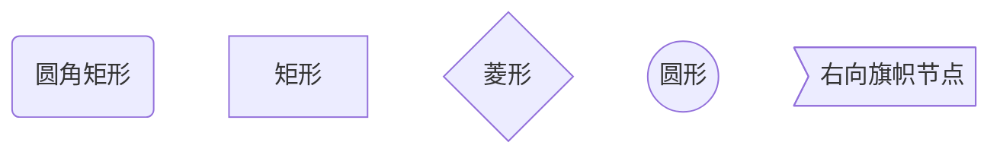
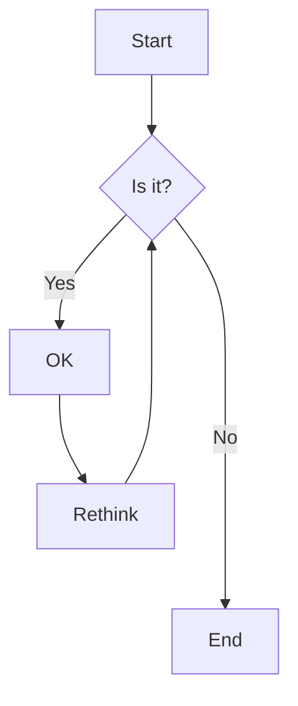
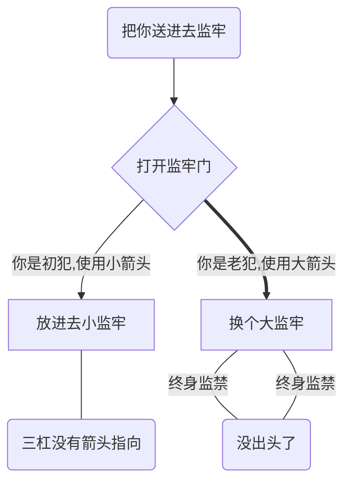
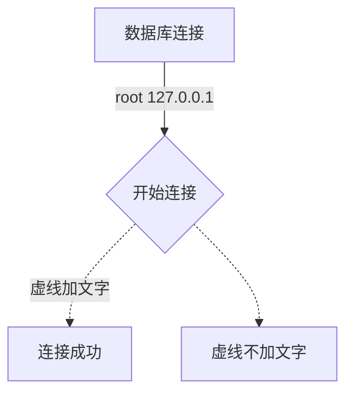
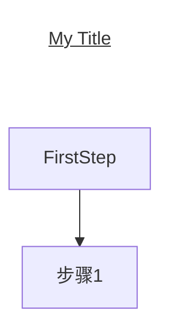
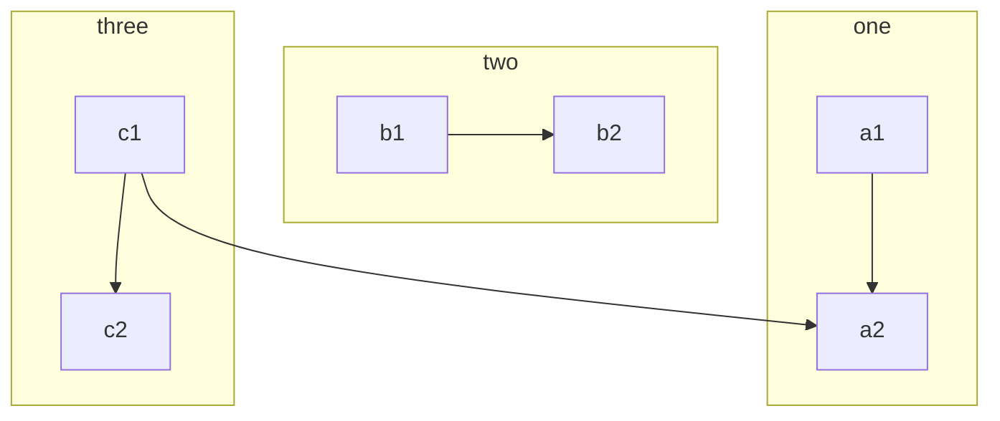
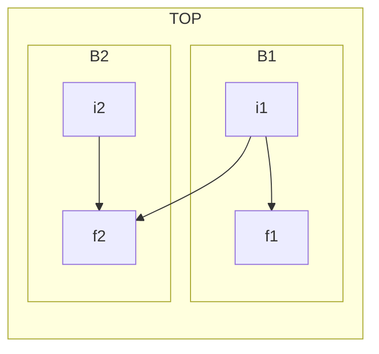
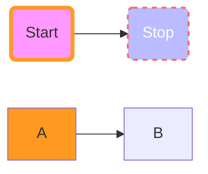
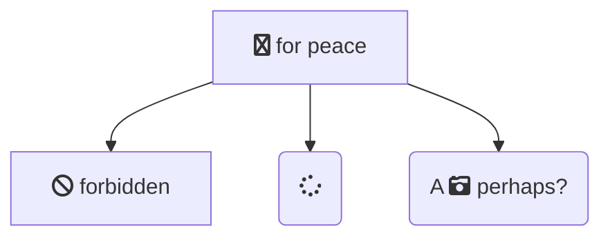
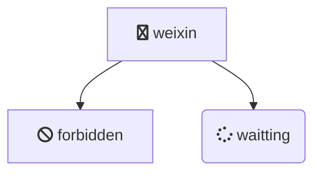

## 1.介绍

Mermaid 是一个用于画流程图、状态图、时序图、甘特图的库，使用 JS 进行本地渲染，广泛集成于许多 Markdown 编辑器中

## 2.流程图基础

### 2.1 流程图符号及含义

Mermaid 的流程图的图形含义使用象形的表达形式，非常类似中国象形，理解起来也不难，比如矩形 `[]`,圆角矩形`()`,圆形`(())`

| 图形             | 符号含义             |                |
| ---------------- | -------------------- | -------------- |
| **圆角矩形**     | 表示开始和结束       | `id(“文字”)`   |
| **矩形**         | 表示过程环节         | `id["文字"]`   |
| **单向箭头线段** | 表示流程进行方向     |                |
| **菱形**         | 决策判断             | `id{"文字"}`   |
| **圆形**         | 表示连接，避免流程图 | `id(("文字"))` |
| **右向旗帜节点** | 标志提示             | `id>"文字"]`   |

### 2.2 节点之间的连线

| 表述       | 说明           | 使用示例                                     |
| ---------- | -------------- | -------------------------------------------- |
| `-->`      | 添加尾部箭头   | `A(把你送进去监牢)-->B{打开监牢}`            |
| `---`      | 不添加尾部箭头 | `A(把你送进去监牢)---B{打开监牢}`            |
| `--`       | 单线           | `A(把你送进去监牢)--B{打开监牢}`             |
| `--text--` | 单线上加文字   | `A(把你送进去监牢)--你好亲爱的--B{打开监牢}` |
| `==`       | 粗线           | `A(把你送进去监牢)==>B{打开监牢}`            |
| `==text==` | 粗线加文字     |                                              |
| `-.-`      | 虚线           |                                              |
| `-.text.-` | 虚线加文字     |                                              |

**添加相应的`-`、`=`、`.`来增加长度**

| 长度              | 1    | 2     | 3      |
| ----------------- | ---- | ----- | ------ |
| Normal            | ---  | ----  | -----  |
| Normal with arrow | -->  | --->  | ---->  |
| Thick             | ===  | ====  | =====  |
| Thick with arrow  | ==>  | ===>  | ====>  |
| Dotted            | -.-  | -..-  | -...-- |
| Dotted with arrow | -.-> | -..-> | -...-> |

**箭头加上文字:**

**给流程表做标题**

### 2.3 布局方向

| TB/TB | Top Bottom 从上到下 |
| ----- | ------------------- |
| BT    | bottom top 从下到上 |
| LR    | left right 从左到右 |
| RL    | right left 从右到左 |

## 3 子图

### 3.1 子图结构和方向

## 4. 自定义CSS的`style & class`

`fill`、`stroke`、`stroke-width`、`color`是CSS中的概念，分别表示填充、边框、边框宽度、字体颜色

`fa:fa-sppinner`等以`fa`开始的是前端一套流行的图标库——`fontawesome`图标库

