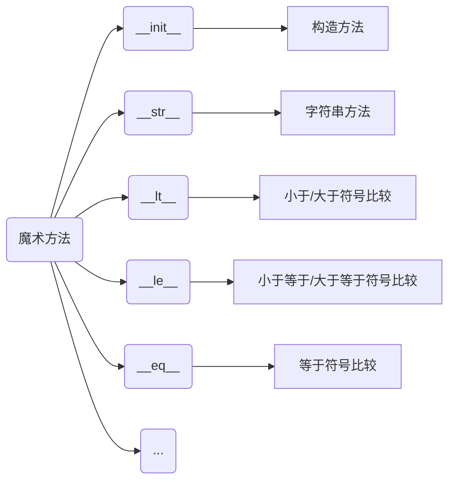

## 一、基础语法

### 1. 字面量

**字面量:**

- 在代码中，被写下来的的固定的值，称之为字面量

### 2. 注释

- 单行注释:以#开头，#右边的所有文字当作说明，而不是真正要执行的程序，起辅助说明作用

```python
# 我是单行注释
print( "Hello World")
```

**注意，#号和注释内容一般建议以一个空格隔开**

- 多行注释:以一对三个双引号引起来("""注释内容""")来解释说明一段代码的作用使用方法

```python
"""
我是多行注释
我是多行注释
我是多行注释
"""
print( "Hello World")
```

### 3. 变量

变量:

- 在程序运行时，能储存计算结果或能表示值的抽象概念。

简单的说，变量就是在程序运行时，记录数据用的

变量的定义格式

`变量名称=变量的值`

- 每一个变量都有自己的名称，称之为:变量名，也就是变量本身
- 赋值，表示将等号右侧的值，赋予左侧的变量
- 每一个变量都有自己存储的值(内容) ,称之为:变量值

### 4. 数据类型

#### 4.1 常用的数据类型

- Python 中常用的有6种值的类型

| 类型             | 描述                                                      | 说明                                                         |
| ---------------- | --------------------------------------------------------- | ------------------------------------------------------------ |
| 数字(Number)     | 整数(int)<br>浮点数(float)<br>复数(complex)<br>布尔(bool) | 整数:如10,-10<br>浮点数:如:13.14,-13.14<br>复数(complex) ,如: 4+3j,以j结尾表示复数<br>布尔(bool)表达现实生活中的逻辑，即真和假，True表示真,False表示假。<br>True本质上是一一个数字记作1, False记作0 |
| 字符串(String )  | 描述文本的一种数据类型                                    | 字符串(string) 由任意数量的字符组成                          |
| 列表(List)       | 有序的可变序列.                                           | Python中使用最频繁的数据类型，可有序记录一堆数据             |
| 元组(Tuple)      | 有序的不可变序列                                          | 可有序记录-堆不可变的Python数据集合                          |
| 集合(Set)        | 无序不重复集合                                            | 可无序记录-堆不重复的Python数据集合                          |
| 字典(Dictionary) | 无序Key-Value集合                                         | 可无序记录-堆Key-Value型的Python数据集合                     |

#### 4.2 type()语句

- 查看值或者变量的数据类型

语法

- `type(被查看类型的数据或变量)`

返回值

- `<class '数据类型'>`

```python
str = "Hello World"
var = None
print(type(1))
print(type("1"))
print(type(1.0))
print(type(str))
print(type(var))
```

```
输出结果
<class 'int'>
<class 'str'>
<class 'float'>
<class 'str'>
<class 'NoneType'>
```

#### 4.3 数据类型的转换

转换函数

- `数据类型(字面量或者变量)`

**常见的转换语句**

| 函数     | 说明                |
| -------- | ------------------- |
| int(x)   | 将x转换为一个整数   |
| float(x) | 将x转换为一个浮点数 |
| str(x)   | 将对象X转换为字符串 |

返回值

- 转换成功返回对应数据类型的值
- 转换失败则报错

### 5. 标识符命名规则

#### 5.1 命名规则

标识符命名中，只允许出现:

- 英文
- 中文
- 数字
- 下划线(_)

这四类元素, 其余任何内容都不被允许。

- 虽然python支持中文命名标识符, 但**不推荐使用中文**

#### 5.2 不可使用关键字

Python中有一系列单词，称之为关键字

- 关键字在Python中都有特定用途
- 我们不可以使用它们作为标识符

**常见的关键字:**

```
False  True  None  and  as  assert  break  class
continue  def  del  elif  else  except  finally
for  from  global  if  import  in  is  lambda  nonlocal
not  or  pass  raise  return  try  whi1e  with  yield
```

#### 5.3 变量命名规范

**标识符命名规范**

- 变量名
- 类名
- 方法名

不同的标识符有不同的规范

变量的命名规范

- 见名知意
- 下划线命名法
  - 多个单词组合变量名, 要使用下划线分隔
- 英文字母全小写

### 6. 运算符

#### 6.1 算术运算符

| 运算符 | 描述   | 实例                                                      |
| ------ | ------ | --------------------------------------------------------- |
| +      | 加     | 两个对象相加a+ b输出结果30                                |
| -      | 减     | 得到负数或是一个数减去另一个数a-b输出结果 -10             |
| *      | 乘     | 两个数相乘或是返回一个被重复若干次的字符串a* b输出结果200 |
| /      | 除     | b/a输出结果2                                              |
| //     | 取整除 | 返回商的整数部分9//2输出结果4 , 9.0//2.0输出结果4.0       |
| %      | 取余   | 返回除法的余数b %a输出结果0                               |
| **     | 指数   | a**b为10的20次方，输出结果100000000000000000000           |

#### 6.2 赋值运算符

| 运算符 | 描述             | 实例                                                        |
| ------ | ---------------- | ----------------------------------------------------------- |
| =      | 赋值运算符       | 把=号右边的结果赋给左边的变量，如num= 1+2*3，结果num的值为7 |
| +=     | 加法赋值运算符   | C+= a等效于C=C+ a                                           |
| -=     | 减法赋值运算符   | C-= a等效于 C=C- a                                          |
| *=     | 乘法赋值运算符   | `C*= a`等效于`C=C* a`                                       |
| /=     | 除法赋值运算符   | C /=a等效于C=c/ a                                           |
| %=     | 取模赋值运算符   | C %=a等效于C=C % a                                          |
| **=    | 幂赋值运算符     | `c**=a`等效于`C=C** a`                                      |
| // =   | 取整除赋值运算符 | c//a等效于c = c//a                                          |

#### 6.3 比较运算符

| 运算符 | 描述                                                        | 示例                        |
| ------ | ----------------------------------------------------------- | --------------------------- |
| ==     | 判断内容是否相等，满足为True，不满足为False                 | 如a=3,b=3，则(a == b)为True |
| !=     | 判断内容是否不相等，满足为True，不满足为False               | 如a=1,b=3，则(a != b)为True |
| >      | 判断运算符左侧内容是否大于右侧满足为True，不满足为False     | 如a=7,b=3，则(a > b)为True  |
| <      | 判断运算符左侧内容是否小于右侧满足为True，不满足为False     | 如a=3,b=7，则(a<b)为True    |
| >=     | 判断运算符左侧内容是否大于等于右侧满足为True，不满足为False | 如a=3,b=3，则(a >= b)为True |
| <=     | 判断运算符左侧内容是否小于等于右侧满足为True，不满足为False | 如a=3,b=3，则(a<= b)为True  |

### 7. 字符串

#### 7.1 字符串的三种定义方式

字符串在Python中有多种定义形式

- 单引号定义法:name ='hello world'
- 双引号定义法:name ="hello world"
- 三引号定义法:name = """hello world"""

三引号定义法，和多行注释的写法一样，同样支持换行操作。
使用变量接收它，它就是字符串
不使用变量接收它，就可以作为多行注释使用。  d

#### 7.2 字符串的引号嵌套

- 单引号定义法，可以内含双引号
- 双引号定义法，可以内含单引号
- 可以使用转移字符(`\`)来将引号解除效用，变成普通字符串

#### 7.3 字符串的拼接

如果我们有两个字符串(文本)字面量，可以将其拼接成一个字符串，通过+号即可完成

一般，字面量和变量或变量和变量之间会使用拼接

**无法使用+号与非字符串类型拼接**

#### 7.4 字符串的格式化

通过下面语法进行字符串拼接

```python
str = "string %s" % name
```

其中的，%S

- %表示:我要占位
- s表示:将变量变成字符串放入占位的地方

注意

- 多个变量占位, 变量要用括号括起来, 并按照占位的顺序填入

**常见的数据类型占位**

| 格式符号 | 转化                             |
| -------- | -------------------------------- |
| %s       | 将内容转换成字符串，放入占位位置 |
| %d       | 将内容转换成整数，放入占位位置   |
| %f       | 将内容转换成浮点型，放入占位位置 |

#### 7.5 快速格式化

语法

- `f"内容{变量}"`的格式来快速格式化

```python
name = "张三"
age = 18
print(f"我是{name},我是{age}岁")
```

这种方式

- 不考虑类型
- 不做精度控制

适合对精度没有要求的时候快速使用

语法

- `.format(变量,变量)`

```python
name = "张三"
age = 18
print("我是.format()格式化输出的：我叫{}，今年{}岁".format(name, age))
```

#### 7.6 格式化的精度控制

**数字精度控制**

我们可以使用辅助符号"m.n"来控制数据的宽度和精度

- m，控制宽度，要求是数字（很少使用）,设置的宽度小于数字自身，不生效. 
- .n，控制小数点精度，要求是数字，会进行小数的四舍五入

### 8. 数据的输入输出

input是python中数据输入的函数,用来获取键盘的输入

print时python中数据输出的函数

- 数据输出; print
- 数据输入: input

#### 8.1 input函数

使用

- 使用input()语句可以从键盘获取输入
- 使用一个变量接收（存储) input语句获取的键盘输入数据即可

**注意**

- 无论键盘输入什么类型的数据，获取到的数据永远都是**字符串类型**

#### 8.2 print函数

print函数输出一行文本，可以是字符串，数值，或者其他类型，输出完后默认换行

- 要使print输出默认不换行可以使用`end = ''`参数，即可使print输出不换行

```python
print("hello",end = '')
print('world',end = '')
```

```python
输出结果
helloworld
```

### 9. 分支语句

#### 9.1 if语句

语法

```python
if 判断条件:
    条件成立时执行的语句
    条件成立时执行的语句
    条件成立时执行的语句
```

注意

- python 中的嵌套关系使用缩进(缩进为4个空格)控制,故没有花括号

#### 9.2 if else语句

语法

```python
if 判断条件:
    条件成立时执行的语句
    条件成立时执行的语句
    条件成立时执行的语句
else:
    不满足条件时执行的语句
    不满足条件时执行的语句
    不满足条件时执行的语句
```

#### 9.3 if elif else语句

语法

```python
if 判断条件1:
    条件成立时执行的语句
    条件成立时执行的语句
    条件成立时执行的语句
elif 判断条件2:
    条件成立时执行的语句
    条件成立时执行的语句
    条件成立时执行的语句
elif 判断条件3:
    条件成立时执行的语句
    条件成立时执行的语句
    条件成立时执行的语句
else:
    不满足条件时执行的语句
    不满足条件时执行的语句
    不满足条件时执行的语句
```

#### 9.4 if语句的缩进

语法

```python
if 判断条件1:
    条件成立时执行的语句
    条件成立时执行的语句
    条件成立时执行的语句
    if 判断条件2:
    	条件成立时执行的语句
    	条件成立时执行的语句
    	条件成立时执行的语句
else:
    不满足条件时执行的语句
    不满足条件时执行的语句
    不满足条件时执行的语句
```

### 10. 循环语句

#### 10.1 while循环

语法

```python
while 条件:
    条件满足时执行的语句
    条件满足时执行的语句
    条件满足时执行的语句
```

#### 10.2 for循环

语法

```python
for 临时变量 in 待处理数据集:
    满足条件时执行的代码
```

语法中的:待处理数据集，严格来说，称之为:**序列类型**
序列类型指，**其内容可以一个个依次取出的一种类型**，包括:

- 字符串
- 列表
- 元组
- 等

##### 10.2.1 统计字母出现次数

```python
str = "Visul Studio Code"
count = 0
for x in str:
    if x == "o":
        count += 1
print(count)
```

##### 10.2.2 range语句

语法1

- `range(num)`

获取一个从0开始，到num结束的数字序列（不含num本身)

如range(5)取得的数据是:[0,1,2,3,4]

语法2

- `range(num1,num2)`

获得一个从num1开始，到num2结束的数字序列（不含num2本身)

如，range(5,10)取得的数据是:[5,6,7,8,9]

语法3

- `range(num1, num2, step)`

获得一个从num1开始，到num2结束的数字序列（不含num2本身)

数字之间的步长，以step为准 ( step默认为1)

如，range(5,10,2)取得的数据是:[5,7,9]

#### 10.3 打印九九乘法表

while循环

```python
i = 1
while i <= 9:
    j = 1
    while j <= i:
        print(f"{j} * {i} = {i*j}", end="\t")
        j += 1
    print("")
    i += 1
```

for循环

```python
for i in range(1, 10):
    for j in range(1, i+1):
        print(f"{j} * {i} = {i*j}", end="\t")
    print()
```

#### 10.4 循环中断

##### 10.4.1 break

continue关键字用于:中断本次循环，直接进入下一次循环

continue可以用于:for循环和while循环，效果一致

##### 10.4.2 continue

break关键字用于:直接结束循环

break可以用于:for循环和while循环，效果一致

### 11. 函数

#### 11.1 简介

函数:是组织好的，可重复使用的，用来实现特定功能的代码段。

定义

```python
def 函数名(传入参数):
	函数体
	return 返回值
```

调用

```python
函数名(参数)
```

注意

- 参数如不需要,可以省略
- 返回值如不需要，可以省略
- 函数必须先定义后使用

#### 11.2 传入参数

传入参数的功能是:在函数进行计算的时候，接受外部（调用时）提供的数据

```python
def add(x, y):
    result = x+y
    print(result)
add(1, 1)
```

#### 11.3 返回值

```python
def 函数(参数...)
	函数体
    return 返回值
```

**None类型**

Python中有一个特殊的字面量:None，其类型是:`<class 'NoneType'>`
无返回值的函数，实际上就是返回了:None这个字面量

#### 11.4 函数说明文档

我们可以给函数添加说明文档，辅助理解函数的作用。

```python
def func(x,y):
    """
    函数说明
    :param x: 形参x的说明
    :param y: 形参y的说明
    :return: 返回值的说明
    """
    函数体
    return 返回值
```

#### 11.5 函数的嵌套调用

所谓函数嵌套调用指的是一个函数里面又调用了另外一个函数

```python
def func_b():
    print("b")

def func_a():
    print("a")
    func_b()
func_a()
```

#### 11.6 局部变量

变量作用域指的是变量的作用范围（变量在哪里可用，在哪里不可用)
主要分为两类:**局部变量**和**全局变量**

所谓局部变量是定义在函数体内部的变量，即只在函数体内部生效

```python
def testA():
    num = 100
    print(num)
testA()
print(num)
# 报错, num是局部变量在函数外不可访问
```

#### 11.7 函数的多返回值

语法

```python
def func():
    return 1,2
x,y = func()
"""
按照返回值的顺序，写对应顺序的多个变量接收即可
变量之间用逗号隔开
支持不同类型的数据return
"""
```

#### 11.8 函数的多种传参方式

**位置参数**

- 调用函数时根据函数定义的参数位置来传递参数

```python
def user _info(name,age,gender):
    print(f"名字:{name},年龄:{age},性别:{gender}")
user_info("TOM",20,"男")
```

注意

- 传递的参数和定义的参数的顺序和个数必须一致


**关键字参数**

- 函数调用时通过"键=值"形式传递参数

```python
def user _info(name,age,gender):
    print(f"名字:{name},年龄:{age},性别:{gender}")
user_info(name="TOM",age=20,gender="男")
```

注意

- 函数调用时，如果有位置参数时，位置参数必须在关键字参数的前面，但关键字参数之间不存在先后顺序


**缺省参数**

- 缺省参数也叫默认参数，用于定义函数，为参数提供默认值，调用函数时可不传该默认参数的值（注意:所有位置参数必须出现在默认参数前，包括函数定义和调用)

```python
def user _info(name,age,gender="男"):
    print(f"名字:{name},年龄:{age},性别:{gender}")
user_info("TOM",20)
```


**不定长参数**

- 不定长参数也叫可变参数.用于不确定调用的时候会传递多少个参数(不传参也可以)的场景

```python
def user_info(*args):
    print(args)
user_info("TOM")
user_info("TOM",18)
```

注意

- 传进的所有参数都会被args变量收集，它会根据传进参数的位置合并为一个元组(tuple)，args是元组类型，这就是位置传递

```python
def user_info(**kwargs):
    print(kwargs)
user_info(name="TOM",age=18,id=110)
```

注意

- 参数是“键=值”形式的形式的情况下，所有的“键=值”都会被kwargs接受，同时会根据“键=值”组成字典

#### 11.9 函数作为参数传递

```python
def test_func(compute):
    # compute函数作为函数参数传递
    result = compute(1,2)
    print(result)

def compute(x,y):
    return x + y
```

#### 11.10 lambda匿名函数

函数的定义中

- def关键字，可以定义带有名称的函数
- lambda关键字，可以定义匿名函数（无名称)

有名称的函数，可以基于名称**重复使用**。
无名称的匿名函数，只可**临时使用一次**。


**定义语法:**
`lambda 传入参数: 函数体(一行代码)`

- lambda是关键字，表示定义匿名函数
- 传入参数表示匿名函数的形式参数，如:x, y表示接收2个形式参数
- 函数体，就是函数的执行逻辑，要注意:只能写一行，无法写多行代码

```python
def test_func(compute):
  result = compute(1,2)
  print(f"result:{result}")
test_func(lambda x,y:x+y)
```


##  二、数据容器

**Python中的数据容器:**
一种可以容纳多份数据的数据类型，容纳的每一份数据称之为1个元素每一个元素，可以是任意类型的数据，如字符串、数字、布尔等。

### 1. list列表

语法

```python
# 字面量
[元素1,元素2,元素3,...]

# 定义变量
变量名称 = [元素1,元素2,元素3,...]

# 定义空列表
变量名称 = []
变量名称 = list()
```

列表内的**每一个数据，称之为元素**

- 以`[]`作为标识
- 列表内每一个元素之间用`,`逗号隔开

####  1.1 下标索引

**循序索引**

- 从0开始到n-1结束

**逆序索引**

- 从-1开始到-n结束

#### 1.2 列表的常用操作                                                                                                                                                                                                                                                                                                                                                                                                                                                                                                                                                                                                                                                                                                                                                                                                                                                                                                                                                                                                                                                                                                                                                                                                                                         

列表除了可以:

- 定义
- 使用下标索引获取值

以外，列表也提供了一系列功能:

- 插入元素
- 删除元素
- 清空列表
- 修改元素
- 统计元素个数
- 等等功能。

这些功能我们都称之为:**列表的方法**

| 方法   | 语法                        | 描述                                                 |
| ------ | --------------------------- | ---------------------------------------------------- |
| index  | `列表.index(元素)`          | 查找指定元素在列表的下标，如果找不到，报错valueError |
| insert | `列表.insert(索引,元素)`    | 在指定索引位置插入新元素                             |
| append | `列表.append(元素)`         | 将指定元素追加到列表的尾部                           |
| extend | `列表.extend(其他数据容器)` | 将其他数据容器的内容取出,依次追加到列表尾部          |
| del    | `del 列表[下标]`            | 删除列表指定元素                                     |
| pop    | `列表.pop(下标)`            | 删除列表指定元素后取出, 不对原列表修改               |
| remove | `列表.remove(元素)`         | 删除某元素在列表中的第一个匹配项                     |
| clear  | `列表.clear()`              | 清空列表                                             |
| count  | `列表.count(元素)`          | 统计某元素在列表中的数量                             |
| len    | `len(列表)`                 | 统计列表中有多少元素                                 |

#### 1.3 列表的遍历

既然数据容器可以存储多个元素，那么，就会有需求从容器内依次取出元素进行操作。将容器内的元素依次取出进行处理的行为，称之为:**遍历**、**迭代**。

```python
index  = 0
while index < len(列表):
    元素 = 列表[index]
    对元素进行处理
    index += 1
```

```python
for x in 列表:
    对元素进行处理
```

#### 1.4 二维列表

语法

```python
a = [[0 for _ in range(2)] for _ in range(3)]
```

```bash
结果：
[[0, 0], [0, 0], [0, 0]]
```

`_`符号

- 在这里是一个循环标志，也可以使用i，j等其他字母代替

`0` 数字

- 在这里是数组内填充用的数字，可以使用其他数字


### 2. tuple元组

**元组中的数据一旦定义便不可以修改**

元组定义:定义元组使用小括号，且使用逗号隔开各个数据，数据可以是不同的数据类型。

```python
# 字面量
(元素1,元素2,元素3,...)
# 定义元组变量
变量名称 = (元素1,元素2,元素3,...)
# 定义空元组
变量名称 = ()
变量名称 = tuple()
```

#### 2.1 元组的常用操作

| 方法      | 描述                                               |
| --------- | -------------------------------------------------- |
| index()   | 查找某个数据，如果数据存在返回对应的下标，否则报错 |
| count()   | 统计某个数据在当前元组出现的次数                   |
| len(元组) | 统计元组内的元素个数                               |

### 3. str字符串

字符串是字符的容器，一个字符串可以存放任意数量的字符。

#### 3.1 字符串的常用操作

| 方法                              | 描述                                                         |
| --------------------------------- | ------------------------------------------------------------ |
| `字符串.replace(字符串1,字符串2)` | 将字符串内全部字符串1替换为字符串2,不修改字符串本身,而是 返回一个新字符串 |
| `字符串.split(分割字符串)`        | 按照指定的分割符字符串,将字符串划分为多个字符串,返回一个列表对象 |
| `字符串.strip(字符串)`            | 无参数时去除字符串前后空格,有参数时去除前后指定字符串        |
| `字符串.count(字符串1)`           | 统计字符串1在字符串中的出现次数                              |
| `len(字符串)`                     | 统计字符串的长度                                             |

### 4. 序列

序列

- 内容连续、有序，可使用下标索引的一类数据容器

**列表、元组、字符串，均可以可以视为序列。**

#### 4.1 序列常用操作

序列支持切片，即:列表、元组、字符串，均支持进行切片操作

切片

- 从一个序列中，取出一个子序列

语法

- `序列[起始下标:结束下标:步长]`

**表示从序列中，从指定位置开始，依次取出元素，到指定位置结束，得到一个新序列:**

- 起始下标表示从何处开始，可以留空，留空视作从头开始
- 结束下标（不含）表示何处结束，可以留空，留空视作截取到结尾
- 步长表示，依次取元素的间隔
  - 步长1表示，一个个取元素
  - 步长2表示，每次跳过1个元素取
  - 步长N表示，每次跳过N-1个元素取
  - 步长为负数表示，反向取（注意，起始下标和结束下标也要反向标记)

### 5. set集合

集合不支持重复元素,且内容无序

**不支持下标索引访问,允许修改**

语法

```python
# 字面量
{元素1,元素2,元素3,...}
# 定义集合变量
变量名称 = {元素1,元素2,元素3,...}
# 定义空集合
变量名称 = set()
```

#### 5.1 集合常用操作

| 方法                             | 描述                                             |
| -------------------------------- | ------------------------------------------------ |
| `集合.pop()`                     | 随机取出一个元素                                 |
| `集合.add("元素")`               | 添加一个元素                                     |
| `集合.remove("元素")`            | 移除元素                                         |
| `集合.clear()`                   | 清空集合                                         |
| `集合1.difference(集合2)`        | 取出集合1和集合2的差集(集合1有的而集合2没有的)   |
| `集合1.difference_update(集合2)` | 对比集合1和集合2,在集合1内,删除和集合2相同的元素 |
| `集合1.union(集合2)`             | 合并两个集合                                     |
| `len(集合)`                      | 返回集合元素的数量                               |

#### 5.2 遍历集合

语法

```python
for element in 集合:
    对element的操作
```

### 6. dict字典

字典即**键值对**

```python
# 字面量
{key:value,key:value,key:value,...}
# 定义字典变量
变量名称 = {key:value,key:value,key:value,...}
# 定义空字典
变量名称 = {}
变量名称 = dict()
```

#### 6.1 字典的常用操作

| 方法                | 描述                                   |
| ------------------- | -------------------------------------- |
| `字典[key] = value` | 新增/更新元素                          |
| `字典.pop(key)`     | 获得指定key的value,同时key的数据被删除 |
| `字典.clear()`      | 字典被清空                             |
| `字典.keys()`       | 获取字典的全部key                      |
| `len(字典)`         | 计算字典内元素的数量                   |

#### 6.2 遍历字典

语法

```python
for key in 字典:
    print(f"key:{key};value:{字典[key]}")
```

### 7. 数据容器的通用操作

#### 7.1 遍历

```python
for x in 数据容器:
    对x的操作
```

#### 7.2 通用统计功能

| 方法        | 描述                 |
| ----------- | -------------------- |
| `len(容器)` | 统计容器内元素个数   |
| `max(容器)` | 统计容器内的最大元素 |
| `min(容器)` | 统计容器内的最小元素 |

#### 7.3 通用转换功能

| 方法          | 描述                   |
| ------------- | ---------------------- |
| `list(容器)`  | 将指定容器转换为列表   |
| `str(容器)`   | 将指定容器转换为字符串 |
| `tuple(容器)` | 将指定容器转换为元组   |
| `set(容器)`   | 将指定容器转换为集合   |

#### 7.4 通用排序功能

| 方法                      | 描述               |
| ------------------------- | ------------------ |
| `sort(容器,reverse=true)` | 将指定容器进行排序 |

## 三、文件操作

### 1. 文件的读写

#### 1.1 open()打开函数

在Python，使用open函数，可以打开一个已经存在的文件，或者创建一个新文件，语法如下

`open(name, mode, encoding)`

| 参数     | 描述                                                    |
| -------- | ------------------------------------------------------- |
| name     | 是要打开的目标文件名的字符串(可以包含文件所在的具体路径 |
| mode     | 设置打开文件的模式(访问模式):只读、写入、追加等。       |
| encoding | 编码格式（推荐使用UTF-8)                                |

注意

- 此时的f是open函数的文件对象，对象是Python中一种特殊的数据类型，拥有属性和方法

#### 1.2 mode常用的三种基础访问模式

| 模式 | 描述                                                         |
| ---- | ------------------------------------------------------------ |
| r    | 以只读方式打开文件。文件的指针将会放在文件的开头。这是默认模式。 |
| w    | 打开一个文件只用于写入。如果该文件已存在则打开文件，并从开头开始编辑，原有内容会被删除。如果该文件不存在，创建新文件。 |
| a    | 打开一个文件用于追加。如果该文件已存在，新的内容将会被写入到已有内容之后。如果该文件不存在，创建新文件进行写入。 |

#### 1.3 读操作相关方法

`read()`方法

```python
文件对象.read(num)
```

num表示要从文件中读取的数据的长度（单位是字节)，如果没有传入num，那么就表示读取文件中所有的数据。

`readlines()`方法

```python
f = open('python.txt')
content = f.readlines()

#['hello world\n','abcdefg\n','aaa\n','bbb\n' ,'ccc']
print(content)

#关闭文件
f.close()
```

- readlines可以按照行的方式把整个文件中的内容进行一次性读取，并且返回的是一个列表，其中每一行的数据为一个元素。

`readline()`方法

- **一次读取一行内容**


文件关闭操作

语法

- `文件对象.close`


with open语法

```python
with open("python.txt", "r") as f:
	f.readlines()
```

- 通过在with open的语句块中对文件进行操作
- 可以在操作完成后自动关闭close文件，避免遗忘掉close方法

#### 1.4 写操作相关方法

`w`模式写文件

```python
#1.打开文件
f = open('python.txt' , 'w')
#2.文件写入
f.write('hello world')
#3.内容刷新
f.flush()
```

注意:

- 直接调用write，内容并未真正写入文件，而是会积攒在程序的内存中，称之为缓冲区
- 当调用flush的时候，内容会真正写入文件
- 这样做是避免频繁的操作硬盘，导致效率下降（攒一堆，一次性写磁盘)

`a`模式写文件

```python
#1.打开文件，通过a模式打开即可
f = open('python.txt','a')
#2.文件写入
f.write('hello world')
#3.内容刷新
f.flush()
```

注意:

- a模式，文件不存在会创建文件
- a模式，文件存在会在最后，追加写入文件
- 使用`\n`写换行符号

## 四、异常、模块、包

### 1.异常

当检测到一个错误时，Python解释器就无法继续执行了，反而出现了一些错误的提示，这就是所谓的“异常”，也就是我们常说的BUG

#### 1.1 捕获异常

基本捕获语法

```python
try:
    f = open("D:/abc.txt","r",encoding="UTF-8")
except:
    print(" 改用w模式打开")
    f = open("D:/abc.txt","w",encoding="UTF-8")
```

捕获指定异常

```python
try:
    print(name)
except NameError as e:
    print("捕获变量未定义异常")
    print(e)
```

捕获多个异常

- 当捕获多个异常时，可以把要捕获的异常类型的名字，放到except后，并使用元组的方式进行书写。

```python
try:
	print(1/0)
except (NameError,ZeroDivisionError) as e:
	print('ZeroDivision错误...')
```

捕获全部异常

```python
try:
    f = open("D:/abc.txt","r")
except Exception as e:
    print(e)
```

异常else

- else表示的是如果没有异常要执行的代码。

```python
try:
	print(1)
except Exception as e:
    print(e)
else:
	print('我是else，是没有异常的时候执行的代码')
```

异常finally

- finally表示的是无论是否异常都要执行的代码，例如关闭文件。

```python
try:
	f = open('test.txt' , 'r')
except Exception as e:
    f =open( 'test.txt' , 'w')
else:
	print('没有异常')
finally:
	f.close()
```

#### 1.2 异常的传递

- 异常是具有传递性的

```python
def func01():
    print("func01")
    num = 1/0
    print("func01 end")


def func02():
    print("func02")
    func01()
    print("func02 end")


def main():
    try:
        func02()
    except Exception as e:
        print(e)
main()
```


当**函数func01**中发生异常，并且没有捕获处理这个异常的时候，异常会传递到**函数func02**，当func02也没有捕获处理这个异常的时候main函数会捕获这个异常，这就是异**常的传递性.**

- 当所有函数都没有捕获到异常的时候,程序就会报错

### 2. 模块

Python模块(Module)，是一个 Python 文件，以.py结尾． 模块能定义函数，类和变量，模块里也能包含可执行的代码

#### 2.1 模块的导入方式

导入语法

`[from 模块名] import [模块 | 类 | 变量 | 函数 |*] [as 别名]`

常用的组合

- import 模块名
- from 模块名 imort 类、变量、方法等
- from 模块名 import *
- import 模块名 as 别名
- from 模块名 import 功能名 as 别名

#### 2.2 自定义模块

新建python文件，命名为my_modulel.py，并定义test函数

导入模块

`import my_modulel`

即可使用模块中的函数

#### 2.3 `__main__`和`__all__`变量

`__main__`变量

在模块中调用了函数,在测试类中导入模块时就会执行函数

要使导入时不调用函数可以使用`__main__`变量限制

```python
def test(a,b):
    print(a+b)
    
if __name__ == "__main__":
    test(1,2)
```

`__all__`变量

如果一个模块文件中有`_all_`变量，当使用`from xxx import *`导入时，只能导入这个列表中的元素

```python
__all__ = ['test_A']

def test_A():
	print("test_A")

def test_B():
    print("test_B")
```

### 3. python包

**从物理上看**

- 包就是一个文件夹，在该文件夹下包含了一个`__init__.py`文件，该文件夹可用于包含多个模块文件

**从逻辑上看**

- 包的本质依然是模块

python包目录

```
└─package
        module1.py
        module2.py
        module3.py
        module4.py
        __init__.py
```

#### 3.1 `__init__.py`

在`__init__.py`文件中写`__main__`和`__all__`变量,功能和在模块中写一样

#### 3.2 第三方包

在Python程序的生态中，有许多非常多的第三方包（非Python官方)，可以极大的帮助我们提高开发效率，如:·

- 科学计算中常用的:numpy包
- 数据分析中常用的: pandas包
- 大数据计算中常用的:pyspark、apache-flink包
- 图形可视化常用的: matplotlib、pyecharts
- 人工智能常用的: tensorflow
- 等等

#### 3.3 安装第三方包

第三方包的安装非常简单，我们只需要使用Python内置的pip程序即可。

语法

- `pip install 包名称`

## 综合案例

### 1. 前置知识

#### 1.1. json

- JSON是一种轻量级的数据交互格式。可以按照JSON指定的格式去组织和封装数据
- JSON本质上是一个带有特定格式的字符串
- JSON就是一种在各个编程语言中流通的数据格式，**负责不同编程语言中的数据传递和交互**

字典向JSON的转换

```python
import json
# 字典向JSON的转换
data = [{"name":"张大山","age":11},{"name":"李小花","age":12},{"name":"王大锤","age":13}]
json_data = json.dumps(data,ensure_ascii=False)
print(type(json_data))
print(json_data)
print("--------------------------------------------------")

# JSON字符串向字典列表的转换
str = '[{"name": "张大山", "age": 11}, {"name": "李小花", "age": 12}, {"name": "王大锤", "age": 13}]'
dict_data = json.loads(str)
print(type(dict_data))
print(dict_data)
```

#### 1.2 pyecharts模块

Echarts是个由百度开源的数据可视化，凭借着良好的交互性，精巧的图表设计，得到了众多开发者的认可.而Python是门富有表达力的语言，很适合用于数据处理.当数据分析遇上数据可视化时pyecharts诞生了.

**官方画廊**

https://gallery.pyecharts.org/#/README

#### 1.3 pyecharts快速入门

 折线图

```python
import json
from pyecharts.charts import Line
from pyecharts.options import TitleOpts, LabelOpts


# 处理数据
f_us = open("C:/Users/admin/Desktop/workspace/VSCode-Workplace/python/python资料/可视化案例数据/折线图数据/美国.txt",
            "r", encoding="utf-8")
us_data = f_us.read()
f_jp = open("C:/Users/admin/Desktop/workspace/VSCode-Workplace/python/python资料/可视化案例数据/折线图数据/日本.txt",
            "r", encoding="utf-8")
jp_data = f_jp.read()
f_in = open("C:/Users/admin/Desktop/workspace/VSCode-Workplace/python/python资料/可视化案例数据/折线图数据/印度.txt",
            "r", encoding="utf-8")
in_data = f_in.read()
# 去掉不合JSON规范的开头
us_data = us_data.replace("jsonp_1629344292311_69436(", "")
jp_data = jp_data.replace("jsonp_1629350871167_29498(", "")
in_data = in_data.replace("jsonp_1629350745930_63180(", "")
# 去掉不合JSON规范的结尾
us_data = us_data[:-2]
jp_data = jp_data[:-2]
in_data = in_data[:-2]
# JSON字符串转换为Python对象
us_dict = json.loads(us_data)
jp_dict = json.loads(jp_data)
in_dict = json.loads(in_data)
# 获取trend key
us_trend_data = us_dict["data"][0]["trend"]
jp_trend_data = jp_dict["data"][0]["trend"]
in_trend_data = in_dict["data"][0]["trend"]
# 获取日期 取到2020年之前的数据
us_x_data = us_trend_data["updateDate"][:314]
jp_x_data = jp_trend_data["updateDate"][:314]
in_x_data = in_trend_data["updateDate"][:314]
# 获取确认数据，用于y轴，取2020年（到314下标结束）
us_y_data = us_trend_data["list"][0]["data"][:314]
jp_y_data = jp_trend_data["list"][0]["data"][:314]
in_y_data = in_trend_data["list"][0]["data"][:314]
# 生成图表
line = Line()
line.add_xaxis(us_x_data)
line.add_xaxis(jp_x_data)
line.add_xaxis(in_x_data)

line.add_yaxis("美国确诊人数", us_y_data, label_opts=LabelOpts(is_show=False))
line.add_yaxis("日本确诊人数", jp_y_data, label_opts=LabelOpts(is_show=False))
line.add_yaxis("印度确诊人数", in_y_data, label_opts=LabelOpts(is_show=False))

# 设置全局选项
line.set_global_opts(
    title_opts=TitleOpts(title="2020年美日印确诊人数对比折线图",pos_left="center", pos_bottom="1%")
)
line.render()

# 关闭文件
f_us.close
f_jp.close
f_in.close
```

## 五、对象

面向对象编程，是许多编程语言都支持的一种编程思想。
简单理解是:基于模板（类）去创建实体（对象），使用对象完成功能开发。

面向对象包含3大主要特性:

- 封装
- 继承
- 多态

### 1. 对象的概念

封装属性和方法的一种思想

**定义语法：**

```python
class 类名称:
    类的属性
    
    类的行为
```

**创建语法：**

```python
对象 = 类名称()
```

**类的基本操作**

```python
# 设计一个类
class Student:
      name = None          # 记录学生姓名
      gender = None        # 记录学生性别
      nationality = None   # 记录学生国籍
      nation_place = None  # 记录学生籍贯
      age = None           # 记录学生年龄

# 创建一个对象
stu_1 = Student()

# 为对象的属性赋值
stu_1.name = '张三'
stu_1.gender = '男'
stu_1.nationality = '中国'
stu_1.nation_place = '北京'
stu_1.age = 20

# 获取对象的属性值
print(stu_1.name)
print(stu_1.gender)
print(stu_1.nationality)
print(stu_1.nation_place)
print(stu_1.age)
```

### 2. 类的成员

类的成员分：

- 成员变量，是类中定义的属性
- 成员方法，是类中定义的函数

**成员方法**

在类中国定义成员方法和定义函数基本一致，但有细微区别

```python
def 方法名(self, 形参1,....,形参N):
    方法体
```

可以看到，在方法定义的参数列表中，有一个: `self`

关键字`self`关键字是成员方法定义的时候，必须填写的。

- 它用来表示类对象自身的意思
- 当我们使用类对象调用方法的是，self会自动被python传入
- **在方法内部，想要访问类的成员变量，必须使用self**
- 在传入参数的时候，self是透明的，可以不用理会它

### 3. 构造方法

Python类可以使用:`__init__()`方法，称之为构造方法。可以实现:

- 在创建类对象（构造类）的时候，会自动执行。
- 在创建类对象（构造类)的时候，将传入参数自动传递给`__init__`方法使用。

### 4. 内置方法(魔术方法)

上文学习的`__init__`构造方法，是Python类内置的方法之一。
这些内置的类方法，各自有各自特殊的功能，这些内置方法我们称之为︰**魔术方法**



`__str__`方法控制对象返回字符串

```python
# 创建一个对象
stu_1 = Student()

print(stu_1)
```

```
默认返回值
<__main__.Student object at 0x000001CD59D74490>
```

```python
# 设计一个类
class Student:
      name = None          # 记录学生姓名
      gender = None        # 记录学生性别
      nationality = None   # 记录学生国籍
      nation_place = None  # 记录学生籍贯
      age = None           # 记录学生年龄
      def __str__(self):
            return f"姓名：{self.name},性别：{self.gender},国籍：{self.nationality},籍贯：{self.nation_place},年龄：{self.age}" 

# 创建一个对象
stu_1 = Student()

print(stu_1)
```

```
返回值
姓名：None,性别：None,国籍：None,籍贯：None,年龄：None
```


`__lt__`方法实现对两个对象的小于/大于符号的比较

```python
def __lt__(self,other):
            return self.age < other.age
```

`__le__`方法实现对两个对象的小于等于/大于等于符号的比较

```python
def __le__(self,other):
            return self.age <= other.age
```

`__eq__`方法对两个对象`==`符号的比较

```python
def __eq__(self,other):
            return self.age == other.age
```

### 5. 封装

封装

- 将属性和行为结合到一起的思想

#### 5.1 私有成员

类中提供了私有成员的形式来支持。

- 私有成员变量
- 私有成员方法

定义私有成员的方式非常简单，只需要:

- 私有成员变量: 变量名以`__`开头（2个下划线）
- 私有成员方法: 方法名以`__`开头（2个下划线）

即可完成私有成员的设置

**私有成员无法被类对象使用，但是可以被其它的成员使用。**

```python
class Phone:
      __current_voltage = None      #手机运行电压

      def __keep_single_core(self):
          print("让CPU以单核模式运行")

phone = Phone()
```

### 6. 继承

继承

- 单继承
- 多继承

#### 6.1 单继承/多继承

语法

```python
# 单继承
class 类名(父类名):
	类内容
# 多继承
class 类名(父类1, 父类2, ..., 父类N):
    类内容
```

**多继承同名成员,谁先继承,谁的优先级高**

#### 6.2 pass关键字

占位语句,保证类或者方法定义的完整性,表示空,无内容的意思

```python
class 类名():
    pass
```

#### 6.3 复写和调用父类同名成员

子类继承父类的成员属性和成员方法后，如果对其“不满意”，那么可以进行复写。

**复写只需要在子类中重新定义即可**

一旦复写父类成员，那么类对象调用成员的时候，就会调用复写后的新成员
如果需要使用被复写的父类的成员，需要特殊的调用方式:

方法一:

- 调用父类成员
  - 使用成员变量: `父类名.成员变量`
  - 使用成员方法: `父类名.成员方法(self)`

方法二:

- 使用`super()`调用父类成员
  - 使用成员变量: `super().成员变量`
  - 使用成员方法: `super().成员方法()`

### 7.  类型注解

Python在3.5版本的时候引入了类型注解，以方便静态类型检查工具，IDE等第三方工具。
类型注解: 在代码中涉及数据交互的地方，提供数据类型的注解（显式的说明）。

主要功能:

- 帮助第三方IDE工具（如PyCharm)对代码进行类型推断，协助做代码提示
- 帮助开发者自身对变量进行类型注释

支持:

- 变量的类型注解
- 函数（方法）形参列表和返回值的类型注解

#### 7.1 变量的类型注解

语法1

`变量: 类型`

语法2--在注释中进行类型注解

`#type: 类型`

```pythonthon
var_1 = 10  # type: int
```

容器类型详细注解

`变量: 容器类型[类型1, 类型2, ..., 类型N]`

#### 7.2 函数和方法的类型注解

形参注解

```python
def 函数名(形参1: 类型, 形参2: 类型, ...,形参N: 类型):
    pass
```

返回值注解

```python
def func(a: int, b: int)->int:
    return a+b
```

#### 7.3 Union联合类型注解

使用Union[类型1, ..., 类型N]

可以定义联合类型注解

```python 
from typing import Union

my_dict: dict[str, Union[str, int]] = {"name": "周杰伦", "age": 31}
```

### 8. 多态

多态，指的是:多种状态，即完成某个行为时，使用不同的对象会得到不同的状态。

```python
class Animal():
    def speak(self):
        pass

class Dog(Animal):
    def speak(self):
        print("Woof")

class Cat(Animal):
    def speak(self):
        print("Meow")

def animal_speak(animal):
    animal.speak()

dog = Dog()
cat = Cat()

animal_speak(dog)
animal_speak(cat)
```

父类Animal的speak方法是空实现

这种设计的含义是:

- 父类用来确定有哪些方法
- 子类决定具体方法

这种写法,叫做**抽象类(接口类)**

- 抽象类: 含有抽象方法的类称之为抽象类
- 抽象方法: 方法体是空实现的(pass)称之为抽象方法


## 六、多进程与多线程


## 七、协程 与 asyncio 异步编程

### 1. 协程

协程(Coroutine) ，也可以被称为微线程，是一种用户态内的上下文切换技术。
简而言之，其实就是**通过一个线程实现代码块相互切换执行**。例如︰

```python
def func1():
    print(1)
    ...
    print(2)
def func2():
    print(3)
    ...
    print(4)
func1()
func2()
```

实现协程有以下几种方法

- greelet 早期模块
- yield 关键字
- asyncio 装饰器
- async、await关键字(python3.5)[推荐]

#### 1.1 greenlet 

```bash
pip3 install greenlet
```

```python
from greenlet import greenlet
def func1():
  print(1)          # 2. 输出1
  gr2.switch()      # 3. 切换到func2函数
  print(2)          # 6. 输出2
  gr2.switch()      # 7. 切换到func2函数，从上一次执行的位置继续向后执行

def func2():
  print(3)          # 4. 输出3
  gr1.switch()      # 5. 切换到func1函数
  print(4)          # 8. 输出4

gr1 = greenlet(func1)  # 创建一个greenlet对象，指定函数为func1
gr2 = greenlet(func2)  # 创建一个greenlet对象，指定函数为func2

gr1.switch()          # 1. 切换到func1函数
```

#### 1.2 yield关键字

```python
def func1():
  yield 1
  yield from func2
  yield 2

def func2():
  yield 3
  yield 4

f1 = func1()
for item in f1:
  print(item)
```

#### 1.3 asyncio

python 3.4 以后版本

```python
import asyncio

@asyncio.coroutine
def func1():
  print(1)
  yield from asyncio.sleep(2)  # 模拟IO耗时操作，自动切换到其他任务
  print(2)

@asyncio.coroutine
def func2():
  print(3)
  yield from asyncio.sleep(2)  # 模拟IO耗时操作，自动切换到其他任务
  print(4)

tasks = [
  asyncio.ensure_future(func1()),
  asyncio.ensure_future(func2())
]

loop = asyncio.get_event_loop()
loop.run_until_complete(asyncio.wait(tasks))
```

**注意，asyncio遇到IO自动切换**

#### 1.4 async & await 关键字

python 3.5以后版本

```python
```

#### 1.5. 协程的意义

在一个线程中如果遇到IO等待时间，线程不会继续等，而是利用空闲时间去干其他事情

### 2. asyncio 异步编程

#### 2.1 事件循环

理解成为一个死循环，去检测并执行某些代码。

```python
#伪代码

任务列表=[任务1，任务2，任务3，...]

while True :
	可执行的任务列表，已完成的任务列表=去任务列表中检查所有的任务，将'可执行'和'已完成'的任务返回
	for 就绪任务 in 可执行的任务列表:
		执行已就绪的任务
	for 已完成的任务 in 已完成的任务列表:
		在任务列表中移除已完成的任务
        
	如果任务列表中的任务都已完成，则终止循环
```

```python
import asyncio

# 去生成或获取一个事件循环
loop = asyncio.get_event_loop()

# 将任务放到‘任务列表’
loop.run_until_complete(任务)
```


#### 2.2 async

协程函数

语法：

- `async def 函数名`

协程对象，执行协程函数得到的协程对象

```python
async def func():
    pass

result = func()
```

**注意：执行协程函数创建协程对象，函数内部代码不会执行**。

如个想要运行协程函数内部代码，必须要将协程对象交给事件循环来处理

```python
import asyncio

async def func():
    print("1")

result = func()

# loop = asyncio.get_event_loop()
# loop.run_until_complete(result)
asyncio.run(result) # python 3.7
```


#### 2.3 await

await + 可等待的对象（协程对象、Future对象、Task 对象 => IO等待）

示例一：

```python
import asyncio

async def func():
    print(1)
    response = await asyncio.sleep(2)
    print('结束'，response)
    
asyncio.run(func())
```

示例二：

```python
import asyncio

async def others():
    print(1)
    await asyncio.sleep(2)
    print('结束')
    return '返回值'

async def func():
    print("执行协程函数内部代码")
    
    # 遇到IO操作挂起等钱协程（任务），等IO操作完成之后再继续向下执行，事件循环可以去执行其他协程
    response = await others()
    print('IO请求结果是'，response)
    
asyncio.run(func())
```


#### 2.4 Task对象

> Tasks are used to schedule coroutines concurrently.
>
> When a coroutine is wrapped into a Task with functions like `asyncio.create_task()` the coroutine iautomatically scheduled to run soon。

简单的说

- Task对象的作用是**在事件循环中添加多个任务**

Tasks用于并发调度协程，通过 `asyncio.create_task(协程对象)`的方式创建Task对象，这样可以让协程加入事件循环中等待被调度执行。除了使用`asyncio.create_task()`函数以外，还可以用低层级的
`loop.create_task()`或`ensure_future()`函数。不建议手动实例化Task对象。

**注意:** `asyncio.create_task()`函数在Python 3.7中被加入。
在Python 3.7之前，可以改用低层级的`asyncio.ensure_future()`函数。

示例一：

```python
import asyncio

async def func():
    print(1)
    await asyncio.sleep(1)
    print(2)
    return '返回值'

async def main():
    print('main开始')
    
    # 创建Task对象，将当前执行的func函数任务添加到事件循环中。
    task1 = asyncio.create_task(func())
    # 创建Task对象，将当前执行func函数任务添加到事件循环。
    task2 = asyncio.create_task(func())
    
    print("main结果")
    
    # 当执行某协程遇到IO操作时，会自动化切换执行其他任务
    # 此处await是等待相应的协程全都执行完毕并获取结果
    ret1 = await task1
    ret2 = await task2
    print(ret1,ret2)
    
asyncio.run(main())
```

示例二：

```python
import asyncio

async def func():
    print(1)
    await asyncio.sleep(1)
    print(2)
    return '返回值'

async def main():
    print('main开始')
    
    # 创建Task对象，将当前执行的func函数任务添加到事件循环中。
    task_list = [
        asyncio.create_task(func()),
        asyncio.create_task(func())
    ]
    
    print("main结果")
    
    # 当执行某协程遇到IO操作时，会自动化切换执行其他任务
    # 此处await是等待相应的协程全都执行完毕并获取结果
    res,pending = await asyncio.wait(task_list,timeout=None)
    print(res)
    # res 返回Task对象集合，
    #{<Task finished name='Task-2' coro=<func() done, defined at c:\Users\admin\Desktop\workspace\VSCode-Workplace\python\webCrawler\1.py:4> result='返回值'>, <Task finished name='Task-3' coro=<func() done, defined at c:\Users\admin\Desktop\workspace\VSCode-Workplace\python\webCrawler\1.py:4> result='返回 值'>}

asyncio.run(main())
```

示例三：

```python
import asyncio

async def func():
    print(1)
    await asyncio.sleep(1)
    print(2)
    return '返回值'


task_list = [
    func(),
    func()
]

res,pending = asyncio.run(asyncio.wait(task_list))
print(res)
```


#### 2.5 asyncio.Future对象

> A Future is a special **low-level** awaitable object that represents an eventual result of anasynchronous operation.

Task继承Future，Task对象内部await结果的处理基于Future对象来的

示例一：

```python
async def main():
    # 获取当前事件循环
    loop asyncio.get_rumning_loop()
    
    # 创建一个任务（Future对象），这个任务什么都不干。
    fut = loop.create_future()
    
    # 等待任务最终结果（Future对象），没有几个则会一直等下去
    await fut
 
asyncio.run(main())
```

示例二：

```python
import asyncio

async def set_after(fut):
    await asyncio.sleep(1)
    fut.set_result("666")
  
async def main():
    #获取当前事件循环
    loop = asyncio.get_rumning_loop()
    
    # 创建一个任务（Future对象），没绑定任何行为，则这个任务永远不知道什么时候结束
    fut = loop.create_future()
    
    # 创建一个任务（Task对象），绑定了set_after函数，函数内部再2S之后，会给fut fuzhi 
    # 即手动设置future任务的最终结果，那么fut就可以结束了
    await loop.create_task(set_after(fut))
    
    # 等待Future对象获取 最终结果 ，否则一致等下去
    data = await fut
    print(data)
    
asyncio.run(main())
```

#### 2.6 concurrent.futures.Future对象

使用线程池、进程池实现异步操作时用到的对象。

```python
import time 
from concurrent.futures import Future
from concurrent.futures.thread import ThreadPoolExecutor
from concurrent.futures.process import ProcessPoolExecutor

def func(value):
    time.sleep(1)
    print(value)
    return 123

# 创建线程池
pool  = ThreadPoolExecutor(max_workers=5)
# 创建进程池
# pool  = ProcessPoolExecutor(max_workers=5)

for i in range(10):
  fut = pool.submit(func, i)
  print(fut)
```

写代码可能交叉使用协程和进程


#### 2.7 异步迭代器

 **什么是异步迭代器?**

>  实现了`__aiter__()`和`__anext__()`方法的对象。`__anext__`必须返回一个`awaitable`对象。`async for` 会处理异步迭代器的.`__anext__()`方法所返回的可等待对象，直到其引发一个`StopAsyncIteration`异常。由PEP 492引入。

**什么是异步可迭代对象?**

> 可在 `async for` 语句中被使用的对象。必须通过它的`__aiter__`方法返回一个`asynchronous iterator`。由PEP 492引入。

```python
import asyncio


class Reader(object):
    """自定义异步迭代器 （同时也是异步可迭代器）"""

    def __init__(self):
        self.count = 0

    async def readline(self):
        # await asyncio.sleep(1)
        self.count += 1
        if self.count == 100:
            return None
        return self.count
    
    def __aiter__(self):
        return self
    
    async def __anext__(self):
        line = await self.readline()
        if line is None:
            raise StopAsyncIteration
        return line
  
async def func():
    obj = Reader()
    async for item in obj:
        print(item)
       
asyncio.run(func())   
```

#### 2.8 异步上下文管理器

此种对象通过定义`__aenter__()`和`__aexit__()`方法来对`async with`语句中的环境进行控制，由PEP 492引入

```python
import asyncio


class AsyncContextManager:
    def _init__(self,conn):
        self.conn = conn

    async def do_something(self):
        return 666

    async def __aenter__(self):
        # 异步链接数据库
        self.conn = await asyncio.sleep(1)
        return self

    async def __aexit__(self, exc_type, exc, tb):
        # 异步关闭数据库
        await asyncio.sleep(1)


async def func():
    async with AsyncContextManager() as f:
        result = await f.do_something()
        print(result)

asyncio.run(func())
```

### 3. uvloop

uvloop 是 asyncio 的事件循环的替代方案。事件循环的效率大于默认的asyncio的事件循环

```bash
pip3 install uvloop
```

```python
import asyncio
import uvloop
asyncio.set_event_loop_policy(uvloop.EventLoopPolicy())

# 编写asyncio的代码，与之前的代码一致

# 内部的事件循环自动化变为uvloop
asyncio.run(...)
```

注意：一个asgi->`uvicorn` 内部使用的就是uvloop

### 4. 案例

#### 4.1 爬虫

```bash
pip install aiohttp
```

```python
from enum import verify
import aiohttp
import asyncio

async def fetch(session,url):
  print('发送请求',url)
  async with session.get(url,verify_ssl=False) as response:
    text = await response.text()
    print('得到结果',url ,len(text))
    return text
  
async def main():
  async with aiohttp.ClientSession() as session:
    url_list = [
      'https://www.baidu.com',
      'https://www.sina.com.cn',
      'https://www.sohu.com',
    ]
    tasks = [asyncio.create_task(fetch(session,url))for url in url_list]

    done,pending = await asyncio.wait(tasks)
    for task in done:
      print(task.result())    # 获得task任务返回值

if __name__ == '__main__':
asyncio.run(main())
```

